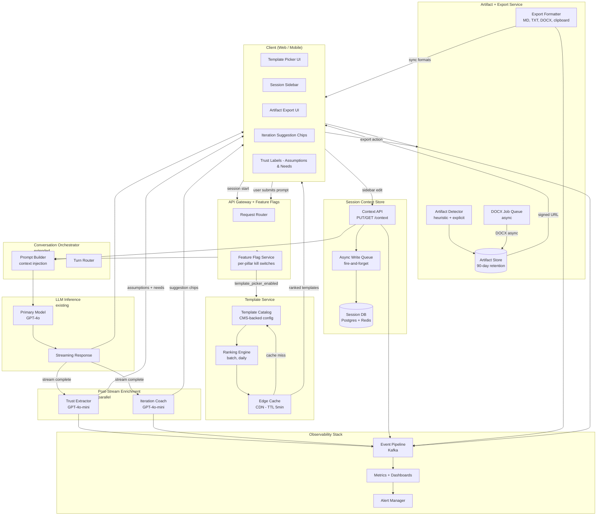
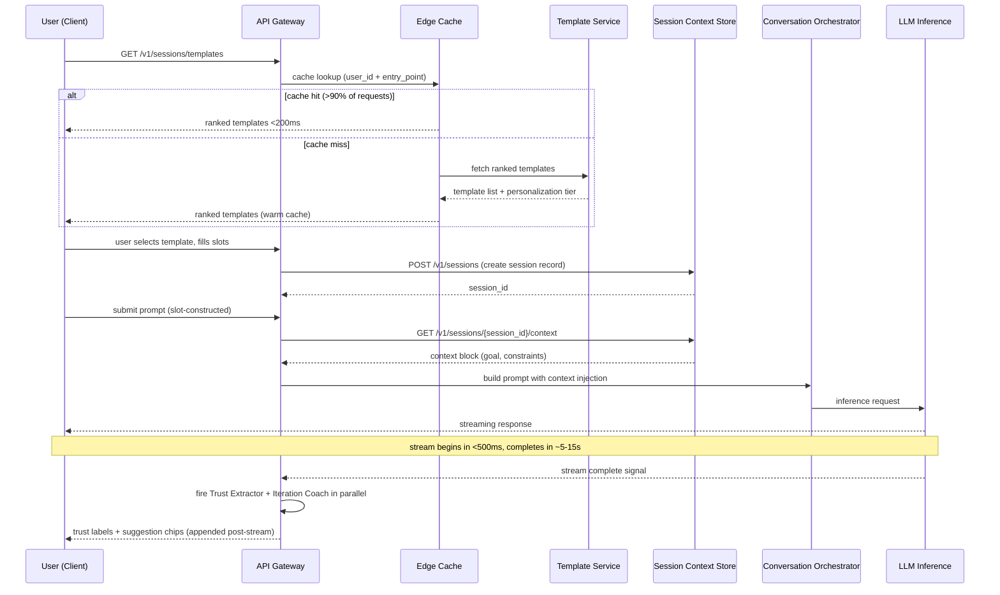
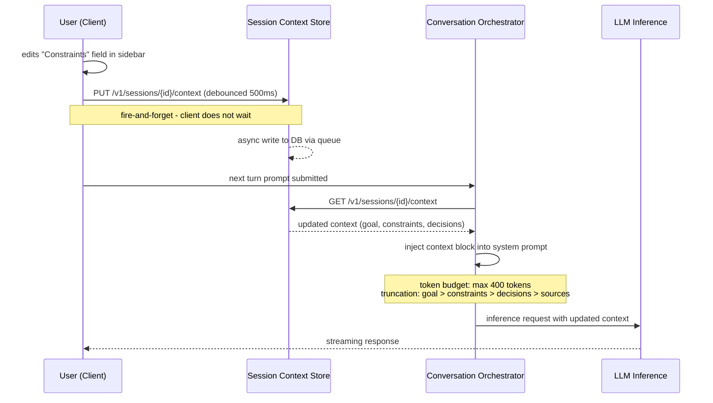
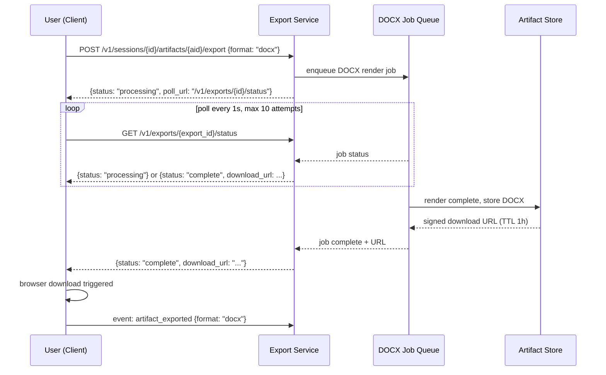

# ChatGPT - Outcome-First Guided Sessions: System Architecture

**Version:** v2 - Improved system design
**Changes from v1:** Added Mermaid system and sequence diagrams, expanded API contracts with error handling and retry semantics, caching and scaling design for Template Service, observability section with SLI/SLO mapping, cost model per request for secondary LLM calls, competitive architecture comparison, circuit breaker patterns for failure modes, and partial resolution of open questions from v1.

| Version | Key additions |
|---|---|
| v1 | Core component topology, data model, primary API contracts, key workflows, trade-offs, open questions |
| v2 | Mermaid diagrams, caching and scaling design, expanded API contracts, SLI/SLO observability, cost model, circuit breakers, competitive architecture comparison, resolved open questions |

**Source PRD:** chatgpt-prd.md (v3 - Outcome-First Guided Sessions)
**Date:** 2026-05-07
**Author:** Staff Engineering + Product

---

## 1. Product Context

The PRD targets a specific funnel break: users treat ChatGPT as single-turn search and drop off before the second turn. The architecture must support five product pillars:

1. **Outcome templates** - persona-aware starters that pre-fill intent, constraints, and format
2. **Iteration coaching** - contextual follow-up suggestions after each LLM response
3. **Trust and confidence UX** - surfacing model assumptions and unresolved needs inline
4. **Session context sidebar** - lightweight persistence of goal, constraints, sources, decisions
5. **Shippable handoff** - copy/export artifacts in multiple formats

The system lives entirely within the ChatGPT web + mobile surfaces. It does not replace the core LLM inference path - it wraps and enriches it.

---

## 2. Non-Functional Requirements

| Requirement | Target | Measurement | Alert threshold |
|---|---|---|---|
| Template load latency (P95) | <200ms | Edge cache hit rate + origin fallback latency | >300ms for >5 min triggers cache warming job |
| Iteration suggestion latency (P95) | <1.5s after response streams complete | Per-request span, post-stream only | >2.0s triggers skip + `iteration_coach_timeout` event |
| Trust extraction latency (P95) | <1.0s after response streams complete | Per-request span, post-stream only | >1.5s triggers skip + `trust_extractor_timeout` event |
| Session context write latency (P99) | <100ms | PUT /context endpoint P99 | >200ms triggers async retry queue |
| Export generation latency - sync formats (P95) | <500ms | Per-request span for MD, TXT, clipboard | >1s triggers fallback to plain text |
| Export generation latency - DOCX (P95) | <5s | Job queue time to completion | >8s triggers dead-letter + user notification |
| System availability - all pillars | 99.9% | Rolling 7 days across all pillar services | <99.5% pages on-call; each pillar independently monitored |
| Session context storage per user | <500KB active sessions | Per-user storage audit, daily | >1MB triggers inactive session pruning |
| Trust label extraction accuracy | >85% assumption recall | Weekly annotation set evaluation | <80% triggers model review |
| Template cache hit rate | >90% | CDN cache analytics | <80% triggers cache TTL review |

### Graceful Degradation Contract

Every pillar is additive. If any enrichment service is unavailable:
- Template service down: show blank prompt box (current baseline), log `template_service_unavailable`
- Iteration coach down: response renders without suggestion chips, no user-visible error
- Trust extractor down: response renders without assumptions/needs section, no user-visible error
- Session context store write failure: context not persisted, session continues, log `context_write_failed`
- Export service down: offer clipboard copy only, log `export_service_unavailable`

The core LLM response path must never be gated on any of these services. The inference route has no synchronous dependency on any pillar component.

---

## 3. System Architecture Diagram



---

## 4. Key Workflow Sequence Diagrams

### 4.1 Session Start with Template



### 4.2 Mid-Session Context Update and Next Turn



### 4.3 DOCX Export (Async)



---

## 5. Component Deep Dives (v2 expansions)

### 5.1 Template Service - Caching and Scaling Design

**Cache architecture:**
- Templates are served from CDN edge (e.g., Fastly or CloudFront) with a 5-minute TTL per `(entry_point, personalization_tier)` key.
- Personalization tier 0 (new users) is fully cacheable at the edge - one response per `entry_point`. Cache hit rate target: >98%.
- Tier 1 and Tier 2 templates are cached per `user_id` at the edge with a 5-minute TTL. Cache invalidated on ranking batch job completion.
- On cache miss, the edge forwards to the Template Service origin. Origin response time target: <500ms P99 (well within the 200ms P95 composite budget since cache misses are rare).

**Ranking batch job:**
- Runs daily at 2am UTC (low-traffic window).
- Input: user activity events from the previous 7 days (`template_selected`, `artifact_exported`, session completion).
- Output: per-user ranked template list for Tier 1 and Tier 2 users, written to a fast key-value store (Redis).
- Tier 0 defaults are static config - no batch job required.

**Template catalog update workflow:**
- Templates are maintained in a CMS (e.g., Contentful or internal admin tool).
- New template publish triggers a CDN cache invalidation for Tier 0 keys (all entry points).
- A/B test variants are controlled via `ab_test_cohort` field on the template object - the ranking engine applies the cohort split before serving.

**Scale envelope:**
- Assumed peak: 10M new sessions/day. With >90% cache hit rate, origin receives <1M requests/day (~12 QPS peak).
- Origin is stateless and horizontally scalable. Auto-scaling target: <20% CPU at 2x peak traffic.

### 5.2 Session Context Store - Async Write Design

**Write path:**
- Client fires PUT /context as fire-and-forget (no blocking wait for 204).
- Gateway queues the write to an async worker (Redis queue or lightweight task queue).
- Worker writes to Postgres within 500ms of enqueue.
- If the queue is backlogged (queue depth >1000 items), workers auto-scale up.

**Read path (on each LLM turn):**
- Conversation Orchestrator reads context synchronously via GET /context before building the prompt.
- Context is cached in-memory in the Orchestrator process for 10 seconds to avoid redundant reads within rapid successive turns.
- On cache miss, Postgres read P99 target: <20ms (context records are small, indexed by `session_id`).

**Conflict resolution:**
- If two context writes arrive out-of-order (e.g., mobile + web editing simultaneously), the write with the highest `updated_at` timestamp wins. No merge - last write wins.
- Multi-device editing is flagged as a v2 known limitation. Full conflict resolution is deferred to v3.

**Session pruning:**
- A daily batch job soft-deletes sessions with `last_active_at < 30 days ago` and `pinned = false`.
- Soft-deleted sessions are retained for 7 days in a cold tier before hard deletion.
- Pinned sessions are exempt from pruning. Storage target: <500KB active context per user.

### 5.3 Trust Extractor and Iteration Coach - Cost Model

Both services use a secondary LLM call (GPT-4o-mini or equivalent small model) after each primary response.

**Per-request cost estimate:**

| Component | Input tokens (avg) | Output tokens (avg) | Cost per call (est.) | Calls per day (10M sessions, 3 turns avg) |
|---|---|---|---|---|
| Trust Extractor | ~800 (last response + extraction prompt) | ~150 (assumptions list) | ~$0.0015 | ~30M |
| Iteration Coach | ~600 (goal + last 2 turns + coaching prompt) | ~100 (3 suggestions) | ~$0.001 | ~30M |
| **Total enrichment cost** | - | - | **~$0.0025/turn** | **~$75,000/day at full scale** |

**Cost control levers:**
1. Skip enrichment for sessions with `session_type = open_ended` and no template (applies to ~60% of sessions) - reduces cost by ~60%.
2. Skip enrichment for responses <50 tokens (clarifying questions, greetings).
3. Batch enrichment calls using the LLM provider's batch API for offline processing (post-stream async) - typically 50% cheaper per call.
4. Evaluate in-context extraction via structured output from the primary model (eliminates second call) as a v3 option. Trade-off: couples extraction quality to primary model version changes.

**At Phase 1 (5% rollout):** ~$3,750/day. Acceptable as an experiment cost.
**At full rollout without cost controls:** ~$75,000/day. Cost control levers 1+2 reduce to ~$25,000/day - requires product sign-off on the margin impact.

### 5.4 Artifact and Export Service - Storage and Detection

**Artifact auto-detection heuristics (v2 refinements):**

| Signal | Threshold | Weight |
|---|---|---|
| Response length | >300 tokens | Primary |
| Structured document pattern | H2 headers, numbered list, code block | Primary |
| Template session | `session_type = template_guided` | Boost |
| User copy action | Any copy event on the response | Override - always artifact |
| User scrolls to bottom of response | Scroll completion event | Supporting |

A response needs to meet at least one primary signal or the override condition to be classified as an artifact. The "user copy" override means that any response a user explicitly copies becomes an artifact, regardless of length or structure.

**Export service storage:**
- Sync exports (MD, TXT, clipboard): rendered in-memory, not persisted. Only the `export_events` array in the Artifact record is updated.
- DOCX exports: stored in object storage (S3 or equivalent) for 24 hours; link served via signed URL with 1-hour TTL. After 24 hours, DOCX is deleted from object storage (user can re-export).
- Artifact content snapshots: stored in Postgres for 90 days.

---

## 6. API Contracts (v2 - expanded with error handling)

### Template Service

**GET /v1/sessions/templates**

Request headers:
- `X-User-Id`: user UUID
- `X-Entry-Point`: `direct | explore | share | mobile`
- `X-Session-Id`: optional; if present, used for session-scoped cache key

Response (200):
```json
{
  "templates": [
    {
      "template_id": "pm-brief-v2",
      "title": "Write a PM brief",
      "description": "Draft a concise PM brief with goals, scope, and open questions.",
      "category": "pm",
      "slots": [
        {
          "name": "goal",
          "label": "What is the goal of this brief?",
          "required": true,
          "default": null,
          "input_type": "multiline"
        }
      ],
      "rank": 1
    }
  ],
  "personalization_tier": 1,
  "ab_cohort": "template_picker_v2",
  "cache_hit": true
}
```

Error responses:
- `503 Service Unavailable` with `{"error": "template_service_unavailable", "fallback": "show_blank_prompt"}` - client renders blank prompt box
- `429 Too Many Requests` with `Retry-After: 1` header - client retries once after 1s; if still 429, falls back to blank prompt

### Session Context

**PUT /v1/sessions/{session_id}/context**

Request body:
```json
{
  "goal": "string | null",
  "constraints": "string | null",
  "sources": ["string"],
  "decisions": ["string"],
  "client_ts": "ISO8601"
}
```

Response: `202 Accepted` (async write acknowledged; replaces v1's `204`)

Rationale for `202` over `204`: signals that the write is enqueued, not necessarily persisted. Client does not need to care, but observability tooling can track async write completion separately.

Error responses:
- `503` - queue full; client logs `context_write_dropped` and moves on (session continues)

**GET /v1/sessions/{session_id}/context**

Response (200):
```json
{
  "goal": "string | null",
  "constraints": "string | null",
  "sources": ["string"],
  "decisions": ["string"],
  "version": 3,
  "updated_at": "ISO8601"
}
```

Error responses:
- `404` - session not found or expired; Orchestrator proceeds with empty context, logs `context_not_found`
- `503` - context store unavailable; Orchestrator proceeds with empty context, logs `context_store_unavailable`

### Trust Extraction (internal service call)

**POST /internal/v1/trust/extract**

Called by the Conversation Orchestrator after the primary LLM stream completes.

Request body:
```json
{
  "session_id": "uuid",
  "turn_index": 3,
  "response_text": "string",
  "response_tokens": 420,
  "template_category": "pm | developer | writer | student | ops | creative | null",
  "skip_if_creative": true
}
```

Response (200):
```json
{
  "extraction_id": "uuid",
  "assumptions": [
    {"text": "string", "confidence": "high | medium | low"}
  ],
  "needs": [
    {"text": "string"}
  ],
  "skipped": false,
  "skip_reason": null,
  "latency_ms": 280
}
```

Timeout: 1.5s. If exceeded, caller receives `408 Request Timeout` and renders response without trust labels.

### Iteration Coaching (internal service call)

**POST /internal/v1/coach/suggest**

Request body:
```json
{
  "session_id": "uuid",
  "turn_index": 3,
  "goal": "string | null",
  "last_user_message": "string",
  "last_two_assistant_turns": ["string", "string"],
  "template_category": "string | null"
}
```

Response (200):
```json
{
  "suggestion_set_id": "uuid",
  "suggestions": [
    {"text": "string", "type": "deepen | handoff | explore | clarify"}
  ],
  "latency_ms": 310
}
```

Timeout: 1.5s. If exceeded, caller receives `408` and renders response without suggestion chips.

### Artifact Export

**POST /v1/sessions/{session_id}/artifacts/{artifact_id}/export**

Request body:
```json
{
  "format": "markdown | plaintext | docx | clipboard"
}
```

Response (200, sync formats - markdown, plaintext, clipboard):
```json
{
  "export_id": "uuid",
  "format": "markdown",
  "content": "string",
  "download_url": null,
  "latency_ms": 120
}
```

Response (202, async - docx):
```json
{
  "export_id": "uuid",
  "format": "docx",
  "status": "processing",
  "poll_url": "/v1/exports/{export_id}/status",
  "estimated_completion_ms": 4000
}
```

**GET /v1/exports/{export_id}/status**

Response (200, in-progress):
```json
{"export_id": "uuid", "status": "processing"}
```

Response (200, complete):
```json
{
  "export_id": "uuid",
  "status": "complete",
  "download_url": "https://...",
  "url_expires_at": "ISO8601",
  "latency_ms": 3200
}
```

Response (200, failed):
```json
{
  "export_id": "uuid",
  "status": "failed",
  "error": "render_timeout",
  "fallback_url": "/v1/exports/{export_id}/plaintext"
}
```

On DOCX failure, the fallback endpoint returns the artifact as plain text. Client surfaces: "Word export failed - downloaded as plain text instead."

---

## 7. Observability Design

### SLI/SLO Mapping

| SLI | SLO target | Measurement method | Event source |
|---|---|---|---|
| Template service availability | 99.9% rolling 7d | HTTP success rate on GET /templates | API Gateway access log |
| Template P95 latency | <200ms | P95 of response_time_ms on GET /templates | API Gateway span |
| Context store write availability | 99.7% rolling 7d | Queue acknowledgement rate | Async write queue metrics |
| Context store read availability | 99.9% rolling 7d | HTTP success rate on GET /context | API Gateway access log |
| Trust extractor availability | 99.0% rolling 7d | Non-timeout responses / total calls | Internal service span |
| Iteration coach availability | 99.0% rolling 7d | Non-timeout responses / total calls | Internal service span |
| Export service (sync) availability | 99.9% rolling 7d | HTTP success rate on POST /export | API Gateway access log |
| DOCX export job success rate | 98.0% rolling 7d | Completed jobs / total enqueued | Job queue metrics |

### Key Dashboards

**Session health dashboard (per rollout cohort):**
- Template adoption rate: `template_selected` / `session_started`
- Second-turn rate: sessions with `turn_count >= 2` / total sessions
- Suggestion click rate: `iteration_suggestion_clicked` where `action=clicked` / sessions with suggestions shown
- Trust label expansion rate: `trust_label_viewed` where `expanded=true` / eligible sessions
- Artifact export rate: `artifact_exported` / template sessions

**Enrichment pipeline dashboard:**
- Trust extractor: P50/P95/P99 latency, skip rate, timeout rate, fallback rate
- Iteration coach: P50/P95/P99 latency, skip rate, timeout rate, fallback rate
- Both services broken down by `template_category`

**Cost dashboard:**
- Enrichment calls per day (trust extractor + iteration coach)
- Estimated cost per day at current pricing
- Enrichment skip rate (cost control lever effectiveness)
- Cost per template session vs. open-ended session

### Alert Runbook Summary

| Alert | Severity | First action |
|---|---|---|
| Template P95 latency >300ms | P2 | Check CDN cache hit rate; if <80%, trigger cache warming job |
| Trust extractor timeout rate >5% | P2 | Check secondary LLM provider status; if degraded, disable trust labels via flag |
| Context store write queue depth >2000 | P2 | Scale async worker pool; check DB connection pool saturation |
| DOCX job dead-letter queue >50 items | P3 | Check render worker health; enable plain text fallback redirect |
| Session abandonment rate delta >3pp vs. baseline | P1 | Kill Exp 1 (template picker A/B) immediately via feature flag; page PM lead |
| Generation P95 latency >baseline +500ms for >12h | P1 | Disable trust labels and iteration coach; alert platform team |

---

## 8. Failure Modes and Circuit Breakers

### Circuit Breaker Configuration

Both the Trust Extractor and Iteration Coach are wrapped in a circuit breaker at the Conversation Orchestrator layer.

| Parameter | Value |
|---|---|
| Failure threshold | 10 consecutive timeouts or 5xx responses within 60 seconds |
| Open state duration | 30 seconds (then probe with 1 request) |
| Half-open probe | 1 request; if success, close circuit; if fail, reopen |
| Fallback behavior | Skip enrichment silently; increment `enrichment_circuit_open` counter |

The Template Service edge cache acts as its own circuit breaker: if the origin is unreachable and the cache is stale, serve the stale cache for up to 60 seconds before returning the blank-prompt fallback. Cache-stale window is logged as `template_cache_stale`.

### Expanded Failure Mode Table

| Failure | Detection signal | Degraded behavior | Recovery |
|---|---|---|---|
| Template service origin down | Health check fail + 503 rate >1% | Serve stale CDN cache for 60s, then blank prompt | Auto-recovers when origin health check passes |
| Template service CDN cache miss storm | P95 latency >500ms | Rate-limit origin requests; queue excess; return stale or blank | Cache warming job + origin scale-out |
| Trust extractor circuit open | `enrichment_circuit_open` counter | Skip trust labels; response renders cleanly | Circuit auto-closes after 30s probe succeeds |
| Iteration coach circuit open | `enrichment_circuit_open` counter | Skip suggestion chips; response renders cleanly | Circuit auto-closes after 30s probe succeeds |
| Session context write queue full | Queue depth alert | Writes dropped; session continues; `context_write_dropped` logged | Scale worker pool; reduce write debounce to 1s |
| Context store DB read failure | 5xx on GET /context | Orchestrator proceeds with empty context; logs `context_store_unavailable` | DB failover to replica within 30s |
| Context token budget overflow | Token count check in Orchestrator | Truncate by priority: goal > constraints > decisions > sources | No recovery needed - handled inline |
| DOCX render worker crash | Dead-letter queue growth | Offer plain text fallback via `failed` status response | Worker restart via health check; DLQ items re-queued |
| LLM provider primary model degraded | Inference P95 latency alert | Falls back to existing ChatGPT provider fallback path (not in scope of this feature) | Existing platform oncall |
| Feature flag service unavailable | Flag evaluation timeout | Default to all flags OFF (safe default - no enrichment shown) | Flag service is existing infra with its own SLA |

---

## 9. Data Model (v2 - additions and clarifications)

All data models from v1 are unchanged. v2 adds two supplementary structures.

### TemplateRankingSnapshot

Captures the per-user ranked template list output from the daily batch job.

```json
{
  "snapshot_id": "uuid",
  "user_id": "uuid",
  "personalization_tier": 1,
  "ranked_template_ids": ["pm-brief-v2", "debug-plan-v1", "memo-v1"],
  "computed_at": "ISO8601",
  "expires_at": "ISO8601",
  "ab_cohort": "template_picker_v2 | null"
}
```

Stored in Redis. TTL: 25 hours (refreshed by daily batch job before expiry).

### EnrichmentSkipLog

Tracks all skipped enrichment calls for cost and quality analysis.

```json
{
  "skip_id": "uuid",
  "session_id": "uuid",
  "turn_index": 3,
  "enrichment_type": "trust_extractor | iteration_coach",
  "skip_reason": "response_too_short | creative_category | circuit_open | feature_flag_off | timeout",
  "ts": "ISO8601"
}
```

Written to the event pipeline (not the DB). Aggregated in the cost dashboard.

---

## 10. Event Schemas (v2 - additions)

All events from v1 are unchanged. v2 adds:

```json
// enrichment_circuit_open
{
  "event": "enrichment_circuit_open",
  "enrichment_type": "trust_extractor | iteration_coach",
  "trigger": "timeout_threshold | error_threshold",
  "consecutive_failures": 10,
  "ts": "ISO8601"
}

// template_cache_stale
{
  "event": "template_cache_stale",
  "entry_point": "direct | explore | share | mobile",
  "personalization_tier": 0,
  "stale_age_seconds": 45,
  "ts": "ISO8601"
}

// context_write_dropped
{
  "event": "context_write_dropped",
  "session_id": "uuid",
  "reason": "queue_full | service_unavailable",
  "fields_attempted": ["goal", "constraints"],
  "ts": "ISO8601"
}

// enrichment_cost_signal
{
  "event": "enrichment_cost_signal",
  "session_id": "uuid",
  "turn_index": 3,
  "trust_extractor_tokens_in": 820,
  "trust_extractor_tokens_out": 145,
  "iteration_coach_tokens_in": 610,
  "iteration_coach_tokens_out": 98,
  "estimated_cost_usd": 0.0024,
  "ts": "ISO8601"
}
```

---

## 11. Competitive Architecture Comparison

| Capability | ChatGPT (this design) | Claude.ai Projects | Gemini Advanced | Copilot (M365) |
|---|---|---|---|---|
| Session scaffolding surface | Template picker at session start, inline slot collection | Projects as a separate container; no session-start guidance | None - blank prompt start | Task-type picker in specific surfaces (Word, Outlook) |
| Context persistence mechanism | Per-session context store, injected as system prompt each turn | Project-level system prompt; always-on for all project conversations | None within a session | Document context (current file); not user-editable |
| Enrichment after response | Trust extractor + iteration coach via secondary LLM call | No post-response enrichment; suggestions sometimes inline via model | No structured enrichment | In-line Copilot autocomplete only |
| Artifact export path | MD, TXT, DOCX, clipboard - all from chat UI | Clipboard copy + MD only | No export | Direct Word/Excel/Outlook edit - no explicit export |
| Personalization | Daily batch ranking; 3 tiers based on session history | None - no template system | None | Role/license-level (E3 vs. E5) - not session-personalized |
| Graceful degradation | All pillars additive; LLM path never blocked | N/A | N/A | Copilot degrades to manual - no enrichment to degrade |

**Win condition vs. Claude Projects:** Claude Projects require the user to pre-configure a context container before starting a session - this is a setup tax that most users never pay. This design meets users at the session start with no pre-configuration required. The template picker is zero-setup: pick a template, fill 3 slots, go.

**Loss condition vs. M365 Copilot:** Copilot's DOCX export is a native Word edit, not a download. For users whose workflow ends in Word/Sheets, Copilot eliminates the copy-paste step entirely. This architecture's DOCX export is a one-way download with no live connection - a structural disadvantage for the enterprise document workflow. Not fixable without native integrations.

**Loss condition vs. Gemini for Google Workspace users:** Gemini in Docs can insert generated content directly into a Doc with live context from the user's existing documents. The session context this design maintains is manually curated by the user - it has no read access to external docs or files. For knowledge workers whose source material lives in Drive, Gemini's grounded context is superior.

---

## 12. Trade-offs (v2 additions)

All trade-offs from v1 are retained. v2 adds:

| Decision | Chosen approach | Alternative considered | Reason |
|---|---|---|---|
| 202 Accepted on context write (vs. 204) | 202 - async acknowledged | 204 - synchronous write | Async write is necessary for the <100ms budget; 202 accurately communicates the semantics; observability can track async completion separately |
| Circuit breaker threshold: 10 consecutive failures | 10 failures in 60s | 5 failures or 1% error rate | Conservative threshold reduces false trips during transient spikes; enrichment failure is low-stakes (response still renders) |
| DOCX stored for 24h only after export (not 90 days) | 24h object storage + re-export on demand | 90-day DOCX retention | DOCX files are ~10x larger than text snapshots; 90-day retention at scale would dominate storage cost; re-export is fast (<5s) so 24h is sufficient |
| Stale-cache serve for 60s on origin failure | Yes - serve stale | Return 503 immediately | Stale templates are better than no templates; user experience is unaffected if templates haven't changed in the last 5 minutes |
| In-context extraction deferred to v3 | Not in v2 | Ship in v2 | In-context extraction requires structured output schema changes to the primary model call - cross-team dependency not on the v2 critical path |

---

## 13. Open Questions (v2 - partial resolutions)

Questions resolved from v1:

1. **Template vs. Custom Instructions interaction** - Resolved in PRD v3: Templates take precedence for slot values. Custom Instructions apply as a persona/tone layer on top. Memory is suppressed during slot collection. This is now documented in the Orchestrator's prompt build logic (Section 5.2, context injection spec). No architectural change needed.

2. **Trust extractor model selection** - Provisional decision: use the provider's smallest capable model (GPT-4o-mini or equivalent). Accuracy evaluation against the internal annotation set runs in Phase 0 dogfood. If recall <80%, the trust label feature does not ship to Phase 1.

3. **Session context cross-device sync** - Decided: server-side context store handles sync naturally since both devices read/write to the same `session_id`. Conflict resolution is last-write-wins (Section 5.2). Edge case: rapid concurrent edits from two devices within the 500ms debounce window may drop one write. This is accepted for v2 - frequency is low and the consequence is a missed context update, not data corruption.

Questions still open for v3:

4. **Template catalog ownership** - Who owns template quality review and release cadence? Product, content design, or a community submission model? This is a process question, not architectural, but it affects how the CMS integration is structured (read-only API vs. full editorial workflow). Needs PM decision before v3.

5. **Artifact expiry policy for pinned artifacts** - v2 assumes pinned sessions exempt from the 30-day prune. But artifacts within pinned sessions still expire at 90 days. Should pinned artifact expiry extend to match session pin duration? Needs product decision.

6. **Mobile UX for session sidebar** - v2 design is web-centric. The context sidebar interaction on mobile (bottom sheet vs. tab vs. swipe panel) is unspecified. Deferred to mobile PM and design. Not blocking Phase 1 (desktop web only). Must be resolved before Phase 3 (full rollout includes mobile).

7. **Iteration suggestion safety review** - Noted in v1, still open. The suggestion prompt must pass safety review before Phase 1. This is a blocker. Owner: Trust and Safety team.

---

*All metrics are directional estimates based on public information and observable UX patterns, not internal OpenAI data.*
