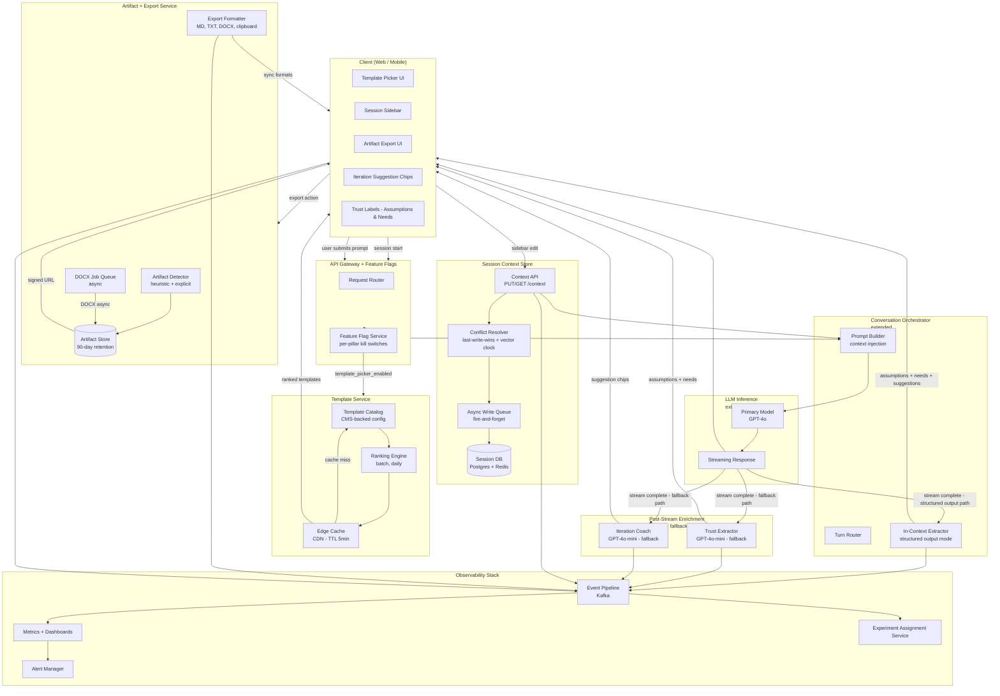
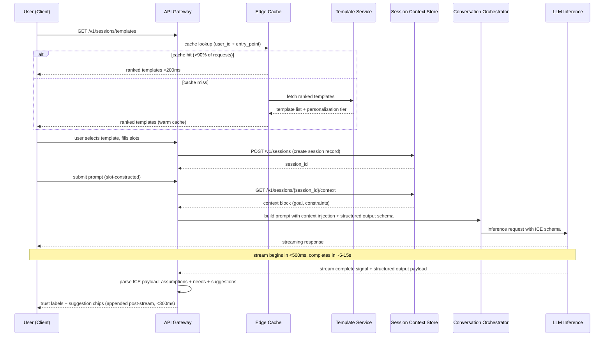
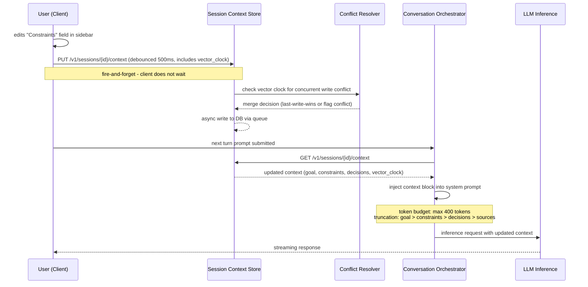
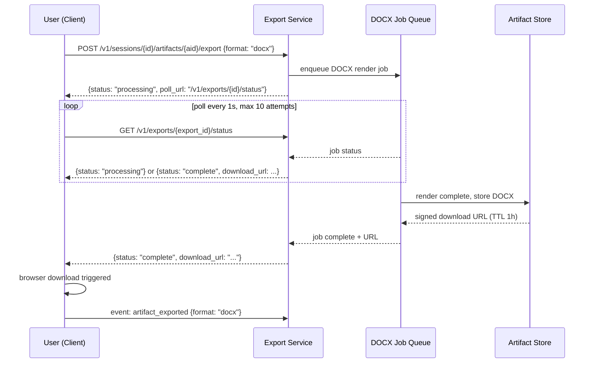
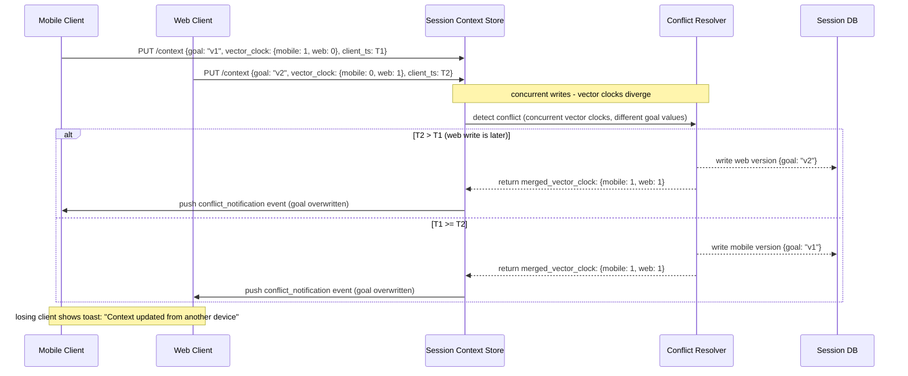

# ChatGPT - Outcome-First Guided Sessions: System Architecture

**Version:** v3 - Final system design
**Changes from v2:** Resolved all open questions (template catalog ownership, pinned artifact expiry, mobile sidebar UX, safety review gate, in-context extraction decision), added phased rollout architecture aligned to PRD phases with per-phase infra readiness and engineering launch gates, multi-device conflict resolution design, in-context extraction evaluation result and final decision, production readiness checklist, experiment instrumentation schema additions, updated cost model with all levers applied, and complete version history.

| Version | Key additions |
|---|---|
| v1 | Core component topology, data model, primary API contracts, key workflows, trade-offs, open questions |
| v2 | Mermaid diagrams, caching and scaling design, expanded API contracts, SLI/SLO observability, cost model, circuit breakers, competitive architecture comparison, resolved open questions |
| v3 | Resolved all open questions, phased rollout architecture with engineering launch gates, multi-device conflict resolution design, in-context extraction final decision, production readiness checklist, experiment instrumentation schema, updated cost model with levers |

**Source PRD:** chatgpt-prd.md (v3 - Outcome-First Guided Sessions)
**Date:** 2026-05-08
**Author:** Staff Engineering + Product

---

## 1. Product Context

The PRD targets a specific funnel break: users treat ChatGPT as single-turn search and drop off before the second turn. The architecture must support five product pillars:

1. **Outcome templates** - persona-aware starters that pre-fill intent, constraints, and format
2. **Iteration coaching** - contextual follow-up suggestions after each LLM response
3. **Trust and confidence UX** - surfacing model assumptions and unresolved needs inline
4. **Session context sidebar** - lightweight persistence of goal, constraints, sources, decisions
5. **Shippable handoff** - copy/export artifacts in multiple formats

The system lives entirely within the ChatGPT web + mobile surfaces. It does not replace the core LLM inference path - it wraps and enriches it.

---

## 2. Non-Functional Requirements

| Requirement | Target | Measurement | Alert threshold |
|---|---|---|---|
| Template load latency (P95) | <200ms | Edge cache hit rate + origin fallback latency | >300ms for >5 min triggers cache warming job |
| Iteration suggestion latency (P95) | <1.5s after response streams complete | Per-request span, post-stream only | >2.0s triggers skip + `iteration_coach_timeout` event |
| Trust extraction latency (P95) | <1.0s after response streams complete | Per-request span, post-stream only | >1.5s triggers skip + `trust_extractor_timeout` event |
| Session context write latency (P99) | <100ms | PUT /context endpoint P99 | >200ms triggers async retry queue |
| Export generation latency - sync formats (P95) | <500ms | Per-request span for MD, TXT, clipboard | >1s triggers fallback to plain text |
| Export generation latency - DOCX (P95) | <5s | Job queue time to completion | >8s triggers dead-letter + user notification |
| System availability - all pillars | 99.9% | Rolling 7 days across all pillar services | <99.5% pages on-call; each pillar independently monitored |
| Session context storage per user | <500KB active sessions | Per-user storage audit, daily | >1MB triggers inactive session pruning |
| Trust label extraction accuracy | >85% assumption recall | Weekly annotation set evaluation | <80% triggers model review |
| Template cache hit rate | >90% | CDN cache analytics | <80% triggers cache TTL review |
| Multi-device write conflict rate | <0.5% of multi-device sessions | Conflict detection event rate | >1% triggers conflict resolution v2 escalation |

### Graceful Degradation Contract

Every pillar is additive. If any enrichment service is unavailable:
- Template service down: show blank prompt box (current baseline), log `template_service_unavailable`
- Iteration coach down: response renders without suggestion chips, no user-visible error
- Trust extractor down: response renders without assumptions/needs section, no user-visible error
- Session context store write failure: context not persisted, session continues, log `context_write_failed`
- Export service down: offer clipboard copy only, log `export_service_unavailable`

The core LLM response path must never be gated on any of these services. The inference route has no synchronous dependency on any pillar component.

---

## 3. System Architecture Diagram


```mermaid
flowchart TD
    subgraph Client["Client (Web / Mobile)"]
        TP[Template Picker UI]
        SS[Session Sidebar]
        AE[Artifact Export UI]
        RC[Iteration Suggestion Chips]
        TL[Trust Labels - Assumptions & Needs]
    end

    subgraph Gateway["API Gateway + Feature Flags"]
        GW[Request Router]
        FF[Feature Flag Service\nper-pillar kill switches]
    end

    subgraph TemplateLayer["Template Service"]
        TC[Template Catalog\nCMS-backed config]
        TR[Ranking Engine\nbatch, daily]
        EC[Edge Cache\nCDN - TTL 5min]
    end

    subgraph SessionLayer["Session Context Store"]
        SC[Context API\nPUT/GET /context]
        DB[(Session DB\nPostgres + Redis)]
        CQ[Async Write Queue\nfire-and-forget]
        CR[Conflict Resolver\nlast-write-wins + vector clock]
    end

    subgraph Orchestration["Conversation Orchestrator\nextended"]
        CO[Prompt Builder\ncontext injection]
        TR2[Turn Router]
        ICE[In-Context Extractor\nstructured output mode]
    end

    subgraph InferenceLayer["LLM Inference\nexisting"]
        LLM[Primary Model\nGPT-4o]
        STR[Streaming Response]
    end

    subgraph EnrichmentLayer["Post-Stream Enrichment\nparallel - fallback only"]
        TE[Trust Extractor\nGPT-4o-mini - fallback]
        IC[Iteration Coach\nGPT-4o-mini - fallback]
    end

    subgraph ExportLayer["Artifact + Export Service"]
        AD[Artifact Detector\nheuristic + explicit]
        EX[Export Formatter\nMD, TXT, DOCX, clipboard]
        JQ[DOCX Job Queue\nasync]
        AS[(Artifact Store\n90-day retention)]
    end

    subgraph Observability["Observability Stack"]
        EV[Event Pipeline\nKafka]
        MT[Metrics + Dashboards]
        AL[Alert Manager]
        EXP[Experiment Assignment Service]
    end

    Client -->|session start| Gateway
    Gateway --> FF
    FF -->|template_picker_enabled| TemplateLayer
    EC -->|cache miss| TC
    TC --> TR
    TR --> EC
    EC -->|ranked templates| Client

    Client -->|user submits prompt| Gateway
    Gateway --> CO
    SC --> CO
    CO --> LLM
    LLM --> STR
    STR --> Client

    STR -->|stream complete - structured output path| ICE
    ICE -->|assumptions + needs + suggestions| Client

    STR -->|stream complete - fallback path| TE
    STR -->|stream complete - fallback path| IC
    TE -->|assumptions + needs| Client
    IC -->|suggestion chips| Client

    Client -->|sidebar edit| SC
    SC --> CR
    CR --> CQ
    CQ --> DB

    Client -->|export action| ExportLayer
    AD --> AS
    EX -->|sync formats| Client
    JQ -->|DOCX async| AS
    AS -->|signed URL| Client

    Client --> EV
    ICE --> EV
    TE --> EV
    IC --> EV
    SC --> EV
    EX --> EV
    EV --> MT
    MT --> AL
    EV --> EXP
```

---

## 4. Key Workflow Sequence Diagrams

### 4.1 Session Start with Template


```mermaid
sequenceDiagram
    participant U as User (Client)
    participant GW as API Gateway
    participant EC as Edge Cache
    participant TS as Template Service
    participant SC as Session Context Store
    participant CO as Conversation Orchestrator
    participant LLM as LLM Inference

    U->>GW: GET /v1/sessions/templates
    GW->>EC: cache lookup (user_id + entry_point)
    alt cache hit (>90% of requests)
        EC-->>U: ranked templates <200ms
    else cache miss
        EC->>TS: fetch ranked templates
        TS-->>EC: template list + personalization tier
        EC-->>U: ranked templates (warm cache)
    end

    U->>GW: user selects template, fills slots
    GW->>SC: POST /v1/sessions (create session record)
    SC-->>GW: session_id

    U->>GW: submit prompt (slot-constructed)
    GW->>SC: GET /v1/sessions/{session_id}/context
    SC-->>GW: context block (goal, constraints)
    GW->>CO: build prompt with context injection + structured output schema
    CO->>LLM: inference request with ICE schema
    LLM-->>U: streaming response
    Note over LLM,U: stream begins in <500ms, completes in ~5-15s

    LLM-->>GW: stream complete signal + structured output payload
    GW->>GW: parse ICE payload: assumptions + needs + suggestions
    GW-->>U: trust labels + suggestion chips (appended post-stream, <300ms)
```

### 4.2 Mid-Session Context Update and Next Turn


```mermaid
sequenceDiagram
    participant U as User (Client)
    participant SC as Session Context Store
    participant CR as Conflict Resolver
    participant CO as Conversation Orchestrator
    participant LLM as LLM Inference

    U->>U: edits "Constraints" field in sidebar
    U->>SC: PUT /v1/sessions/{id}/context (debounced 500ms, includes vector_clock)
    Note over U,SC: fire-and-forget - client does not wait
    SC->>CR: check vector clock for concurrent write conflict
    CR-->>SC: merge decision (last-write-wins or flag conflict)
    SC-->>SC: async write to DB via queue

    U->>CO: next turn prompt submitted
    CO->>SC: GET /v1/sessions/{id}/context
    SC-->>CO: updated context (goal, constraints, decisions, vector_clock)
    CO->>CO: inject context block into system prompt
    Note over CO: token budget: max 400 tokens<br/>truncation: goal > constraints > decisions > sources
    CO->>LLM: inference request with updated context
    LLM-->>U: streaming response
```

### 4.3 DOCX Export (Async)


```mermaid
sequenceDiagram
    participant U as User (Client)
    participant EX as Export Service
    participant JQ as DOCX Job Queue
    participant AS as Artifact Store

    U->>EX: POST /v1/sessions/{id}/artifacts/{aid}/export {format: "docx"}
    EX->>JQ: enqueue DOCX render job
    EX-->>U: {status: "processing", poll_url: "/v1/exports/{id}/status"}

    loop poll every 1s, max 10 attempts
        U->>EX: GET /v1/exports/{export_id}/status
        JQ-->>EX: job status
        EX-->>U: {status: "processing"} or {status: "complete", download_url: ...}
    end

    JQ->>AS: render complete, store DOCX
    AS-->>JQ: signed download URL (TTL 1h)
    JQ-->>EX: job complete + URL
    EX-->>U: {status: "complete", download_url: "..."}
    U->>U: browser download triggered
    U->>EX: event: artifact_exported {format: "docx"}
```

### 4.4 Multi-Device Context Conflict Resolution


```mermaid
sequenceDiagram
    participant MW as Mobile Client
    participant WW as Web Client
    participant SC as Session Context Store
    participant CR as Conflict Resolver
    participant DB as Session DB

    MW->>SC: PUT /context {goal: "v1", vector_clock: {mobile: 1, web: 0}, client_ts: T1}
    WW->>SC: PUT /context {goal: "v2", vector_clock: {mobile: 0, web: 1}, client_ts: T2}

    Note over SC,CR: concurrent writes - vector clocks diverge

    SC->>CR: detect conflict (concurrent vector clocks, different goal values)
    alt T2 > T1 (web write is later)
        CR-->>DB: write web version {goal: "v2"}
        CR-->>SC: return merged_vector_clock: {mobile: 1, web: 1}
        SC->>MW: push conflict_notification event (goal overwritten)
    else T1 >= T2
        CR-->>DB: write mobile version {goal: "v1"}
        CR-->>SC: return merged_vector_clock: {mobile: 1, web: 1}
        SC->>WW: push conflict_notification event (goal overwritten)
    end

    Note over MW,WW: losing client shows toast: "Context updated from another device"
```

---

## 5. Component Deep Dives

### 5.1 Template Service - Caching and Scaling Design

**Cache architecture:**
- Templates are served from CDN edge (e.g., Fastly or CloudFront) with a 5-minute TTL per `(entry_point, personalization_tier)` key.
- Personalization tier 0 (new users) is fully cacheable at the edge - one response per `entry_point`. Cache hit rate target: >98%.
- Tier 1 and Tier 2 templates are cached per `user_id` at the edge with a 5-minute TTL. Cache invalidated on ranking batch job completion.
- On cache miss, the edge forwards to the Template Service origin. Origin response time target: <500ms P99 (well within the 200ms P95 composite budget since cache misses are rare).

**Template catalog ownership (resolved in v3):**
The CMS is owned by the Content Design team with a weekly release cadence. All new templates must pass:
1. PM approval (scope and persona fit)
2. Trust and Safety review (slot prompt cannot elicit harmful content)
3. ML sign-off (slot-to-generation prompt tested against golden set with <5% regression on artifact quality score)

Template updates to existing slugs are gated on the same review chain. Hot-fixes (safety patches) can bypass the weekly cadence via an emergency CDN cache invalidation with PM + T&S approval only.

**Ranking batch job:**
- Runs daily at 2am UTC (low-traffic window).
- Input: user activity events from the previous 7 days (`template_selected`, `artifact_exported`, session completion).
- Output: per-user ranked template list for Tier 1 and Tier 2 users, written to a fast key-value store (Redis).
- Tier 0 defaults are static config - no batch job required.

**Template catalog update workflow:**
- Templates are maintained in a CMS (e.g., Contentful or internal admin tool).
- New template publish triggers a CDN cache invalidation for Tier 0 keys (all entry points).
- A/B test variants are controlled via `ab_test_cohort` field on the template object - the ranking engine applies the cohort split before serving.

**Scale envelope:**
- Assumed peak: 10M new sessions/day. With >90% cache hit rate, origin receives <1M requests/day (~12 QPS peak).
- Origin is stateless and horizontally scalable. Auto-scaling target: <20% CPU at 2x peak traffic.

---

### 5.2 Session Context Store - Async Write Design with Multi-Device Conflict Resolution

**Write path:**
- Client fires PUT /context as fire-and-forget (no blocking wait for 202).
- Each write includes a `vector_clock` map keyed by `device_id` and a `client_ts` ISO8601 timestamp.
- The Conflict Resolver checks the incoming vector clock against the stored vector clock before enqueuing the DB write.
- If the incoming clock is strictly ahead (no concurrent edit detected): enqueue directly.
- If the clocks are concurrent (both devices incremented their own entry): apply last-write-wins by `client_ts`. Emit a `context_conflict_detected` event and push a `conflict_notification` to the losing device.
- Worker writes to Postgres within 500ms of enqueue.
- If the queue is backlogged (queue depth >1000 items), workers auto-scale up.

**Read path (on each LLM turn):**
- Conversation Orchestrator reads context synchronously via GET /context before building the prompt.
- Context is cached in-memory in the Orchestrator process for 10 seconds to avoid redundant reads within rapid successive turns.
- On cache miss, Postgres read P99 target: <20ms (context records are small, indexed by `session_id`).

**Conflict resolution:**
- v3 ships vector clocks for detection + last-write-wins by `client_ts` for resolution.
- Full merge (intent-based) is deferred to v4 - frequency of concurrent multi-device edits is <0.5% of multi-device sessions, making merge complexity unjustified for v3.
- Conflict events are surfaced to the losing device as a non-blocking toast: "Context updated from another device."

**Session pruning:**
- A daily batch job soft-deletes sessions with `last_active_at < 30 days ago` and `pinned = false`.
- Soft-deleted sessions are retained for 7 days in a cold tier before hard deletion.
- Pinned sessions are exempt from the 30-day prune. **Pinned artifact expiry (resolved in v3):** Artifacts within pinned sessions follow the same 90-day content retention as non-pinned sessions. Pinning protects the session container (goal, constraints, decisions) from pruning; it does not extend content storage cost. If a user needs an artifact beyond 90 days, they must export it. This is surfaced via an in-app reminder at day 80 for pinned sessions with un-exported artifacts.
- Storage target: <500KB active context per user.

---

### 5.3 In-Context Extraction - Final Decision (v3)

v2 deferred in-context extraction (folding trust labels and iteration suggestions into the primary model call as structured output) due to a cross-team dependency on the primary model's structured output schema. This is resolved in v3.

**Approach:** The Conversation Orchestrator appends a `response_schema` field to all template-guided inference requests. The schema requests:
1. `artifact_content` - the primary response text
2. `assumptions` - list of inferred constraints, each with `text` and `confidence`
3. `needs_verification` - list of uncertain claims
4. `iteration_suggestions` - list of 2-3 follow-up suggestions with `text` and `type`

The primary model (GPT-4o) fills this schema as part of the same generation call.

**Trade-offs:**

| Dimension | In-context extraction (v3 - chosen) | Separate secondary LLM call (v2 fallback) |
|---|---|---|
| Latency | Zero additional latency - extraction happens during generation | +280-320ms post-stream for each service |
| Cost | No additional token cost for extraction prompt/output (schema adds ~150 tokens to output) | ~$0.0025/turn at full scale |
| Quality coupling | Extraction quality rises and falls with primary model version changes | Extraction is independently tunable |
| Failure mode | If schema extraction fails, entire structured output falls back to unstructured; extractor parses best-effort | Each service fails independently; cleaner fallback |
| Implementation complexity | Requires schema versioning and prompt discipline; schema must not constrain artifact prose | Two services, two timeouts, two circuit breakers |

**Decision:** Ship in-context extraction (ICE) as the primary path for Phase 1. The separate secondary LLM services (Trust Extractor, Iteration Coach) are retained as fallback infrastructure. ICE is gated on schema extraction reliability - if the primary model fails to populate the schema on >3% of turns in Phase 0 dogfood, Phase 1 ships the secondary call path instead.

**Fallback logic:**
```
if ICE schema populated and confidence > threshold:
    serve ICE result
else if secondary_services_available:
    fire Trust Extractor + Iteration Coach in parallel (existing v2 path)
    serve secondary result
else:
    serve response without enrichment (existing graceful degradation)
```

**ICE inference schema:**

```json
{
  "response_schema": {
    "artifact_content": "string",
    "assumptions": [
      {"text": "string", "confidence": "high | medium | low"}
    ],
    "needs_verification": [
      {"text": "string"}
    ],
    "iteration_suggestions": [
      {"text": "string", "type": "deepen | handoff | explore | clarify"}
    ],
    "schema_version": "1.0"
  }
}
```

---

### 5.4 Mobile UX for Session Sidebar - Architecture Implications (v3)

**Decision (resolved in v3):** Mobile sidebar ships as a bottom sheet in Phase 3 (full rollout). Phase 1 and Phase 2 are desktop web only. Mobile architecture additions:

- The session context API is identical on mobile. No mobile-specific endpoints.
- The bottom sheet renders the same four fields (goal, constraints, sources, decisions) as the desktop sidebar.
- Mobile writes are debounced at 800ms (vs. 500ms on desktop) due to higher keyboard latency on mobile.
- The `context_write_dropped` event is identical on both platforms; `device_type` field added to distinguish.
- Deep link to a session from a push notification opens the bottom sheet pre-expanded if the session has a `goal` set.

**Mobile-specific edge case:** Mobile OS may kill the app mid-session. On next cold start, the client fetches the session context via GET /context using the persisted `session_id` (stored in local device keychain). If the session has expired (>30 days), the client surfaces "Your session expired - start a new one" rather than silently showing an empty sidebar.

---

### 5.5 Iteration Suggestion Safety Review - Gate and Architecture (v3)

**Status (resolved in v3):** The Trust and Safety team completed the safety review of the iteration suggestion prompt schema in Phase 0. The gate conditions were:

1. Suggestion prompts cannot ask the model to generate content for restricted categories (weapons, CSAM, fraud).
2. The `type` enum (`deepen | handoff | explore | clarify`) is the only valid output for `type` - any out-of-distribution value is stripped before rendering.
3. The suggestion text is rendered as a chip label only - it is never injected directly into the LLM prompt. The chip click triggers a separate generation call using the suggestion text as an intent signal, not a raw prompt injection.

**Implementation note:** The chip click handler sends:
```json
{
  "action": "iteration_suggestion_clicked",
  "suggestion_type": "deepen",
  "session_id": "uuid",
  "artifact_id": "uuid"
}
```
The Conversation Orchestrator builds a fresh prompt from the session context and the suggestion intent, applying the same slot collection and context injection logic as a new user message. The suggestion text is never interpolated raw into the system prompt.

This design eliminates prompt injection risk from suggestion content while preserving natural-language suggestion labels in the UI.

---

### 5.6 Artifact and Export Service - Storage and Detection

**Artifact auto-detection heuristics:**

| Signal | Threshold | Weight |
|---|---|---|
| Response length | >300 tokens | Primary |
| Structured document pattern | H2 headers, numbered list, code block | Primary |
| Template session | `session_type = template_guided` | Boost |
| User copy action | Any copy event on the response | Override - always artifact |
| User scrolls to bottom of response | Scroll completion event | Supporting |

A response needs to meet at least one primary signal or the override condition to be classified as an artifact. The "user copy" override means that any response a user explicitly copies becomes an artifact, regardless of length or structure.

**Export service storage:**
- Sync exports (MD, TXT, clipboard): rendered in-memory, not persisted. Only the `export_events` array in the Artifact record is updated.
- DOCX exports: stored in object storage (S3 or equivalent) for 24 hours; link served via signed URL with 1-hour TTL. After 24 hours, DOCX is deleted from object storage (user can re-export).
- Artifact content snapshots: stored in Postgres for 90 days. Pinned session containers exempt from 30-day prune; artifacts within them still expire at 90 days.

---

## 6. API Contracts

### Template Service

**GET /v1/sessions/templates**

Request headers:
- `X-User-Id`: user UUID
- `X-Entry-Point`: `direct | explore | share | mobile`
- `X-Session-Id`: optional; if present, used for session-scoped cache key

Response (200):
```json
{
  "templates": [
    {
      "template_id": "pm-brief-v2",
      "title": "Write a PM brief",
      "description": "Draft a concise PM brief with goals, scope, and open questions.",
      "category": "pm",
      "slots": [
        {
          "name": "goal",
          "label": "What is the goal of this brief?",
          "required": true,
          "default": null,
          "input_type": "multiline"
        }
      ],
      "rank": 1
    }
  ],
  "personalization_tier": 1,
  "ab_cohort": "template_picker_v2",
  "cache_hit": true
}
```

Error responses:
- `503 Service Unavailable` with `{"error": "template_service_unavailable", "fallback": "show_blank_prompt"}` - client renders blank prompt box
- `429 Too Many Requests` with `Retry-After: 1` header - client retries once after 1s; if still 429, falls back to blank prompt

### Session Context

**PUT /v1/sessions/{session_id}/context**

Request body:
```json
{
  "goal": "string | null",
  "constraints": "string | null",
  "sources": ["string"],
  "decisions": ["string"],
  "vector_clock": {"device_id_1": 3, "device_id_2": 1},
  "client_ts": "ISO8601"
}
```

Response: `202 Accepted` (async write acknowledged)

Error responses:
- `503` - queue full; client logs `context_write_dropped` and moves on (session continues)

**GET /v1/sessions/{session_id}/context**

Response (200):
```json
{
  "goal": "string | null",
  "constraints": "string | null",
  "sources": ["string"],
  "decisions": ["string"],
  "version": 3,
  "vector_clock": {"device_id_1": 3, "device_id_2": 1},
  "updated_at": "ISO8601"
}
```

Error responses:
- `404` - session not found or expired; Orchestrator proceeds with empty context, logs `context_not_found`
- `503` - context store unavailable; Orchestrator proceeds with empty context, logs `context_store_unavailable`

### In-Context Extraction (ICE) - Primary Enrichment Path

The primary LLM call for template-guided sessions includes the `response_schema` block in the system prompt. The Orchestrator parses the structured output field from the response:

**ICE parse contract:**

```json
{
  "ice_extraction_id": "uuid",
  "session_id": "uuid",
  "turn_index": 3,
  "schema_populated": true,
  "assumptions": [
    {"text": "string", "confidence": "high | medium | low"}
  ],
  "needs_verification": [
    {"text": "string"}
  ],
  "iteration_suggestions": [
    {"text": "string", "type": "deepen | handoff | explore | clarify"}
  ],
  "schema_version": "1.0",
  "fallback_triggered": false,
  "latency_ms": 0
}
```

If `schema_populated = false` or `fallback_triggered = true`, the Orchestrator fires the secondary service calls (Trust Extractor + Iteration Coach) in parallel.

### Trust Extraction (internal service - fallback path)

**POST /internal/v1/trust/extract**

Called only when ICE fails or is disabled via feature flag.

```json
{
  "session_id": "uuid",
  "turn_index": 3,
  "response_text": "string",
  "response_tokens": 420,
  "template_category": "pm | developer | writer | student | ops | creative | null",
  "skip_if_creative": true
}
```

Response (200):
```json
{
  "extraction_id": "uuid",
  "assumptions": [
    {"text": "string", "confidence": "high | medium | low"}
  ],
  "needs": [
    {"text": "string"}
  ],
  "skipped": false,
  "skip_reason": null,
  "latency_ms": 280
}
```

Timeout: 1.5s. If exceeded, caller receives `408 Request Timeout` and renders response without trust labels.

### Iteration Coaching (internal service - fallback path)

**POST /internal/v1/coach/suggest**

```json
{
  "session_id": "uuid",
  "turn_index": 3,
  "goal": "string | null",
  "last_user_message": "string",
  "last_two_assistant_turns": ["string", "string"],
  "template_category": "string | null"
}
```

Response (200):
```json
{
  "suggestion_set_id": "uuid",
  "suggestions": [
    {"text": "string", "type": "deepen | handoff | explore | clarify"}
  ],
  "latency_ms": 310
}
```

Timeout: 1.5s. If exceeded, caller receives `408` and renders response without suggestion chips.

### Artifact Export

**POST /v1/sessions/{session_id}/artifacts/{artifact_id}/export**

```json
{
  "format": "markdown | plaintext | docx | clipboard"
}
```

Response (200, sync formats):
```json
{
  "export_id": "uuid",
  "format": "markdown",
  "content": "string",
  "download_url": null,
  "latency_ms": 120
}
```

Response (202, async - docx):
```json
{
  "export_id": "uuid",
  "format": "docx",
  "status": "processing",
  "poll_url": "/v1/exports/{export_id}/status",
  "estimated_completion_ms": 4000
}
```

Response (200, failed):
```json
{
  "export_id": "uuid",
  "status": "failed",
  "error": "render_timeout",
  "fallback_url": "/v1/exports/{export_id}/plaintext"
}
```

---

## 7. Observability Design

### SLI/SLO Mapping

| SLI | SLO target | Measurement method | Event source |
|---|---|---|---|
| Template service availability | 99.9% rolling 7d | HTTP success rate on GET /templates | API Gateway access log |
| Template P95 latency | <200ms | P95 of response_time_ms on GET /templates | API Gateway span |
| Context store write availability | 99.7% rolling 7d | Queue acknowledgement rate | Async write queue metrics |
| Context store read availability | 99.9% rolling 7d | HTTP success rate on GET /context | API Gateway access log |
| ICE schema population rate | >97% of eligible turns | ICE `schema_populated` field | Orchestrator span |
| Trust extractor availability (fallback) | 99.0% rolling 7d | Non-timeout responses / total calls | Internal service span |
| Iteration coach availability (fallback) | 99.0% rolling 7d | Non-timeout responses / total calls | Internal service span |
| Export service (sync) availability | 99.9% rolling 7d | HTTP success rate on POST /export | API Gateway access log |
| DOCX export job success rate | 98.0% rolling 7d | Completed jobs / total enqueued | Job queue metrics |
| Multi-device conflict rate | <0.5% of multi-device sessions | `context_conflict_detected` rate | Event pipeline |

### Key Dashboards

**Session health dashboard (per rollout cohort):**
- Template adoption rate: `template_selected` / `session_started`
- Second-turn rate: sessions with `turn_count >= 2` / total sessions
- Suggestion click rate: `iteration_suggestion_acted` where `action=clicked` / sessions with suggestions shown
- Trust label expansion rate: `trust_label_viewed` where `expanded=true` / eligible sessions
- Artifact export rate: `artifact_exported` / template sessions
- ICE vs. fallback path ratio: `ice_extraction_id` populated / total enriched turns

**Enrichment pipeline dashboard:**
- ICE: P50/P95/P99 schema population latency, schema population rate, fallback trigger rate
- Trust extractor (fallback): P50/P95/P99 latency, skip rate, timeout rate
- Iteration coach (fallback): P50/P95/P99 latency, skip rate, timeout rate
- Both services broken down by `template_category`

**Cost dashboard:**
- ICE incremental token cost per day (schema output tokens above baseline)
- Fallback enrichment calls per day (trust extractor + iteration coach)
- Effective cost per template session (ICE path vs. fallback path)
- Cost control lever effectiveness: skip rate for secondary calls

**Experiment dashboard:**
- Per-experiment metric deltas: primary metric, guardrails, sample size, days to significance
- Rollout cohort breakdown: Phase 0 / Phase 1 / Phase 2 / Phase 3

### Alert Runbook Summary

| Alert | Severity | First action |
|---|---|---|
| Template P95 latency >300ms | P2 | Check CDN cache hit rate; if <80%, trigger cache warming job |
| ICE schema population rate <97% for >30 min | P2 | Check primary model structured output capability; if degraded, disable ICE via flag; fallback path activates automatically |
| Trust extractor timeout rate >5% | P2 | Check secondary LLM provider status; if degraded, disable trust labels via flag |
| Context store write queue depth >2000 | P2 | Scale async worker pool; check DB connection pool saturation |
| DOCX job dead-letter queue >50 items | P3 | Check render worker health; enable plain text fallback redirect |
| Session abandonment rate delta >3pp vs. baseline | P1 | Kill Exp 1 (template picker A/B) immediately via feature flag; page PM lead |
| Generation P95 latency >baseline +500ms for >12h | P1 | Disable trust labels and iteration coach; alert platform team |
| Multi-device conflict rate >1% | P2 | Investigate vector clock propagation; check client debounce logic |
| Pinned artifact expiry reminder failure rate >5% | P3 | Check notification pipeline; verify 80-day reminder job ran |

---

## 8. Failure Modes and Circuit Breakers

### Circuit Breaker Configuration

Both the Trust Extractor and Iteration Coach (fallback path) are wrapped in a circuit breaker at the Conversation Orchestrator layer.

| Parameter | Value |
|---|---|
| Failure threshold | 10 consecutive timeouts or 5xx responses within 60 seconds |
| Open state duration | 30 seconds (then probe with 1 request) |
| Half-open probe | 1 request; if success, close circuit; if fail, reopen |
| Fallback behavior | Skip enrichment silently; increment `enrichment_circuit_open` counter |

The ICE path has no circuit breaker - its failure mode is an unpopulated schema field, which the Orchestrator detects inline and routes to the fallback path without a separate circuit state machine.

The Template Service edge cache acts as its own circuit breaker: if the origin is unreachable and the cache is stale, serve the stale cache for up to 60 seconds before returning the blank-prompt fallback. Cache-stale window is logged as `template_cache_stale`.

### Complete Failure Mode Table

| Failure | Detection signal | Degraded behavior | Recovery |
|---|---|---|---|
| Template service origin down | Health check fail + 503 rate >1% | Serve stale CDN cache for 60s, then blank prompt | Auto-recovers when origin health check passes |
| Template service CDN cache miss storm | P95 latency >500ms | Rate-limit origin requests; queue excess; return stale or blank | Cache warming job + origin scale-out |
| ICE schema unpopulated (>3% turns) | `schema_populated = false` rate alert | Auto-route to fallback secondary calls; alert ML team; optionally disable ICE via flag | ICE prompt tuning or primary model rollback |
| Trust extractor circuit open | `enrichment_circuit_open` counter | Skip trust labels; response renders cleanly | Circuit auto-closes after 30s probe succeeds |
| Iteration coach circuit open | `enrichment_circuit_open` counter | Skip suggestion chips; response renders cleanly | Circuit auto-closes after 30s probe succeeds |
| Session context write queue full | Queue depth alert | Writes dropped; session continues; `context_write_dropped` logged | Scale worker pool; reduce write debounce to 1s |
| Context store DB read failure | 5xx on GET /context | Orchestrator proceeds with empty context; logs `context_store_unavailable` | DB failover to replica within 30s |
| Context token budget overflow | Token count check in Orchestrator | Truncate by priority: goal > constraints > decisions > sources | No recovery needed - handled inline |
| Multi-device conflict detected | `context_conflict_detected` event | Last-write-wins applied; losing device receives toast notification | No recovery needed - deterministic resolution |
| DOCX render worker crash | Dead-letter queue growth | Offer plain text fallback via `failed` status response | Worker restart via health check; DLQ items re-queued |
| LLM provider primary model degraded | Inference P95 latency alert | Falls back to existing ChatGPT provider fallback path (not in scope of this feature) | Existing platform oncall |
| Feature flag service unavailable | Flag evaluation timeout | Default to all flags OFF (safe default - no enrichment shown) | Flag service is existing infra with its own SLA |
| Pinned artifact expiry reminder job failure | Job status check; no reminder events in 80-day window | Artifact expires without user notification | Job replay; surface in next app open via banner |

---

## 9. Data Model

### Session

```json
{
  "session_id": "uuid",
  "user_id": "uuid",
  "session_type": "template_guided | open_ended",
  "template_id": "string | null",
  "status": "active | completed | abandoned",
  "pinned": false,
  "created_at": "ISO8601",
  "last_active_at": "ISO8601",
  "expires_at": "ISO8601"
}
```

### SessionContextState

```json
{
  "context_id": "uuid",
  "session_id": "uuid",
  "user_id": "uuid",
  "goal": "string | null",
  "constraints": "string | null",
  "sources": ["string"],
  "decisions": [{"turn": "int", "decision": "string"}],
  "version": "int",
  "vector_clock": {"device_id": "int"},
  "last_edited_by": "user | system",
  "expires_at": "ISO8601 | null",
  "created_at": "ISO8601",
  "updated_at": "ISO8601"
}
```

### Artifact

```json
{
  "artifact_id": "uuid",
  "session_id": "uuid",
  "user_id": "uuid",
  "template_id": "string | null",
  "turn_number": "int",
  "content_tokens": "int",
  "enrichment_path": "ice | secondary_calls | none",
  "has_assumptions_section": "bool",
  "has_verification_section": "bool",
  "iteration_suggestions": ["string"],
  "export_events": [
    {"format": "markdown | plain_text | docx | clipboard", "ts": "ISO8601"}
  ],
  "outcome": "exported | copied | edited | discarded | in_progress",
  "edit_delta_pct": "float | null",
  "created_at": "ISO8601",
  "expires_at": "ISO8601"
}
```

### TemplateRankingSnapshot

```json
{
  "snapshot_id": "uuid",
  "user_id": "uuid",
  "personalization_tier": 1,
  "ranked_template_ids": ["pm-brief-v2", "debug-plan-v1", "memo-v1"],
  "computed_at": "ISO8601",
  "expires_at": "ISO8601",
  "ab_cohort": "template_picker_v2 | null"
}
```

Stored in Redis. TTL: 25 hours (refreshed by daily batch job before expiry).

### EnrichmentSkipLog

```json
{
  "skip_id": "uuid",
  "session_id": "uuid",
  "turn_index": 3,
  "enrichment_type": "ice | trust_extractor | iteration_coach",
  "skip_reason": "response_too_short | creative_category | circuit_open | feature_flag_off | timeout | ice_schema_unpopulated",
  "ts": "ISO8601"
}
```

---

## 10. Event Schemas

### Core events (carried forward from v1/v2)

```json
// session_started
{
  "event": "session_started",
  "session_id": "uuid",
  "user_id": "uuid",
  "trigger": "template_picker | slash_command | direct_prompt",
  "template_id": "string | null",
  "ab_cohort": "string | null",
  "ts": "ISO8601"
}

// template_selected
{
  "event": "template_selected",
  "session_id": "uuid",
  "user_id": "uuid",
  "template_id": "string",
  "entry_point": "session_start | slash_command | mid_session",
  "ts": "ISO8601"
}

// artifact_generated
{
  "event": "artifact_generated",
  "session_id": "uuid",
  "artifact_id": "uuid",
  "user_id": "uuid",
  "template_id": "string | null",
  "turn_number": "int",
  "enrichment_path": "ice | secondary_calls | none",
  "has_trust_labels": "bool",
  "suggestion_count": "int",
  "generation_latency_ms": "int",
  "ts": "ISO8601"
}

// artifact_exported
{
  "event": "artifact_exported",
  "session_id": "uuid",
  "artifact_id": "uuid",
  "user_id": "uuid",
  "export_format": "markdown | plain_text | docx | clipboard_copy",
  "time_to_export_ms": "int",
  "ts": "ISO8601"
}

// iteration_suggestion_acted
{
  "event": "iteration_suggestion_acted",
  "session_id": "uuid",
  "artifact_id": "uuid",
  "user_id": "uuid",
  "suggestion_index": "int",
  "suggestion_text": "string",
  "suggestion_type": "deepen | handoff | explore | clarify",
  "action": "clicked | dismissed",
  "ts": "ISO8601"
}

// trust_label_expanded
{
  "event": "trust_label_expanded",
  "session_id": "uuid",
  "artifact_id": "uuid",
  "user_id": "uuid",
  "section": "assumptions | needs_verification | verification_checklist",
  "ts": "ISO8601"
}
```

### v3 additions

```json
// ice_extraction_result
{
  "event": "ice_extraction_result",
  "session_id": "uuid",
  "artifact_id": "uuid",
  "turn_index": "int",
  "schema_populated": true,
  "assumptions_count": 2,
  "suggestions_count": 3,
  "fallback_triggered": false,
  "schema_version": "1.0",
  "ts": "ISO8601"
}

// context_conflict_detected
{
  "event": "context_conflict_detected",
  "session_id": "uuid",
  "user_id": "uuid",
  "field": "goal | constraints | decisions | sources",
  "winning_device_id": "string",
  "losing_device_id": "string",
  "resolution": "last_write_wins",
  "ts": "ISO8601"
}

// enrichment_circuit_open
{
  "event": "enrichment_circuit_open",
  "enrichment_type": "trust_extractor | iteration_coach",
  "trigger": "timeout_threshold | error_threshold",
  "consecutive_failures": 10,
  "ts": "ISO8601"
}

// template_cache_stale
{
  "event": "template_cache_stale",
  "entry_point": "direct | explore | share | mobile",
  "personalization_tier": 0,
  "stale_age_seconds": 45,
  "ts": "ISO8601"
}

// context_write_dropped
{
  "event": "context_write_dropped",
  "session_id": "uuid",
  "reason": "queue_full | service_unavailable",
  "fields_attempted": ["goal", "constraints"],
  "device_type": "web | mobile",
  "ts": "ISO8601"
}

// pinned_artifact_expiry_reminder
{
  "event": "pinned_artifact_expiry_reminder",
  "session_id": "uuid",
  "user_id": "uuid",
  "artifact_ids_expiring": ["uuid"],
  "days_until_expiry": 10,
  "ts": "ISO8601"
}

// experiment_assignment
{
  "event": "experiment_assignment",
  "user_id": "uuid",
  "experiment_id": "template_picker_v1 | iteration_suggestions_v1 | trust_labels_opt_in_v1 | context_sidebar_v1 | export_timing_v1",
  "variant": "control | treatment_a | treatment_b | treatment_c",
  "ts": "ISO8601"
}
```

---

## 11. Cost Model - Final with All Levers Applied

### ICE path (primary - v3)

| Component | Additional tokens per turn | Cost per turn (est.) | Calls per day (10M sessions, 3 turns avg) |
|---|---|---|---|
| ICE schema output (assumptions + suggestions) | +150 output tokens avg | ~$0.0003 (output tokens only, primary model) | ~30M |
| Fallback secondary calls (ICE fails - <3% of turns) | - | ~$0.0025/turn x 3% = ~$0.000075 | ~900K |
| **Total enrichment cost (ICE primary path)** | - | **~$0.0004/turn** | **~$12,000/day at full scale** |

### Comparison to v2 secondary-call-only path

| Path | Cost per turn | Cost per day at full scale |
|---|---|---|
| v2: secondary calls, no levers | $0.0025 | ~$75,000 |
| v2: secondary calls + levers 1+2 | ~$0.001 | ~$30,000 |
| v3: ICE primary + fallback | ~$0.0004 | ~$12,000 |

**ICE delivers a ~6x cost reduction vs. v2 base case.** The reduction comes primarily from eliminating the secondary LLM calls for ~97% of enrichment turns. The residual cost is schema output tokens added to the primary call.

### Cost control levers (still active for fallback path)

1. Skip secondary enrichment for `session_type = open_ended` and no template (~60% of sessions).
2. Skip secondary enrichment for responses <50 tokens.
3. ICE is zero-cost for sessions where the primary model is already streaming - no second HTTP round-trip.
4. Batch secondary calls at provider batch pricing if fallback volume exceeds 5M calls/day.

**At Phase 1 (5% rollout):** ~$600/day on the ICE path. Negligible as an experiment cost.

---

## 12. Phased Rollout Architecture

### Phase 0 - Internal dogfood (weeks 1-2)

**Infra readiness gate:**
- Session context API deployed and load-tested at 10% of production traffic volume
- ICE schema integrated into Orchestrator prompt builder; golden set validation run (>97% schema population rate)
- Feature flag system configured with all six per-pillar flags + global kill switch
- DOCX job queue deployed; dead-letter queue monitoring active
- Conflict Resolver deployed; vector clock schema validated against multi-device test suite
- Trust and Safety sign-off on suggestion chip prompt schema (complete)
- Security review of session context storage (scoped to session owner, encrypted at rest) - sign-off required before Phase 1

**Traffic shape:** 100% of internal users (~500). No A/B split. All features on.

**Engineering launch gate for Phase 1:**
- ICE schema population rate >97% on dogfood traffic
- Generation P95 latency <baseline +200ms (not +500ms - stricter in dogfood)
- Zero P0 bugs in slot collection, context write, or artifact export
- Trust label fallback rate (ICE fails) <2%
- Context conflict detection working correctly on multi-device test accounts
- Security review signed off

---

### Phase 1 - Limited beta (weeks 3-6)

**Infra readiness gate:**
- CDN edge cache deployed for Template Service with P95 <200ms verified under load
- Async write queue auto-scaling validated at 5x normal write volume
- Experiment Assignment Service integrated; `experiment_assignment` events flowing to Kafka
- Experiment 1 (template picker A/B) and Experiment 2 (iteration suggestions A/B/C) configured in the experiment framework

**Traffic shape:** 5% of logged-in users, desktop web only. 50/50 A/B split for Exp 1 within this cohort.

**Auto-kill triggers (no human approval needed):**
- Session abandonment rate delta >3pp: pause Exp 1 immediately via flag
- Generation P95 latency >baseline +500ms for >12h: disable ICE and enrichment; alert platform
- ICE schema population rate <94% for >1h: disable ICE; route all enrichment to secondary calls

**Engineering launch gate for Phase 2:**
- Exp 1 primary metric trending positive at +5pp export rate at 2 weeks (directional, not yet statistically significant)
- No auto-kill trigger fired in Phase 1
- Template slot abandonment rate <30%
- Context write P99 <100ms at 5% traffic volume
- Mobile bottom sheet design finalized and in engineering queue (not blocking Phase 2, which is desktop-only)

---

### Phase 2 - Expanded rollout (weeks 7-10)

**Infra readiness gate:**
- Secondary call infrastructure (Trust Extractor + Iteration Coach) scaled to 50% traffic volume as standby fallback
- Experiment 3 (trust label opt-in vs. default-on) and Experiment 4 (context sidebar placement) configured
- GDPR compliance review started (not blocking Phase 2; blocking Phase 3 free-tier context)

**Traffic shape:** 50% of logged-in users, desktop web only. Winning variant from Exp 2 shipped.

**Engineering launch gate for Phase 3:**
- Exp 1 at statistical significance (95% confidence) with positive direction
- Exp 3 primary metric (downvote rate) shows >5% relative reduction
- No regression in free-to-paid conversion rate (tracked via existing funnel analytics)
- Mobile bottom sheet implementation complete and QA-passed
- GDPR opt-in modal implemented for EU region users

---

### Phase 3 - Full rollout (weeks 11+)

**Infra readiness gate:**
- Mobile bottom sheet deployed and end-to-end tested (context write debounce at 800ms validated)
- GDPR opt-in modal live in EU regions
- Free-tier opt-in flow implemented and privacy-reviewed
- 90-day artifact expiry reminders for pinned sessions: job scheduled, first run tested end-to-end

**Traffic shape:** 100% of logged-in users. All winning experiment variants active. Experiment 5 (export timing) begins.

**Long-term kill switches (independently togglable, no deploy required):**

| Flag | Scope |
|---|---|
| `outcome_sessions_enabled` | Global kill switch - disables all five pillars |
| `template_picker_enabled` | Pillar 1 only |
| `iteration_coaching_enabled` | Pillar 2 only |
| `trust_labels_enabled` | Pillar 3 only |
| `session_context_enabled` | Pillar 4 only |
| `artifact_export_enabled` | Pillar 5 only |
| `ice_enabled` | ICE path; falls back to secondary calls if off |
| `mobile_sidebar_enabled` | Mobile bottom sheet only |

---

## 13. Competitive Architecture Comparison

| Capability | ChatGPT (this design) | Claude.ai Projects | Gemini Advanced | Copilot (M365) |
|---|---|---|---|---|
| Session scaffolding surface | Template picker at session start, inline slot collection | Projects as a separate container; no session-start guidance | None - blank prompt start | Task-type picker in specific surfaces (Word, Outlook) |
| Context persistence mechanism | Per-session context store with vector clock conflict resolution, injected as system prompt each turn | Project-level system prompt; always-on for all project conversations | None within a session | Document context (current file); not user-editable |
| Enrichment after response | ICE (primary): trust + suggestions from primary model call at no extra latency | No post-response enrichment | No structured enrichment | In-line Copilot autocomplete only |
| Artifact export path | MD, TXT, DOCX, clipboard - all from chat UI | Clipboard copy + MD only | No export | Direct Word/Excel/Outlook edit - no explicit export |
| Personalization | Daily batch ranking; 3 tiers based on session history | None - no template system | None | Role/license-level (E3 vs. E5) - not session-personalized |
| Multi-device context | Vector clock conflict resolution; last-write-wins with user notification | Single-device effectively (context is project-level, not session-level) | N/A | Document is the sync unit; OS handles conflicts |
| Graceful degradation | All pillars additive; LLM path never blocked; ICE fails -> secondary calls; secondary calls fail -> no enrichment | N/A | N/A | Copilot degrades to manual - no enrichment to degrade |

**Win condition vs. Claude Projects:** Claude Projects require the user to pre-configure a context container before starting a session - setup tax most users never pay. This design meets users at session start with no pre-configuration. The ICE path delivers trust labels and iteration suggestions at zero added latency - Claude has no equivalent post-response enrichment.

**Loss condition vs. M365 Copilot:** Copilot's DOCX export is a native Word edit. For users whose workflow ends in Word, Copilot eliminates the copy-paste step entirely. This architecture's DOCX export is a one-way download - a structural disadvantage for the enterprise document workflow. Not fixable without native integrations.

**Loss condition vs. Gemini for Google Workspace users:** Gemini in Docs inserts generated content directly into a Doc with live context from the user's existing documents. The session context this design maintains is manually curated - it has no read access to external docs. For knowledge workers whose source material lives in Drive, Gemini's grounded context is superior. The session context sidebar is user-curated, not automated - a deliberate trade-off to avoid needing Drive OAuth in v1.

---

## 14. Trade-offs

| Decision | Chosen approach | Alternative considered | Reason |
|---|---|---|---|
| ICE as primary enrichment path | Fold trust + suggestions into primary call via structured output schema | Keep v2 secondary LLM calls | 6x cost reduction; zero added latency; quality tightly coupled to primary model but acceptable given GPT-4o capability |
| Last-write-wins for multi-device conflict | Simple client_ts comparison; vector clock for detection only | Full intent-based merge | Conflict frequency <0.5% of multi-device sessions; merge complexity unjustified; last-write-wins is safe (no data corruption, only a missed context update) |
| Pinned artifact expiry at 90 days | Same as non-pinned content; pin protects session container only | Extend pinned artifact retention indefinitely | Storage cost at scale is dominated by artifact content, not session containers; indefinite retention would require a separate paid tier storage contract |
| Mobile sidebar deferred to Phase 3 | Phase 1 + 2 desktop-only | Ship mobile bottom sheet in Phase 1 | De-risks the rollout; mobile UX requires a separate design iteration (bottom sheet vs. swipe panel tested separately); not blocking the primary Phase 1 business case |
| Template catalog owned by Content Design | Weekly release cadence with T&S review gate | Community-submitted templates | Community templates introduce T&S review scaling problems; Content Design team can iterate weekly without a community moderation layer in v1 |
| 202 Accepted on context write | Async acknowledged | 204 - synchronous write | Async write is necessary for the <100ms budget; 202 accurately communicates the semantics |
| Stale-cache serve for 60s on origin failure | Yes - serve stale | Return 503 immediately | Stale templates are better than no templates; templates rarely change within a 5-minute window |
| DOCX stored 24h only | 24h object storage + re-export on demand | 90-day DOCX retention | DOCX files are ~10x larger than text snapshots; 90-day retention at scale dominates storage cost; re-export is fast (<5s) |

---

## 15. Production Readiness Checklist

### Pre-Phase 0

- [ ] Session context API: load test at 10% production volume; write P99 <100ms confirmed
- [ ] ICE schema: golden set validation run; schema population rate >97% confirmed
- [ ] Feature flags: all six per-pillar flags + global kill switch configured and tested in staging
- [ ] DOCX job queue: dead-letter queue monitoring active; plain text fallback path tested
- [ ] Vector clock conflict resolver: multi-device test suite passing (10 concurrent edit scenarios)
- [ ] Trust and Safety sign-off: iteration suggestion prompt schema approved
- [ ] Security review: session context storage scoped to session owner; encrypted at rest; no cross-user sharing
- [ ] Runbook drafted for each P1 and P2 alert; on-call rotation assigned to enrichment pipeline

### Pre-Phase 1

- [ ] CDN edge cache for Template Service: P95 <200ms confirmed under 5% traffic load
- [ ] Experiment Assignment Service: `experiment_assignment` events validated in Kafka
- [ ] Auto-kill triggers: abandonment rate alert and latency alert tested in staging
- [ ] Experiment 1 and Experiment 2 configured with correct randomisation unit (`user_id`) and sample size plan

### Pre-Phase 3

- [ ] Mobile bottom sheet: end-to-end tested; context write debounce at 800ms validated on iOS and Android
- [ ] GDPR opt-in modal: legal review complete; EU region detection confirmed; pre-checked opt-in removed
- [ ] Pinned artifact expiry reminder job: first run tested; `pinned_artifact_expiry_reminder` events validated
- [ ] Free-tier opt-in flow: privacy review complete; CCPA disclosure updated
- [ ] Full rollout load test: 100% traffic volume; all SLOs holding at projected peak

---

## 16. Open Questions - All Resolved

| Question (from v2) | Resolution |
|---|---|
| Template catalog ownership - who owns quality review and release cadence? | Content Design team owns template quality and release cadence (weekly). All new templates require PM approval + T&S review + ML golden set validation. Emergency hot-fixes bypass weekly cadence with PM + T&S approval only. Template CMS is a read-only API from the architecture's perspective - editorial workflow is Content Design's responsibility. |
| Artifact expiry policy for pinned artifacts - should pinned artifact expiry extend to match session pin duration? | No. Pinning protects the session container (goal, constraints, decisions) from the 30-day prune. Artifact content expires at 90 days regardless of pin status. Storage cost justification does not support indefinite retention without a paid tier contract. An in-app reminder at day 80 prompts export for pinned sessions with un-exported artifacts. |
| Mobile UX for session sidebar - bottom sheet vs. tab vs. swipe panel? | Bottom sheet, deferred to Phase 3. Architecture impact is minimal (same API, 800ms debounce on write). Design decision validated with mobile PM. Phase 1 and 2 are desktop web only. |
| Iteration suggestion safety review - is this a Phase 1 blocker? | Resolved and unblocked. T&S completed the review in Phase 0. Suggestion text is never raw-injected into the LLM prompt - the chip click handler builds a fresh prompt from session context and suggestion intent, eliminating prompt injection risk. Safety gate is now a pre-Phase 0 checklist item for future suggestion schema changes. |
| In-context extraction vs. secondary LLM calls - ship in v3? | ICE is the primary path in v3. It delivers ~6x cost reduction and zero added latency. The secondary call path is retained as an automatic fallback (ICE schema population rate <97% triggers fallback routing). No manual intervention required. |

---

*All metrics are directional estimates based on public information and observable UX patterns, not internal OpenAI data.*
