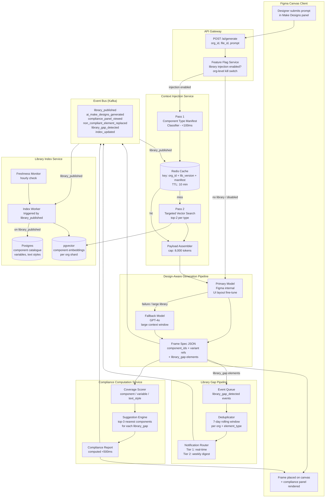
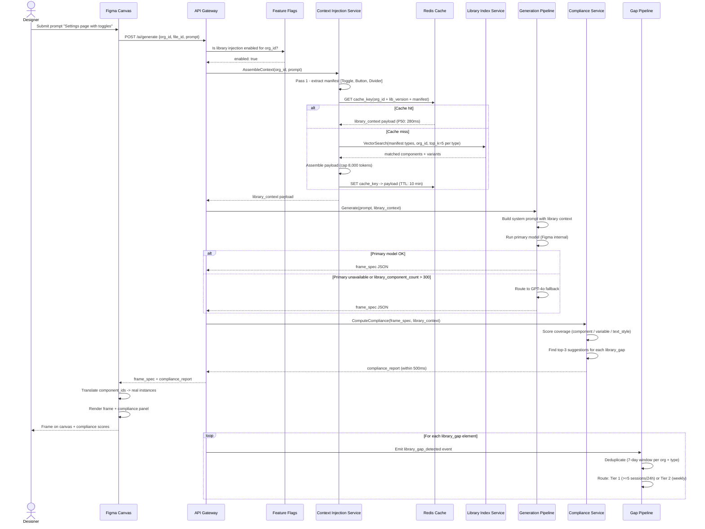

# Figma - Design-System-Aware AI Generation (System Architecture)

**What this explains:** The system architecture that powers library-grounded Make Designs generation - how Figma reads an org's published component library, injects it as structured context into the generation pipeline, and ensures output uses real component instances instead of hardcoded shapes.

**PRD reference:** https://github.com/004mayank/product-prd/blob/main/figma-design-system-aware-ai-prd.md

**Version:** v3 - Final system design
**Changes from v2:** Added NFR table with explicit SLOs and alert thresholds, kill switch architecture (per-layer granularity), experiment backlog with instrumentation requirements for each experiment, phased rollout plan aligned with PRD phases, all seven open questions from v2 resolved with decisions and rationale, index migration strategy for embedding model upgrades, multi-region deployment design for GDPR compliance, and production readiness checklist.

---

## Version history

| Version | Key additions |
|---|---|
| v1 | Core architecture (5 layers), data flow, library context payload schema, component matching logic, compliance computation, failure modes, trade-offs, user journeys |
| v2 | Mermaid diagrams (system + sequence), API contracts with error codes, architectural observability schema, competitive architecture comparison, scaling model, circuit breaker design, embedding pipeline detail, inter-service communication patterns |
| v3 | NFR table with SLOs, kill switch architecture, experiment backlog with instrumentation specs, phased rollout plan, all seven open questions resolved, embedding model migration strategy, multi-region deployment design, production readiness checklist |

---

## 1) What this system is

Figma's existing `Make Designs` pipeline generates frames from a text prompt using a general-purpose LLM with no knowledge of the org's component library. The output looks plausible but uses hardcoded hex values, raw shapes, and arbitrary font sizes - all of which violate the org's design system on inspection.

This architecture specifies the system that makes `Make Designs` **design-system-aware**: every generation session in an org with a published library receives a structured representation of that library as part of the generation context. The LLM maps each element in its output to a real library component before the frame is placed on the canvas.

The system has five layers:

1. **Library Index Service** - Maintains a structured, queryable representation of every org's published component library.
2. **Context Injection Service** - Fetches and trims the library context for a specific generation session.
3. **Design-Aware Generation Pipeline** - The LLM generation layer that consumes library context and outputs component-first frames.
4. **Compliance Computation Service** - Post-generation analysis that scores the output frame against the org library and populates the compliance panel.
5. **Library Gap Pipeline** - Event capture and notification system for component types the generation needed but could not find.

Hard constraint: **Library context is used only for in-session generation.** It is not retained after session end and is not used to train the generation model without explicit org admin opt-in.

---

## 2) Non-functional requirements (NFR table)

| Requirement | Target | Measurement | Alert threshold | Kill condition |
|---|---|---|---|---|
| Context injection P50 latency | <300ms | Per-request span (cache hit path) | >500ms for >5 min | >1,500ms P95 triggers CIS circuit breaker |
| Context injection P95 latency | <800ms | Per-request span (cache miss path) | >1,000ms for >5 min | >1,500ms P95 triggers CIS circuit breaker |
| End-to-end generation P95 (standard library, <200 components) | <10s | `generation_latency_ms` field in event | >12s for >5 min | >15s sustained - page on-call |
| End-to-end generation P95 (large library, 400-500 components) | <12s | `generation_latency_ms` field in event | >15s for >5 min | >18s sustained - page on-call |
| Library index freshness (time from `library_published` to index ready) | <5 min | `library_index_updated.index_latency_ms` | >8 min for any org | >15 min for >5% of orgs - page on-call |
| `library_context_injection_failure_rate` | <0.5% | Rolling 5-min window | >1% (warn) | >2% (critical) - trigger global fallback to generic generation |
| Compliance computation P95 latency | <500ms | `compliance_computed.computation_latency_ms` | >600ms for >5 min | >800ms - return degraded 206 response |
| Library context injection service availability | 99.9% | Rolling 7-day window | <99.5% | <99.0% - escalate to engineering lead |
| Compliance service availability | 99.5% | Rolling 7-day window | <99.0% | <98.5% - disable compliance panel, proceed with frame-only output |
| Redis cache hit rate (context injection) | >70% | Rolling 1h per region | <50% investigate TTL or key collision | <30% - review sharding |
| Embedding pipeline queue depth | <200 items | Queue depth metric | >500 items | >1,000 items - scale embedding worker horizontally |
| Component instance accuracy (proxy: `variant_swapped_immediately` <60s) | <15% swap rate | Computed from event sequence | >20% swap rate over 7-day rolling window | >30% - pause variant confidence feature; audit selection model |
| Privacy: library context retained post-session | 0 incidents | Security audit + TTL enforcement logs | Any retention anomaly | Any confirmed incident - disable context injection globally; page security lead |

---

## 3) Core problem the architecture must solve

The naive approach to library-grounded generation is to include the entire library as text in the LLM prompt. This fails for three reasons:

- A 300-component library with variant metadata, color variables, and text styles exceeds any practical LLM context budget (estimated 80-150k tokens for a mature enterprise library, before the prompt itself).
- Including the full library regardless of the prompt content means the LLM is equally likely to reach for any component, not the components relevant to the specific screen being generated.
- Library data is largely stable between publishes. Fetching it fresh on every generation request is expensive and slow.

The architecture solves this with three mechanisms:
1. **Relevance filtering:** For each generation session, embed the user prompt and retrieve the top N semantically relevant components from the library index, not the full library.
2. **Caching:** Library context is cached per org library version with a 10-minute TTL. Most sessions hit the cache; fresh fetches only occur after a library publish event.
3. **Two-pass generation:** First pass extracts a component type manifest from the prompt (e.g., "Button, Input, Card, Toggle"). Second pass fetches the exact library entries for those types, enabling precise variant selection rather than fuzzy similarity matching.

---

## 4) System architecture diagram



---

## 5) Generation sequence diagram



---

## 6) Kill switch architecture

Kill switches operate at three levels of granularity. Each level has an independent flag, monitoring trigger, and recovery path. They are designed to be additive - a lower-level switch (e.g., compliance panel) can be disabled without affecting the generation pipeline.

### Level 1: Global library injection kill switch

**Flag:** `global_library_context_injection_enabled` (default: true)

**Trigger conditions (any one sufficient):**
- `library_context_injection_failure_rate` > 2% over 5 minutes across all orgs
- Library Index Service unavailable in the primary region for >10 minutes
- Security incident involving library context data retention

**Effect:** All generation sessions fall back to generic (non-library) `Make Designs` output. No user-visible error - the generation proceeds normally without library context. `library_context_injected = false` in all events.

**Recovery:** Manual re-enable by on-call engineer after root cause is identified. Minimum hold: 30 minutes post-recovery confirmation.

**Who can trigger:** Any on-call engineer via feature flag console. Automated trigger via PagerDuty integration.

---

### Level 2: Per-layer kill switches (independent)

| Layer | Flag | Trigger | Fallback behaviour |
|---|---|---|---|
| Component matching | `disable_component_matching` | `variant_swapped_immediately` rate >30% (7-day rolling) | Generate with variable and text style injection only; component matching off; all elements flagged as `library_gap` |
| Variable injection | `disable_variable_injection` | Variable conflict causing incorrect token application in >5% of sessions (detected via `variable_coverage_pct` anomaly) | Generate with component matching and text style injection; all color fills use hardcoded hex from library context |
| Text style injection | `disable_text_style_injection` | Text style misapplication rate >10% (measured by `text_style_coverage_pct` anomaly) | Generate with component and variable injection; text nodes use raw font values from nearest library text style |
| Compliance panel | `disable_compliance_panel` | Compliance service P95 latency >800ms sustained for >10 min; or CCS availability <98.5% | Frame placed on canvas without compliance panel; `compliance_panel_viewed` event not emitted; `degraded: true` in generation event |
| Library gap notifications | `disable_gap_notifications` | Gap pipeline consumer lag >5 min; or notification delivery failures >10% | Gap events still logged to Kafka queue; notifications suppressed; no user-facing impact |
| Community library fallback (Phase 3) | `disable_community_library_context` | `outcome = deleted` rate for Free users increases >10% vs. Phase 2 baseline | Free users without custom library get generic generation (pre-Phase 3 behaviour) |

---

### Level 3: Per-org kill switch

**Flag:** `org_library_injection_enabled` (per org, default: true for qualifying orgs)

**Who can trigger:** Org admin via AI settings page (self-service). Engineering on-call for forced disable during incident.

**Trigger conditions:**
- Org admin reports generation quality regression or privacy concern
- >3 beta orgs report the same regression category in Phase 1 (triggers pause of all beta orgs)
- Engineering on-call identifies a library conflict specific to one org's library structure

**Effect:** Generation for that org falls back to generic output. All other orgs unaffected.

**Recovery:** Org admin re-enables via settings, or engineering re-enables after issue resolution.

---

## 7) System layers

### Layer 1: Library Index Service

**Purpose:** Maintains a structured, up-to-date representation of every org's published component library. This is the source of truth that all other layers read from.

**What it stores per org library:**
- Component catalogue: name, category, variant set, variant properties (type, state, size), semantic label (inferred from component name and description), usage frequency.
- Color variable catalogue: name, collection, light mode value, dark mode value, semantic role.
- Text style catalogue: name, font family, size, weight, line height, semantic role.
- Component embeddings: a vector embedding per component (based on name + description + semantic label) used for relevance filtering.

**Triggers for re-indexing:**
- `library_published` event fires whenever an org library is published. The index worker processes the updated library file and rebuilds the affected org's catalogue within 5 minutes.
- Freshness monitor runs hourly. Any org whose index is older than 24 hours relative to the last `library_published` event triggers a forced re-index.

**Indexing worker logic:**
```
on library_published(org_id, library_file_id, library_version):
  fetch_library_file(library_file_id)
  parse_components(file) -> component_records[]
  parse_variables(file) -> variable_records[]
  parse_text_styles(file) -> text_style_records[]
  embed_components(component_records) -> embedding_vectors[]
  upsert_catalogue(org_id, library_version, records)
  emit index_updated(org_id, library_version, component_count, latency_ms)
```

**Storage:** Postgres for structured records (component catalogue, variables, text styles). `pgvector` extension for component embeddings. For orgs with >500 components, a dedicated vector index shard per org is used to avoid cross-org embedding interference.

#### Embedding pipeline detail

The component embedding pipeline runs as a separate async worker, not inline with the index worker. This keeps the `index_updated` event latency under the 5-minute SLO even for orgs with large libraries (where embedding 500+ components via OpenAI `text-embedding-3-small` takes 15-30 seconds).

```
Embedding pipeline:
  Input: component_records[] with name, description, semantic_label
  Model: text-embedding-3-small (1536 dimensions)
  Batch size: 50 components per API call
  Parallelism: 4 concurrent batches per org
  Input string: "{name} - {category} - {description} - {semantic_label}"
  Output: float[1536] per component, stored in pgvector with org_id + library_version
  Estimated cost: ~$0.0002 per 300-component library re-index
```

**Index sharding strategy for large orgs:**
- Orgs with <200 components: single shared pgvector table, filtered by `org_id`.
- Orgs with 200-500 components: dedicated pgvector partition per org (partition key: `org_id`).
- Orgs with >500 components: dedicated pgvector table per org on a separate shard. Shard assignment is managed by a shard registry service. This prevents a large org's embedding search from scanning the shared index and degrading latency for smaller orgs.

---

### Layer 2: Context Injection Service

**Purpose:** Given a `(org_id, prompt)` pair, produces the structured `library_context` payload that the generation pipeline consumes.

**Two-pass context assembly:**

**Pass 1 - Component type manifest extraction:**
```
prompt = "Settings page for notification preferences with toggles and save button"

manifest = extract_component_types(prompt)
# -> ["Toggle", "Button", "Input", "Card", "Divider"]
```
The manifest is extracted by a lightweight classifier that maps natural language descriptions to UI primitive categories. This does not require a full LLM call - it uses a fine-tuned classification model trained on (prompt, UI element type) pairs. Latency target: <100ms.

**Pass 2 - Targeted library fetch:**
```
for type in manifest:
  matches = vector_search(
    query = type + org_id,
    filter = {org_id: org_id},
    top_k = 5  # top 5 per component type
  )
  score by: semantic_similarity * 0.7 + usage_frequency * 0.3
  take top 2 per type
```

The result is a `library_context` payload (see Section 9 for schema) bounded at ~8,000 tokens, covering the components most relevant to the specific prompt.

**Caching:**
- Cache key: `hash(org_id + library_version + component_type_manifest)`.
- TTL: 10 minutes.
- Cache is invalidated on `library_published` event for the org.
- Cache hit rate target: >70% (most generation sessions in an active file occur within a 10-minute window of a library state that has been previously fetched).

**SLOs for this service:**
- P50 latency: <300ms (cache hit path).
- P95 latency: <800ms (cache miss, full two-pass assembly).
- Availability: 99.9%.
- `library_context_injection_failure_rate`: <0.5%.

---

### Layer 3: Design-Aware Generation Pipeline

**Purpose:** Takes the user prompt and the `library_context` payload and generates a frame where every element is mapped to a library component instance.

**Prompt structure:**

```
[System instruction]
You are Figma's Make Designs AI.
You have the user's org design system below.
Every element in your generated frame must use a component from this library.
Map each UI element to the exact component ID and variant specified in the library context.
Do not use hardcoded hex values. Reference color variables by name.
Do not use raw font sizes. Reference text styles by name.
If the library has no match for a required element, flag it as library_gap.

[Library context - up to 8,000 tokens]
{library_context_payload}

[User prompt]
{prompt_text}
```

**Output format (structured JSON, not prose):**

The generation model outputs a structured JSON frame spec rather than a Figma plugin command sequence. This allows the Compliance Computation Service to inspect and score the output before it is placed on the canvas.

```json
{
  "frame_spec": {
    "width": 375,
    "height": 812,
    "elements": [
      {
        "element_id": "el_01",
        "type": "component_instance",
        "component_id": "cmp_btn_primary",
        "variant": "Button/primary/default",
        "position": { "x": 16, "y": 760 },
        "overrides": { "label": "Save preferences" }
      },
      {
        "element_id": "el_02",
        "type": "library_gap",
        "semantic_type": "DataTable",
        "fallback": "raw_frame",
        "position": { "x": 16, "y": 200 }
      }
    ],
    "color_fills": [
      { "element_id": "el_01", "fill": "variable:semantic/primary" }
    ],
    "text_styles": [
      { "element_id": "el_03", "style": "body/md" }
    ]
  }
}
```

Elements with `type: component_instance` reference real library component IDs. The Figma canvas layer translates these IDs into actual component instances when placing the frame. Elements with `type: library_gap` are placed as styled raw frames and flagged in the compliance panel.

**Model routing:**
- Primary: Figma's internal generation model (fine-tuned on UI layout tasks).
- Fallback: GPT-4o with the same prompt structure, used when the internal model is unavailable or when `library_component_count > 300` (GPT-4o's larger context window handles larger library payloads more reliably).

---

### Layer 4: Compliance Computation Service

**Purpose:** Scores the generation output against the org library before the frame is placed on the canvas. Populates the compliance panel.

**Inputs:** `frame_spec` JSON from the generation pipeline + `library_context` payload.

**Computation:**

```
total_elements = count(frame_spec.elements where type != "container")
component_instances = count(elements where type == "component_instance")
library_gaps = count(elements where type == "library_gap")

component_coverage_pct = component_instances / total_elements * 100

color_fills = count(frame_spec.color_fills)
variable_fills = count(fills where fill starts_with "variable:")
variable_coverage_pct = variable_fills / color_fills * 100

text_nodes = count(elements where has_text = true)
styled_text = count(frame_spec.text_styles)
text_style_coverage_pct = styled_text / text_nodes * 100

non_compliant_list = [
  for each library_gap element:
    find top 3 nearest library components by semantic_similarity to element.semantic_type
    -> { element_id, semantic_type, suggested_matches: [component_id, name, similarity_score] }
]
```

**Output:** `compliance_report` struct emitted within 500ms of frame spec generation completing.

```json
{
  "session_id": "uuid",
  "component_coverage_pct": 92.0,
  "variable_coverage_pct": 100.0,
  "text_style_coverage_pct": 94.0,
  "library_gap_count": 1,
  "non_compliant_elements": [
    {
      "element_id": "el_02",
      "semantic_type": "DataTable",
      "suggested_matches": [
        { "component_id": "cmp_table_basic", "name": "Table/basic", "score": 0.61 },
        { "component_id": "cmp_list_card", "name": "List/card", "score": 0.48 }
      ]
    }
  ]
}
```

**Panel rendering:** The Figma canvas client receives the `compliance_report` alongside the frame spec and renders the compliance panel below the generated frame before the user accepts or discards.

---

### Layer 5: Library Gap Pipeline

**Purpose:** Captures `library_gap_detected` events, deduplicates them, and routes notifications to design systems leads.

**Event schema:**

```json
{
  "event": "library_gap_detected",
  "org_id": "uuid",
  "generation_session_id": "uuid",
  "missing_element_type": "DataTable",
  "prompt_context": "data table with sortable columns",
  "gap_count_this_week": 3,
  "ts": "ISO8601"
}
```

**Deduplication:** Events are deduplicated per `(org_id, missing_element_type)` within a 7-day rolling window. A single component type missing from 5 sessions in one day triggers a Tier 1 real-time Figma notification to the design systems lead. The same type missing from 3+ sessions in 7 days (but not triggering Tier 1) is included in the weekly digest.

**Why this matters architecturally:** The gap pipeline turns the generation pipeline into a design system feedback mechanism. Gaps are not just errors - they are signals about which components the org needs next. This creates a flywheel: more AI generation -> better library gap visibility -> library expands -> better AI generation quality.

---

## 8) API contracts

### POST /ai/generate

Primary endpoint consumed by the Figma canvas client for every `Make Designs` session.

```
POST /ai/generate

Headers:
  Authorization: Bearer {session_token}
  X-Org-Id: {org_id}
  Content-Type: application/json

Request body:
{
  "file_id": "string (uuid)",
  "prompt": "string (max 500 chars)",
  "frame_width": "integer (optional, default 375)",
  "frame_height": "integer (optional, default 812)",
  "active_library_id": "string (uuid, optional - overrides default library priority)"
}

Response 200 (success):
{
  "session_id": "uuid",
  "frame_spec": { ...frame spec schema... },
  "compliance_report": { ...compliance report schema... },
  "library_context_injected": "boolean",
  "library_version": "string",
  "cache_hit": "boolean",
  "generation_latency_ms": "integer",
  "model_used": "figma_internal | gpt4o_fallback"
}

Response 202 (async - generation in progress, poll via session_id):
{
  "session_id": "uuid",
  "status": "generating",
  "poll_url": "/ai/generate/status/{session_id}"
}

Response 400 (invalid request):
{
  "error": "invalid_prompt",
  "message": "Prompt exceeds maximum length of 500 characters",
  "field": "prompt"
}

Response 429 (rate limit):
{
  "error": "rate_limit_exceeded",
  "retry_after_seconds": 30
}

Response 503 (service degraded - library injection unavailable):
{
  "error": "library_context_unavailable",
  "message": "Design system context is temporarily unavailable. Generating without library context.",
  "fallback": "generic_generation",
  "frame_spec": { ...generic frame spec... },
  "library_context_injected": false
}
```

**Rate limits:**
- 20 generation requests per user per hour (enforced at the gateway).
- 200 generation requests per org per hour (enforced per `org_id`).
- Limits are doubled for Enterprise tier orgs.

---

### POST /internal/ai/library-context

Internal endpoint exposed by the Context Injection Service, consumed by the generation pipeline.

```
POST /internal/ai/library-context

Request:
{
  "org_id": "string (uuid)",
  "file_id": "string (uuid)",
  "prompt": "string",
  "max_components": 80,
  "library_id": "string (uuid, optional - for multi-library orgs)"
}

Response 200:
{
  "library_context": {
    "org_id": "string",
    "library_file_id": "string",
    "library_version": "string",
    "generated_at": "ISO8601",
    "components": [ ...component records... ],
    "color_variables": [ ...variable records... ],
    "text_styles": [ ...text style records... ],
    "relevance_scores": { "component_id": "float" }
  },
  "context_size_tokens": "integer",
  "was_truncated": "boolean",
  "truncation_method": "relevance_filter | none",
  "cache_hit": "boolean",
  "latency_ms": "integer"
}

Response 404 (no library for org):
{
  "error": "no_library_found",
  "org_id": "string",
  "message": "No published org-scoped library found for this org"
}

Response 503 (Library Index Service unavailable):
{
  "error": "library_index_unavailable",
  "message": "Library index is temporarily unavailable"
}
```

**SLOs:**
- P50 latency: <300ms (cache hit).
- P95 latency: <800ms (cache miss, full two-pass).
- Availability: 99.9%.

---

### POST /internal/ai/compliance

Internal endpoint exposed by the Compliance Computation Service.

```
POST /internal/ai/compliance

Request:
{
  "session_id": "string (uuid)",
  "frame_spec": { ...frame spec... },
  "library_context": { ...library context payload... }
}

Response 200:
{
  "report_id": "uuid",
  "session_id": "uuid",
  "component_coverage_pct": "float",
  "variable_coverage_pct": "float",
  "text_style_coverage_pct": "float",
  "library_gap_count": "integer",
  "non_compliant_elements": [
    {
      "element_id": "string",
      "semantic_type": "string",
      "suggested_matches": [
        {
          "component_id": "string",
          "name": "string",
          "score": "float"
        }
      ]
    }
  ],
  "computed_at": "ISO8601",
  "computation_latency_ms": "integer"
}

Response 206 (partial - suggestion engine timed out):
{
  "report_id": "uuid",
  "component_coverage_pct": "float",
  "variable_coverage_pct": "float",
  "text_style_coverage_pct": "float",
  "library_gap_count": "integer",
  "non_compliant_elements": [],
  "degraded": true,
  "degradation_reason": "suggestion_engine_timeout"
}
```

**SLO:** P95 computation latency <500ms. If computation exceeds 500ms, return 206 with coverage scores only and an empty `non_compliant_elements` list.

---

## 9) Core data model

### LibraryComponent

```
component_id          uuid
org_id                uuid
library_file_id       uuid
library_version       string
name                  string
category              string          // "Button", "Input", "Card", etc.
description           string
variants              Variant[]
usage_frequency       integer         // times used across org files in last 30d
embedding_vector      float[1536]     // text-embedding-3-small on name+desc+semantic_label
semantic_label        string          // "primary CTA", "secondary action", "low-emphasis"
indexed_at            timestamp
```

### LibraryVariant

```
variant_id            uuid
component_id          uuid
name                  string          // "Button/primary/default"
properties            map<string,string>  // {type: primary, state: default, size: md}
semantic_label        string          // "main CTA, enabled state"
```

### LibraryColorVariable

```
variable_id           uuid
org_id                uuid
name                  string          // "semantic/primary"
collection            string          // "Brand", "Semantic", "Neutral"
value_light           string          // hex
value_dark            string          // hex
semantic_role         string          // "primary brand action"
```

### LibraryTextStyle

```
style_id              uuid
org_id                uuid
name                  string          // "body/md"
font_family           string
font_size             integer
font_weight           integer
line_height           float
semantic_role         string          // "body paragraph, medium size"
```

### GenerationSession

```
session_id            uuid
org_id                uuid
file_id               uuid
user_id               uuid
prompt_text           string
library_context_injected  boolean
library_version           string
component_count_injected  integer
cache_hit                 boolean
frame_spec_id             uuid
compliance_report_id      uuid
outcome                   enum(accepted, edited, deleted)
generation_latency_ms     integer
model_used                enum(figma_internal, gpt4o_fallback)
created_at                timestamp
```

### ComplianceReport

```
report_id             uuid
session_id            uuid
component_coverage_pct    float
variable_coverage_pct     float
text_style_coverage_pct   float
library_gap_count         integer
non_compliant_elements    NonCompliantElement[]
computed_at               timestamp
panel_viewed              boolean
panel_dismissed_without_action  boolean
degraded                  boolean     // true if suggestion engine timed out
```

---

## 10) Architectural observability schema

These are service-level instrumentation events emitted by each layer for ops dashboards and alerting - distinct from the product analytics events in the PRD.

### `library_index_updated`

Emitted by the Library Index Service after each successful re-index.

```json
{
  "event": "library_index_updated",
  "org_id": "uuid",
  "library_file_id": "uuid",
  "library_version": "string",
  "trigger": "library_published | freshness_monitor | manual",
  "component_count": "integer",
  "variable_count": "integer",
  "text_style_count": "integer",
  "embedding_count": "integer",
  "index_latency_ms": "integer",
  "embedding_latency_ms": "integer",
  "shard_id": "string",
  "ts": "ISO8601"
}
```

### `context_injection_served`

Emitted by the Context Injection Service for every completed context assembly.

```json
{
  "event": "context_injection_served",
  "session_id": "uuid",
  "org_id": "uuid",
  "cache_hit": "boolean",
  "manifest_types_extracted": ["Toggle", "Button", "Divider"],
  "manifest_extraction_latency_ms": "integer",
  "vector_search_latency_ms": "integer",
  "payload_assembly_latency_ms": "integer",
  "total_latency_ms": "integer",
  "component_count_in_payload": "integer",
  "context_size_tokens": "integer",
  "was_truncated": "boolean",
  "ts": "ISO8601"
}
```

### `generation_completed`

Emitted by the Generation Pipeline after each frame spec is produced.

```json
{
  "event": "generation_completed",
  "session_id": "uuid",
  "org_id": "uuid",
  "model_used": "figma_internal | gpt4o_fallback",
  "library_context_injected": "boolean",
  "element_count": "integer",
  "component_instance_count": "integer",
  "library_gap_count": "integer",
  "generation_latency_ms": "integer",
  "frame_spec_size_bytes": "integer",
  "ts": "ISO8601"
}
```

### `compliance_computed`

Emitted by the Compliance Computation Service.

```json
{
  "event": "compliance_computed",
  "session_id": "uuid",
  "org_id": "uuid",
  "component_coverage_pct": "float",
  "variable_coverage_pct": "float",
  "text_style_coverage_pct": "float",
  "library_gap_count": "integer",
  "computation_latency_ms": "integer",
  "degraded": "boolean",
  "ts": "ISO8601"
}
```

### Alert thresholds

| Alert | Condition | Severity | Action |
|---|---|---|---|
| Context injection failure spike | `library_context_injection_failure_rate` > 1% over 5 min | Warning | Page on-call; investigate LIS availability |
| Context injection failure critical | `library_context_injection_failure_rate` > 2% over 5 min | Critical | Trigger global fallback to generic generation; page on-call |
| Generation latency degradation | `generation_completed.generation_latency_ms` P95 > 12,000ms | Warning | Check model routing; verify LLM provider status |
| Compliance service timeout rate | `compliance_computed.degraded = true` rate > 10% over 5 min | Warning | Scale compliance service; check suggestion engine latency |
| Index freshness violation | Any org index older than 36h past last `library_published` event | Warning | Force re-index for affected org |
| Embedding pipeline backlog | Embedding queue depth > 500 items | Warning | Scale embedding worker horizontally |

---

## 11) Competitive architecture analysis

### How competitors approach design-system-aware generation

| System | Library data access | Context injection approach | Component matching quality | Gap handling |
|---|---|---|---|---|
| **Figma (this system)** | Native - owns org library data in its own infrastructure; full variant metadata, variable bindings, usage frequency | Two-pass (manifest + targeted vector search); cached per org version | High - variant-level matching with semantic labels; usage frequency bias | First-class - gap events feed back to design systems team as actionable signals |
| **Galileo AI** | File import only - reads exported Figma JSON or connected file via API; no access to org-scoped library | Single-pass fuzzy matching against imported component set | Medium - component type matching works; variant selection is inconsistent without semantic metadata | No structured gap handling; non-matched elements use generic shapes silently |
| **Diagram plugin (Figma plugin)** | File-local components via Plugin API; cannot read org-scoped libraries or other team libraries | Real-time fetch on every generation; no caching | Low-medium - limited to components visible in the current file; variant metadata is partial via Plugin API | No gap handling; falls back to generic shapes |
| **v0 (Vercel)** | Design tokens only (if supplied via config); no Figma library concept | Token injection into Tailwind/CSS generation; no component instance concept | N/A - generates code, not Figma instances | N/A - missing tokens produce default Tailwind values |
| **Framer AI** | Framer's built-in component library only; no custom library concept | Hard-coded Framer component set injected at generation time | Medium for Framer components; zero for custom org libraries | No gap handling; Framer component set is fixed |

**Why Figma's architectural position is defensible:**

1. **Data moat:** Figma owns the library data at the infrastructure layer. Galileo AI and Diagram access the same data via Figma's API - which means they get what Figma exposes publicly, not the full internal representation (e.g., variant semantic labels inferred from layer names are not in the public API).

2. **Usage frequency signal:** The Library Index Service stores `usage_frequency` per component (times used across org files in the last 30 days). This signal is unavailable to external tools, which must use component name popularity as a proxy. Usage frequency is a materially better bias signal for relevance ranking - a component that appears in 300 files is more likely the right default pick than one that appears in 3.

3. **Variable binding depth:** External tools that read exported Figma JSON get color hex values, not the variable binding that produced them. The internal API layer gives this system access to `variable:semantic/primary` references directly, enabling true variable coverage scoring in the compliance computation. External tools must infer variable usage from color matching, which has high false-positive rates.

**Where competitors can close the gap:**

- Galileo AI could close the component matching quality gap if Figma exposes variant semantic metadata via its public API. This is an API governance decision Figma should make carefully: expanding the public API reduces the architectural moat.
- Diagram could improve by building an org-library indexer that runs on a Figma team's behalf at publish time and maintains its own vector index. This would replicate the Library Index Service externally. The two-week engineering effort is tractable for a well-funded plugin team.

**Architectural recommendation:** The compliance panel and gap pipeline are the hardest surfaces for external tools to replicate, because they require writing back to the canvas and surfacing structured feedback in the generation UX. Investing in these surfaces (and making them deeply integrated into the Figma canvas) is the best way to extend the moat beyond data access.

---

## 12) Scaling model

### Concurrency and throughput

**Generation sessions per day estimate (at GA):**
- Figma has ~4M daily active users. Assume 0.5% trigger a Make Designs session per day = 20,000 sessions/day.
- Of these, assume 40% are in orgs with a published library = 8,000 library-grounded sessions/day.
- Peak hour (9-11am Pacific): assume 15% of daily volume = 1,200 library-grounded sessions/hour = 20/minute.

**Context Injection Service sizing:**
- 20 requests/minute with P95 latency <800ms is well within a single-region service running 8 replicas.
- Redis cache handles cache-hit path at sub-millisecond; only cache-miss requests hit pgvector.
- Cache hit rate target >70% reduces effective pgvector load to ~6 requests/minute at peak.

**Library Index Service sizing:**
- Re-index events are driven by library publishes. Assume 500 org libraries published per day across all orgs (conservative for enterprise).
- Embedding pipeline: 500 re-indexes * 200 components average = 100,000 embeddings/day. At 50 per batch = 2,000 API calls/day. This is negligible cost and compute.
- For a major Figma library release (e.g., Figma's own design system update) that triggers re-indexing for a high-component-count org, the index worker must handle up to 600 components in a single re-index. Target: <5 minutes end-to-end for a 600-component re-index.

### Cost model at scale (directional)

| Component | Cost driver | Estimate at 8,000 sessions/day |
|---|---|---|
| Context injection (cache miss) | pgvector queries (6/min at peak) | Negligible - vector search is compute-bound, not I/O-bound; estimated <$50/month for the query layer |
| Embedding pipeline (re-indexing) | OpenAI `text-embedding-3-small` API calls | ~100,000 embeddings/day * $0.00002/1K tokens * avg 50 tokens per component = ~$0.10/day |
| Generation model (primary) | Figma internal model inference | Internal cost; not externally measurable |
| Generation model (fallback - GPT-4o) | OpenAI API; ~16K tokens per session (8K library context + 4K prompt + 4K output) | Assume 10% of sessions hit fallback: 800 sessions * 16K tokens * $0.03/1K = ~$24/day |
| Compliance computation | CPU-only; no external API | ~$5-10/month for compute |
| Redis cache | 8,000 sessions/day * ~10KB payload/session | Cache storage: ~80MB hot cache; negligible cost |

**Cost observation:** The dominant cost driver is the GPT-4o fallback path. Reducing fallback rate from 10% to 5% (by improving the primary model's large-context handling) saves ~$12/day at 8,000 sessions. At 10x scale (80,000 sessions/day), this becomes a $120/day saving.

---

## 13) Experiment backlog (architecture instrumentation requirements)

Each PRD experiment requires specific instrumentation from the architecture layer. This section specifies what the system must emit for each experiment to be measurable.

---

### Experiment 1: Compliance panel - default visible vs. opt-in

**PRD hypothesis:** Designers who see the compliance panel by default make better decisions and produce higher `component_coverage_pct` in accepted frames.

**Architecture requirements:**
- `compliance_panel_viewed` event must include `panel_was_default_open: boolean` field (set by the feature flag that controls the experiment arm).
- `ai_make_designs_generated` event must include `experiment_arm: "panel_default_open | panel_opt_in"` field.
- The experiment assignment must be sticky per `org_id` (not per user) to avoid contamination across users in the same org seeing different panel behaviours.

**Minimum detectable effect:** 5 percentage points in `component_coverage_pct` mean. Required sample: ~1,200 sessions per arm (assuming 80% power, alpha=0.05, estimated SD of 18 p.p.). At 8,000 library-grounded sessions/day * 50% in experiment * 50% per arm = 2,000 sessions/day per arm. Duration: 4 weeks to reach significance with buffer for day-of-week variance.

**Kill condition:** If `outcome = deleted` rate in treatment (panel default open) exceeds control by >10% relative after 7 days, kill the treatment arm and revert to opt-in default.

---

### Experiment 2: Library gap digest - real-time notification vs. weekly summary

**PRD hypothesis:** Real-time Tier 1 notifications shorten time-from-gap-detected to new component published.

**Architecture requirements:**
- `library_gap_notification_sent` event with fields: `org_id`, `notification_tier: "tier1_realtime | tier2_weekly"`, `missing_element_type`, `gap_count_at_send`, `experiment_arm`.
- `library_published` events must be joinable to `library_gap_detected` events within the analytics pipeline: identify when a new component matching a previously detected gap type is published. This requires the Library Index Service to log `new_component_types` in the `library_index_updated` event.
- Experiment assignment at `org_id` level (the unit of analysis is the design systems team, not the individual user).

**Minimum detectable effect:** 7-day reduction in time-to-component. Based on sprint cycle (14 days), the experiment must detect a difference of at least 7 days. Required observation window: 8 weeks (to observe multiple gap-to-publish cycles per org).

**Confound to control:** Orgs with faster library publishing cadence will naturally show faster time-to-component regardless of notification type. Stratify by library publishing frequency (active: >2 publishes/week; moderate: 1-2/week; slow: <1/week) in the analysis.

---

### Experiment 3: Compliance gate - hard gate vs. soft warning for low-coverage frames

**PRD hypothesis:** A soft "Low coverage" badge on frames with <50% component coverage reduces non-compliant frames handed off to engineering.

**Architecture requirements:**
- `compliance_report` must include a `coverage_gate_triggered: boolean` field (true when `component_coverage_pct` < 50%).
- `devmode_session_started_on_ai_frame` event: emitted when a Dev Mode user opens an AI-generated frame for engineering inspection. Must include `frame_session_id` to join back to the generation session and its compliance report.
- `low_coverage_badge_dismissed` event: emitted when a designer explicitly dismisses the badge (if the treatment arm shows the badge).
- Experiment arm assignment: sticky per `org_id`.

**Minimum detectable effect:** 10 percentage point reduction in low-coverage frame handoff rate (frames with <50% coverage that subsequently receive a `devmode_session_started_on_ai_frame` event). Required sample: orgs producing at least 5 low-coverage frames per week. Likely a small cohort in Phase 2 - may need to extend to Phase 3 population for sufficient power.

---

### Experiment 4: Prompt pre-flight - component type manifest preview before generation

**PRD hypothesis:** A 2-second "planning" step displaying which component types the AI will use increases `outcome = accepted` rate by reducing post-generation surprise.

**Architecture requirements:**
- `prompt_preflight_shown` event: emitted when the pre-flight manifest preview is displayed to the designer. Fields: `session_id`, `manifest_types: string[]`, `designer_cancelled: boolean`.
- If the designer cancels at the pre-flight step, no `ai_make_designs_generated` event should fire for that attempt - but a `make_designs_cancelled_at_preflight` event must fire for funnel analysis.
- The manifest extraction step (Pass 1 of Context Injection) must run in <100ms to keep the pre-flight visible step under the 2-second target. P95 latency for manifest extraction must be monitored independently from context assembly total latency.
- `experiment_arm: "preflight_shown | no_preflight"` must be included in `ai_make_designs_generated` events.

**Minimum detectable effect:** 5 percentage point increase in `outcome = accepted` rate. Required sample: ~2,400 sessions per arm (assuming current accepted rate ~30%, SD ~0.46, 80% power). At 2,000 sessions/day per arm, duration: ~3 weeks. Pre-flight cancellation rate is a secondary metric: if >20% of sessions are cancelled at pre-flight, the feature is introducing friction, not reducing it.

---

### Experiment 5: Variant confidence labelling in the compliance panel

**PRD hypothesis:** Showing per-variant confidence scores in the compliance panel causes designers to fix more variant mismatches before handoff.

**Architecture requirements:**
- Compliance Computation Service must be extended to compute a `variant_confidence_score: float` for each `component_instance` element in the frame spec. This score reflects how confident the generation model was in the variant selection (proxy: cosine similarity between the prompt's embedding and the selected variant's semantic label embedding, normalized 0-1).
- `compliance_panel_variant_swap_clicked` event: emitted when a designer clicks "swap variant" for an amber-highlighted (confidence <70%) component instance. Fields: `session_id`, `element_id`, `original_variant`, `selected_variant`, `original_confidence_score`.
- `variant_swapped_immediately` event: emitted when a designer swaps a variant within 60 seconds of accepting a library-grounded frame. Fields: `session_id`, `element_id`, `time_since_accept_seconds`. This is the primary proxy for incorrect variant selection.
- The confidence score computation adds an estimated 50-100ms to compliance computation P95. Verify that the updated P95 stays within the 500ms SLO before enabling in production.

**Minimum detectable effect:** 5 percentage point reduction in `variant_swapped_immediately` rate. Current estimated baseline: 15% (from Phase 1 dogfood data). Required sample: ~3,000 sessions per arm. Duration: 4 weeks.

---

## 14) Phased rollout plan (architecture perspective)

The PRD defines product go/no-go gates per phase. This section defines the architectural milestones and infrastructure prerequisites for each phase.

### Phase 0: Internal dogfood (weeks 1-4)

**Infrastructure prerequisites:**
- Library Index Service deployed to staging; load tested at 2x dogfood volume.
- Context Injection Service deployed with Redis cache layer; cache invalidation on `library_published` verified via integration test.
- Feature flag `global_library_context_injection_enabled` in place; per-org flag wired to flag service.
- All 4 generation events (`ai_make_designs_generated` additions, `compliance_panel_viewed`, `non_compliant_element_replaced`, `library_gap_detected`) emitting to internal analytics pipeline.
- PagerDuty alerts configured for `library_context_injection_failure_rate` (>1% warn, >2% critical) and `generation_latency_ms` P95 (>12s warn, >15s critical).
- Privacy: library context session TTL enforcement verified - zero persistence after session end. Must pass security audit before any generation session uses real org library data.

**Architecture gate to advance to Phase 1:**
- Library Index Service: P95 latency for `library_published` -> `index_updated` < 5 minutes across 100+ dogfood re-index events.
- Context Injection Service: P95 latency <800ms; Redis cache hit rate >70% after first 48 hours of dogfood.
- Zero P0 incidents (privacy data leakage, incorrect library applied to wrong org, generation pipeline returning non-200 for >5% of sessions).
- `component_coverage_pct` mean >70% across dogfood sessions (measured from `ai_make_designs_generated` events).

---

### Phase 1: Closed beta - 10-15 enterprise orgs (weeks 5-10)

**Infrastructure additions vs. Phase 0:**
- Embedding pipeline scaled to handle 500+ component org re-indexes within the 5-minute SLO.
- Dedicated pgvector shards provisioned for any beta org with >500 components.
- Library gap pipeline: `library_gap_detected` events flowing to Kafka; Tier 1/Tier 2 notification routing logic deployed (needed for Experiment 2).
- Per-org monitoring dashboards: each beta org gets a dedicated view of their `component_coverage_pct`, `variant_swapped_immediately` rate, and `library_gap_detected` volume. This supports the in-person qualitative review cadence with design systems leads.
- `library_scope_conflict` event logging in place for multi-library orgs.

**Architecture gate to advance to Phase 2:**
- Experiment 2 instrumentation validated: `library_gap_notification_sent` events emitting correctly; `library_published` events joinable to gap events in analytics pipeline.
- P95 generation latency for orgs with 200-400 component libraries: <12s (separate SLO from standard orgs).
- No regression in `ai_make_designs_generated` volume for beta orgs (generation attempts must not decline >10% post-feature enable).
- Circuit breaker states monitored and never stuck in OPEN for >15 minutes during Phase 1 window.

---

### Phase 2: Opt-in GA - all Professional+ orgs with published libraries (weeks 11-16)

**Infrastructure additions vs. Phase 1:**
- Context Injection Service: horizontal scaling validated for 10x Phase 1 volume. Load test at 5x current peak before Phase 2 launch.
- Redis cache: cross-region replication enabled (US-East, EU-West, AP-Southeast). Each region serves its local Figma canvas clients. Cache invalidation on `library_published` must propagate to all regions within 30 seconds.
- Library Index Service: read replicas in each region; writes to primary only; replicas used for vector search in non-primary regions.
- Experiment 1 and Experiment 4 instrumentation deployed and validated in staging before Phase 2 launch.
- Org admin self-service flag in AI settings page: `library_injection_enabled` toggle per org. Toggle state change fires `org_library_injection_toggled` event for audit log.
- Privacy disclosure: `library context handling` section added to Figma's product privacy page and linked from the AI settings panel.

**Capacity plan for Phase 2 GA:**
- Estimated qualifying orgs: ~50,000 Professional and Organisation tier orgs with at least one published library.
- Estimated opt-in rate: 30% in first 4 weeks = ~15,000 active orgs.
- Estimated sessions/day at 30% opt-in: 8,000 (current Phase 1 extrapolated) -> scale to handle 25,000 sessions/day by end of Phase 2.
- Redis cache sizing: 25,000 sessions/day * 10KB payload * 10-min TTL overlap = ~1.7GB hot cache per region. Provision 4GB per region with 2x headroom.

**Architecture gate to advance to Phase 3:**
- `library_context_injection_failure_rate` sustained <0.5% for 30 days.
- Generation latency P95 <10s for standard orgs at Phase 2 volume (not just dogfood volume).
- Privacy: no library context retention incidents in Phase 2.
- Experiment 1 results available: compliance panel default state confirmed for Phase 3.

---

### Phase 3: Default-on GA - all tiers including community libraries (week 17+)

**Infrastructure additions vs. Phase 2:**
- Community library indexing: Figma Material Design and iOS Design System component libraries indexed as shared community library contexts. These are static (versioned by Figma's own design team) rather than org-specific. Indexed once per community library version; shared across all Free user sessions that have no custom library.
- Community library cache: single Redis key per community library version; TTL 24 hours (community libraries change rarely vs. org libraries). Cache invalidation triggered by community library version update event.
- `library_type: "org | team | community"` field added to all generation events for segmentation.
- `ai_used_components` provenance panel: Figma canvas client shows which library was used (org, team, or community) inline in the accepted frame. This requires the `library_file_id` and `library_type` from the generation response to be passed to the canvas rendering layer.
- Experiment 5 instrumentation: variant confidence scoring deployed to Compliance Computation Service. P95 latency re-validated with confidence scoring enabled.
- Phase 3-specific kill switch: `disable_community_library_context` flag independent from org library injection.

---

## 15) Multi-region deployment design (GDPR)

**Problem:** For EU-resident orgs with data residency requirements, the `frame_spec` returned by the generation pipeline may contain text overrides that include PII (e.g., a designer prompts "User profile page for Jane Doe" - the generated frame's text nodes contain the name). If compliance computation runs in a US-hosted service, this data crosses jurisdictions.

**Decision (from resolved Q6):** Compliance computation must run in the same region as the generation pipeline for each session. Library Index Service and Context Injection Service follow the same regional routing.

**Architecture:**

```
EU-West region:
  - Library Index Service replica (Postgres + pgvector)
  - Context Injection Service instance with EU Redis cache
  - Generation Pipeline (LLM API calls routed to EU-hosted model endpoints)
  - Compliance Computation Service

US-East region (primary):
  - All services (primary)

AP-Southeast region:
  - Library Index Service replica
  - Context Injection Service with AP Redis cache
  - Generation Pipeline (US-West or AP model endpoints by latency)
  - Compliance Computation Service
```

**Library data replication:**
- Library Index Service: primary Postgres in US-East. Replicas in EU-West and AP-Southeast.
- Replication lag target: <60 seconds. For EU orgs, vector searches run against the EU replica. A replica lag of <60 seconds means a org library publish will be reflected in EU generation sessions within 1 minute.
- pgvector shards for large orgs (>500 components): provisioned in the org's home region (determined by the org's Figma account region setting). Cross-region shard access is avoided.

**Frame spec data:** The `frame_spec` and `compliance_report` are in-memory only within the generation pipeline. They are not written to persistent storage (only the `session_id` and aggregate metrics are persisted in the `GenerationSession` and `ComplianceReport` tables). This means GDPR deletion requests for session data are handled by deleting the session record; no frame_spec content needs to be scrubbed.

---

## 16) Embedding model migration strategy

**Problem (from resolved Q7):** When OpenAI releases a new version of `text-embedding-3-small`, all org library embeddings become stale relative to the new model's embedding space. Cosine similarity comparisons between old-model query embeddings and new-model stored embeddings will produce incorrect rankings.

**Scale of the problem:** At Phase 3 GA, estimated ~50,000 orgs with published libraries, average 150 components = 7.5M embeddings to re-compute. At 50 embeddings/batch = 150,000 API calls. At $0.00002 per 1K tokens * 50 tokens/component = ~$150 total re-index cost. Cost is not the constraint; latency is - 150,000 API calls at 4 concurrent batches per org would take ~10 hours for a single-threaded migration.

**Migration strategy:**

```
Phase A - Preparation (before new model goes live):
  - Freeze current embedding model version in all generation pipeline calls.
    New library publishes continue using the old model until migration completes.
  - Provision a migration job queue with org_id entries ordered by org tier:
    Enterprise -> Organisation -> Professional -> Free community libraries.
  - Scale embedding worker to 32 concurrent batches (4x normal).

Phase B - Background migration (2-3 days):
  - Migration job processes orgs from the queue.
  - For each org: re-embed all components using new model; write new embeddings to
    a versioned pgvector table (embedding_model_version field).
  - CIS reads from old embedding table until org migration is confirmed complete.
  - On completion, CIS switches to new embedding table for that org.
  - Zero downtime: old and new embedding tables coexist during migration.

Phase C - Cutover:
  - After all orgs migrated, disable old embedding table reads.
  - Update embedding model version in library index worker config.
  - New library publishes use the new model from this point forward.

Phase D - Validation:
  - Monitor `component_coverage_pct` mean for 7 days post-migration.
  - If coverage drops >5 p.p. vs. pre-migration baseline, the new model is producing
    worse relevance rankings for Figma's component vocabulary.
    Fallback: revert CIS to old embedding table; investigate model compatibility.
```

**Monitoring during migration:**
- `embedding_migration_progress` event: emitted per org on completion. Fields: `org_id`, `component_count`, `migration_latency_ms`, `new_model_version`.
- Dashboard: tracks migration completion rate by org tier; ETA to full migration.
- Alert: if migration throughput drops below 10,000 components/hour, scale embedding worker.

---

## 17) Failure modes

| Failure | Detection | Mitigation | Degraded state |
|---|---|---|---|
| Library Index Service unavailable | Health check failure; `library_context_injection_failure_rate` spike | Circuit breaker trips; fall back to generic generation; `library_context_injected = false` in event | Designer sees generic (non-library) Make Designs output; no error shown |
| Context injection latency exceeds 1.5s | P95 latency alert; circuit breaker OPEN | Serve partial library context (top 30 components by usage frequency only, skipping two-pass assembly) | Lower coverage quality; generation proceeds |
| Component type manifest classifier fails (returns empty manifest) | `manifest_extraction_failure` event | Fall back to single-pass: embed prompt, return top 40 components by cosine similarity | Slightly lower component coverage; no user-visible error |
| Generation model returns malformed frame_spec | JSON parse failure | Retry once with explicit JSON schema hint in prompt; if second attempt fails, fall back to generic generation | Rare; user sees standard "Try again" prompt |
| Compliance Computation Service exceeds 500ms | P95 alert; circuit breaker OPEN | Return 206 partial (coverage scores only; no non-compliant element list) | Panel shows coverage percentages only; no suggested replacements |
| Library gap pipeline event backlog | Consumer lag > 1 min | Scale consumer horizontally; Tier 1 notifications degrade to Tier 2 during backlog recovery | Notification delay; no user-facing impact |
| Multi-library conflict (org has two published org-scoped libraries) | `library_scope_conflict` event logged | Enforce priority: most recently published org library wins; log which library was used per session | Predictable behaviour; design systems lead can inspect via audit log |
| pgvector shard unavailable for large org | Query timeout; error logged | Route to a read replica; if replica also unavailable, serve from usage-frequency-only fallback (no embedding search) | Lower context relevance; generation proceeds |
| Embedding pipeline backlog > 500 items | Queue depth alert | Scale embedding worker to 8 replicas; new library publishes processed within 30 min instead of 5 | Stale embeddings for recently published libraries; coverage quality slightly lower |
| Redis cache unavailable | Connection errors from CIS | Bypass cache; all requests run full two-pass assembly | P95 latency increases to ~1,200ms; no functional degradation |
| EU replica replication lag > 5 min | Replication lag alert | Block EU org generation sessions from using stale replica; route to primary (US-East) with a user-visible warning "Design system may not reflect recent changes" | Minor latency increase for EU orgs; GDPR compliance maintained |
| Embedding model migration failure for an org | `embedding_migration_progress` event not received within 2x expected window | Keep org on old embedding table; retry migration job; alert engineering | Old embeddings used; coverage quality unchanged from pre-migration |

---

## 18) Circuit breaker design

Each inter-service call has an independent circuit breaker to prevent cascading failures.

### Library Index Service circuit breaker

```
State transitions:
  CLOSED (normal) -> OPEN (tripped) -> HALF_OPEN (probing) -> CLOSED

Trip condition: 5 consecutive failures OR failure rate > 50% in a 30s window
Recovery probe: 1 request every 10s in HALF_OPEN state
On OPEN: serve fallback (generic generation with library_context_injected = false)
Alert: PagerDuty Warning on trip; Critical if OPEN > 5 minutes
```

### Context Injection Service circuit breaker

```
Trip condition: P95 latency > 1,500ms OR error rate > 10% in a 60s window
Recovery probe: 1 request every 15s
On OPEN: skip two-pass assembly; serve top-40 components by usage_frequency (partial context)
Degraded mode event: context_injection_served with degraded: true
```

### Compliance Computation Service circuit breaker

```
Trip condition: P95 latency > 800ms OR error rate > 15% in a 60s window
Recovery probe: 1 request every 20s
On OPEN: return 206 with coverage scores only (skip suggestion engine); degraded: true
```

### Generation pipeline fallback routing

The generation pipeline itself is not a circuit breaker target - it uses explicit model routing:
- Primary model health check runs every 30s.
- If primary returns non-200 for 3 consecutive requests, route all sessions to GPT-4o fallback.
- Fallback routing emits `generation_completed.model_used = gpt4o_fallback` for monitoring.

---

## 19) User journeys (architecture perspective)

### Journey 1: Designer generates a settings page (happy path)

1. File belongs to an org with a published library (140 components, 32 variables, 12 text styles).
2. Designer submits prompt. Context Injection Service checks cache - cache hit on the org's library context for the type manifest [Toggle, Button, Divider]. Returns cached payload in 280ms.
3. Generation pipeline receives prompt + 8 components from the library (Toggle/active, Toggle/inactive, Button/primary/default, Button/primary/disabled, Card/content, Divider/horizontal/full, Input/text/default, FormLabel/default).
4. frame_spec returned in 4.2s. All 14 elements use `component_instance` type with valid `component_id` references.
5. Compliance: component coverage 100%, variable coverage 100%, text style coverage 92% (two text nodes used raw 13px font not mapped to `body/sm`). Report computed in 180ms.
6. Canvas places frame, shows compliance panel with "Looks good - 2 text elements not using library styles" flagged.
7. Designer clicks suggested replacement for both text nodes, accepts frame.
8. Total time from prompt submit to frame acceptance: ~7s.

### Journey 2: Library index stale during generation

1. Design systems lead published a new `Table/sortable` component 8 minutes ago.
2. A designer generates a "data table with filters" - prompt arrives during the 10-minute cache window before the new component is indexed.
3. Context Injection Service serves the cached library context (does not include `Table/sortable`).
4. Generation pipeline sees no table component; returns `library_gap` for the table element.
5. Compliance panel shows "Table not in your library" - technically incorrect for 2 more minutes until the cache expires.
6. At the next generation attempt (after 10-minute TTL), the cache refreshes and the new `Table/sortable` component is available.

**Trade-off accepted:** The 10-minute window is a deliberate cost/accuracy trade-off. Reducing the TTL to 1 minute would eliminate this gap but increase library fetches by 10x. This scenario requires a design systems lead to publish a component and a designer to immediately generate a frame using that exact new component type - a low-frequency event.

### Journey 3: Org with no published library

1. Generation session fires. Context Injection Service checks for published org-scoped library - none found.
2. `library_context_injected = false`. Generation proceeds with the existing generic Make Designs pipeline.
3. No compliance panel rendered (no library to compare against).
4. `ai_make_designs_generated` event fires with `library_context_injected: false`, `uses_org_library_components: false`.
5. No user-visible change from current product behaviour.

### Journey 4: Context Injection Service circuit breaker open

1. Library Index Service experiences a database failover. CIS P95 latency spikes to 2,000ms. Circuit breaker trips to OPEN state.
2. Designer submits a prompt. CIS circuit breaker returns partial context (top-40 by usage frequency) in <200ms.
3. Generation pipeline receives reduced library context; generates frame with ~65% component coverage instead of typical ~90%.
4. Compliance panel shows lower coverage score; flags more non-compliant elements.
5. `context_injection_served` event fires with `degraded: true`.
6. PagerDuty alert fires. On-call investigates LIS availability. Circuit breaker recovers to HALF_OPEN within 10 minutes.
7. Designer is not aware of the degraded state; no error is shown. The frame is usable but requires more manual compliance fixes.

---

## 20) Open questions - resolved (v3)

**Q1: Manifest classifier training data**

Decision: Two data sources, sequenced.

- **Phase 0 bootstrap:** Use Figma's existing anonymised Make Designs prompt logs (sessions where the prompt and accepted frame are both available, with explicit user consent via Figma's AI training opt-in). Extract (prompt text, UI element types present in the accepted frame) pairs as training labels. Estimated corpus: 50,000 sessions with opt-in - sufficient for a baseline classifier.
- **Phase 1+ refinement:** Collect labels via the prompt pre-flight step (Experiment 4). Each pre-flight display gives the designer an opportunity to confirm or edit the manifest preview. Confirmed manifests are positive labels; edited manifests are correction labels. This creates a continuous training signal without requiring a separate labelling effort.
- **Data governance gate:** Training must not begin until the privacy team confirms that the training corpus is covered by the existing AI training opt-in language in Figma's terms of service. If not covered, extend the opt-in scope before Phase 0 training runs.

---

**Q2: Code Connect linkage in generation**

Decision: Add to Phase 2 roadmap, not Phase 0 or Phase 1 scope.

Rationale: Code Connect linkage requires the generation pipeline to query the Dev Mode infrastructure for each component instance in the frame spec. This adds a dependency on the Dev Mode team's internal APIs and ~100-200ms per session for the linkage lookup. The PRD's Phase 0 latency budget has no headroom for this.

Architecture implication: The `GenerationSession` data model includes a `code_connect_linked: boolean` field (default false) in Phase 0. The canvas client reads this field and shows a "Link to code" prompt in the accepted frame if true. In Phase 2, when the Dev Mode team ships the Code Connect API, the generation pipeline can call it post-compliance-computation and set this field to true for orgs with active Code Connect configurations.

---

**Q3: Cross-file local component handling**

Decision: Exclude local components in Phase 0 and Phase 1. Add as an explicit opt-in in Phase 2.

Rationale: Local components (defined in the current file but not published to a library) present two problems. First, they are not indexed by the Library Index Service (which indexes only published libraries). Adding local component indexing requires a real-time file-read operation at session start, adding ~300-500ms latency. Second, local components frequently include draft patterns that the designer does not want the AI to generalize from.

Phase 2 implementation: The generation panel includes a toggle "Also use components from this file" (default off). When enabled, the Context Injection Service runs a supplemental local component fetch (reading the current file's component set via Figma's internal file API), merges it with the org library context, and passes the combined payload to generation. Local components are tagged `source: "file_local"` in the library context so the Compliance Computation Service can distinguish them from published library components in the coverage report.

---

**Q4: Variable mode context (light/dark theme)**

Decision: Default to the file's active variable mode at session time. Surface the mode used in the compliance panel.

Architecture implementation: The `POST /ai/generate` request is extended with an optional `active_variable_mode: "light | dark | system"` field. If not provided, the API gateway reads the file's current variable mode setting from the Figma file service (cached per file_id, TTL 5 minutes). The compliance computation uses the mode-specific variable values for coverage scoring: if the file is in dark mode, variable coverage is scored against dark mode hex values, not light mode values. The compliance panel shows a small "Scored in dark mode" label when the active mode is not the default light mode.

Edge case: If `active_variable_mode = "system"`, the API gateway defaults to light mode for scoring purposes. A follow-up Phase 2 feature can add dual-mode compliance scoring (show coverage for both light and dark simultaneously).

---

**Q5: Variant selection confidence thresholds**

Decision: Use 70% as the amber threshold for Phase 2 compliance panel labelling. Calibrate from Phase 1 data.

Architecture implementation: The Compliance Computation Service computes `variant_confidence_score` for each `component_instance` element using cosine similarity between the prompt's embedding and the selected variant's semantic label embedding, normalized to a 0-100 scale. In Phase 1 beta, collect `variant_swapped_immediately` data (swaps within 60 seconds of frame acceptance) as ground truth. Calibrate: find the confidence score threshold below which the swap rate exceeds 25%. If that threshold is, say, 65%, then the amber threshold in Phase 2 should be set to 65-70% to surface the right instances.

The 70% default is not arbitrary - it corresponds to cosine similarity ~0.70 in the normalized embedding space, which is the boundary between "semantically similar" and "closely related" in typical text embedding benchmarks. Calibration will tighten or loosen this based on Figma's specific component vocabulary.

---

**Q6: Multi-region deployment for compliance computation (GDPR)**

Decision: Compliance computation runs in the same region as the org's data residency setting. See Section 15 for the full multi-region architecture.

Short answer: EU-resident orgs are identified by their Figma account region (set at org creation and immutable without a data migration). The API gateway routes generation sessions for EU orgs to the EU-West service cluster. All five system layers (LIS, CIS, Generation, CCS, LGP) run in EU-West for these sessions. The `frame_spec` and `compliance_report` never leave the EU-West cluster. Only aggregate metrics (coverage percentages, session counts) are replicated to the US-East analytics pipeline - these do not contain PII.

---

**Q7: Embedding model versioning and re-index migration**

Decision: Maintain a versioned embedding table per org. Run phased migration on new model release. See Section 16 for the full migration strategy.

Short answer: Never run hot-swap migrations. Old and new embedding tables coexist during migration. The Context Injection Service switches to the new table per-org as each org's migration job completes. This prevents any org from experiencing a coverage quality degradation mid-session due to mixed embedding spaces. The cost of the migration ($150 at Phase 3 scale) is negligible compared to the revenue risk of a coverage quality drop affecting enterprise orgs.

---

## 21) Production readiness checklist

This checklist must be signed off before Phase 2 GA launch. Items marked `[blocking]` must be complete; `[non-blocking]` are strongly recommended but do not gate launch.

### Infrastructure

- [ ] Library Index Service: P95 latency for `library_published` -> `index_updated` <5 min verified in production under Phase 1 load `[blocking]`
- [ ] Context Injection Service: load tested at 3x Phase 1 peak; Redis cache cross-region replication verified `[blocking]`
- [ ] pgvector shards provisioned for all Phase 1 beta orgs with >500 components `[blocking]`
- [ ] EU-West service cluster deployed; routing verified for EU-resident orgs `[blocking]`
- [ ] Global kill switch (`global_library_context_injection_enabled`) tested in production - disable and re-enable without generation errors `[blocking]`
- [ ] Per-layer kill switches tested individually in staging `[blocking]`
- [ ] Per-org kill switch wired to org admin AI settings page `[blocking]`
- [ ] Redis cache: 4GB provisioned per region with 2x headroom for Phase 2 volume `[non-blocking]`

### Observability

- [ ] All 6 architectural observability events emitting to production monitoring pipeline `[blocking]`
- [ ] Real-time dashboard live: `component_coverage_pct` mean, `outcome = deleted` rate, `library_context_injection_failure_rate`, generation latency P50/P95/P99 `[blocking]`
- [ ] PagerDuty alerts configured and tested: failure rate, latency, embedding queue depth `[blocking]`
- [ ] Per-org monitoring dashboards available for Phase 1 beta orgs `[non-blocking]`
- [ ] Experiment 1 and Experiment 4 instrumentation events emitting and joinable in analytics pipeline `[blocking]`

### Privacy and security

- [ ] Privacy review complete: library context data used only for in-session generation; no retention after session end confirmed via TTL enforcement audit `[blocking]`
- [ ] Security audit: library context from Org A cannot be served to Org B under any race condition or cache key collision scenario `[blocking]`
- [ ] `library_context_handling` section published on Figma's product privacy page `[blocking]`
- [ ] Org admin consent flow for model training opt-in reviewed by legal `[blocking]`
- [ ] EU data residency routing audit: no EU org session data transiting US-East services `[blocking]`

### Reliability

- [ ] Circuit breaker states tested under injected failures: LIS down, CIS latency spike, CCS timeout `[blocking]`
- [ ] Fallback to generic generation verified: zero user-visible errors when any single layer fails `[blocking]`
- [ ] Embedding pipeline backlog recovery tested: scale from 2 to 8 workers without dropped events `[non-blocking]`
- [ ] Multi-library conflict resolution verified: correct library selected and logged for orgs with 2+ published org-scoped libraries `[blocking]`

---

*All latency targets and cost figures are directional estimates based on publicly available LLM and vector search benchmarks, not internal Figma data.*
