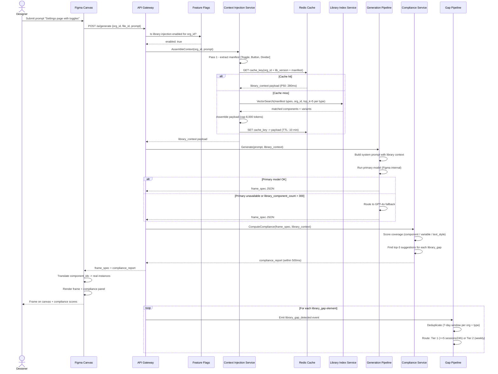

# Figma - Design-System-Aware AI Generation (System Architecture)

**What this explains:** The system architecture that powers library-grounded Make Designs generation - how Figma reads an org's published component library, injects it as structured context into the generation pipeline, and ensures output uses real component instances instead of hardcoded shapes.

**PRD reference:** https://github.com/004mayank/product-prd/blob/main/figma-design-system-aware-ai-prd.md

**Version:** v2 - Improved system design
**Changes from v1:** Added Mermaid system architecture diagram and generation sequence diagram, full API contracts with error codes and SLOs, architectural instrumentation schema (service-level observability events), competitive architecture analysis (Galileo AI vs. Figma vs. Diagram plugin), scaling model (sharding, concurrency, cost at scale), expanded failure modes with circuit breaker design, inter-service communication patterns, and component embedding pipeline deep dive.

---

## Version history

| Version | Key additions |
|---|---|
| v1 | Core architecture (5 layers), data flow, library context payload schema, component matching logic, compliance computation, failure modes, trade-offs, user journeys |
| v2 | Mermaid diagrams (system + sequence), API contracts with error codes, architectural observability schema, competitive architecture comparison, scaling model, circuit breaker design, embedding pipeline detail, inter-service communication patterns |

---

## 1) What this system is

Figma's existing `Make Designs` pipeline generates frames from a text prompt using a general-purpose LLM with no knowledge of the org's component library. The output looks plausible but uses hardcoded hex values, raw shapes, and arbitrary font sizes - all of which violate the org's design system on inspection.

This architecture specifies the system that makes `Make Designs` **design-system-aware**: every generation session in an org with a published library receives a structured representation of that library as part of the generation context. The LLM maps each element in its output to a real library component before the frame is placed on the canvas.

The system has five layers:

1. **Library Index Service** - Maintains a structured, queryable representation of every org's published component library.
2. **Context Injection Service** - Fetches and trims the library context for a specific generation session.
3. **Design-Aware Generation Pipeline** - The LLM generation layer that consumes library context and outputs component-first frames.
4. **Compliance Computation Service** - Post-generation analysis that scores the output frame against the org library and populates the compliance panel.
5. **Library Gap Pipeline** - Event capture and notification system for component types the generation needed but could not find.

Hard constraint: **Library context is used only for in-session generation.** It is not retained after session end and is not used to train the generation model without explicit org admin opt-in.

---

## 2) Core problem the architecture must solve

The naive approach to library-grounded generation is to include the entire library as text in the LLM prompt. This fails for three reasons:

- A 300-component library with variant metadata, color variables, and text styles exceeds any practical LLM context budget (estimated 80-150k tokens for a mature enterprise library, before the prompt itself).
- Including the full library regardless of the prompt content means the LLM is equally likely to reach for any component, not the components relevant to the specific screen being generated.
- Library data is largely stable between publishes. Fetching it fresh on every generation request is expensive and slow.

The architecture solves this with three mechanisms:
1. **Relevance filtering:** For each generation session, embed the user prompt and retrieve the top N semantically relevant components from the library index, not the full library.
2. **Caching:** Library context is cached per org library version with a 10-minute TTL. Most sessions hit the cache; fresh fetches only occur after a library publish event.
3. **Two-pass generation:** First pass extracts a component type manifest from the prompt (e.g., "Button, Input, Card, Toggle"). Second pass fetches the exact library entries for those types, enabling precise variant selection rather than fuzzy similarity matching.

---

## 3) System architecture diagram

```mermaid
flowchart TD
    subgraph Client["Figma Canvas Client"]
        A[Designer submits prompt\nin Make Designs panel]
        Z[Frame placed on canvas\n+ compliance panel rendered]
    end

    subgraph Gateway["API Gateway"]
        B[POST /ai/generate\norg_id, file_id, prompt]
        FF[Feature Flag Service\nlibrary injection enabled?\norg-level kill switch]
    end

    subgraph LIS["Library Index Service"]
        LIS_DB[(Postgres\ncomponent catalogue\nvariables, text styles)]
        LIS_VEC[(pgvector\ncomponent embeddings\nper org shard)]
        LIS_WORKER[Index Worker\ntriggered by library_published]
        LIS_FRESH[Freshness Monitor\nhourly check]
    end

    subgraph CIS["Context Injection Service"]
        CIS_CACHE[(Redis Cache\nkey: org_id + lib_version + manifest\nTTL: 10 min)]
        CIS_P1[Pass 1\nComponent Type Manifest\nClassifier - <100ms]
        CIS_P2[Pass 2\nTargeted Vector Search\ntop-2 per type]
        CIS_ASSEMBLE[Payload Assembler\ncap: 8,000 tokens]
    end

    subgraph GEN["Design-Aware Generation Pipeline"]
        GEN_PRIMARY[Primary Model\nFigma internal\nUI layout fine-tune]
        GEN_FALLBACK[Fallback Model\nGPT-4o\nlarge context window]
        GEN_OUTPUT[Frame Spec JSON\ncomponent_ids + variant refs\n+ library_gap elements]
    end

    subgraph CCS["Compliance Computation Service"]
        CCS_SCORE[Coverage Scorer\ncomponent / variable / text_style]
        CCS_SUGGEST[Suggestion Engine\ntop-3 nearest components\nfor each library_gap]
        CCS_REPORT[Compliance Report\ncomputed <500ms]
    end

    subgraph LGP["Library Gap Pipeline"]
        LGP_QUEUE[Event Queue\nlibrary_gap_detected events]
        LGP_DEDUP[Deduplicator\n7-day rolling window\nper org + element_type]
        LGP_NOTIFY[Notification Router\nTier 1: real-time\nTier 2: weekly digest]
    end

    subgraph Events["Event Bus (Kafka)"]
        EVT[library_published\nai_make_designs_generated\ncompliance_panel_viewed\nnon_compliant_element_replaced\nlibrary_gap_detected\nindex_updated]
    end

    A --> B
    B --> FF
    FF -->|injection enabled| CIS_P1
    FF -->|no library / disabled| GEN_PRIMARY

    LIS_WORKER -->|on library_published| LIS_DB
    LIS_WORKER --> LIS_VEC
    LIS_FRESH --> LIS_WORKER
    Events -->|library_published| LIS_WORKER
    Events -->|library_published| CIS_CACHE

    CIS_P1 --> CIS_CACHE
    CIS_CACHE -->|hit| CIS_ASSEMBLE
    CIS_CACHE -->|miss| CIS_P2
    CIS_P2 --> LIS_VEC
    CIS_P2 --> CIS_ASSEMBLE

    CIS_ASSEMBLE --> GEN_PRIMARY
    GEN_PRIMARY -->|failure / large library| GEN_FALLBACK
    GEN_PRIMARY --> GEN_OUTPUT
    GEN_FALLBACK --> GEN_OUTPUT

    GEN_OUTPUT --> CCS_SCORE
    CCS_SCORE --> CCS_SUGGEST
    CCS_SUGGEST --> CCS_REPORT

    CCS_REPORT --> Z
    GEN_OUTPUT --> Z

    GEN_OUTPUT -->|library_gap elements| LGP_QUEUE
    LGP_QUEUE --> LGP_DEDUP
    LGP_DEDUP --> LGP_NOTIFY

    GEN_OUTPUT --> Events
    CCS_REPORT --> Events
    LGP_NOTIFY --> Events
```



---

## 4) Generation sequence diagram



---

## 5) System layers

### Layer 1: Library Index Service

**Purpose:** Maintains a structured, up-to-date representation of every org's published component library. This is the source of truth that all other layers read from.

**What it stores per org library:**
- Component catalogue: name, category, variant set, variant properties (type, state, size), semantic label (inferred from component name and description), usage frequency.
- Color variable catalogue: name, collection, light mode value, dark mode value, semantic role.
- Text style catalogue: name, font family, size, weight, line height, semantic role.
- Component embeddings: a vector embedding per component (based on name + description + semantic label) used for relevance filtering.

**Triggers for re-indexing:**
- `library_published` event fires whenever an org library is published. The index worker processes the updated library file and rebuilds the affected org's catalogue within 5 minutes.
- Freshness monitor runs hourly. Any org whose index is older than 24 hours relative to the last `library_published` event triggers a forced re-index.

**Indexing worker logic:**
```
on library_published(org_id, library_file_id, library_version):
  fetch_library_file(library_file_id)
  parse_components(file) -> component_records[]
  parse_variables(file) -> variable_records[]
  parse_text_styles(file) -> text_style_records[]
  embed_components(component_records) -> embedding_vectors[]
  upsert_catalogue(org_id, library_version, records)
  emit index_updated(org_id, library_version, component_count, latency_ms)
```

**Storage:** Postgres for structured records (component catalogue, variables, text styles). `pgvector` extension for component embeddings. For orgs with >500 components, a dedicated vector index shard per org is used to avoid cross-org embedding interference.

#### Embedding pipeline detail

The component embedding pipeline runs as a separate async worker, not inline with the index worker. This keeps the `index_updated` event latency under the 5-minute SLO even for orgs with large libraries (where embedding 500+ components via OpenAI `text-embedding-3-small` takes 15-30 seconds).

```
Embedding pipeline:
  Input: component_records[] with name, description, semantic_label
  Model: text-embedding-3-small (1536 dimensions)
  Batch size: 50 components per API call
  Parallelism: 4 concurrent batches per org
  Input string: "{name} - {category} - {description} - {semantic_label}"
  Output: float[1536] per component, stored in pgvector with org_id + library_version
  Estimated cost: ~$0.0002 per 300-component library re-index
```

**Index sharding strategy for large orgs:**
- Orgs with <200 components: single shared pgvector table, filtered by `org_id`.
- Orgs with 200-500 components: dedicated pgvector partition per org (partition key: `org_id`).
- Orgs with >500 components: dedicated pgvector table per org on a separate shard. Shard assignment is managed by a shard registry service. This prevents a large org's embedding search from scanning the shared index and degrading latency for smaller orgs.

---

### Layer 2: Context Injection Service

**Purpose:** Given a `(org_id, prompt)` pair, produces the structured `library_context` payload that the generation pipeline consumes.

**Two-pass context assembly:**

**Pass 1 - Component type manifest extraction:**
```
prompt = "Settings page for notification preferences with toggles and save button"

manifest = extract_component_types(prompt)
# -> ["Toggle", "Button", "Input", "Card", "Divider"]
```
The manifest is extracted by a lightweight classifier that maps natural language descriptions to UI primitive categories. This does not require a full LLM call - it uses a fine-tuned classification model trained on (prompt, UI element type) pairs. Latency target: <100ms.

**Pass 2 - Targeted library fetch:**
```
for type in manifest:
  matches = vector_search(
    query = type + org_id,
    filter = {org_id: org_id},
    top_k = 5  # top 5 per component type
  )
  score by: semantic_similarity * 0.7 + usage_frequency * 0.3
  take top 2 per type
```

The result is a `library_context` payload (see Section 7 for schema) bounded at ~8,000 tokens, covering the components most relevant to the specific prompt.

**Caching:**
- Cache key: `hash(org_id + library_version + component_type_manifest)`.
- TTL: 10 minutes.
- Cache is invalidated on `library_published` event for the org.
- Cache hit rate target: >70% (most generation sessions in an active file occur within a 10-minute window of a library state that has been previously fetched).

**SLOs for this service:**
- P50 latency: <300ms (cache hit path).
- P95 latency: <800ms (cache miss, full two-pass assembly).
- Availability: 99.9%.
- `library_context_injection_failure_rate`: <0.5%.

---

### Layer 3: Design-Aware Generation Pipeline

**Purpose:** Takes the user prompt and the `library_context` payload and generates a frame where every element is mapped to a library component instance.

**Prompt structure:**

```
[System instruction]
You are Figma's Make Designs AI.
You have the user's org design system below.
Every element in your generated frame must use a component from this library.
Map each UI element to the exact component ID and variant specified in the library context.
Do not use hardcoded hex values. Reference color variables by name.
Do not use raw font sizes. Reference text styles by name.
If the library has no match for a required element, flag it as library_gap.

[Library context - up to 8,000 tokens]
{library_context_payload}

[User prompt]
{prompt_text}
```

**Output format (structured JSON, not prose):**

The generation model outputs a structured JSON frame spec rather than a Figma plugin command sequence. This allows the Compliance Computation Service to inspect and score the output before it is placed on the canvas.

```json
{
  "frame_spec": {
    "width": 375,
    "height": 812,
    "elements": [
      {
        "element_id": "el_01",
        "type": "component_instance",
        "component_id": "cmp_btn_primary",
        "variant": "Button/primary/default",
        "position": { "x": 16, "y": 760 },
        "overrides": { "label": "Save preferences" }
      },
      {
        "element_id": "el_02",
        "type": "library_gap",
        "semantic_type": "DataTable",
        "fallback": "raw_frame",
        "position": { "x": 16, "y": 200 }
      }
    ],
    "color_fills": [
      { "element_id": "el_01", "fill": "variable:semantic/primary" }
    ],
    "text_styles": [
      { "element_id": "el_03", "style": "body/md" }
    ]
  }
}
```

Elements with `type: component_instance` reference real library component IDs. The Figma canvas layer translates these IDs into actual component instances when placing the frame. Elements with `type: library_gap` are placed as styled raw frames and flagged in the compliance panel.

**Model routing:**
- Primary: Figma's internal generation model (fine-tuned on UI layout tasks).
- Fallback: GPT-4o with the same prompt structure, used when the internal model is unavailable or when `library_component_count > 300` (GPT-4o's larger context window handles larger library payloads more reliably).

---

### Layer 4: Compliance Computation Service

**Purpose:** Scores the generation output against the org library before the frame is placed on the canvas. Populates the compliance panel.

**Inputs:** `frame_spec` JSON from the generation pipeline + `library_context` payload.

**Computation:**

```
total_elements = count(frame_spec.elements where type != "container")
component_instances = count(elements where type == "component_instance")
library_gaps = count(elements where type == "library_gap")

component_coverage_pct = component_instances / total_elements * 100

color_fills = count(frame_spec.color_fills)
variable_fills = count(fills where fill starts_with "variable:")
variable_coverage_pct = variable_fills / color_fills * 100

text_nodes = count(elements where has_text = true)
styled_text = count(frame_spec.text_styles)
text_style_coverage_pct = styled_text / text_nodes * 100

non_compliant_list = [
  for each library_gap element:
    find top 3 nearest library components by semantic_similarity to element.semantic_type
    -> { element_id, semantic_type, suggested_matches: [component_id, name, similarity_score] }
]
```

**Output:** `compliance_report` struct emitted within 500ms of frame spec generation completing.

```json
{
  "session_id": "uuid",
  "component_coverage_pct": 92.0,
  "variable_coverage_pct": 100.0,
  "text_style_coverage_pct": 94.0,
  "library_gap_count": 1,
  "non_compliant_elements": [
    {
      "element_id": "el_02",
      "semantic_type": "DataTable",
      "suggested_matches": [
        { "component_id": "cmp_table_basic", "name": "Table/basic", "score": 0.61 },
        { "component_id": "cmp_list_card", "name": "List/card", "score": 0.48 }
      ]
    }
  ]
}
```

**Panel rendering:** The Figma canvas client receives the `compliance_report` alongside the frame spec and renders the compliance panel below the generated frame before the user accepts or discards.

---

### Layer 5: Library Gap Pipeline

**Purpose:** Captures `library_gap_detected` events, deduplicates them, and routes notifications to design systems leads.

**Event schema:**

```json
{
  "event": "library_gap_detected",
  "org_id": "uuid",
  "generation_session_id": "uuid",
  "missing_element_type": "DataTable",
  "prompt_context": "data table with sortable columns",
  "gap_count_this_week": 3,
  "ts": "ISO8601"
}
```

**Deduplication:** Events are deduplicated per `(org_id, missing_element_type)` within a 7-day rolling window. A single component type missing from 5 sessions in one day triggers a Tier 1 real-time Figma notification to the design systems lead. The same type missing from 3+ sessions in 7 days (but not triggering Tier 1) is included in the weekly digest.

**Why this matters architecturally:** The gap pipeline turns the generation pipeline into a design system feedback mechanism. Gaps are not just errors - they are signals about which components the org needs next. This creates a flywheel: more AI generation -> better library gap visibility -> library expands -> better AI generation quality.

---

## 6) API contracts

### POST /ai/generate

Primary endpoint consumed by the Figma canvas client for every `Make Designs` session.

```
POST /ai/generate

Headers:
  Authorization: Bearer {session_token}
  X-Org-Id: {org_id}
  Content-Type: application/json

Request body:
{
  "file_id": "string (uuid)",
  "prompt": "string (max 500 chars)",
  "frame_width": "integer (optional, default 375)",
  "frame_height": "integer (optional, default 812)",
  "active_library_id": "string (uuid, optional - overrides default library priority)"
}

Response 200 (success):
{
  "session_id": "uuid",
  "frame_spec": { ...frame spec schema... },
  "compliance_report": { ...compliance report schema... },
  "library_context_injected": "boolean",
  "library_version": "string",
  "cache_hit": "boolean",
  "generation_latency_ms": "integer",
  "model_used": "figma_internal | gpt4o_fallback"
}

Response 202 (async - generation in progress, poll via session_id):
{
  "session_id": "uuid",
  "status": "generating",
  "poll_url": "/ai/generate/status/{session_id}"
}

Response 400 (invalid request):
{
  "error": "invalid_prompt",
  "message": "Prompt exceeds maximum length of 500 characters",
  "field": "prompt"
}

Response 429 (rate limit):
{
  "error": "rate_limit_exceeded",
  "retry_after_seconds": 30
}

Response 503 (service degraded - library injection unavailable):
{
  "error": "library_context_unavailable",
  "message": "Design system context is temporarily unavailable. Generating without library context.",
  "fallback": "generic_generation",
  "frame_spec": { ...generic frame spec... },
  "library_context_injected": false
}
```

**Rate limits:**
- 20 generation requests per user per hour (enforced at the gateway).
- 200 generation requests per org per hour (enforced per `org_id`).
- Limits are doubled for Enterprise tier orgs.

---

### POST /internal/ai/library-context

Internal endpoint exposed by the Context Injection Service, consumed by the generation pipeline.

```
POST /internal/ai/library-context

Request:
{
  "org_id": "string (uuid)",
  "file_id": "string (uuid)",
  "prompt": "string",
  "max_components": 80,
  "library_id": "string (uuid, optional - for multi-library orgs)"
}

Response 200:
{
  "library_context": {
    "org_id": "string",
    "library_file_id": "string",
    "library_version": "string",
    "generated_at": "ISO8601",
    "components": [ ...component records... ],
    "color_variables": [ ...variable records... ],
    "text_styles": [ ...text style records... ],
    "relevance_scores": { "component_id": "float" }
  },
  "context_size_tokens": "integer",
  "was_truncated": "boolean",
  "truncation_method": "relevance_filter | none",
  "cache_hit": "boolean",
  "latency_ms": "integer"
}

Response 404 (no library for org):
{
  "error": "no_library_found",
  "org_id": "string",
  "message": "No published org-scoped library found for this org"
}

Response 503 (Library Index Service unavailable):
{
  "error": "library_index_unavailable",
  "message": "Library index is temporarily unavailable"
}
```

**SLOs:**
- P50 latency: <300ms (cache hit).
- P95 latency: <800ms (cache miss, full two-pass).
- Availability: 99.9%.

---

### POST /internal/ai/compliance

Internal endpoint exposed by the Compliance Computation Service.

```
POST /internal/ai/compliance

Request:
{
  "session_id": "string (uuid)",
  "frame_spec": { ...frame spec... },
  "library_context": { ...library context payload... }
}

Response 200:
{
  "report_id": "uuid",
  "session_id": "uuid",
  "component_coverage_pct": "float",
  "variable_coverage_pct": "float",
  "text_style_coverage_pct": "float",
  "library_gap_count": "integer",
  "non_compliant_elements": [
    {
      "element_id": "string",
      "semantic_type": "string",
      "suggested_matches": [
        {
          "component_id": "string",
          "name": "string",
          "score": "float"
        }
      ]
    }
  ],
  "computed_at": "ISO8601",
  "computation_latency_ms": "integer"
}

Response 206 (partial - suggestion engine timed out):
{
  "report_id": "uuid",
  "component_coverage_pct": "float",
  "variable_coverage_pct": "float",
  "text_style_coverage_pct": "float",
  "library_gap_count": "integer",
  "non_compliant_elements": [],
  "degraded": true,
  "degradation_reason": "suggestion_engine_timeout"
}
```

**SLO:** P95 computation latency <500ms. If computation exceeds 500ms, return 206 with coverage scores only and an empty `non_compliant_elements` list.

---

## 7) Core data model

### LibraryComponent

```
component_id          uuid
org_id                uuid
library_file_id       uuid
library_version       string
name                  string
category              string          // "Button", "Input", "Card", etc.
description           string
variants              Variant[]
usage_frequency       integer         // times used across org files in last 30d
embedding_vector      float[1536]     // text-embedding-3-small on name+desc+semantic_label
semantic_label        string          // "primary CTA", "secondary action", "low-emphasis"
indexed_at            timestamp
```

### LibraryVariant

```
variant_id            uuid
component_id          uuid
name                  string          // "Button/primary/default"
properties            map<string,string>  // {type: primary, state: default, size: md}
semantic_label        string          // "main CTA, enabled state"
```

### LibraryColorVariable

```
variable_id           uuid
org_id                uuid
name                  string          // "semantic/primary"
collection            string          // "Brand", "Semantic", "Neutral"
value_light           string          // hex
value_dark            string          // hex
semantic_role         string          // "primary brand action"
```

### LibraryTextStyle

```
style_id              uuid
org_id                uuid
name                  string          // "body/md"
font_family           string
font_size             integer
font_weight           integer
line_height           float
semantic_role         string          // "body paragraph, medium size"
```

### GenerationSession

```
session_id            uuid
org_id                uuid
file_id               uuid
user_id               uuid
prompt_text           string
library_context_injected  boolean
library_version           string
component_count_injected  integer
cache_hit                 boolean
frame_spec_id             uuid
compliance_report_id      uuid
outcome                   enum(accepted, edited, deleted)
generation_latency_ms     integer
model_used                enum(figma_internal, gpt4o_fallback)
created_at                timestamp
```

### ComplianceReport

```
report_id             uuid
session_id            uuid
component_coverage_pct    float
variable_coverage_pct     float
text_style_coverage_pct   float
library_gap_count         integer
non_compliant_elements    NonCompliantElement[]
computed_at               timestamp
panel_viewed              boolean
panel_dismissed_without_action  boolean
degraded                  boolean     // true if suggestion engine timed out
```

---

## 8) Architectural observability schema

These are service-level instrumentation events emitted by each layer for ops dashboards and alerting - distinct from the product analytics events in the PRD.

### `library_index_updated`

Emitted by the Library Index Service after each successful re-index.

```json
{
  "event": "library_index_updated",
  "org_id": "uuid",
  "library_file_id": "uuid",
  "library_version": "string",
  "trigger": "library_published | freshness_monitor | manual",
  "component_count": "integer",
  "variable_count": "integer",
  "text_style_count": "integer",
  "embedding_count": "integer",
  "index_latency_ms": "integer",
  "embedding_latency_ms": "integer",
  "shard_id": "string",
  "ts": "ISO8601"
}
```

### `context_injection_served`

Emitted by the Context Injection Service for every completed context assembly.

```json
{
  "event": "context_injection_served",
  "session_id": "uuid",
  "org_id": "uuid",
  "cache_hit": "boolean",
  "manifest_types_extracted": ["Toggle", "Button", "Divider"],
  "manifest_extraction_latency_ms": "integer",
  "vector_search_latency_ms": "integer",
  "payload_assembly_latency_ms": "integer",
  "total_latency_ms": "integer",
  "component_count_in_payload": "integer",
  "context_size_tokens": "integer",
  "was_truncated": "boolean",
  "ts": "ISO8601"
}
```

### `generation_completed`

Emitted by the Generation Pipeline after each frame spec is produced.

```json
{
  "event": "generation_completed",
  "session_id": "uuid",
  "org_id": "uuid",
  "model_used": "figma_internal | gpt4o_fallback",
  "library_context_injected": "boolean",
  "element_count": "integer",
  "component_instance_count": "integer",
  "library_gap_count": "integer",
  "generation_latency_ms": "integer",
  "frame_spec_size_bytes": "integer",
  "ts": "ISO8601"
}
```

### `compliance_computed`

Emitted by the Compliance Computation Service.

```json
{
  "event": "compliance_computed",
  "session_id": "uuid",
  "org_id": "uuid",
  "component_coverage_pct": "float",
  "variable_coverage_pct": "float",
  "text_style_coverage_pct": "float",
  "library_gap_count": "integer",
  "computation_latency_ms": "integer",
  "degraded": "boolean",
  "ts": "ISO8601"
}
```

### Alert thresholds

| Alert | Condition | Severity | Action |
|---|---|---|---|
| Context injection failure spike | `library_context_injection_failure_rate` > 1% over 5 min | Warning | Page on-call; investigate LIS availability |
| Context injection failure critical | `library_context_injection_failure_rate` > 2% over 5 min | Critical | Trigger global fallback to generic generation; page on-call |
| Generation latency degradation | `generation_completed.generation_latency_ms` P95 > 12,000ms | Warning | Check model routing; verify LLM provider status |
| Compliance service timeout rate | `compliance_computed.degraded = true` rate > 10% over 5 min | Warning | Scale compliance service; check suggestion engine latency |
| Index freshness violation | Any org index older than 36h past last `library_published` event | Warning | Force re-index for affected org |
| Embedding pipeline backlog | Embedding queue depth > 500 items | Warning | Scale embedding worker horizontally |

---

## 9) Competitive architecture analysis

### How competitors approach design-system-aware generation

| System | Library data access | Context injection approach | Component matching quality | Gap handling |
|---|---|---|---|---|
| **Figma (this system)** | Native - owns org library data in its own infrastructure; full variant metadata, variable bindings, usage frequency | Two-pass (manifest + targeted vector search); cached per org version | High - variant-level matching with semantic labels; usage frequency bias | First-class - gap events feed back to design systems team as actionable signals |
| **Galileo AI** | File import only - reads exported Figma JSON or connected file via API; no access to org-scoped library | Single-pass fuzzy matching against imported component set | Medium - component type matching works; variant selection is inconsistent without semantic metadata | No structured gap handling; non-matched elements use generic shapes silently |
| **Diagram plugin (Figma plugin)** | File-local components via Plugin API; cannot read org-scoped libraries or other team libraries | Real-time fetch on every generation; no caching | Low-medium - limited to components visible in the current file; variant metadata is partial via Plugin API | No gap handling; falls back to generic shapes |
| **v0 (Vercel)** | Design tokens only (if supplied via config); no Figma library concept | Token injection into Tailwind/CSS generation; no component instance concept | N/A - generates code, not Figma instances | N/A - missing tokens produce default Tailwind values |
| **Framer AI** | Framer's built-in component library only; no custom library concept | Hard-coded Framer component set injected at generation time | Medium for Framer components; zero for custom org libraries | No gap handling; Framer component set is fixed |

**Why Figma's architectural position is defensible:**

1. **Data moat:** Figma owns the library data at the infrastructure layer. Galileo AI and Diagram access the same data via Figma's API - which means they get what Figma exposes publicly, not the full internal representation (e.g., variant semantic labels inferred from layer names are not in the public API).

2. **Usage frequency signal:** The Library Index Service stores `usage_frequency` per component (times used across org files in the last 30 days). This signal is unavailable to external tools, which must use component name popularity as a proxy. Usage frequency is a materially better bias signal for relevance ranking - a component that appears in 300 files is more likely the right default pick than one that appears in 3.

3. **Variable binding depth:** External tools that read exported Figma JSON get color hex values, not the variable binding that produced them. The internal API layer gives this system access to `variable:semantic/primary` references directly, enabling true variable coverage scoring in the compliance computation. External tools must infer variable usage from color matching, which has high false-positive rates.

**Where competitors can close the gap:**

- Galileo AI could close the component matching quality gap if Figma exposes variant semantic metadata via its public API. This is an API governance decision Figma should make carefully: expanding the public API reduces the architectural moat.
- Diagram could improve by building an org-library indexer that runs on a Figma team's behalf at publish time and maintains its own vector index. This would replicate the Library Index Service externally. The two-week engineering effort is tractable for a well-funded plugin team.

**Architectural recommendation:** The compliance panel and gap pipeline are the hardest surfaces for external tools to replicate, because they require writing back to the canvas and surfacing structured feedback in the generation UX. Investing in these surfaces (and making them deeply integrated into the Figma canvas) is the best way to extend the moat beyond data access.

---

## 10) Scaling model

### Concurrency and throughput

**Generation sessions per day estimate (at GA):**
- Figma has ~4M daily active users. Assume 0.5% trigger a Make Designs session per day = 20,000 sessions/day.
- Of these, assume 40% are in orgs with a published library = 8,000 library-grounded sessions/day.
- Peak hour (9-11am Pacific): assume 15% of daily volume = 1,200 library-grounded sessions/hour = 20/minute.

**Context Injection Service sizing:**
- 20 requests/minute with P95 latency <800ms is well within a single-region service running 8 replicas.
- Redis cache handles cache-hit path at sub-millisecond; only cache-miss requests hit pgvector.
- Cache hit rate target >70% reduces effective pgvector load to ~6 requests/minute at peak.

**Library Index Service sizing:**
- Re-index events are driven by library publishes. Assume 500 org libraries published per day across all orgs (conservative for enterprise).
- Embedding pipeline: 500 re-indexes * 200 components average = 100,000 embeddings/day. At 50 per batch = 2,000 API calls/day. This is negligible cost and compute.
- For a major Figma library release (e.g., Figma's own design system update) that triggers re-indexing for a high-component-count org, the index worker must handle up to 600 components in a single re-index. Target: <5 minutes end-to-end for a 600-component re-index.

### Cost model at scale (directional)

| Component | Cost driver | Estimate at 8,000 sessions/day |
|---|---|---|
| Context injection (cache miss) | pgvector queries (6/min at peak) | Negligible - vector search is compute-bound, not I/O-bound; estimated <$50/month for the query layer |
| Embedding pipeline (re-indexing) | OpenAI `text-embedding-3-small` API calls | ~100,000 embeddings/day * $0.00002/1K tokens * avg 50 tokens per component = ~$0.10/day |
| Generation model (primary) | Figma internal model inference | Internal cost; not externally measurable |
| Generation model (fallback - GPT-4o) | OpenAI API; ~16K tokens per session (8K library context + 4K prompt + 4K output) | Assume 10% of sessions hit fallback: 800 sessions * 16K tokens * $0.03/1K = ~$24/day |
| Compliance computation | CPU-only; no external API | ~$5-10/month for compute |
| Redis cache | 8,000 sessions/day * ~10KB payload/session | Cache storage: ~80MB hot cache; negligible cost |

**Cost observation:** The dominant cost driver is the GPT-4o fallback path. Reducing fallback rate from 10% to 5% (by improving the primary model's large-context handling) saves ~$12/day at 8,000 sessions. At 10x scale (80,000 sessions/day), this becomes a $120/day saving.

---

## 11) Data flow - happy path

```
1. Designer submits prompt in Make Designs panel
   -> POST /ai/generate {org_id, file_id, prompt}

2. Context Injection Service checks cache
   -> cache miss: run two-pass assembly (type manifest + targeted library fetch)
   -> cache hit: return cached library_context (P50 latency <300ms)

3. library_context payload assembled (<8,000 tokens)

4. Design-Aware Generation Pipeline receives (prompt + library_context)
   -> generates frame_spec JSON with component_ids, variable references, text_style references

5. Compliance Computation Service scores frame_spec
   -> produces compliance_report within 500ms

6. Canvas client receives frame_spec + compliance_report
   -> translates component_ids to real Figma component instances
   -> renders frame on canvas
   -> displays compliance panel with scores and non-compliant elements list

7. Designer reviews panel, replaces any flagged elements, accepts frame

8. Events fire:
   ai_make_designs_generated (uses_org_library_components: true, outcome: edited)
   compliance_panel_viewed
   [if applicable] library_gap_detected per non-compliant element type
```

**Total latency budget:**

| Step | P50 target | P95 target |
|---|---|---|
| Context injection (cache hit) | 300ms | 800ms |
| Context injection (cache miss) | 600ms | 1,200ms |
| Frame generation (LLM) | 3,000ms | 6,000ms |
| Compliance computation | 100ms | 500ms |
| Canvas rendering | 200ms | 500ms |
| **End-to-end (cache hit)** | **~4,000ms** | **<8,000ms** |
| **End-to-end (cache miss)** | **~5,000ms** | **<10,000ms** |

---

## 12) Key trade-offs

### Two-pass vs. single-pass generation

**Two-pass** (type manifest extraction -> targeted library fetch -> generation) adds ~200ms latency but produces dramatically better component specificity. The manifest step lets the system fetch only the components the prompt actually needs, staying within the token budget without relevance ranking over the entire library.

**Single-pass** (embed prompt -> top-N library components by cosine similarity -> generation) is simpler but degrades for prompts where the UI element types are described implicitly ("settings page for notification preferences") rather than explicitly ("page with toggles and a save button"). The semantic similarity between "notification preferences" and "Toggle" is lower than expected.

Decision: Two-pass for v1. Monitor manifest extraction accuracy - if the classifier misses element types in >10% of sessions, add a single-pass fallback.

### Strict component matching vs. best-effort matching

**Strict:** The generation model must use an exact library component for every element. If no match exists, the element is placed as `library_gap` and flagged. This produces cleaner output but more visible warnings for libraries with coverage gaps.

**Best-effort:** The model uses the nearest library component even if the semantic match is weak (e.g., using a `Card/content` component as a table container because no `Table` exists). This reduces gap warnings but at the cost of producing system-compliant-looking frames that are semantically wrong - engineers may trust them and build from incorrect specs.

Decision: Strict matching. The compliance panel is the user's signal for gaps; best-effort matching would produce false confidence. Design systems teams should fix the library, not accept wrong component substitutions.

### Cache invalidation on library publish vs. real-time library reads

**Cache:** Library context cached for 10 minutes per org library version. A designer who publishes a new component and immediately generates a frame using it will hit the old cache for up to 10 minutes.

**Real-time:** Every generation session fetches the live library. Zero stale cache risk, but eliminates the primary latency and cost lever.

Decision: Cache with 10-minute TTL. Real-time reads add 600-800ms to every cache-miss path and are unnecessary for the vast majority of sessions where the library has not changed since the last fetch. The 10-minute window is short enough that designers who publish a new component can trigger a new generation session after a brief wait without losing trust in the system.

---

## 13) Circuit breaker design

Each inter-service call has an independent circuit breaker to prevent cascading failures.

### Library Index Service circuit breaker

```
State transitions:
  CLOSED (normal) -> OPEN (tripped) -> HALF_OPEN (probing) -> CLOSED

Trip condition: 5 consecutive failures OR failure rate > 50% in a 30s window
Recovery probe: 1 request every 10s in HALF_OPEN state
On OPEN: serve fallback (generic generation with library_context_injected = false)
Alert: PagerDuty Warning on trip; Critical if OPEN > 5 minutes
```

### Context Injection Service circuit breaker

```
Trip condition: P95 latency > 1,500ms OR error rate > 10% in a 60s window
Recovery probe: 1 request every 15s
On OPEN: skip two-pass assembly; serve top-40 components by usage_frequency (partial context)
Degraded mode event: context_injection_served with degraded: true
```

### Compliance Computation Service circuit breaker

```
Trip condition: P95 latency > 800ms OR error rate > 15% in a 60s window
Recovery probe: 1 request every 20s
On OPEN: return 206 with coverage scores only (skip suggestion engine); degraded: true
```

### Generation pipeline fallback routing

The generation pipeline itself is not a circuit breaker target - it uses explicit model routing:
- Primary model health check runs every 30s.
- If primary returns non-200 for 3 consecutive requests, route all sessions to GPT-4o fallback.
- Fallback routing emits `generation_completed.model_used = gpt4o_fallback` for monitoring.

---

## 14) Failure modes

| Failure | Detection | Mitigation | Degraded state |
|---|---|---|---|
| Library Index Service unavailable | Health check failure; `library_context_injection_failure_rate` spike | Circuit breaker trips; fall back to generic generation; `library_context_injected = false` in event | Designer sees generic (non-library) Make Designs output; no error shown |
| Context injection latency exceeds 1.5s | P95 latency alert; circuit breaker OPEN | Serve partial library context (top 30 components by usage frequency only, skipping two-pass assembly) | Lower coverage quality; generation proceeds |
| Component type manifest classifier fails (returns empty manifest) | `manifest_extraction_failure` event | Fall back to single-pass: embed prompt, return top 40 components by cosine similarity | Slightly lower component coverage; no user-visible error |
| Generation model returns malformed frame_spec | JSON parse failure | Retry once with explicit JSON schema hint in prompt; if second attempt fails, fall back to generic generation | Rare; user sees standard "Try again" prompt |
| Compliance Computation Service exceeds 500ms | P95 alert; circuit breaker OPEN | Return 206 partial (coverage scores only; no non-compliant element list) | Panel shows coverage percentages only; no suggested replacements |
| Library gap pipeline event backlog | Consumer lag > 1 min | Scale consumer horizontally; Tier 1 notifications degrade to Tier 2 during backlog recovery | Notification delay; no user-facing impact |
| Multi-library conflict (org has two published org-scoped libraries) | `library_scope_conflict` event logged | Enforce priority: most recently published org library wins; log which library was used per session | Predictable behaviour; design systems lead can inspect via audit log |
| pgvector shard unavailable for large org | Query timeout; error logged | Route to a read replica; if replica also unavailable, serve from usage-frequency-only fallback (no embedding search) | Lower context relevance; generation proceeds |
| Embedding pipeline backlog > 500 items | Queue depth alert | Scale embedding worker to 8 replicas; new library publishes processed within 30 min instead of 5 | Stale embeddings for recently published libraries; coverage quality slightly lower |
| Redis cache unavailable | Connection errors from CIS | Bypass cache; all requests run full two-pass assembly | P95 latency increases to ~1,200ms; no functional degradation |

---

## 15) User journeys (architecture perspective)

### Journey 1: Designer generates a settings page (happy path)

1. File belongs to an org with a published library (140 components, 32 variables, 12 text styles).
2. Designer submits prompt. Context Injection Service checks cache - cache hit on the org's library context for the type manifest [Toggle, Button, Divider]. Returns cached payload in 280ms.
3. Generation pipeline receives prompt + 8 components from the library (Toggle/active, Toggle/inactive, Button/primary/default, Button/primary/disabled, Card/content, Divider/horizontal/full, Input/text/default, FormLabel/default).
4. frame_spec returned in 4.2s. All 14 elements use `component_instance` type with valid `component_id` references.
5. Compliance: component coverage 100%, variable coverage 100%, text style coverage 92% (two text nodes used raw 13px font not mapped to `body/sm`). Report computed in 180ms.
6. Canvas places frame, shows compliance panel with "Looks good - 2 text elements not using library styles" flagged.
7. Designer clicks suggested replacement for both text nodes, accepts frame.
8. Total time from prompt submit to frame acceptance: ~7s.

### Journey 2: Library index stale during generation

1. Design systems lead published a new `Table/sortable` component 8 minutes ago.
2. A designer generates a "data table with filters" - prompt arrives during the 10-minute cache window before the new component is indexed.
3. Context Injection Service serves the cached library context (does not include `Table/sortable`).
4. Generation pipeline sees no table component; returns `library_gap` for the table element.
5. Compliance panel shows "Table not in your library" - technically incorrect for 2 more minutes until the cache expires.
6. At the next generation attempt (after 10-minute TTL), the cache refreshes and the new `Table/sortable` component is available.

**Trade-off accepted:** The 10-minute window is a deliberate cost/accuracy trade-off. Reducing the TTL to 1 minute would eliminate this gap but increase library fetches by 10x. This scenario requires a design systems lead to publish a component and a designer to immediately generate a frame using that exact new component type - a low-frequency event.

### Journey 3: Org with no published library (Free/Professional tier without org-scoped library)

1. Generation session fires. Context Injection Service checks for published org-scoped library - none found.
2. `library_context_injected = false`. Generation proceeds with the existing generic Make Designs pipeline.
3. No compliance panel rendered (no library to compare against).
4. `ai_make_designs_generated` event fires with `library_context_injected: false`, `uses_org_library_components: false`.
5. No user-visible change from current product behaviour.

### Journey 4: Context Injection Service circuit breaker open during generation

1. Library Index Service experiences a database failover. CIS P95 latency spikes to 2,000ms. Circuit breaker trips to OPEN state.
2. Designer submits a prompt. CIS circuit breaker returns partial context (top-40 by usage frequency) in <200ms.
3. Generation pipeline receives reduced library context; generates frame with ~65% component coverage instead of typical ~90%.
4. Compliance panel shows lower coverage score; flags more non-compliant elements.
5. `context_injection_served` event fires with `degraded: true`.
6. PagerDuty alert fires. On-call investigates LIS availability. Circuit breaker recovers to HALF_OPEN within 10 minutes.
7. Designer is not aware of the degraded state; no error is shown. The frame is usable but requires more manual compliance fixes.

---

## 16) Open questions

1. **Manifest classifier training data:** The two-pass approach relies on a classifier that maps prompt text to UI component types. What training corpus is used? Figma likely has access to anonymised Make Designs prompt logs (with opt-in) that can provide ground truth, but this needs explicit data governance approval before training can begin.

2. **Code Connect linkage in generation:** Dev Mode's Code Connect links Figma components to their Storybook/codebase counterparts. Should AI-generated component instances automatically carry Code Connect metadata? This would make generated frames immediately engineer-ready - but it requires the generation pipeline to know which components have active Code Connect links, adding a dependency on the Dev Mode infrastructure team.

3. **Cross-file local component handling:** A file may have locally defined components (not from a published library) that the designer regularly uses. Should local components be included in the library context? Including them increases coverage but creates privacy complexity (local components may include draft patterns not ready for AI use). Recommendation: exclude local components in v1; add as opt-in toggle in v2.

4. **Variable mode context (light/dark theme):** The library context includes both `value_light` and `value_dark` for each color variable. Should the generation pipeline be aware of the file's current variable mode (light/dark/system)? If a file is set to dark mode and the compliance panel checks only dark mode variable references, coverage scores will differ from a file in light mode. Not a blocking question for v1 - default to checking against the active mode.

5. **Variant selection confidence thresholds:** The compliance panel in v2 will show a confidence score per variant selection. What is the minimum threshold below which a variant selection is flagged as low-confidence? This requires a calibration dataset (human-labelled correct/incorrect variant selections) that does not yet exist. Plan: collect labels via the thumbs-up/thumbs-down micro-feedback in Phase 2 rollout (per PRD Q5 resolution) and use them to calibrate in v2.

6. **Multi-region deployment for compliance computation:** Compliance computation currently runs in the same region as the generation pipeline. For GDPR-compliant orgs (EU data residency), does the compliance computation step need to run in the EU region even if the generation model is US-hosted? The `frame_spec` contains component IDs and text overrides that may reference PII (e.g., a designer using real customer names in a prompt). This needs a privacy review before expanding to EU Enterprise orgs.

7. **Embedding model versioning:** When OpenAI releases a new version of `text-embedding-3-small`, all org embeddings become stale relative to the new model's embedding space. A full re-index of all org libraries is required. For 50,000 orgs with an average 150-component library, this is 7.5M embedding API calls - a non-trivial operation. A migration strategy (phased re-index by org tier, starting with Enterprise) should be designed before the first embedding model upgrade.

---

*All latency targets and cost figures are directional estimates based on publicly available LLM and vector search benchmarks, not internal Figma data.*
