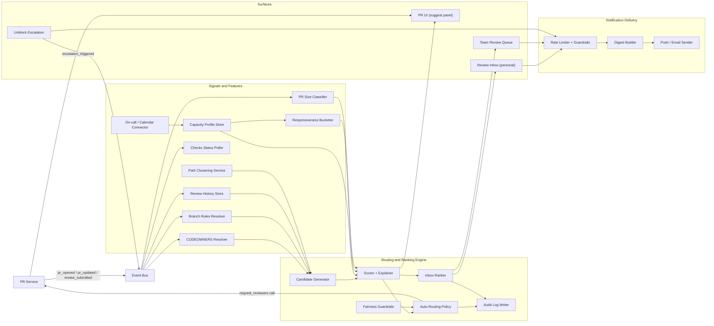
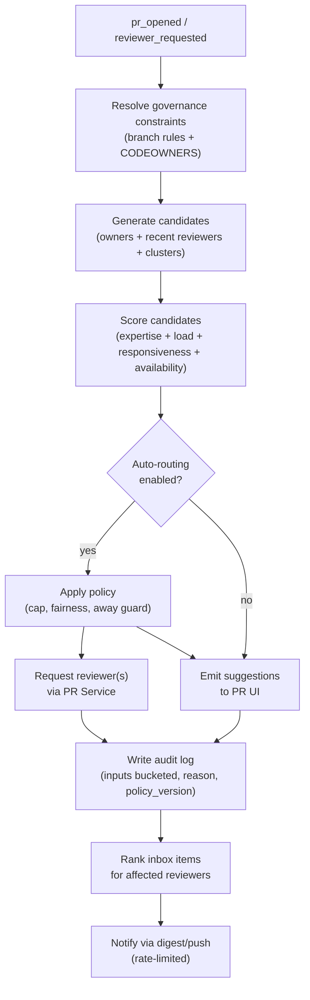

# GitHub: Review Inbox + Load-Aware Review Routing (System Architecture v3)

**What this explains:** a production-grade system architecture for reducing PR review latency without increasing reviewer burnout by treating review as an **attention-routing problem**.

**PRD reference:** https://github.com/004mayank/product-prd/blob/main/github-review-routing-prd.md

---

**Version:** v3 - Final system design
**Changes from v2:** Added full event schemas, API contracts, sequence diagrams, experiment backlog, phased rollout plan, kill switch architecture, failure modes with mitigations, open questions, and version history.

| Version | Key additions |
|---|---|
| v1 | Core architecture: signals layer, decision layer, surfaces + delivery. Mermaid system diagram. Data model (PR, ReviewRequest, CapacityProfile). |
| v2 | Path clustering service, on-call/calendar capacity signals, candidate generation + scoring split, audit log + fairness guardrails. |
| v3 | Event schemas, API contracts, sequence diagrams, experiment backlog, phased rollout, kill switches, failure mode playbook, open questions. |

---

## 1) Problem recap (the bottleneck)

In mature teams, CI/checks are mostly automated; **human review throughput** becomes the limiting step:

**Branch -> PR -> Review -> Checks -> Merge**

Failure modes:
- review requests are not a real queue (hard to prioritize)
- CODEOWNERS answers "who should review" but not "who will respond soon"
- "why me" is unclear -> low trust and more side-channel pings
- stalled PRs lack a safe escalation path

v3 target outcomes:
- p50 time-to-first-review: -30% on teams with auto-routing enabled
- stuck PR rate (no review at 24h): -20%
- top-10% reviewer concentration: -15% (fairness)
- side-channel ping volume: directionally down (proxy: unblock usage vs Slack @-mentions)

---

## 2) Design principles

1. **Explainable by default**: every routing decision shows a primary reason.
2. **Governance is a hard constraint**: branch rules and CODEOWNERS are never bypassed.
3. **Capacity signals stay coarse**: no surveillance; user-controlled and bucketed.
4. **Fail open**: if the routing system is unavailable, CODEOWNERS and manual selection still work.
5. **Auditability by construction**: every decision is attributable to inputs and policy version.
6. **Load is not a leaderboard**: show relative buckets, never raw counts.

---

## 3) High-level architecture

Three layers:

1. **Signals layer**: collect and derive routing, urgency, and capacity signals.
2. **Decision layer**: rank PRs for reviewers; pick suggested and auto-routed reviewers.
3. **Surfaces + delivery layer**: inboxes, queues, notifications, auditability.

### Mermaid: full system diagram



### Mermaid: decision flow (per review request event)



---

## 4) Core data model

### PullRequest
```
pr_id           uuid
repo_id         string
title           string
author_id       string
files_changed   string[]       // paths
created_at      timestamp
updated_at      timestamp
requested_reviewers  string[]  // user ids
requested_teams      string[]  // team ids
required_reviewers   string[]  // derived from branch rules
check_summary   enum(failing | pending | passed | none)
size_bucket     enum(S | M | L)
path_clusters   string[]       // derived; cluster_ids
```

### ReviewRequest
```
request_id      uuid
pr_id           uuid
target_type     enum(user | team)
target_id       string
request_type    enum(required | requested | fyi)
reason_primary  string         // human-readable key
reason_detail   string?        // optional secondary label
created_at      timestamp
state           enum(open | snoozed | completed | declined | not_me)
routing_source  enum(manual | autorouted | escalation)
policy_version  string
```

### CapacityProfile (per reviewer)
```
user_id         string
availability    enum(available | focus | away)
soft_max_queue  int?           // default null = no cap
working_hours   {tz, start_h, end_h}?
on_call         bool           // sourced from on-call integration
updated_at      timestamp
```

### TeamQueueConfig (per team)
```
team_id             string
sla_first_review_h  int?       // e.g. 8 or 24
sla_merge_h         int?
escalation_target   string?    // user_id of lead or on-call
allow_autoroute     bool
allow_unblock       bool
```

### PathCluster
```
cluster_id      string
label           string?
member_paths    string[]       // glob patterns
repo_scope      string         // repo_id or org_id
```

### AuditLogEntry
```
entry_id        uuid
decision_type   enum(suggest | autoroute | rank | escalate)
pr_id           uuid
target_id       string
inputs          {ownership_match, load_bucket, responsiveness_bucket, availability}
reason_primary  string
policy_version  string
feature_flags   string[]
created_at      timestamp
```

---

## 5) Event schemas

### `pr_opened`
```json
{
  "event": "pr_opened",
  "pr_id": "uuid",
  "repo_id": "string",
  "author_id": "string",
  "files_changed": ["string"],
  "size_bucket": "S|M|L",
  "branch_rules_required_reviewers": ["string"],
  "codeowners_candidates": ["string"],
  "created_at": "iso8601"
}
```

### `reviewer_requested`
```json
{
  "event": "reviewer_requested",
  "pr_id": "uuid",
  "requester_id": "string",
  "reviewer_id": "string",
  "routing_source": "manual|autorouted|escalation",
  "reason_primary": "string",
  "policy_version": "string"
}
```

### `review_submitted`
```json
{
  "event": "review_submitted",
  "pr_id": "uuid",
  "reviewer_id": "string",
  "review_type": "approval|changes_requested|comment",
  "time_to_first_review_s": 3600,
  "was_required": true
}
```

### `unblock_triggered`
```json
{
  "event": "unblock_triggered",
  "pr_id": "uuid",
  "author_id": "string",
  "target_scope": "current_reviewers|reroute|escalate_lead",
  "wait_time_s": 7200,
  "author_daily_unblock_count": 1
}
```

### `inbox_item_actioned`
```json
{
  "event": "inbox_item_actioned",
  "request_id": "uuid",
  "pr_id": "uuid",
  "reviewer_id": "string",
  "action": "review_now|snooze|not_me|mark_reviewed",
  "section": "blocking|due_soon|high_risk|follow_up|fyi",
  "inbox_rank": 3
}
```

---

## 6) API contracts (abbreviated)

### Reviewer suggestions
`POST /api/v1/repos/{owner}/{repo}/pulls/{pr_number}/review-suggestions`

Request: none (context derived from PR)

Response:
```json
{
  "suggestions": [
    {
      "user_id": "string",
      "login": "string",
      "reason_primary": "owner|recent_reviewer|cluster_match|on_call|autoroute",
      "reason_label": "CODEOWNERS: /payments/*",
      "load_bucket": "low|med|high",
      "responsiveness_bucket": "fast|normal|slow",
      "availability": "available|focus|away",
      "required": true
    }
  ],
  "policy_version": "string",
  "autoroute_eligible": true
}
```

### Review inbox
`GET /api/v1/users/{user_id}/review-inbox`

Query params: `?section=blocking|due_soon|high_risk|follow_up|fyi&limit=25&cursor=`

Response:
```json
{
  "items": [
    {
      "request_id": "uuid",
      "pr": { "pr_id": "uuid", "title": "string", "repo": "string", "size_bucket": "S|M|L", "check_summary": "failing|pending|passed" },
      "request_type": "required|requested|fyi",
      "reason_primary": "string",
      "reason_label": "string",
      "age_s": 7200,
      "is_blocking": false,
      "section": "blocking",
      "rank": 1
    }
  ],
  "cursor": "string"
}
```

### Inbox item action
`POST /api/v1/review-requests/{request_id}/actions`

Request:
```json
{
  "action": "snooze|not_me|mark_reviewed",
  "snooze_until": "iso8601?",
  "not_me_reason": "wrong_team|overloaded|not_relevant?"
}
```

### Unblock escalation
`POST /api/v1/repos/{owner}/{repo}/pulls/{pr_number}/unblock`

Request:
```json
{
  "scope": "current_reviewers|reroute|escalate_lead"
}
```

Response includes rate-limit headers (`X-Unblock-Daily-Remaining`).

### Capacity profile (self-service)
`PUT /api/v1/users/{user_id}/review-capacity`

Request:
```json
{
  "availability": "available|focus|away",
  "soft_max_queue": 5,
  "working_hours": { "tz": "America/Los_Angeles", "start_h": 9, "end_h": 18 }
}
```

---

## 7) Signals layer

### Governance constraints (hard)
- **Branch rules**: required reviewers and teams; CODEOWNERS rules.
- These constrain who *can* satisfy the requirement. Never routed around.

### Expertise and ownership signals
- **CODEOWNERS match**: exact path match to ownership rule.
- **Path cluster match**: reviewer has reviewed PRs touching the same cluster in last 60 days.
- **Recent reviewer**: reviewed a file in this PR's diff in the last 30 days.

### Capacity and responsiveness signals (soft, bucketed)
| Signal | Source | Representation |
|---|---|---|
| Queue depth | Open `ReviewRequest` count | Low / Med / High bucket |
| Responsiveness | Rolling median time-to-first-review (90d) | Fast / Normal / Slow bucket |
| Availability | Self-set status | Available / Focus / Away |
| On-call | On-call integration | bool |
| Working hours | Self-set | bool (in-window?) |

**Guardrail**: all capacity signals are coarse (never surface exact numbers to other users) and user-controlled. On-call and calendar signals require opt-in at the org level.

### PR state signals
- check state: failing / pending / passed
- PR age since review requested
- PR size bucket (S: <100 lines, M: 100-500, L: >500)
- follow-up: reviewer previously commented; new commits landed since

### Path clustering
**Problem**: directory-based ownership breaks in monorepos and cross-cutting changes.

**Approach** (hybrid, two phases):
- Phase 1: heuristic co-change clusters (files that frequently change together, computed weekly per repo)
- Phase 2: refine with package graph / build graph for repos that expose it

Output per PR: `path_clusters[]` (stable `cluster_id` values)
Output per reviewer: expertise score per cluster (normalized over last 90 days of reviews)

---

## 8) Decision layer

### 8.1 Candidate generation

```
required candidates  = branch_rules_required + codeowners_match
recent candidates    = reviewers of same cluster (last 60 days)
on-call candidate    = if on-call integration enabled and PR touches relevant service
```

Deduplicate; cap at 20 candidates for scoring.

### 8.2 Scoring (explainable)

```
score(candidate) =
  w_ownership  * ownership_score(candidate, pr)
+ w_expertise  * cluster_expertise_score(candidate, pr.path_clusters)
+ w_responsiveness * responsiveness_score(candidate)  // inverted (fast = higher)
+ w_load       * load_score(candidate)                // inverted (low = higher)
+ w_availability * availability_score(candidate)      // 1.0 available, 0.5 focus, 0.0 away
```

Weights are configurable per repo/org; defaults are approximately 40/25/15/15/5.

Required reviewers (from governance) are always included regardless of score; score determines among elective suggestions.

**Explainability output**: for each suggestion, emit `reason_primary` (the highest-weight contributing factor) + optional `reason_secondary`.

### 8.3 Auto-routing policy

Activated per repo or org (opt-in). Logic:
1. Select top-scored non-away, non-at-cap candidate satisfying governance constraints.
2. Apply fairness guardrail: skip if candidate's share of team reviews in last 7 days exceeds concentration threshold.
3. Cap auto-routes at N per reviewer per day (configurable; default 10).
4. Write audit entry before triggering PR Service call.
5. If no eligible candidate, emit `autoroute_skipped` event + fall back to suggestions.

### 8.4 Inbox ranking

Rank score for each `ReviewRequest` item:

```
rank_score(item) =
  + 1000 * is_required
  + 500  * is_blocking_escalation
  + 200  * sla_urgency_score(item, team_config)   // 0-1, high near SLA breach
  + 100  * (1 - check_passing)                    // failing checks boost priority
  + 50   * size_score(item.pr.size_bucket)         // L > M > S, grows with age
  + 30   * age_decay_score(item.age_s)             // old items gain weight
  + 20   * is_follow_up
  - 10   * is_fyi
```

Sort descending. Pin required + blocking at the top of their section regardless of score.

### 8.5 Fairness guardrails

Track rolling 7-day reviewer load per team. Before auto-routing:
- Compute `concentration = reviewer_reviews_7d / team_reviews_7d`.
- If `concentration > 0.4` for a candidate, skip and try next.
- Log `fairness_guardrail_triggered` when skipped.

---

## 9) Surfaces + interactions

### 9.1 Review Inbox (personal)

**Sections** (rendered in order):
1. **Blocking me** - required + not yet reviewed, or escalation targeting me
2. **Due soon** - SLA-configured items approaching threshold
3. **High risk / high impact** - failing checks, sensitive paths, large PRs aging
4. **Follow-ups** - I commented; new commits since
5. **FYI / optional** - watch-based, non-required

**Item display**:
- repo + PR title
- `request_type` badge (Required / Requested / FYI)
- `check_summary` chip (Failing / Pending / Passing)
- `size_bucket` chip (S / M / L)
- age since request
- why-you-were-requested label
- blocking badge (if escalation)

**Item actions**: Review now | Snooze (1h / Tomorrow) | Not me | Mark reviewed

### 9.2 Reviewer suggestion panel (PR UI)

Shown when author opens "Request reviewers":
- Ranked list of suggestions (up to 5)
- Each shows: login + avatar + match reason + load bucket + expected response bucket
- Optional availability chip
- If auto-routing is enabled: "GitHub will request 1-2 reviewers automatically" indicator

### 9.3 Unblock escalation

Available after configurable wait threshold (default 4h). Author selects scope:
1. **Unblock this PR** - adds blocking badge to current reviewers' inboxes
2. **Reroute** - suggests alternative reviewers (if governance allows)
3. **Escalate to lead/on-call** - pings team escalation target (if configured)

Rate limits enforced server-side: 3/day per author, 1 per PR per 6h.

### 9.4 Team Review Queue

Minimal team accountability view:
- PRs waiting on this team's required reviewers
- SLA clock per item (if configured)
- Escalated / blocking badges
- Assignment suggestions (not mandates)

---

## 10) Sequence diagrams

### 10.1 Author opens PR (auto-routing enabled)

```
Author -> PR Service: open PR (files_changed, branch)
PR Service -> Event Bus: pr_opened
Event Bus -> CODEOWNERS Resolver: resolve owners for files_changed
Event Bus -> Branch Rules Resolver: required reviewers
CODEOWNERS + Rules -> Candidate Generator: governance set
Candidate Generator -> Scorer: candidates + path_clusters
Scorer -> Candidate Generator: scored + ranked list
Scorer -> Auto-Routing Policy: top candidates
Auto-Routing Policy -> Fairness Guardrails: check concentration
Fairness Guardrails -> Auto-Routing Policy: ok | skip
Auto-Routing Policy -> PR Service: request_reviewer(reviewer_id, reason)
Auto-Routing Policy -> Audit Log: write entry (policy_version, inputs, reason)
PR Service -> Event Bus: reviewer_requested
Event Bus -> Inbox Ranker: rank for reviewer_id
Inbox Ranker -> Review Inbox: update reviewer's queue
Inbox Ranker -> Notification Service: notify (rate-limited, digest)
```

### 10.2 Reviewer opens inbox

```
Reviewer -> Review Inbox API: GET /review-inbox?section=blocking
Inbox API -> ReviewRequest Store: fetch open requests for user
ReviewRequest Store -> Inbox Ranker: score + rank (live)
Inbox Ranker -> Inbox API: ranked items with section assignments
Inbox API -> Reviewer: rendered inbox (reason_label, load_bucket, check_summary)
```

### 10.3 Author triggers unblock

```
Author -> Unblock API: POST /pulls/{pr}/unblock (scope=current_reviewers)
Unblock API -> Rate Limiter: check author daily limit + PR cooldown
Rate Limiter -> Unblock API: allowed (remaining=2)
Unblock API -> ReviewRequest Store: set is_blocking=true for targeted requests
Unblock API -> Event Bus: unblock_triggered
Event Bus -> Inbox Ranker: re-rank (blocking items jump to top)
Event Bus -> Notification Service: send targeted escalation notification
Unblock API -> Author: 200 ok + X-Unblock-Daily-Remaining: 2
```

### 10.4 Reviewer declines ("Not me")

```
Reviewer -> Inbox Action API: POST /review-requests/{id}/actions (action=not_me, reason=wrong_team)
Inbox API -> ReviewRequest Store: update state=not_me
Inbox API -> Event Bus: not_me_actioned (pr_id, reviewer_id, reason)
Event Bus -> PR Service: surface not_me signal to author (re-suggest)
Event Bus -> Signals Layer: record not_me for routing quality feedback
```

---

## 11) Observability

### 11.1 Primary funnel
```
review_requested
  -> inbox_impression (reviewer opened inbox while item was in it)
    -> inbox_click (reviewer clicked into the PR)
      -> review_submitted
```

Track p50/p90 at each step transition. Segment by: `required vs requested`, `routing_source`, `size_bucket`, `has_sla`.

### 11.2 Key metrics

| Metric | Type | Target |
|---|---|---|
| `time_to_first_review_s` (p50/p90) | Primary | -30% on auto-route repos |
| `idle_waiting_review_s` (p50) | Primary | -25% |
| `stuck_pr_rate` (no review at 24h) | Primary | -20% |
| `review_acceptance_rate_8h` | Secondary | +10pp |
| `reviewer_concentration` (top-10% share) | Guardrail | -15% |
| `autoroute_skip_rate` (fairness trigger) | Guardrail | <10% |
| `unblock_usage_rate` (per 100 PRs) | Guardrail | <5 (spike = routing quality issue) |
| `not_me_rate` (per 100 routed) | Guardrail | <8 (spike = expertise mismatch) |
| `snooze_rate` (per 100 inbox items) | Guardrail | <15 (spike = overload) |
| `rapid_approval_rate` (< 30s review time) | Quality proxy | stable |

### 11.3 Dashboards

- Routing quality: `not_me_rate`, `autoroute_skip_rate`, candidate coverage by repo
- Latency funnel: p50/p90 time-to-review by team + routing_source
- Load distribution: Gini coefficient of reviews per reviewer per team per week
- Inbox engagement: section click-through, action distribution by section
- Escalation: unblock usage, daily rate limit hits, escalation conversion (did escalated PR get reviewed?)

### 11.4 Alerts
- `time_to_first_review_p90` regresses > 20% for any team (SLO alert)
- `not_me_rate` spikes > 15% on auto-route repos (routing quality regression)
- `fairness_guardrail_triggered` rate > 20% (load imbalance not resolving)
- Audit log write failures (data loss risk)

---

## 12) Rollout plan

### Phase 0 - Internal dogfood (weeks 1-4)
- Feature flag: 2-3 GitHub internal repos (engineering tools teams)
- Ship: Review Inbox (read-only mode - show ranked items but no auto-routing)
- Ship: "Why you were requested" label on existing requests
- Ship: basic event instrumentation + audit log
- Gate: funnel data collection, audit log coverage >95%

### Phase 1 - MVP (weeks 5-10)
- Expand: 5% of orgs (opt-in waitlist)
- Ship: reviewer suggestions with load buckets (PR UI)
- Ship: unblock escalation (rate-limited)
- Ship: capacity profile (availability status self-set)
- Not shipped: auto-routing, team queue, on-call integration
- Gate: `not_me_rate` < 8%, `snooze_rate` < 15%, no p0 governance bypass bugs

### Phase 2 - Auto-routing + team queue (weeks 11-18)
- Expand: 20% of orgs
- Ship: auto-routing policy (opt-in per repo)
- Ship: Team Review Queue
- Ship: on-call integration (opt-in, enterprise)
- Ship: fairness guardrails (concentration threshold)
- Gate: reviewer_concentration decreases, `time_to_first_review` improves, fairness guardrail rate < 10%

### Phase 3 - GA (weeks 19-26)
- Expand: all orgs (with feature flag defaults)
- Ship: path clustering v2 (build graph integration for monorepos)
- Ship: working hours capacity signal
- Ship: SLA configuration in Team Queue
- Gate: all primary metrics at target, no regression in quality proxies

---

## 13) Experiment backlog

| Experiment | Hypothesis | Primary metric | Min detectable effect |
|---|---|---|---|
| Inbox sections default order | Reordering "Follow-ups" above "High risk" reduces snooze rate for junior reviewers | `snooze_rate` | -10% |
| Load bucket display | Hiding load buckets from author reduces "avoid me" social dynamics without harming routing quality | `not_me_rate`, `reviewer_concentration` | neutral on not_me, -5% concentration |
| Unblock wait threshold | Reducing threshold from 4h to 2h increases unblock usage but reduces stuck PRs (test: SLA-configured teams only) | `stuck_pr_rate`, `unblock_usage_rate` | -15% stuck, < 2x unblock increase |
| Auto-routing default on vs opt-in | Default-on repos have higher adoption but higher `not_me_rate` in first 2 weeks vs steady state | `not_me_rate` (week 1 vs week 4) | <5pp diff by week 4 |
| "Not me" feedback signal in routing | Feeding `not_me_reason` back into scorer reduces repeat wrong-team routing | `not_me_rate` (same reviewer + same cluster) | -20% on repeat routes |
| Path clusters vs directory matching | Cluster-based matching improves `not_me_rate` for monorepos specifically | `not_me_rate` (monorepo cohort) | -15% |
| Responsiveness bucket visibility | Showing "Expected: Fast/Normal/Slow" increases selection of Fast reviewers, reducing p50 latency | `time_to_first_review_p50` | -15% |

---

## 14) Kill switches and feature flags

| Flag | Scope | Effect when off |
|---|---|---|
| `review_inbox_enabled` | org / user | Revert to current "Requested reviews" list |
| `autorouting_enabled` | repo / org | Disable auto-routing; suggestions still show |
| `unblock_enabled` | org | Hide unblock button; side-channel pings resume |
| `capacity_signals_enabled` | org | Ignore capacity profiles in scoring |
| `on_call_integration_enabled` | org | Ignore on-call signals |
| `path_clustering_enabled` | repo | Fall back to directory-based matching |
| `fairness_guardrails_enabled` | org | Disable concentration cap (use if load is very uneven and needs manual rebalancing) |
| `team_queue_enabled` | team | Hide Team Review Queue |

All flags are server-evaluated. Client reads config on app load; flags can be updated without deploy.

Kill switch priority: `review_inbox_enabled=false` is a full rollback to current behavior.

---

## 15) Failure modes and mitigations

| Failure | Detection | Mitigation |
|---|---|---|
| CODEOWNERS resolver unavailable | `governance_resolution_failed` event spike | Block auto-routing; fall back to manual selection only; alert |
| Audit log write failure | `audit_write_error` rate > 0.1% | Disable auto-routing until resolved (governance requirement) |
| Inbox ranking latency spike | `inbox_api_p95_ms` > 500ms | Serve stale ranked list (TTL cache); log `stale_inbox_served` |
| Path clustering stale (weekly job fails) | `cluster_last_computed_age_h` > 72h | Fall back to directory matching; emit `cluster_staleness_alert` |
| Auto-routing concentration spike | `reviewer_concentration` > 0.6 in any 24h window | Trigger fairness guardrail hard cap; page routing team |
| Unblock rate limit bypass attempt | `unblock_daily_exceeded` events | Return 429 with `Retry-After`; log for abuse review |
| Capacity profile inconsistency (stale "away" not cleared) | "Away" reviewer receiving routed items complaints | Add auto-expiry: `away` status expires after 14 days without renewal; surface stale warning |
| Score model produces ties for all candidates | `autoroute_skipped` rate > 30% | Tiebreak by recency of last review; log + alert routing team |

---

## 16) Trade-offs

| Decision | Optimised for | Sacrificed | Why |
|---|---|---|---|
| Bucketed load (Low/Med/High) | Reviewer autonomy; avoid social pressure | Precision in routing to least-loaded reviewer | Teams can game exact counts; bucketing reduces gaming while preserving directional signal |
| Opt-in auto-routing | Trust and adoption; no surprise requests | Faster time-to-first-review in non-opt-in repos | First adoption wave needs to build trust; default-on risks backlash and `not_me` spikes |
| Explainable scoring (weighted rule-based) over ML | Auditability; reviewer trust; debuggability | Marginal ranking accuracy | Black-box ML routing in a social/trust context is high-risk; explainability is a product requirement |
| Rate-limited unblock | Prevents author spam; keeps reviewer trust | Author can't escalate freely when truly blocked | Governance requires reviewer respect; rate limits can be loosened per-org if needed |
| Coarse calendar signals (busy/free only) | Privacy; no surveillance | Finer-grained availability routing | Calendar data is sensitive; coarse signals provide most value with minimal privacy cost |

---

## 17) Security and privacy

- **Load buckets only**: raw review counts for other users are never surfaced in the UI.
- **Capacity profiles are user-controlled**: no automatic inference of availability from activity logs.
- **Audit logs are internal**: routing decisions are not surfaced to PR authors (reason labels are a separate, coarser display).
- **On-call integration**: requires explicit org admin opt-in; data scoped to on-call schedule only.
- **Calendar integration**: coarse busy/free only; no event titles or details accessed.
- **`not_me_reason` feedback**: stored in aggregate for model signals; not surfaced to PR authors.
- **Reviewer concentration reports**: available to org admins only, not to individual reviewers.

---

## 18) Open questions

1. **Substantive review definition**: should `review_submitted` require a minimum comment count or code change to count as "substantive"? Current proxy (any approval / changes-requested / comment) may inflate quality metrics.

2. **Cross-repo routing**: platform/infra owners review across many repos. How should path clusters and load buckets aggregate across repos vs per-repo? Per-repo load is a weaker signal for these profiles.

3. **ML readiness gate**: what conditions must hold before introducing a learned ranking model? Minimum dataset size, required accuracy on holdout, explainability mechanism (SHAP or equivalent)?

4. **Notification integration**: Review Inbox reduces need for email/Slack pings, but GitHub sends review requests via email by default. Should inbox adoption require changing default notification settings, or can both coexist?

5. **Sensitive path classification**: CODEOWNERS marks ownership but not sensitivity (security-critical paths, payment flows). Should GitHub introduce a separate "sensitive path" label for routing and prioritization?

6. **Mobile parity**: Review Inbox on mobile needs a simplified rendering. What sections collapse? Is "not me" available on mobile?

7. **Org vs repo config precedence**: when org-level and repo-level config conflict (e.g., org disables auto-routing but repo wants it), which wins? Default: org > repo (safer), but should be configurable.

---

## 19) What changed across versions

| Version | Key additions |
|---|---|
| v1 | Core architecture: signals layer, decision layer, surfaces. System Mermaid diagram. PullRequest, ReviewRequest, CapacityProfile data model. Basic inbox sections and notification layer. |
| v2 | Path Clustering Service. On-call and calendar integrations as capacity signals. Candidate generation split from scoring. Audit log + fairness guardrails as first-class components. Explainable scoring model. |
| v3 | Full event schemas. API contracts (suggestions, inbox, actions, unblock, capacity). Sequence diagrams (auto-routing, inbox open, unblock, not-me). Experiment backlog with hypotheses and metrics. Phased rollout plan. Kill switch architecture. Failure mode table with mitigations. Trade-off table. Security and privacy section. Open questions. |
