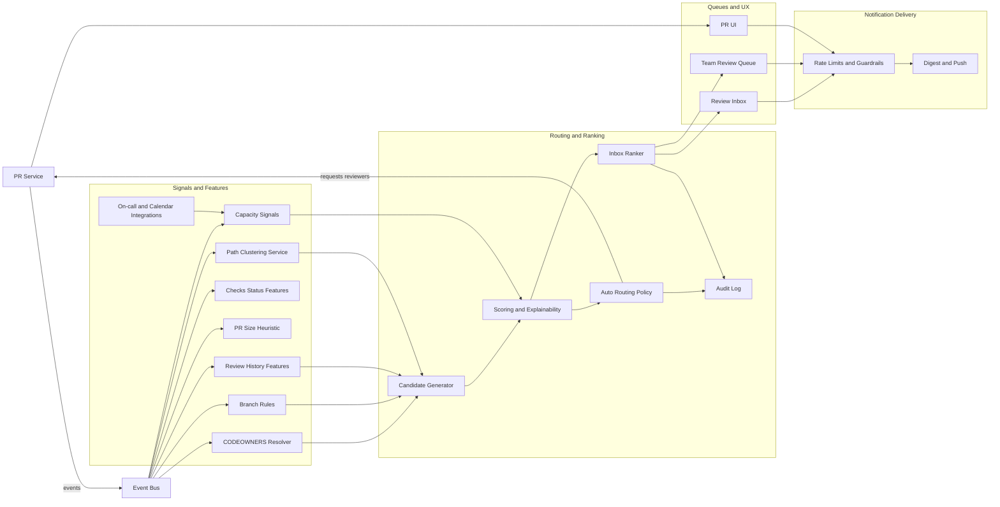

# GitHub: Review Inbox + Load-Aware Review Routing (System Architecture v2)

**What this explains:** a system-level architecture for reducing PR review latency without increasing reviewer burnout by treating review as an **attention-routing problem**.

**PRD reference:** https://github.com/004mayank/product-prd/blob/main/github-review-routing-prd.md

---

## 1) Problem recap (the bottleneck)
In mature teams, CI/checks are mostly automated; **human review throughput** becomes the limiting step:

**Branch → PR → Review → Checks → Merge**

Failure modes:
- review requests are not a real queue (hard to prioritize)
- CODEOWNERS answers “who should review” but not “who will respond soon”
- “why me” is unclear → low trust and more side-channel pings
- stalled PRs lack a safe escalation path

v2 additions (what was missing in v1):
- directory-based ownership is a weak proxy; you need **semantic/path clustering** to match expertise better
- “availability” is often implicit (meetings, PTO, on-call); you need **default capacity signals** and org integrations
- ranking and routing need **auditability + guardrails** to avoid social pressure and unfair load concentration

---

## 2) High-level architecture
At a systems level, GitHub needs three layers:

1) **Signals layer**: collect/derive routing, urgency, and capacity signals.
2) **Decision layer**: rank PRs for reviewers and pick suggested/auto-routed reviewers.
3) **Surfaces + delivery layer**: inboxes/queues + notifications + auditability.

### Mermaid (system diagram)

---

## 3) Core entities (data model)

### PullRequest
- id, repo, title
- files changed (paths)
- author
- created_at, updated_at
- requested_reviewers (users)
- requested_teams (teams)
- required_reviewers (derived from rules)
- check_summary (required checks pass/fail/pending)
- size_bucket (S/M/L)
- path_clusters (derived; v2)

### ReviewRequest
Represents a unit of work in a queue.
- pr_id
- target_type: user | team
- target_id
- request_type: required | requested | fyi
- reason_primary (enum + text)
- created_at
- state: open | snoozed | completed | declined

### CapacityProfile (per reviewer)
- availability: available | focus | away
- soft_max_queue
- working_hours (optional)
- on_call (optional; v2)

### TeamQueueConfig (per team)
- SLA targets (e.g., 8h/24h)
- escalation target (lead/on-call) (optional)
- policy toggles: allow_autoroute, allow_unblock

### PathCluster (v2)
A stable grouping over files/dirs that better matches expertise than raw directories.
- cluster_id
- label (optional)
- member_paths (patterns)
- repo_scope

---

## 4) Signals layer (where routing gets its truth)

### Governance constraints (hard)
- **Branch rules**: required reviewers/teams, required checks
- **CODEOWNERS**: path → owners mapping

These constrain who *can* satisfy the review requirement.

### Responsiveness and quality signals (soft)
- **reviewer history**: recent reviews in this repo and in the same path cluster
- **response-time buckets**: rolling median time-to-first-review per reviewer (bucketed)
- **load buckets**: open review requests (personal queue depth), age-weighted

### PR state signals
- check state: failing/pending/passed (for required checks)
- PR age since request
- PR size bucket S/M/L
- “follow-up” state: reviewer commented and PR updated since

### Capacity and availability signals (v2)
Default, non-invasive ways to avoid routing to unavailable people:
- “focus” or “away” status (manual)
- on-call schedule (pager/on-call integration)
- calendar busy blocks (optional, coarse; e.g., Busy / Free)

Guardrail: these must stay **coarse and user-controlled** (avoid surveillance vibes).

### Path clustering (v2)
Problem: ownership mapped by directories breaks down in monorepos and with cross-cutting changes.

Approach options:
- **heuristic**: cluster by common co-change sets (files that change together)
- **semantic**: cluster by package graph + imports
- **hybrid**: start heuristic, refine with repo metadata (package.json, build graph)

Output:
- PR → {cluster_id} set
- reviewer expertise score is computed per cluster (not per directory string)

---

## 5) Decision layer

### 5.1 Reviewer suggestions (author assist)
When the author opens “Request reviewers”, produce a ranked list.

**Candidate generation**
- required candidates from branch rules
- owners for touched paths from CODEOWNERS
- recent reviewers of similar clusters
- optional on-call / rotation candidate

**Scoring (explainable, v2)**
Score = weighted sum of:
- eligibility and match strength (owner, cluster match, recent reviewer)
- capacity bucket (prefer low)
- responsiveness bucket (prefer fast)
- availability bucket (prefer available)

**Output**
- suggested reviewers + primary “why” reason
- show load as Low/Med/High (no exact numbers)
- show expected response as Fast/Normal/Slow (bucketed)
- show availability as Available/Focus/Away (optional)

### 5.2 Auto-routing policy (optional)
If enabled at repo/org:
- auto-request 1–2 reviewers that satisfy constraints
- never remove required reviewers
- never route to “away” by default
- log an audit entry describing why the reviewer was chosen

### 5.3 Inbox ranking
Treat review as a **queue**, not a list.

Rank score inputs:
- required-reviewer (highest weight)
- SLA urgency for team-configured queues
- “blocking” escalations
- age since request
- check state (failing required checks increases priority)
- PR size (prevents starvation over time)
- follow-up state (fresh updates bubble back up)

Output surfaces:
- **Review Inbox** (personal): prioritized items + sections
- **Team Review Queue**: aging required items and SLA breaches

### 5.4 Auditability and guardrails (v2)
To keep trust high, every routing decision should be explainable and inspectable.

Audit log entries:
- decision type: suggest | autoroute | rank
- inputs used (bucketed)
- primary reason string shown to the user
- policy version + feature flags

Guardrails:
- cap auto-routes per reviewer per day
- enforce load balancing (avoid over-concentration)
- allow decline with reason (feeds the model and reduces future bad routes)

---

## 6) Surfaces + guardrails

### 6.1 Review Inbox (personal)
A single place that behaves like a work queue:
- Blocking me
- Due soon (SLA)
- High risk/high impact
- Follow-ups
- FYI

Each item must show:
- request type (required/requested/fyi)
- check summary
- size bucket
- age
- **why you were requested** (primary explanation)

### 6.2 Unblock escalation (rate-limited)
An explicit escalation that is safer than pings:
- can trigger only after a threshold wait time
- per-author daily rate limit and per-PR cooldown
- escalations create a “blocking” badge and one additional notification

### 6.3 Team Review Queue
Minimal team-level accountability:
- shows PRs waiting on required team review
- highlights SLA approaching/breached
- supports “assignment suggestion” but keeps governance intact

---

## 7) Notifications (delivery layer)
Goal: reduce side-channel pings, not create more spam.

Principles:
- default to digest-friendly updates
- only escalate when unblock is used or SLA is breached
- bucketed load/capacity to avoid social pressure

---

## 8) Observability (what to measure)
Funnel:
- review_requested → inbox_impression → inbox_click → review_submitted

Primary:
- time to first substantive review (p50/p90)
- total idle time in waiting-for-review

Guardrails:
- snooze rate, decline rate, unsubscribe/mute signals
- concentration: share of reviews by top 10% reviewers
- fairness: variance in per-reviewer load controlling for expertise match

---

## 9) Trade-offs and risks
- Load indicators can create social dynamics → keep them bucketed and optional
- Ranking mistakes can hide important work → always pin required and blocking
- Auto-routing can feel invasive → make it opt-in with clear auditability
- Availability signals can feel surveillant → keep coarse, explicit, and user-controlled

---

## 10) What changed from v1 to v2 (quick diff)
- Added **Path Clustering Service** to improve expertise matching beyond directories
- Added **On-call and Calendar Integrations** as default capacity signals
- Split routing into **candidate generation + scoring** for clearer auditability
- Added **audit log + fairness guardrails** as first-class components
