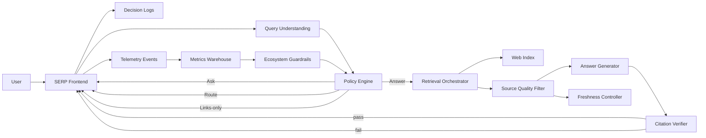

# Google Search — AI Answers (Grounded) Without Breaking the Web (System Architecture V1)

**Product:** Google Search (SERP)  
**Audience:** PMs / Engineers  
**Goal:** Describe an implementation-oriented, **generic (non-proprietary)** architecture for **grounded AI Answers** on the SERP with **trust, freshness, and web ecosystem guardrails**.

**PRD reference (v3):**
- https://github.com/004mayank/product-prd/blob/main/google-search-ai-answers-prd.md

---

## 1) What this system is
AI Answers is a SERP module that, for eligible queries, produces a **retrieval-grounded** summary with **citations**.

Hard constraints:
- Users must finish informational tasks faster (when eligible)
- The answer must be **grounded** and **freshness-aware**
- The module must not become a **dead-end** that destroys publisher value

The core mechanism is a per-query policy decision:
> **Answer vs Ask vs Route vs Links-only**

---

## 2) Design principles (V1)
1. **Conservative by default:** if unsure, fall back to classic results.
2. **Grounding is mandatory:** generation is constrained to retrieved evidence.
3. **Citations must be correct:** if citation checks fail, do not ship the answer.
4. **Freshness-aware:** breaking / time-sensitive topics prefer sources-first.
5. **Web value exchange:** source UX is first-class, not decorative.
6. **Ads integrity:** strict separation between ads and AI output.

---

## 3) Non-functional requirements (indicative)
- **Latency:** AI module must not materially regress perceived SERP load.
  - Target p95 budget (decision + evidence + synth + verify): ~300–700ms using progressive rendering
- **Availability:** degrade gracefully to classic SERP at any time.
- **Cost control:** cache where safe; restrict eligibility; monitor $/satisfied-session.
- **Auditability:** decision logs + source/citation logs for incident response.

---

## 4) High-level components
### Online path
- **SERP Frontend**: renders classic results + modules; progressive AI Answer slot
- **Query Understanding**: intent, risk, freshness sensitivity, ambiguity
- **Policy Engine**: decides Answer/Ask/Route/Links-only (plus kill switches)
- **Retrieval Orchestrator**: top documents + passages with diversity constraints
- **Source Quality Filter**: spam/thin content filtering; diversity enforcement
- **Answer Generator**: grounded synthesis in structured sections
- **Citation Verifier**: claim/section entailment checks vs cited passages
- **Freshness Controller**: breaking/periodic detection; timestamp requirements; “as of” time

### Monitoring + control
- **Telemetry Pipeline**: decision logs, sources, citations, user actions, outcomes
- **Experimentation**: eligibility-only A/B, holdbacks
- **Ecosystem Guardrails**: publisher value scorecard + automatic tightening per query cluster

### Data systems
- **Web Index**: documents + ranking signals
- **Passage Store** (optional): precomputed passages/snippets
- **Caches**: short TTL for evidence bundles / safe answers
- **Decision Log Store**: debug/audit trails
- **Metrics Warehouse**: aggregated metrics for dashboards + guardrails

---

## 5) System diagram (V1)

---

## 6) Request lifecycle (end-to-end)
### 6.1 Classify + decide
1. User submits query.
2. Query Understanding returns:
   - intent bucket (Know/Do/Go/Buy)
   - risk class (low/medium/high)
   - freshness sensitivity (evergreen/periodic/breaking)
   - ambiguity score
3. Policy Engine applies thresholds + kill switches and returns:
   - `decision = Answer | Ask | Route | LinksOnly`
   - optional `ask_question` or `route_target` (News/Maps/Shopping)

### 6.2 Evidence retrieval + synthesis (Answer path)
4. Retrieval Orchestrator fetches candidate docs/passages from the Web Index.
5. Source Quality Filter enforces:
   - minimum domain diversity
   - spam/thin/low-trust suppression
6. Answer Generator produces structured sections (bullets/steps/pros-cons) constrained to evidence.
7. Citation Verifier checks:
   - each bullet/section has supporting passage(s)
   - entailment/consistency between claim and cited text
8. If verification passes, SERP renders AI Answer with citations; otherwise falls back to Links-only.

### 6.3 Source-first UX instrumentation
9. SERP logs user actions (expand, view passage, click citation, continue to source, return).

---

## 7) Ecosystem guardrails loop (query-cluster control)
A background job computes a **publisher value scorecard** per query cluster:
- qualified outbound value (long clicks + downstream engagement)
- diversity index (domain concentration)
- complaint / escalation rate

If the scorecard drops below thresholds, Guardrails triggers:
- eligibility tightening (Links-only)
- increased above-the-fold source prominence (layout variant)
- stricter diversity requirements

---

## 8) Key data contracts (suggested)
### 8.1 Policy decision log
- `query_id`, `query_text_hash`
- `intent`, `risk`, `freshness`, `ambiguity`
- `decision` and `reasons[]`
- `model_versions` (classifier + generator + verifier)
- `kill_switches_active[]`

### 8.2 Answer artifact
- `answer_sections[]` (bullets/steps)
- `citations[]` (url, domain, passage_id, section_id)
- `as_of_timestamp`
- `verification_scores`

---

## 9) Failure modes and fallbacks (must be explicit)
- Retrieval failure / low diversity → Links-only
- Citation verification fail → Links-only
- Breaking topic detected → Route to News/sources-first
- High-risk domain (medical/legal/finance) → Links-only or tightly scoped definitional answer

---

## 10) Ads integrity boundary
- Ads rendering and ranking are independent.
- AI Answer generation and citation selection must exclude sponsored content as factual evidence.
- UI must keep ads clearly labeled and separated.

---

## 11) Rollout controls
- query-cluster allowlists/denylists
- per-geo rollouts
- instant kill switches per category and per decision stage

---

## 12) What V2 would add (not in scope here)
- richer claim-level citations everywhere (not just section-level)
- multi-perspective UX for contested topics
- publisher controls/visibility tooling
- more advanced caching strategies for evidence bundles
