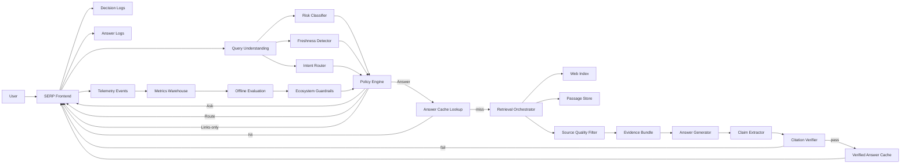

# Google Search — AI Answers (Grounded) Without Breaking the Web (System Architecture V2)

**Product:** Google Search (SERP)  
**Audience:** PMs / Engineers  
**Goal:** Describe an implementation-oriented, **generic (non-proprietary)** architecture for **grounded AI Answers** on the SERP with **trust, freshness, and web ecosystem guardrails**.

**PRD reference (v3):**
- https://github.com/004mayank/product-prd/blob/main/google-search-ai-answers-prd.md

---

## 1) What this system is
AI Answers is a SERP module that, for eligible queries, produces a **retrieval-grounded** answer with **citations** and **source-forward UX**.

Hard constraints:
- Users must finish informational tasks faster (when eligible)
- The answer must be **grounded** and **freshness-aware**
- The module must not become a **dead-end** that destroys publisher value

The core mechanism is a per-query policy decision:
> **Answer vs Ask vs Route vs Links-only**

V2 adds:
- claim-level grounding checks (not just section-level)
- explicit **risk and policy gates** (YMYL, elections, crises)
- **publisher value guardrails** wired into eligibility and layout
- caching of **evidence bundles** and **verified answer artifacts**
- clear separation of **online serving** vs **offline evaluation**

---

## 2) Design principles (V2)
1. **Conservative by default:** if unsure, fall back to classic results.
2. **Grounding is mandatory:** generation is constrained to retrieved evidence.
3. **Citations must be correct:** if verification fails, do not ship the answer.
4. **Freshness-aware:** breaking / time-sensitive topics prefer sources-first.
5. **Web value exchange:** source UX is first-class, not decorative.
6. **Ads integrity:** strict separation between ads and AI output.
7. **Risk-aware routing:** for sensitive clusters, prefer links, routing, or tightly scoped answers.
8. **Auditability by construction:** every shipped token is attributable to evidence + policy.

---

## 3) Non-functional requirements (indicative)
- **Latency:** AI module must not materially regress perceived SERP load.
  - Target p95 budget (decision + evidence + synth + verify): ~300–700ms using progressive rendering
- **Availability:** degrade gracefully to classic SERP at any time.
- **Cost control:** cache where safe; restrict eligibility; monitor $/satisfied-session.
- **Auditability:** decision logs + source/citation logs for incident response.

---

## 4) High-level components
### Online path
- **SERP Frontend**: renders classic results + modules; progressive AI Answer slot
- **Query Understanding**: ambiguity, entities, language, task type
- **Risk Classifier**: YMYL + crisis + policy sensitivity scoring
- **Freshness Detector**: evergreen vs periodic vs breaking; timestamp requirements; “as of” time
- **Intent Router**: decides if query should route to verticals (News/Maps/Shopping)
- **Policy Engine**: decides Answer/Ask/Route/Links-only (plus kill switches)
- **Answer Cache Lookup**: returns recently verified answers when safe
- **Retrieval Orchestrator**: top documents + passages with diversity constraints
- **Source Quality Filter**: spam/thin content filtering; diversity enforcement
- **Evidence Bundle**: normalized retrieved passages with provenance and timestamps
- **Answer Generator**: grounded synthesis in structured sections
- **Claim Extractor**: turns sections into atomic claims for verification
- **Citation Verifier**: claim-level entailment checks vs cited passages
- **Verified Answer Cache**: caches only verification-passing artifacts

### Monitoring + control
- **Telemetry Pipeline**: decisions, sources, citations, user actions, outcomes
- **Experimentation**: eligibility-only A/B, holdbacks
- **Offline Evaluation**: continuous evals for citation accuracy and satisfaction
- **Ecosystem Guardrails**: publisher value scorecard + automatic tightening per query cluster

### Data systems
- **Web Index**: documents + ranking signals
- **Passage Store** (optional): precomputed passages/snippets
- **Caches**: short TTL for evidence bundles / verified answers
- **Decision Log Store**: debug/audit trails
- **Metrics Warehouse**: aggregated metrics for dashboards + guardrails

---

## 5) System diagram (V2)

---

## 6) Request lifecycle (end-to-end)
### 6.1 Classify + decide
1. User submits query.
2. Query Understanding returns:
   - intent bucket (Know/Do/Go/Buy)
   - risk class (low/medium/high)
   - freshness sensitivity (evergreen/periodic/breaking)
   - ambiguity score
3. Policy Engine applies thresholds + kill switches and returns:
   - `decision = Answer | Ask | Route | LinksOnly`
   - optional `ask_question` or `route_target` (News/Maps/Shopping)

### 6.2 Evidence retrieval + synthesis (Answer path)
4. Retrieval Orchestrator fetches candidate docs/passages from the Web Index.
5. Source Quality Filter enforces:
   - minimum domain diversity
   - spam/thin/low-trust suppression
6. Answer Generator produces structured sections (bullets/steps/pros-cons) constrained to evidence.
7. Citation Verifier checks:
   - each bullet/section has supporting passage(s)
   - entailment/consistency between claim and cited text
8. If verification passes, SERP renders AI Answer with citations; otherwise falls back to Links-only.

### 6.3 Source-first UX instrumentation
9. SERP logs user actions (expand, view passage, click citation, continue to source, return).

---

## 7) Ecosystem guardrails loop (query-cluster control)
A background job computes a **publisher value scorecard** per query cluster:
- qualified outbound value (long clicks + downstream engagement)
- diversity index (domain concentration)
- complaint / escalation rate

If the scorecard drops below thresholds, Guardrails triggers:
- eligibility tightening (Links-only)
- increased above-the-fold source prominence (layout variant)
- stricter diversity requirements

---

## 8) Key data contracts (suggested)
### 8.1 Policy decision log
- `query_id`, `query_text_hash`
- `intent`, `risk`, `freshness`, `ambiguity`
- `decision` and `reasons[]`
- `model_versions` (classifier + generator + verifier)
- `kill_switches_active[]`

### 8.2 Answer artifact
- `answer_sections[]` (bullets/steps)
- `citations[]` (url, domain, passage_id, section_id)
- `as_of_timestamp`
- `verification_scores`

---

## 9) Failure modes and fallbacks (must be explicit)
- Retrieval failure / low diversity → Links-only
- Citation verification fail → Links-only
- Breaking topic detected → Route to News/sources-first
- High-risk domain (medical/legal/finance) → Links-only or tightly scoped definitional answer

---

## 10) Ads integrity boundary
- Ads rendering and ranking are independent.
- AI Answer generation and citation selection must exclude sponsored content as factual evidence.
- UI must keep ads clearly labeled and separated.

---

## 11) Rollout controls
- query-cluster allowlists/denylists
- per-geo rollouts
- instant kill switches per category and per decision stage

---

## 12) V2 additions (implemented in this doc)
### 12.1 Claim-level grounding
V2 treats the answer as a set of atomic **claims** and verifies each claim against citations:
- extract claims from each answer section
- require at least one supporting passage per claim
- block or rewrite claims that fail entailment

### 12.2 Risk-aware and topic-aware routing
Policy Engine uses risk + freshness + intent to decide among:
- **Answer**: eligible + verifiable + non-breaking
- **Ask**: ambiguous queries to disambiguate before retrieving
- **Route**: specialized verticals (News, Maps, Shopping, Flights)
- **Links-only**: high-risk, low evidence quality, or guardrails triggered

### 12.3 Evidence bundle caching
Two caches with different safety properties:
- **Evidence Bundle Cache** (short TTL): retrieved passages, diversity-constrained
- **Verified Answer Cache** (short TTL): only answers that passed verification; contains citations + as-of timestamp

### 12.4 Publisher value guardrails wired to serving
Guardrails is not just a dashboard. It can automatically:
- reduce eligibility in a query cluster
- enforce higher domain diversity
- shift layout to "sources-first" variants
- increase citation prominence and outbound affordances

### 12.5 Offline evaluation as a first-class system
A continuous eval pipeline measures:
- citation accuracy
- factuality under freshness shifts
- user satisfaction proxies (reformulations, pogo-sticking)
- publisher value metrics (qualified outbound)

---

## 13) Multi-perspective and contested topics (optional V2.1)
For contested topics, the Answer Generator can switch to a **multi-perspective template**:
- "What sources agree on"
- "Where sources differ"
- "How to verify"

This is gated by risk policy and requires stronger diversity + verification thresholds.

## 14) Publisher controls (optional V2.1)
A publisher-facing control plane can expose:
- why the site was cited (topic + passage)
- citation traffic and engagement metrics
- reporting for citation mismatch

This requires careful abuse prevention and is typically rolled out gradually.
