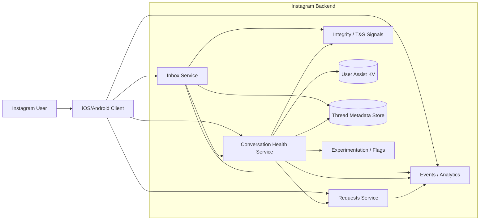
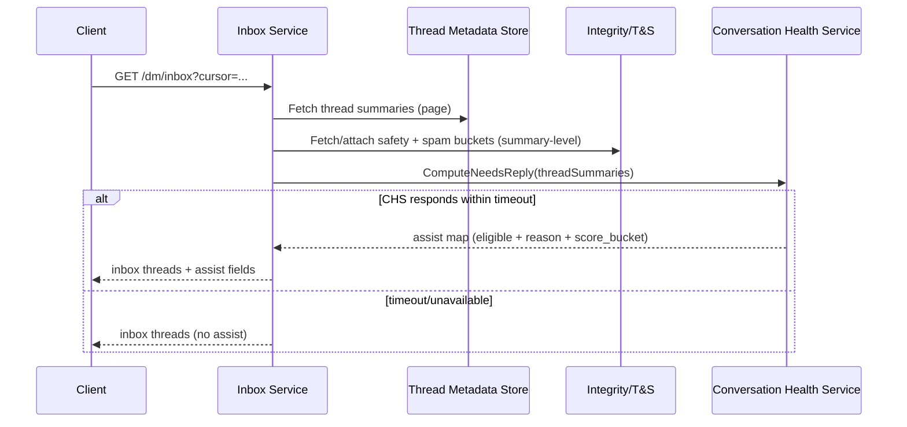
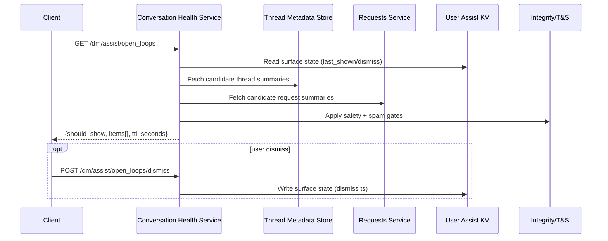
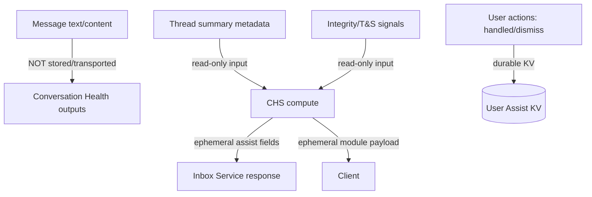
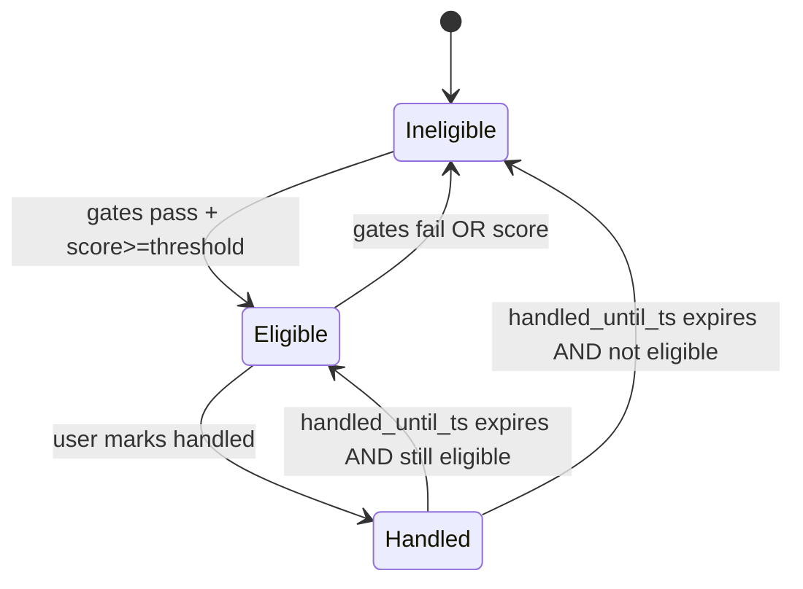
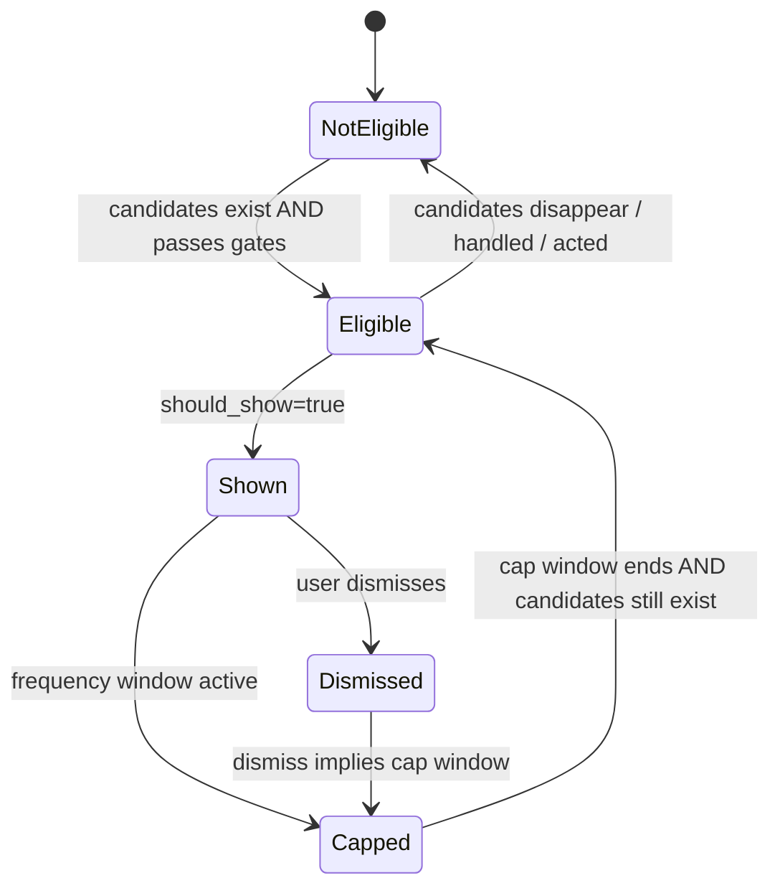

# Instagram DMs — Conversation Health Assist

**Subtitle:** Needs Reply • Requests Triage • Open Loops

**Artifact:** System Architecture (V3)
**Product:** Instagram (DMs)
**Scope:** Architecture to support PRD v3+ (V3 adds clearer service boundaries, data flows, and diagrams; still policy-safe and lightweight).
**Author:** Mayank Malviya (with Botty)
**Status:** V3 — diagrammed architecture + stronger separation of concerns + production hardening.

---

## 0) Executive summary
We’re building three “conversation health” assists for Instagram DMs:

1) **Needs Reply** — per-thread indicator in inbox list for eligible threads.
2) **Requests triage** — stable signals + one-tap actions + likely-spam bucket in Message Requests.
3) **Open Loops** — a small module on entry that resurfaces eligible items after time away.

V3 keeps the core V2 design goals and adds:
- **Clear service boundaries** (Inbox vs CHS vs Requests vs Integrity).
- **Explicit data-flow contracts** (what is derived vs stored, where computation happens).
- **Architecture diagrams** (C4-style + sequences) suitable for Instagram engineering reviews.

---

## 1) Principles and constraints
1. **Policy-safe by construction:** minimize message-content handling; prefer metadata + integrity signals.
2. **No inbox reordering (V1–V3):** indicators/modules only.
3. **Latency isolation:** inbox must succeed without CHS; **drop-on-timeout**.
4. **Data minimization:** store only user actions and minimal timestamps; derived attributes are ephemeral.
5. **Cross-device convergence:** handled state + caps are user-scoped and stored server-side.
6. **Explainability via enums:** reasons/labels are enumerations; never ship text.

---

## 2) Architecture (V3)

### 2.1 Logical components
**Messaging domain (existing)**
- **Inbox Service**: returns DM thread list pages.
- **Thread Metadata Store**: thread summaries, last inbound/outbound timestamps.
- **Requests Service**: message requests inbox + actions.

**Integrity/Trust & Safety (existing)**
- Spam bucket signals, restriction/protection state, teen safety flags.

**Conversation Health Service (CHS) (new)**
- Computes **Needs Reply** assist fields.
- Computes **Open Loops** module payload.
- Persists **handled state** and **surface frequency state**.
- Applies **caps/anti-flapping**.

**Shared infrastructure (existing)**
- Experimentation/feature flags
- Analytics/events pipeline
- KV store for small user-scoped state

---

## 3) Diagrams

### 3.1 System context (C4 Level 1)


### 3.2 Inbox augmentation (C4 Level 2: key request path)


### 3.3 Open Loops module (C4 Level 2)


### 3.4 Data classification diagram (what can be stored)


---

## 4) Data model

### 4.1 Derived (ephemeral) attributes
Computed per request (or cached short-term):
- `needs_reply.eligible` (bool)
- `needs_reply.score_bucket` (enum): `low | med | high`
- `needs_reply.reason` (enum): `story_reply | question_hint | verified_sender | strong_graph | other`

Inputs (thread-summary level only):
- `last_inbound_ts`, `last_outbound_ts`
- `thread_folder`: `primary | general | requests`
- `is_story_reply_context`
- `relationship_flags`: `is_mutual`, `is_verified_sender`
- `safety_state`: `is_muted`, `is_archived`, `is_restricted`, `is_blocked`, `is_teen_protected`
- `spam_bucket`: `hc_spam | suspected | clean`
- `question_hint` (bool; see §7.3)

### 4.2 Stored state (durable, minimal)
**UserThreadAssistState** *(key: `user_id + thread_id`)*
- `handled_until_ts` (nullable)
- `updated_at`

**UserAssistSurfaceState** *(key: `user_id + surface`)*
- `open_loops_last_shown_ts`
- `open_loops_last_dismiss_ts`
- `open_loops_last_payload_hash` (optional)

Retention/TTL:
- handled suppression TTL: typically 14 days
- surface state TTL: 30–90 days acceptable (small footprint)

---

## 5) APIs and contracts

### 5.1 Inbox augmentation (preferred)
Inbox response may include an `assist` object.

```json
{
  "thread_id": "t_123",
  "assist": {
    "needs_reply": {
      "eligible": true,
      "reason": "question_hint",
      "score_bucket": "med"
    }
  }
}
```

**Hard rule:** if CHS fails/times out, omit `assist` entirely.

### 5.2 Sidecar endpoint (optional)
`GET /dm/assist/needs_reply?thread_ids=...`
- Returns `thread_id -> needs_reply` map.

### 5.3 Mutations
**Mark handled**
- `POST /dm/assist/threads/{thread_id}/handled`
- Body: `{ "duration_days": 14 }`
- Response: `{ "handled_until_ts": 1760000000 }`
- Idempotent via `Idempotency-Key`

**Open Loops fetch**
- `GET /dm/assist/open_loops`

**Open Loops dismiss**
- `POST /dm/assist/open_loops/dismiss`
- Idempotent via `Idempotency-Key`

### 5.4 API summary table
| Surface | Endpoint | Owner | Purpose | Idempotent | Cache/TTL | Notes |
|---|---|---|---|---|---|---|
| Inbox augmentation | *(internal)* `ComputeNeedsReply(threadSummaries)` | Inbox → CHS | Attach `assist.needs_reply` | N/A | CHS cache 3–5 min | Drop-on-timeout; summaries only |
| Needs Reply (fallback) | `GET /dm/assist/needs_reply?...` | CHS | Sidecar lookup | Yes | Cacheable minutes | Staged rollout option |
| Mark handled | `POST /dm/assist/threads/{thread_id}/handled` | CHS | Persist suppression | **Yes** | Stored TTL ~14d | User action; cross-device convergence |
| Open Loops fetch | `GET /dm/assist/open_loops` | CHS | Module decision + payload | Yes | `ttl_seconds` ~300 | 24h frequency cap |
| Open Loops dismiss | `POST /dm/assist/open_loops/dismiss` | CHS | Persist dismiss + cap | **Yes** | Stored | Optional payload hash |
| Requests actions | `POST/DELETE /dm/requests/...` | Requests svc | Accept/delete/report | Depends | Existing | Triaging is mostly UX + signals |

---

## 6) Core flows

### 6.1 Needs Reply compute and render
- Inbox service fetches a page of thread summaries.
- Inbox service calls CHS with summaries only.
- CHS returns an assist map; inbox attaches it.

Latency budgets (illustrative):
- CHS target p95: 30–50ms
- Inbox CHS timeout: 20–30ms (hard)

### 6.2 Mark handled
- Client optimistic hide.
- CHS writes `handled_until_ts` in KV.

### 6.3 Requests triage
- Signals are surfaced deterministically from existing backend fields.
- Actions remain owned by Requests Service.

### 6.4 Open Loops
- CHS reads surface cap state and candidate summaries.
- Returns deterministic ordering with 3–5 items.

---

## 7) Eligibility, scoring, and safety

### 7.1 Hard exclusion gates (must-pass)
Exclude from **Needs Reply** if any:
- muted or archived
- restricted/blocked/integrity-protected
- teen/safety-sensitive state
- last inbound older than 7 days
- thread is in Requests
- spam bucket == high-confidence spam

Exclude from **Open Loops** items if:
- same safety gates
- already acted (requests) or handled (threads)

### 7.2 Lightweight scoring (non-ML; illustrative)
- +3 story reply context
- +2 primary folder
- +2 question hint
- +2 verified sender
- +1 mutual/strong graph
- +1 inbound age ≤ 24h

Threshold: score ≥ 4.

### 7.3 Question hint without shipping text
Preferred:
- Inbox computes `question_hint` locally using safe heuristics (e.g., contains `?`), and passes only boolean.

Fallback:
- omit feature.

---

## 8) Caps, anti-flapping, and state machines

### 8.1 Caps
- Needs Reply: cap `min(5, 10% of first-screen threads)` per page.
- Open Loops: cap 3–5 items.
- Open Loops frequency: max once per 24h.

### 8.2 Anti-flapping
- deterministic ordering before caps
- cache output (3–5 min)
- optional payload hash comparison for Open Loops

### 8.3 State machines

#### Needs Reply (per user-thread)


#### Open Loops (per user-surface)


---

## 9) Observability, experiments, and guardrails

### 9.1 Flags
- `dm_needs_reply_enabled`
- `dm_open_loops_enabled`
- `dm_requests_triage_enabled`

### 9.2 Event schema (contract)

Common fields (recommended): `client_ts_ms`, `app_version`, `os`, `locale`, experiment context.

| Event | Required fields | Optional fields | Privacy notes |
|---|---|---|---|
| `dm_needs_reply_impression` | `thread_id`, `reason`, `score_bucket` | `position`, `inbox_surface` | No message text; enums only |
| `dm_needs_reply_mark_handled` | `thread_id` | `duration_days`, `source` | User action derived |
| `dm_open_loops_impression` | `items_count`, `items_types` | `payload_hash`, `entrypoint` | Prefer counts/types over ids |
| `dm_open_loops_item_click` | `item_type`, `rank` | `thread_id|request_id` (if allowed) | Apply standard retention controls |
| `dm_open_loops_dismiss` | — | `payload_hash` | No content |
| `dm_request_action` | `request_id`, `action` | `signals_shown`, `spam_bucket` | No message text |

Sampling:
- payload hashes/debug: 1–5% sample
- safety incidents: do not sample

### 9.3 Guardrails (must monitor)
- block/restrict/report actions per DAU (treatment vs control)
- spam exposure incidents
- inbox latency impact (p50/p95)
- label fatigue (users seeing >N labels/day)
- Open Loops CTR + bounce

---

## 10) Failure modes and fallbacks
- CHS timeout/unavailable → inbox returns without assist.
- KV outage → best-effort writes disabled; behavior becomes ephemeral; alert.
- Safety regression → hard gates + kill switches + staged rollout.
- Cache staleness → short TTL + summary-version keys.

---

## 11) Security and privacy
- No message content stored or transported for these assists.
- Derived `question_hint` is boolean only.
- Stored state is minimal and user-action derived.
- Exclude teen/safety-sensitive states early.

---

## 12) Implementation plan (V3)
1) Finalize schema/contract review with Integrity + Messaging owners.
2) Implement CHS with strict timeouts + cache + deterministic caps.
3) Add idempotency + KV-backed convergence.
4) Add dashboards + guardrails; staged rollout.
5) Run holdouts for safety/latency regressions.

---

## 13) V4 candidates (explicitly out of scope for V3)
- inbox reordering experiments
- richer language-aware “question hint” under policy constraints
- per-user personalization beyond deterministic buckets
