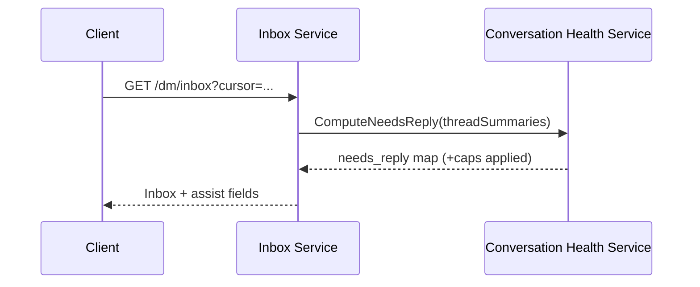
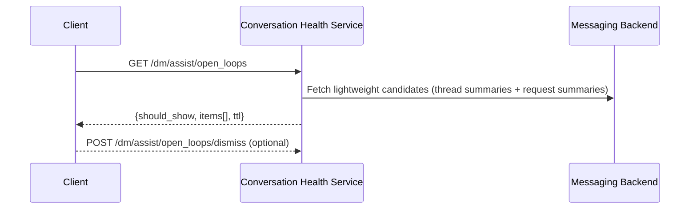

# Instagram DMs — Conversation Health Assist (Needs Reply / Requests Triage / Open Loops)

**Artifact:** System Architecture (V2)
**Product:** Instagram (DMs)
**Scope:** Architecture to support the PRD features shipped in PRD v3 (lightweight, policy-safe; avoid “deep semantic” intent)
**Author:** Mayank Malviya (with Botty)
**Status:** v2 — hardened contracts, caching/consistency, safety guardrails, and failure handling

---

## 0) What are we building (in one paragraph)
We’re adding three lightweight “conversation health” assists to Instagram DMs:
1) a **Needs Reply** indicator on eligible threads in the DM list,
2) a **Requests triage** UX in Message Requests (signals + one-tap actions + likely-spam bucket), and
3) an **Open Loops** entry module that resurfaces eligible items when the user returns after time away.

The architecture must be **safe** (avoid spam amplification, protect sensitive users), **low-latency** (inbox first paint unaffected), **consistent across devices** (handled state + caps), and **measurable** (experiments + guardrails).

---

## 1) Design principles / constraints
- **Policy-safe by construction**: prefer explicit metadata + trust/safety signals; avoid storing/transporting message content.
- **No inbox reordering (V1–V2)**: add indicators/modules only; do not change thread ordering.
- **Consistency across devices**: “handled” and module frequency caps are user-scoped and should converge quickly.
- **Data minimization**: store only user actions + minimal timestamps; derived signals should be ephemeral.
- **Latency isolation**: assist computation must not block inbox response; timeouts degrade to “no assist”.
- **Safety first**: conservative eligibility; integrate existing spam/restriction/teen protections.

---

## 2) High-level architecture

### 2.1 Components (logical)
1) **Messaging Backend** (existing)
   - Inbox/thread list service
   - Message store / thread metadata
   - Requests inbox
   - Existing trust & safety pipelines (spam buckets, restriction states, integrity signals)

2) **Conversation Health Service (CHS)** (new logical service or internal module)
   - Computes **Needs Reply eligibility** + lightweight reasons
   - Produces **Open Loops** module payload
   - Stores **user-per-thread handled state**
   - Enforces **caps/frequency**
   - Emits structured debug info (sampled) for audits

3) **Experimentation / Feature Flag platform** (existing)
   - gates: `dm_needs_reply_enabled`, `dm_open_loops_enabled`, `dm_requests_triage_enabled`
   - variants & holdouts for guardrails

4) **Clients (iOS/Android)**
   - renders pill/module and requests triage UX
   - optimistic UI for user actions
   - emits analytics events

5) **Analytics/Event pipeline** (existing)
   - event ingestion, dashboards, experiment analysis, safety monitoring

### 2.2 Primary integration choice
**Server-augmented thread list (recommended)**
- Inbox service calls CHS using thread summaries and returns assist fields in the inbox response.
- CHS computations are on **summaries only**; avoid message-body fetch.

---

## 3) Data model (minimal & durable)

### 3.1 Ephemeral computed attributes (derived; not stored long-term)
Computed per request (or cached for minutes):
- `needs_reply.eligible` (bool)
- `needs_reply.score_bucket` (enum): `low|med|high` (avoid exposing raw score)
- `needs_reply.reason` (enum): `story_reply | question_hint | verified_sender | strong_graph | other`

Inputs (read-only thread summary fields):
- `last_inbound_ts`, `last_outbound_ts`
- `thread_folder`: `primary|general|requests`
- `is_story_reply_context` (bool)
- `relationship_flags`: `is_mutual`, `is_verified_sender` (or sender verified)
- `safety_state`: `is_muted`, `is_archived`, `is_restricted`, `is_blocked`, `is_teen_protected` (or equivalent)
- `spam_bucket` (existing): `hc_spam|suspected|clean` (illustrative)
- `question_hint` (bool) — computed without sharing text (see §6)

### 3.2 Stored state (new)
**UserThreadAssistState** (key: `user_id + thread_id`)
- `handled_until_ts` (nullable)
- `handled_source` (enum): `user_marked_handled | auto_expired` (optional)
- `updated_at`

**UserAssistSurfaceState** (key: `user_id + surface`)
- `open_loops_last_shown_ts`
- `open_loops_last_dismiss_ts`
- `open_loops_last_payload_hash` (optional; helps reduce flapping)

Storage requirements:
- small KV footprint; low write volume
- TTL allowed (e.g., 14 days for handled)

---

## 4) API surfaces & contracts

### 4.1 Inbox augmentation contract (preferred)
Inbox response adds an optional assist object per thread:

```json
{
  "thread_id": "t_123",
  "...": "existing fields",
  "assist": {
    "needs_reply": {
      "eligible": true,
      "reason": "question_hint",
      "score_bucket": "med"
    },
    "debug": null
  }
}
```

**Timeout behavior:** if CHS fails or times out, `assist` is omitted.

### 4.2 Sidecar endpoint (optional fallback)
If inbox augmentation is hard initially:
- `GET /dm/assist/needs_reply?thread_ids=...` returns a map `thread_id -> needs_reply`.

Trade-off: extra round trip; can be used for staged rollout.

### 4.3 User actions
**Mark handled**
- `POST /dm/assist/threads/{thread_id}/handled`
- Request body:

```json
{ "duration_days": 14 }
```

- Response:

```json
{ "handled_until_ts": 1760000000 }
```

**Idempotency:** accept `Idempotency-Key` header; repeated calls must be safe.

**Open Loops module**
- `GET /dm/assist/open_loops`
- Response:

```json
{
  "should_show": true,
  "items": [
    { "type": "thread", "thread_id": "t_123", "reason": "needs_reply" },
    { "type": "request", "request_id": "r_9", "reason": "pending_request" }
  ],
  "ttl_seconds": 300
}
```

**Dismiss**
- `POST /dm/assist/open_loops/dismiss`

---

## 5) Core flows (with sequencing)

### 5.1 DM list load → Needs Reply labels



**Latency strategy**
- CHS called with **thread summaries only**.
- CHS has strict budget (e.g., p95 < 30–50ms). Inbox uses a tighter timeout (e.g., 20–30ms) and drops assist if exceeded.
- CHS uses a short cache (e.g., 3–5 minutes) keyed by `(user_id, inbox_cursor/page)` or `(user_id, thread_id + summary_version)`.
- Fail-safe: absence of labels is acceptable; do not block inbox.

### 5.2 “Mark handled”
- Client performs optimistic UI hide.
- Server persists handled with TTL.

Edge behavior:
- If persistence fails, client may re-show later; log server errors and retry best-effort.

### 5.3 Requests triage (primarily existing)
Requests triage remains mostly client + existing backend actions. The key V2 hardening is **guardrails + consistent signals**.
- Requests response should include stable signals and safety buckets:
  - verified, mutual, shared groups (if allowed), account age bucket (if policy allows), spam bucket, restriction state.

Actions (existing):
- `POST /dm/requests/{id}/accept`
- `DELETE /dm/requests/{id}`
- `POST /dm/requests/{id}/report`

### 5.4 DM entry → Open Loops module



Selection rules (non-ML ranking):
- candidates: eligible Needs Reply threads (not handled) + pending Requests + optional mentions
- ordering: deterministic (e.g., most recent inbound first; requests before threads if in same recency band)
- cap: 3–5 items

---

## 6) Eligibility & scoring (policy-safe)

### 6.1 Hard exclusion gates (must-pass)
Exclude from **Needs Reply** if any:
- muted / archived
- restricted / blocked / integrity-protected state
- teen/safety-sensitive state (as defined by product policy)
- last inbound older than 7 days
- thread belongs to Requests (handled separately)
- spam bucket == high confidence spam

Exclude from **Open Loops** items if:
- same safety gates as above
- already acted (requests) or handled (threads)

### 6.2 Lightweight scoring (illustrative)
Use a small number of stable features; avoid “semantic intent”.
- +3 story reply context
- +2 primary folder
- +2 `question_hint == true` (computed as a boolean; see below)
- +2 verified sender
- +1 mutual follow / strong graph
- +1 inbound age ≤ 24h

Threshold: `score >= 4`.

### 6.3 Question hint without shipping message text
Preferred approach:
- Inbox service computes `question_hint` using local access to the last inbound message (e.g., contains `?` in supported languages, or an existing safe “contains_question” feature), and passes only a boolean to CHS.

Fallback:
- omit `question_hint` entirely; the system still works with other features.

---

## 7) Caps, anti-flapping, and consistency

### 7.1 Caps (server-side)
- Needs Reply: cap to `min(5, 10% of first-screen threads)` per page.
- Open Loops: cap to 3–5 items.
- Frequency: Open Loops at most once per 24h.

### 7.2 Anti-flapping
- Deterministic ordering for the eligible set (e.g., recency) before applying caps.
- Cache assist output for a short TTL.
- Optional `open_loops_last_payload_hash` to avoid showing materially identical modules repeatedly across quick opens.

### 7.3 Cross-device convergence
- Handled state and Open Loops frequency stored in user-scoped KV.
- Clients apply optimistic UI; server is source of truth.

---

## 8) Observability, experimentation, and safety guardrails

### 8.1 Flags
- `dm_needs_reply_enabled`
- `dm_open_loops_enabled`
- `dm_requests_triage_enabled`

### 8.2 Minimum analytics events
- `dm_needs_reply_impression(thread_id, reason, score_bucket)`
- `dm_needs_reply_mark_handled(thread_id)`
- `dm_open_loops_impression(items_count, items_types[])`
- `dm_open_loops_dismiss`
- `dm_request_action(request_id, action, signals_shown[])`

### 8.3 Guardrails (must monitor)
- blocks/restrict actions per DAU (treatment vs control)
- reports rate and spam exposure incidents
- inbox latency impact (p50/p95)
- “label fatigue”: share of users seeing >N labels/day
- CTR to open threads from Open Loops; bounce rate

---

## 9) Failure modes & fallbacks
- CHS timeout/unavailable → return inbox without labels/modules.
- KV store partial outage → disable persistence writes (best-effort), and fall back to ephemeral behavior; log errors.
- Misclassification (spam surfaced) → rely on strong exclusion gates; add emergency kill switch and shadow evaluation.
- Cache poisoning/staleness → short TTLs; include summary version in cache keys.

---

## 10) Security / privacy notes
- Avoid storing message content.
- Derived `question_hint` is a boolean; do not log raw text.
- Handled state is user-action derived and low sensitivity.
- Exclude teen/safety-sensitive accounts/threads at the earliest gate.

---

## 11) Implementation plan (V2)
1) Harden CHS interfaces + timeouts (SLO + drop-on-timeout).
2) Add idempotency for write endpoints (`handled`, `dismiss`).
3) Add caching + anti-flapping for inbox augmentation and Open Loops.
4) Ship dashboards + guardrails; staged rollout (internal → 1% → 5% → 25% → 50% → 100%).
5) Run holdouts to detect regressions (safety + latency).

---

## 12) Open questions / V3 candidates
- Best home for handled state (messaging store vs dedicated KV) given replication + costs.
- Unifying trust/safety signal schemas across Primary/Requests to reduce client branching.
- Extending question hint beyond `?` while staying policy-safe (language-aware heuristics or existing platform features).
