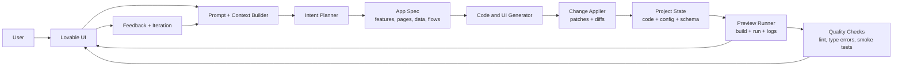
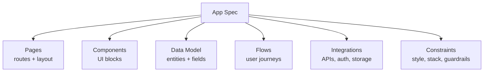
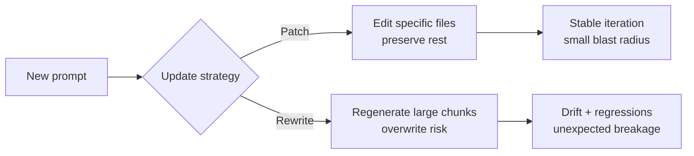
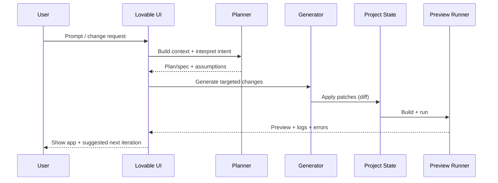

  

# How Lovable Works — AI App Generation Architecture (V1)

**Product:** Lovable  
**Audience:** Product Managers / Builders / AI-curious users  
**Goal:** Explain how Lovable turns prompts into working apps, where uncertainty enters the system, and how iteration drives value — without going deep into infra jargon.

---

## TL;DR (mental model)
Lovable is best understood as a **planning + generation + run/preview + feedback** loop, with two “truths” that must stay aligned:
1) **What the user thinks the app is** (intent + requirements)  
2) **What the app actually is** (project state: code, components, data schema, config)

Most “unreliability” comes from these truths drifting apart during iteration.

---

## 1) The core product problem
Lovable’s core challenge is not generating code or UI.

It is enabling users to **reliably move from idea → usable app → confident iteration**.

Unlike traditional software systems:
- Outputs are **non-deterministic**
- The same prompt can yield different results
- Failures are often ambiguous, not binary

This makes **trust, predictability, and recoverability** first-class product concerns.

---

## 2) Key product requirements
Lovable optimizes for:
- **Speed:** fast generation + preview
- **Approachability:** non-technical users
- **Flexibility:** broad range of app ideas
- **Iterability:** safe refinement after first output
- **Expectation management:** clear limits + visible assumptions
- **Recoverability:** rollback, retries, and bounded change scope

These requirements create unavoidable trade-offs.

---

## 3) High-level generation architecture (conceptual)

### 3.1 System diagram (components)

**PM insight:** Lovable is not “prompt → code”. It’s “prompt → plan/spec → changes → runnable preview → learn → iterate”.

---

## 4) Prompt processing (where intent is interpreted)
When a user submits a prompt, the system typically builds an internal context bundle:
- the latest user prompt
- prior prompts / conversation history
- a summary of current project state (“what exists right now”)
- constraints (template/stack limits, safety/policy restrictions)
- errors from the last preview (logs)

**Where expectation divergence begins**
- Ambiguity is resolved **implicitly** (assumptions)
- Missing constraints are guessed (defaults)
- Users don’t see these assumptions unless the UI surfaces them

**What good UX does here**
- Show a short **Plan** before generating
- Make assumptions explicit (“I’ll use X unless you prefer Y”)
- Ask 1–2 clarifying questions when the prompt is underspecified

---

## 5) Planning layer (turning prompts into an app spec)
A reliable iteration loop benefits from a lightweight internal **App Spec**.

### 5.1 App Spec (what’s inside)

**PM insight:** The spec is where Lovable can create predictability: changes can target parts of the spec, users can review the plan, and the system can preserve continuity across iterations.

---

## 6) AI generation (where non-determinism enters)
The generation engine produces (typically in one combined pass):
- UI components and styling
- business logic and validations
- data wiring (CRUD, queries)
- glue code to make preview run

**Non-determinism implications**
- Quality variance is expected
- Identical prompts ≠ identical outputs
- “Failure” can be subjective (works, but not as intended)

This is not a bug — it’s inherent.

---

## 7) Change application (the hidden heart of iteration)
Iteration becomes reliable when the system can apply changes as **diffs** against the current project state.

### 7.1 Patch vs rewrite (why iteration can feel unsafe)

**PM insight:** Users experience “rewrite” as loss of control. Products that feel reliable usually have explicit **scope control**, **diff visibility**, and **rollback**.

---

## 8) Preview & validation (confidence moment, not proof)
Preview does two jobs:
1) makes the output tangible (the app runs)
2) generates diagnostic feedback (errors, logs, broken flows)

### 8.1 Sequence diagram (end-to-end)

**PM insight:** Preview success builds confidence, but doesn’t guarantee correctness. Great iteration loops help users verify key flows (smoke tests, sample data, guided checklist).

---

## 9) Failure modes & user perception
Common failure patterns:
- output degrades after refinement
- changes affect unintended parts of the app
- errors lack actionable explanations
- the model “forgets” earlier constraints (style/stack)

### 9.1 Failure mode → mitigation map
| Failure mode | User perception | Likely system cause | UX/system mitigation |
|---|---|---|---|
| Regressions after a small change | “It broke what was working” | large rewrite / weak change targeting | patch-only mode, component/page locking, rollback |
| Unintended edits elsewhere | “I don’t control scope” | context drift; overly broad instructions | change scope UI (edit only X), diff viewer |
| Vague errors | “I’m stuck” | tool errors not translated | error translator, suggested fix prompt, one-click “attempt fix” |
| Inconsistent outputs | “It’s random” | sampling + changing context | deterministic mode toggle, pinned spec, explicit assumptions |
| Hallucinated integrations | “It promised things that don’t exist” | overconfident spec | capability checklist, “requires key/setup” flags |

This ties to the **second app problem**: the first demo feels magical, but iteration reveals control/safety gaps.

---

## 10) Key trade-offs Lovable makes
| Trade-off | Typical decision | Why it feels good | What it risks |
|---|---|---|---|
| Creativity vs Predictability | creativity-first | impressive first output | unstable iteration |
| Speed vs Explainability | speed-first | fast feedback | unclear why things happened |
| Flexibility vs Guardrails | flexibility | broad prompt coverage | higher error rate |
| Power vs Simplicity | simplicity | low learning curve | ceiling for advanced users |

---

## 11) Why Lovable sometimes feels unreliable
From a PM lens, unreliability often comes from invisible system behavior:
- hidden assumptions during prompt interpretation
- non-deterministic generation behavior
- weak “change boundaries” (patch vs rewrite)
- lack of visible system constraints (“what is fixed vs negotiable”)

The system may be working — but users lack a mental model for it.

---

## 12) PM takeaways
- AI products behave **probabilistically**, not deterministically
- Iteration is the real unit of value
- Trust is built through **predictability + scope control + recovery**
- Architecture decisions shape user confidence (even without infra jargon)

Lovable’s long-term success depends on making the **generation loop feel safe**, not just impressive.
