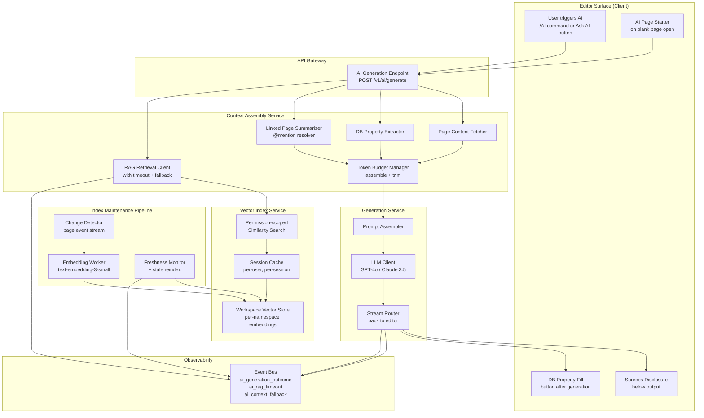
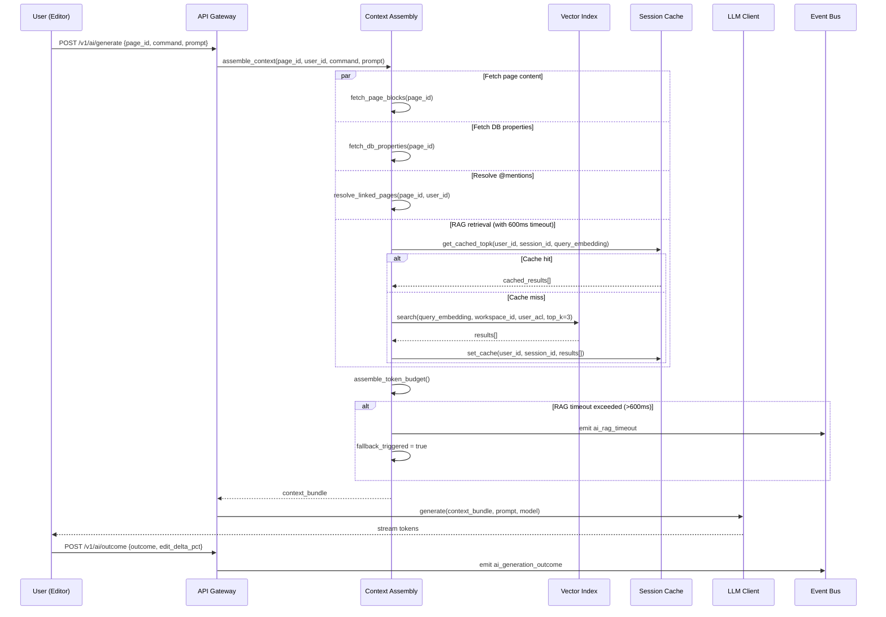

# Notion AI - Contextual Workspace Intelligence (System Architecture)

**What this explains:** the system architecture for grounding Notion AI generation in the user's own workspace content - turning a generic LLM wrapper into a workspace-aware AI that reads your pages before it writes.

**PRD reference:** https://github.com/004mayank/product-prd/blob/main/notion-ai-prd.md

**Version:** v2 - Improved system design  
**Changes from v1:** Added Mermaid system diagram and generation request sequence diagram, full API contracts for context assembly and retrieval services, permission-scoped retrieval scaling analysis, session-level index cache design, competitive architecture comparison, expanded failure modes with mitigations, instrumentation spec with event schemas.

---

## Version history

| Version | Key additions |
|---|---|
| v1 | Core architecture (4 layers), data model, context assembly steps, vector index design, generation layer, index maintenance pipeline, AI surfaces, user journeys, trade-offs |
| v2 | Mermaid diagrams, API contracts, permission-scoped retrieval scaling, session cache, competitive comparison, failure modes, instrumentation |

---

## 1) What this system is

Notion AI in its current state is a **generic LLM invocation** triggered from inside a workspace. It produces grammatically correct text with no knowledge of the workspace it lives in. Users edit the output heavily or discard it - the feedback loop that would build AI habit never forms.

This architecture specifies **Contextual Workspace Intelligence**: every AI generation request is preceded by a context assembly step that injects the current page and retrieves semantically relevant workspace pages. The LLM generates grounded output the user actually keeps.

Three pillars (from the PRD):
1. **Page Context Injection** - inject current page content, DB properties, and @mentioned pages.
2. **Workspace Context Retrieval (RAG)** - retrieve top-N relevant pages from the workspace vector index.
3. **AI Page Starter** - surface a contextual structure suggestion on blank page open.

Hard constraint: **permission model is never relaxed**. A user only receives AI output grounded in pages they have read access to.

---

## 2) System diagram



---

## 3) Generation request sequence



---

## 4) Core data model

### Page (existing Notion object, relevant fields)

```
page_id         uuid
workspace_id    uuid
created_by      user_id
permissions     ACL[]          // who can read/write
block_count     int
token_estimate  int            // approximate; updated on edit
updated_at      timestamp
```

### VectorIndexEntry

```
entry_id             uuid
page_id              uuid
workspace_id         uuid
embedding_vector     float[1536]    // text-embedding-3-small dimension
content_hash         sha256         // detect change without re-reading full content
token_count          int
is_archived          bool
is_deleted           bool
last_indexed_at      timestamp
page_updated_at      timestamp      // from page metadata; detect staleness
index_version        int            // schema version for migrations
```

### AIGenerationRequest

```
request_id           uuid
user_id              uuid
workspace_id         uuid
page_id              uuid
command              enum(write, summarise, draft, improve, translate, fix_spelling, page_starter)
prompt_text          string
context_bundle_id    uuid           // FK to assembled context snapshot
rag_enabled          bool
fallback_triggered   bool
model                enum(gpt-4o, claude-3-5-sonnet)
status               enum(pending, generating, completed, failed, fallback)
created_at           timestamp
completed_at         timestamp
latency_ms           int
```

### ContextBundle (ephemeral per request, TTL 300s)

```
bundle_id            uuid
request_id           uuid
current_page_tokens  int
db_properties_tokens int
linked_pages_tokens  int
rag_pages_tokens     int
total_tokens         int
rag_page_ids         uuid[]
linked_page_ids      uuid[]
fallback_reason      string?
created_at           timestamp
ttl_s                int            // default 300
```

### AIGenerationOutcome

```
outcome_id           uuid
request_id           uuid
user_id              uuid
workspace_id         uuid
page_id              uuid
outcome              enum(accepted, discarded, partially_accepted)
edit_delta_pct       float
sources_opened       bool
db_properties_filled bool
time_to_outcome_ms   int
ts                   timestamp
```

### SessionIndexCache

```
cache_key            string         // hash(user_id + session_id + query_embedding)
workspace_id         uuid
user_id              uuid
results              VectorIndexEntry[]
created_at           timestamp
ttl_s                int            // default 1800 (30 min session window)
```

---

## 5) API contracts

### POST /v1/ai/generate

**Request**

```json
{
  "page_id": "uuid",
  "workspace_id": "uuid",
  "command": "write | summarise | draft | improve | translate | fix_spelling | page_starter",
  "prompt_text": "Draft the Problem section based on our past specs",
  "rag_enabled": true,
  "model_preference": "gpt-4o",
  "session_id": "uuid"
}
```

**Response (streaming - Server-Sent Events)**

```
event: token
data: {"token": "The", "request_id": "uuid"}

event: token
data: {"token": " core", "request_id": "uuid"}

event: done
data: {
  "request_id": "uuid",
  "context_bundle_id": "uuid",
  "rag_page_ids": ["uuid1", "uuid2", "uuid3"],
  "fallback_triggered": false,
  "latency_ms": 3240
}

event: error
data: {"code": "CONTEXT_ASSEMBLY_TIMEOUT", "message": "Context assembly exceeded budget", "fallback": true}
```

**Error codes**

| Code | Meaning | Client behaviour |
|---|---|---|
| `CONTEXT_ASSEMBLY_TIMEOUT` | Full assembly exceeded 800ms | Show output with fallback context; no user-visible error |
| `RAG_TIMEOUT` | Vector store took >600ms | Fall back to page-only context; generation proceeds |
| `PERMISSION_DENIED` | User cannot read the current page | Surface error: "You don't have access to this page" |
| `WORKSPACE_INDEX_NOT_READY` | Index not yet built for new workspace | Proceed without RAG; emit `ai_rag_timeout` |
| `RATE_LIMITED` | AI usage limit hit | Surface upgrade prompt for non-AI subscribers |

---

### POST /v1/ai/outcome

**Request**

```json
{
  "request_id": "uuid",
  "outcome": "accepted | discarded | partially_accepted",
  "edit_delta_pct": 14.2,
  "sources_disclosure_opened": false,
  "db_properties_populated": false,
  "time_to_outcome_ms": 8200
}
```

**Response**

```json
{
  "outcome_id": "uuid",
  "recorded": true
}
```

---

### POST /v1/ai/index/search (internal - Context Assembly -> Vector Index)

**Request**

```json
{
  "workspace_id": "uuid",
  "user_acl": ["page_id_1", "page_id_2", "..."],
  "query_embedding": [0.023, -0.112, "..."],
  "top_k": 3,
  "exclude_page_ids": ["current_page_id"],
  "include_archived": false
}
```

**Response**

```json
{
  "results": [
    {
      "page_id": "uuid",
      "score": 0.87,
      "token_count": 1240,
      "last_indexed_at": "ISO8601",
      "page_title": "Q2 User Research - Search",
      "excerpt": "string (first 200 chars of content)"
    }
  ],
  "retrieval_latency_ms": 312,
  "index_freshness_lag_h": 3.2
}
```

---

## 6) Context assembly layer

Runs on every generation request. Hard latency budget: 800ms P95.

### Steps

**Step 1 - Fetch current page content**

Retrieve all text blocks for `page_id` via existing block content API.

Token management:
- `token_count <= 3,000`: inject full content.
- `token_count > 3,000`: truncate from the bottom (preserve intro + most recent content); append `[page truncated]` marker.

**Step 2 - Fetch DB properties (if page is a DB entry)**

Fetch all typed properties. Serialize as structured JSON. Inject up to 400 tokens.

- Formula properties: inject as computed value.
- Relation/rollup: inject as referenced page titles only (no recursive resolution).

**Step 3 - Resolve @mention links**

Extract up to 3 `@mention` page links. For each:
- Check read ACL for `user_id`.
- Permitted: fetch content, extractively summarise to 400 tokens.
- Not permitted: skip silently. Do not expose page title or existence.

**Step 4 - RAG retrieval (async, 600ms hard timeout)**

If `rag_enabled = true` and command in `[write, draft, summarise]`:

1. Check `SessionIndexCache` for `hash(user_id + session_id + query_embedding)`.
2. Cache hit: return cached results (skip vector store round trip entirely).
3. Cache miss: embed `prompt + page_title` with `text-embedding-3-small`, query vector store with ACL filter, cache results for session TTL (1,800s).
4. Timeout at 600ms: `fallback_triggered = true`; emit `ai_rag_timeout`; proceed without RAG.

**Step 5 - Token budget assembly**

| Layer | Max tokens | Priority |
|---|---|---|
| System prompt | 800 | Fixed |
| Current page content | 3,000 | Highest |
| DB properties | 400 | High |
| @mention linked pages (3 x 400) | 1,200 | Medium |
| RAG pages (3 x 600) | 1,800 | Medium |
| User prompt | 500 | Fixed |
| Generation budget | 2,000 | Fixed |
| **Total** | **~9,700** | Within GPT-4o 128k window |

If total exceeds budget: drop RAG from 3 -> 2 -> 1 -> 0 pages in that order.

---

## 7) Vector index layer

### Architecture decision

| Option | Pros | Cons | Verdict |
|---|---|---|---|
| Dedicated vector DB per workspace (Pinecone) | Strong isolation; no cross-workspace risk | Prohibitive cost at 100k+ workspaces | Reject for v1 |
| Shared vector DB, workspace-namespaced (Weaviate) | Lower cost; good isolation via namespace | Requires careful permission enforcement at query time | Chosen for v1 |
| Postgres + pgvector | Simple ops; no new infra | Query perf degrades at >100k embeddings per workspace | Use for workspaces <10k pages; migrate to Weaviate above |

### Permission-scoped retrieval - the scaling problem

The naive implementation: fetch all pages user can read, filter vector results to that set.

**Problem at scale:** An enterprise workspace with 50,000 pages and a user who can read 40,000 of them. The ACL set passed to the vector store is 40,000 page IDs. This is a large filter payload on every query.

**Solutions (in order of complexity):**

1. **ACL bitmap filter (v1):** Encode user permissions as a bitmap; vector store supports bitmap-filtered ANN search. Weaviate and Pinecone both support this natively. Bitmap filter is computed once per session and cached.

2. **Tiered index (v2):** Separate "public workspace" index (all pages readable by all workspace members) from "private" index (pages with restricted access). Most queries hit the public index; private page retrieval only runs for users with private page access. Reduces filter computation by ~80% for typical workspaces.

3. **Role-based shard (future):** For very large enterprise workspaces, shard the index by team/department. ACL filter is applied per shard in parallel.

### Session-level cache design

**Problem:** Each RAG query requires an embedding call (100ms) + vector store query (200-400ms). For a user triggering AI 5 times per session, this is 5 round trips.

**Solution:** `SessionIndexCache` keyed by `hash(user_id + session_id + query_embedding)`.

- TTL: 1,800s (30 min) - covers a typical active editing session.
- Invalidation: if a page the user can access is edited during the session, the cache is cleared for that user.
- Hit rate target: >60% of RAG calls within active sessions.
- Storage: in-memory (Redis); not persisted across sessions.

**Edge case:** User edits a page that was in their cached RAG results. The session cache is cleared immediately on `page_updated` event for that user's active sessions. Next query re-fetches from vector store with fresh index.

### Index operations

**Upsert trigger:** page block content changes by >50 tokens.

1. Read page content.
2. Compute `content_hash`. If unchanged: no-op.
3. Embed using `text-embedding-3-small`.
4. Upsert `VectorIndexEntry`.
5. Clear session caches for all users with access to this workspace.

**Delete:** mark `is_deleted = true`; exclude from queries; hard delete after 30 days.

**Archive:** mark `is_archived = true`; still indexed; retrieval can optionally exclude.

**Permission change:** ACL enforced at query time, not index time. No re-index on permission change. Immediate effect.

---

## 8) Generation layer

### Prompt structure

```
[System prompt - 800 tokens max]
You are Notion AI. You have been provided workspace context below.
Only generate content grounded in the provided context.
Do not invent facts about the workspace.
When referencing retrieved pages, mention them by name.

[Current page - up to 3,000 tokens]
Page: {title}
Path: {breadcrumb}
Content:
{page_content_blocks}

[DB properties - up to 400 tokens, if applicable]
Properties: {db_properties_json}

[Linked pages from @mentions - up to 1,200 tokens]
Linked page: {title}
{summary}

[Retrieved workspace pages - up to 1,800 tokens]
Retrieved: {title} (last updated {date})
{extractive_summary}

[User request - up to 500 tokens]
{command}: {prompt_text}
```

### Streaming

Generation output is streamed token-by-token to the editor via SSE. Required because P95 generation latency exceeds 5s for longer outputs. Streaming preserves perceived responsiveness.

### Model fallback

Primary: GPT-4o. Fallback: Claude 3.5 Sonnet (if GPT-4o is rate-limited or returns error).

Both models use the same context bundle and prompt structure. The fallback is transparent to the user. Model selection is server-side only; not a user-facing setting in v1.

---

## 9) Index maintenance pipeline

### Change detector

Subscribes to Notion page event stream (`page_created`, `page_updated`, `page_deleted`, `page_archived`).

For updates: checks token count delta. Skips if delta <50 tokens.

### Embedding worker

Reads page content -> calls `text-embedding-3-small` -> upserts to vector store.

Failure handling: exponential backoff, max 3 retries. On final failure: emit `index_failure` event; continue with stale index (stale retrieval > no retrieval).

### Freshness monitor

Background job - runs every 6h.

Computes for each workspace: median lag between `page_updated_at` and `last_indexed_at`.

| Condition | Action |
|---|---|
| Median lag >24h | Emit `index_staleness_alert`; trigger reindex batch |
| Any page lag >7 days | Force re-embed regardless of change threshold |
| Workspace has >0 `index_failure` events in last 24h | Page oncall |

### Deleted page cleaner

Runs hourly. Hard deletes entries where `is_deleted = true` and `last_indexed_at` >30 days ago.

---

## 10) Competitive architecture comparison

| Product | Context approach | RAG mechanism | Permission model | Key difference vs. Notion |
|---|---|---|---|---|
| **Coda AI** | Reads current doc + Pack data sources | Doc-scoped only; no cross-doc retrieval | Doc-level permissions | Narrower scope (current doc only); no workspace-wide retrieval |
| **Confluence AI (Atlassian Intelligence)** | Pulls from Atlassian knowledge graph (Confluence + Jira) | Cross-space search via Atlassian index | Confluence permission model (space + page level) | Richer cross-product graph (Jira data); enterprise ACL maturity |
| **Google Workspace Duet AI** | Reads Drive files + Gmail + Calendar | Google's internal search index | Google Workspace ACL | Broader surface (email + calendar context); not doc-native |
| **Notion AI (this spec)** | Current page + @mentions + workspace-wide RAG | Per-workspace vector index; permission-scoped at query time | Notion page ACL (most granular) | Uniquely positioned: richest page graph; most granular per-page ACL; inline generation in the doc itself |

**Notion's architectural advantage:** the page graph (pages linked via @mentions and DB relations) is a first-class retrieval signal that no competitor has. Future versions can use the graph structure (not just semantic similarity) to bias retrieval toward pages that are structurally related to the current page.

---

## 11) Failure modes + mitigations

| Failure | Detection | Mitigation | Degraded state |
|---|---|---|---|
| Vector store unavailable | `ai_rag_timeout` rate spikes; health check fails | Circuit breaker on vector store client; auto-disable RAG; re-enable when health check passes | Generation continues on page-only context; no user-visible error |
| Embedding API unavailable (OpenAI) | Embedding call returns 5xx; timeout | Retry 3x; fall back to lexical search (BM25) as stopgap for RAG | Lexical search quality is lower but non-zero; maintains some retrieval value |
| Index severely stale (>7 days lag) | Freshness monitor alert | Force full workspace reindex; page oncall | RAG retrieves stale content; `last_updated` shown in Sources disclosure alerts user |
| Permission leakage (critical) | Security audit; anomaly detection on cross-user page access | ACL enforced at query time; penetration test before launch; automated regression suite on every deploy | Zero tolerance; any detection triggers RAG disabled immediately for affected workspace |
| Context assembly exceeds 800ms | P95 latency alert on context assembly service | Reduce RAG top-K; increase timeout threshold with alert; fallback to page-only | Generation proceeds; RAG may be partially or fully skipped |
| LLM returns empty or malformed output | Empty token stream; JSON parse error on done event | Retry once with temperature=0; show "Try again" button to user | User sees "Try again" prompt; no silent failure |
| Session cache stale (page edited mid-session) | `page_updated` event for user's accessible pages | Invalidate session cache for that user on `page_updated` | Next RAG query re-fetches from vector store; minor latency increase |

---

## 12) Observability + instrumentation

### Key dashboards

| Dashboard | Metrics shown | Alert threshold |
|---|---|---|
| AI Generation Health | Request rate, P50/P95/P99 latency, error rate by command | P95 >5s; error rate >1% |
| RAG Pipeline | Retrieval latency, timeout rate, cache hit rate, fallback rate | Timeout rate >10%; cache hit rate <40% |
| Index Freshness | Median index lag per workspace, stale workspace count | Median lag >24h; stale workspaces >5% |
| Outcome Quality | Acceptance rate, edit delta distribution, discard rate | Acceptance rate <20% (signals context regression) |

### Instrumentation events

```json
// ai_generation_outcome
{
  "event": "ai_generation_outcome",
  "request_id": "uuid",
  "user_id": "uuid",
  "workspace_id": "uuid",
  "page_id": "uuid",
  "command": "write | summarise | draft | improve | translate | page_starter",
  "outcome": "accepted | discarded | partially_accepted",
  "context_sources_used": ["page_content", "db_properties", "linked_pages", "rag_retrieval"],
  "retrieved_page_count": 3,
  "fallback_triggered": false,
  "edit_delta_pct": 14.2,
  "sources_disclosure_opened": false,
  "db_properties_populated": false,
  "total_latency_ms": 3240,
  "context_assembly_latency_ms": 680,
  "rag_retrieval_latency_ms": 290,
  "generation_latency_ms": 2270,
  "ts": "ISO8601"
}

// ai_rag_timeout
{
  "event": "ai_rag_timeout",
  "user_id": "uuid",
  "workspace_id": "uuid",
  "page_id": "uuid",
  "retrieval_duration_ms": 623,
  "fallback_applied": true,
  "ts": "ISO8601"
}

// ai_context_fallback
{
  "event": "ai_context_fallback",
  "user_id": "uuid",
  "workspace_id": "uuid",
  "page_id": "uuid",
  "fallback_reason": "injection_timeout | rag_timeout | permission_error | index_not_ready",
  "ts": "ISO8601"
}

// page_indexed
{
  "event": "page_indexed",
  "page_id": "uuid",
  "workspace_id": "uuid",
  "token_count": 1240,
  "embedding_latency_ms": 180,
  "index_lag_ms": 14400000,
  "ts": "ISO8601"
}

// index_staleness_alert
{
  "event": "index_staleness_alert",
  "workspace_id": "uuid",
  "median_lag_hours": 28.4,
  "stale_page_count": 42,
  "ts": "ISO8601"
}
```

---

## 13) Security + privacy

### Permission enforcement

- ACL checked at context assembly time, not at index time.
- `@mention` linked pages: read permission verified per page before injection.
- RAG retrieval: user ACL passed as filter to vector store query; results never returned for pages outside the ACL.
- No cross-workspace retrieval under any circumstances.

### Data handling

- `ContextBundle` is ephemeral: TTL 300s; not logged to persistent storage.
- Raw page content is never logged in generation requests - only `page_id` and token counts.
- `embedding_vector` is stored per page but is not reversible to original content (one-way transform).

### Audit trail

- Every `AIGenerationRequest` is persisted for 90 days.
- Every `AIGenerationOutcome` is persisted for 90 days.
- Workspace admins can request a log of all AI activity for their workspace (for enterprise compliance).

### Pre-launch security requirements

- [ ] Penetration test on permission filter in vector store query (cross-workspace and cross-user scenarios).
- [ ] Automated regression test: guest user cannot receive output grounded in restricted pages.
- [ ] Load test on ACL bitmap filter at enterprise workspace scale (50k pages, 30k ACL entries per user).

---

## 14) What v3 will add

- Launch gates and kill switches with per-feature and per-workspace granularity.
- Full NFR table (availability SLOs, latency SLOs, data retention requirements).
- Multi-region deployment considerations (vector index replication, latency implications).
- Cost model: embedding cost per workspace per month at different scales.
- Graph-based retrieval extension design (use @mention and DB relation graph to bias RAG, not just semantic similarity).
- Complete rollout sequence aligned with PRD Phase 0 -> 3 plan.
