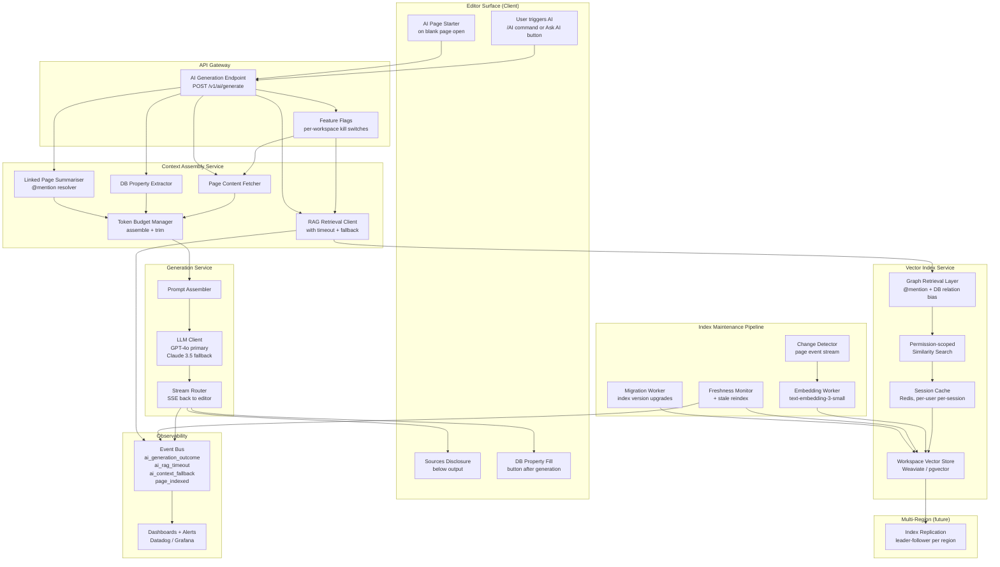
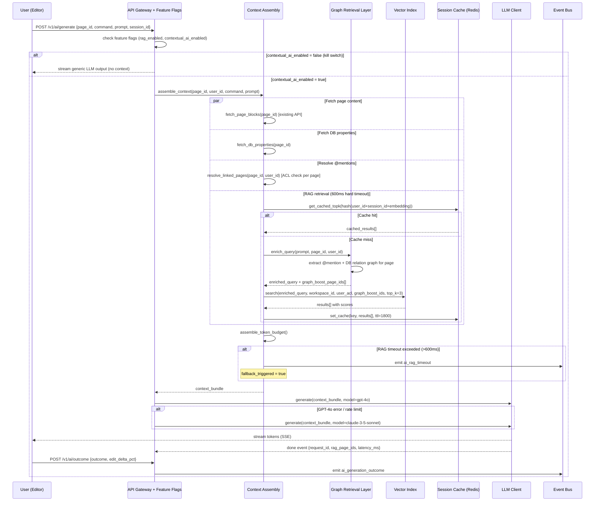

# Notion AI - Contextual Workspace Intelligence (System Architecture)

**What this explains:** the system architecture for grounding Notion AI generation in the user's own workspace content - turning a generic LLM wrapper into a workspace-aware AI that reads your pages before it writes.

**PRD reference:** https://github.com/004mayank/product-prd/blob/main/notion-ai-prd.md

**Version:** v3 - Final system design  
**Changes from v2:** Added launch gates and kill switches with per-feature granularity, full NFR table with SLOs, multi-region deployment design, cost model at scale, graph-based retrieval extension design, complete rollout sequence aligned with PRD phases, index migration strategy, and open questions resolved.

---

## Version history

| Version | Key additions |
|---|---|
| v1 | Core architecture (4 layers), data model, context assembly steps, vector index design, generation layer, index maintenance pipeline, AI surfaces, user journeys, trade-offs |
| v2 | Mermaid diagrams, API contracts, permission-scoped retrieval scaling, session cache, competitive comparison, failure modes, instrumentation |
| v3 | Launch gates, kill switches, NFR table, SLOs, multi-region design, cost model, graph-based retrieval, full rollout sequence, index migration, resolved open questions |

---

## 1) What this system is

Notion AI in its current state is a **generic LLM invocation** triggered from inside a workspace. It produces grammatically correct text with no knowledge of the workspace it lives in. Users edit the output heavily or discard it - the feedback loop that would build AI habit never forms.

This architecture specifies **Contextual Workspace Intelligence**: every AI generation request is preceded by a context assembly step that injects the current page and retrieves semantically relevant workspace pages. The LLM generates grounded output the user actually keeps.

Three pillars (from the PRD):
1. **Page Context Injection** - inject current page content, DB properties, and @mentioned pages.
2. **Workspace Context Retrieval (RAG)** - retrieve top-N relevant pages from the workspace vector index.
3. **AI Page Starter** - surface a contextual structure suggestion on blank page open.

Hard constraint: **permission model is never relaxed**. A user only receives AI output grounded in pages they have read access to.

---

## 2) Non-functional requirements (NFR table)

| Requirement | Target | Measurement | Alert threshold |
|---|---|---|---|
| AI generation P95 latency (end-to-end) | <5,000ms | Production telemetry, rolling 1h | >5,000ms for >5 min |
| Context assembly P95 latency | <800ms | Per-request span | >1,000ms triggers fallback |
| RAG retrieval P95 latency | <500ms | Per-request span | >600ms triggers RAG skip |
| AI generation availability | 99.5% | Rolling 7 days | <99.0% pages oncall |
| RAG retrieval availability | 99.0% | Rolling 7 days | <98.5% disables RAG automatically |
| Index freshness (median lag) | <24h | Per-workspace, rolling 24h | >36h triggers reindex job |
| Permission leakage incidents | 0 | Security audit + anomaly detection | Any incident - immediate RAG disable for workspace |
| Session cache hit rate | >60% | Rolling 1h per region | <40% investigate cache sizing |
| Embedding cost per workspace (10k pages) | <$2/month | Monthly billing reconciliation | >$4/month review indexing frequency |
| Data retention - generation requests | 90 days | Storage audit | None (compliance requirement) |
| Data retention - vector embeddings | Until page deleted + 30 days | Storage audit | None |
| Context bundle TTL | 300s | In-memory expiry | None |

---

## 3) System diagram



---

## 4) Generation request sequence



---

## 5) Core data model

### Page (existing Notion object, relevant fields)

```
page_id              uuid
workspace_id         uuid
created_by           user_id
permissions          ACL[]
block_count          int
token_estimate       int
updated_at           timestamp
parent_page_id       uuid?          // for graph traversal
db_id                uuid?          // if page is a DB entry
```

### VectorIndexEntry

```
entry_id             uuid
page_id              uuid
workspace_id         uuid
embedding_vector     float[1536]    // text-embedding-3-small
content_hash         sha256
token_count          int
is_archived          bool
is_deleted           bool
last_indexed_at      timestamp
page_updated_at      timestamp
index_version        int            // incremented on schema migration
graph_link_count     int            // number of @mention + DB relation links (graph signal)
```

### AIGenerationRequest

```
request_id           uuid
user_id              uuid
workspace_id         uuid
page_id              uuid
command              enum(write, summarise, draft, improve, translate, fix_spelling, page_starter)
prompt_text          string
context_bundle_id    uuid
rag_enabled          bool
graph_retrieval_used bool
fallback_triggered   bool
model                enum(gpt-4o, claude-3-5-sonnet)
status               enum(pending, generating, completed, failed, fallback)
created_at           timestamp
completed_at         timestamp
latency_ms           int
region               string         // which region served this request
```

### ContextBundle (ephemeral, TTL 300s)

```
bundle_id            uuid
request_id           uuid
current_page_tokens  int
db_properties_tokens int
linked_pages_tokens  int
rag_pages_tokens     int
total_tokens         int
rag_page_ids         uuid[]
linked_page_ids      uuid[]
graph_boosted_ids    uuid[]         // pages boosted by graph signal
fallback_reason      string?
created_at           timestamp
ttl_s                int
```

### AIGenerationOutcome

```
outcome_id           uuid
request_id           uuid
user_id              uuid
workspace_id         uuid
page_id              uuid
outcome              enum(accepted, discarded, partially_accepted)
edit_delta_pct       float
sources_opened       bool
db_properties_filled bool
time_to_outcome_ms   int
ts                   timestamp
```

### SessionIndexCache

```
cache_key            string         // hash(user_id + session_id + query_embedding)
workspace_id         uuid
user_id              uuid
results              VectorIndexEntry[]
created_at           timestamp
ttl_s                int            // 1800
```

### FeatureFlag

```
flag_id              string         // e.g. "contextual_ai_enabled", "rag_retrieval_enabled"
scope                enum(global, workspace, user)
scope_id             uuid?          // workspace_id or user_id if scoped
value                bool
updated_at           timestamp
updated_by           uuid
```

---

## 6) API contracts

### POST /v1/ai/generate

**Request**

```json
{
  "page_id": "uuid",
  "workspace_id": "uuid",
  "command": "write | summarise | draft | improve | translate | fix_spelling | page_starter",
  "prompt_text": "Draft the Problem section based on our past specs",
  "rag_enabled": true,
  "model_preference": "gpt-4o",
  "session_id": "uuid"
}
```

**Response (streaming - Server-Sent Events)**

```
event: token
data: {"token": "The", "request_id": "uuid"}

event: done
data: {
  "request_id": "uuid",
  "context_bundle_id": "uuid",
  "rag_page_ids": ["uuid1", "uuid2", "uuid3"],
  "graph_boosted": true,
  "fallback_triggered": false,
  "model_used": "gpt-4o",
  "latency_ms": 3240
}

event: error
data: {"code": "CONTEXT_ASSEMBLY_TIMEOUT", "fallback": true}
```

**Error codes**

| Code | Meaning | Client behaviour |
|---|---|---|
| `CONTEXT_ASSEMBLY_TIMEOUT` | Full assembly exceeded 800ms | Proceed with fallback context; no user-visible error |
| `RAG_TIMEOUT` | Vector store took >600ms | Fall back to page-only context; generation proceeds |
| `PERMISSION_DENIED` | User cannot read the current page | Surface: "You don't have access to this page" |
| `WORKSPACE_INDEX_NOT_READY` | Index not yet built for workspace | Proceed without RAG; log `ai_rag_timeout` |
| `RATE_LIMITED` | AI usage limit hit | Surface upgrade prompt |
| `KILL_SWITCH_ACTIVE` | Feature flag disabled for workspace | Fall back to generic LLM; no context injection |

### POST /v1/ai/outcome

```json
// Request
{
  "request_id": "uuid",
  "outcome": "accepted | discarded | partially_accepted",
  "edit_delta_pct": 14.2,
  "sources_disclosure_opened": false,
  "db_properties_populated": false,
  "time_to_outcome_ms": 8200
}

// Response
{"outcome_id": "uuid", "recorded": true}
```

### POST /v1/ai/index/search (internal)

```json
// Request
{
  "workspace_id": "uuid",
  "user_acl_bitmap": "base64_encoded_bitmap",
  "query_embedding": [0.023, -0.112],
  "graph_boost_page_ids": ["uuid1", "uuid2"],
  "graph_boost_weight": 0.2,
  "top_k": 3,
  "exclude_page_ids": ["current_page_id"],
  "include_archived": false
}

// Response
{
  "results": [
    {
      "page_id": "uuid",
      "score": 0.87,
      "graph_boosted": true,
      "token_count": 1240,
      "last_indexed_at": "ISO8601",
      "page_title": "Q2 User Research - Search",
      "excerpt": "first 200 chars"
    }
  ],
  "retrieval_latency_ms": 312,
  "index_freshness_lag_h": 3.2,
  "cache_hit": false
}
```

---

## 7) Context assembly layer

Runs on every generation request. Hard latency budget: 800ms P95. All four sub-steps run in parallel.

### Token budget

| Layer | Max tokens | Priority |
|---|---|---|
| System prompt | 800 | Fixed |
| Current page content | 3,000 | Highest |
| DB properties | 400 | High |
| @mention linked pages (3 x 400) | 1,200 | Medium |
| RAG pages (3 x 600) | 1,800 | Medium |
| User prompt | 500 | Fixed |
| Generation budget | 2,000 | Fixed |
| **Total** | **~9,700** | Within GPT-4o 128k window |

Budget overflow: drop RAG 3 -> 2 -> 1 -> 0 pages, then drop linked pages 3 -> 2 -> 1 -> 0.

### Step details

- **Page content:** truncate from bottom at 3,000 tokens; append `[page truncated]`.
- **DB properties:** formula = computed value; relation/rollup = referenced titles only.
- **@mentions:** ACL check per page; skip + silent on no permission.
- **RAG:** check session cache first; on miss, run graph enrichment then vector search; hard timeout 600ms.

---

## 8) Vector index layer

### Storage strategy by workspace size

| Workspace size | Storage | Rationale |
|---|---|---|
| <10k pages | Postgres + pgvector | No new infra; simple ops; adequate query performance |
| 10k - 500k pages | Weaviate (shared, workspace-namespaced) | ANN search performance; bitmap ACL filter native support |
| >500k pages (enterprise) | Weaviate with tiered index | Public workspace index + private pages index; reduces ACL filter size by ~80% |

### Permission-scoped retrieval

**ACL bitmap filter (v1):** encode user permissions as a bitmap computed once per session and cached in Redis. Vector store evaluates bitmap filter during ANN search - O(1) per candidate. Weaviate and Pinecone both support native bitmap filtering on vector queries.

**Tiered index (v2 for enterprise):** split into `workspace_public` namespace (pages readable by all workspace members) and `workspace_private` namespace (restricted pages). ~80% of queries hit public namespace only, reducing ACL bitmap size dramatically.

### Graph-based retrieval extension

**Problem with semantic-only retrieval:** two pages may have low semantic similarity but high relational relevance (e.g., a design spec and its linked user research doc). Semantic similarity alone misses this.

**Solution:** at query time, extract the @mention and DB relation graph for the current page. Pages that are one hop away in the graph receive a score boost (`graph_boost_weight = 0.2`) applied post-ANN before final ranking.

```
final_score = semantic_score * (1 - graph_boost_weight)
            + graph_adjacency_score * graph_boost_weight
```

Where `graph_adjacency_score = 1.0` if directly linked, `0.5` if two hops, `0.0` otherwise.

This is a lightweight addition - no new index needed, just graph traversal on existing Notion page metadata at query time.

### Session cache

- Redis; keyed by `hash(user_id + session_id + query_embedding)`.
- TTL: 1,800s.
- Invalidated on `page_updated` for any page the user has access to in this workspace.
- Hit rate target: >60% within active editing sessions.
- Reduces per-query latency by ~300ms on cache hit (skips embedding call + vector search).

### Index operations

**Upsert:** triggered when page block content changes >50 tokens. Compute `content_hash`; skip if unchanged. Embed -> upsert -> clear user session caches for workspace.

**Delete:** `is_deleted = true`; excluded from queries immediately; hard delete after 30 days.

**Permission change:** no re-index; ACL enforced at query time. Instant effect.

---

## 9) Generation layer

### Prompt structure

```
[System prompt - 800 tokens]
You are Notion AI. You have workspace context below.
Only generate content grounded in the provided context.
Do not invent facts about the workspace.
When referencing retrieved pages, mention them by name.

[Current page - up to 3,000 tokens]
Page: {title}
Path: {breadcrumb}
Content: {blocks}

[DB properties - up to 400 tokens, if DB entry]
Properties: {db_properties_json}

[Linked pages - up to 1,200 tokens]
Linked page: {title}
{extractive_summary}

[Retrieved workspace pages - up to 1,800 tokens]
Retrieved: {title} (last updated {date})
{extractive_summary}

[User request - up to 500 tokens]
{command}: {prompt_text}
```

### Model routing

1. Primary: GPT-4o
2. Fallback (on 5xx or rate limit): Claude 3.5 Sonnet
3. Both use identical prompt structure and context bundle
4. Model selection is server-side only; not user-facing in v1
5. `model_used` is logged in every `AIGenerationRequest` for cost attribution

### Streaming

Token-by-token via SSE. Required - P95 generation is 3-5s for longer outputs. Streaming preserves perceived responsiveness.

---

## 10) Index maintenance pipeline

### Change detector

Subscribes to `page_created`, `page_updated`, `page_deleted`, `page_archived` events. For updates: checks token delta; ignores <50 token changes.

### Embedding worker

Read page -> embed (`text-embedding-3-small`) -> upsert to vector store -> clear session caches for workspace.

Failure: exponential backoff, max 3 retries. On failure: emit `index_failure`; continue with stale index.

### Freshness monitor (runs every 6h)

| Condition | Action |
|---|---|
| Median index lag >24h | `index_staleness_alert`; trigger reindex batch |
| Any page lag >7 days | Force re-embed |
| >0 `index_failure` events in 24h | Page oncall |

### Index migration worker

When `index_version` is incremented (e.g., embedding model upgrade):

1. Background worker processes pages in batches (100 pages/batch).
2. Re-embeds with new model.
3. Writes new vector with `index_version = N+1`.
4. Old version kept until migration complete for that workspace.
5. Migration progress tracked per workspace; alerts on stall.

### Deleted page cleaner

Hourly. Hard deletes where `is_deleted = true` and `last_indexed_at` >30 days ago.

---

## 11) Launch gates + kill switches

### Kill switches (all pre-built before Phase 0)

| Flag | Scope | Default | Effect when disabled |
|---|---|---|---|
| `contextual_ai_enabled` | Global / workspace | true | Fall back to generic LLM (no context injection) |
| `rag_retrieval_enabled` | Global / workspace | true | Page-only context injection; no workspace retrieval |
| `page_starter_enabled` | Global / workspace | true | No page starter prompt shown |
| `db_property_fill_enabled` | Global / workspace | true | No "Fill properties" button after generation |
| `graph_retrieval_enabled` | Global | false | Use semantic-only retrieval (graph boost disabled) |

All flags evaluated at request time from `FeatureFlag` table. No restart required. Per-workspace flags override global flags.

### Launch gates (per PRD Phase plan)

**Phase 0 - Internal (week 1-2)**

- [ ] Context injection fallback rate <5% in internal dogfood
- [ ] Zero permission leakage in security penetration test
- [ ] AI generation P95 <5s in internal load test (100 RPS)
- [ ] All kill switches verified working end-to-end

**Phase 1 - 5% rollout (week 3-4)**

- [ ] No increase in workspace-level error rate vs. baseline
- [ ] RAG timeout rate <10%
- [ ] AI generation P95 <5s in production at 5% traffic
- [ ] Acceptance rate trending positive vs. control (A/B Experiment 1)

**Phase 2 - 50% rollout (week 5-8)**

- [ ] Experiment 1 primary metric statistically significant at 95% confidence, positive direction
- [ ] No guardrail metric regression (latency, error rate, trial conversion)
- [ ] Session cache hit rate >40%
- [ ] Opt-out toggle available in AI settings (Req 2.6)

**Phase 3 - 100% rollout (week 9+)**

- [ ] All experiments concluded; winning variants shipped
- [ ] 90-day churn cohort monitoring active
- [ ] Enterprise workspace admin controls live (audit log, opt-out per workspace)
- [ ] Index migration worker ready for future model upgrades

---

## 12) Multi-region deployment

### Problem

Notion serves users globally. A workspace in Europe querying the vector store in US-East adds 100-200ms round-trip latency to every RAG call - which may push retrieval over the 600ms timeout.

### v1 approach (single region)

All AI generation and vector index hosted in US-East. Acceptable for launch - global latency impact is within tolerance given the 600ms timeout and fallback design.

### v2 approach (region-aware routing)

1. Vector index replicated to EU-West and AP-Southeast using leader-follower replication.
2. Write path: all index writes go to leader (US-East); replicated async within 60s.
3. Read path: generation requests routed to nearest regional follower for RAG retrieval.
4. Replication lag <60s means retrieval is eventually consistent - acceptable given 24h index freshness SLA.
5. Session cache is regional (Redis per region); no cross-region cache sharing.

### Consistency trade-off

| Property | v1 (single region) | v2 (multi-region) |
|---|---|---|
| RAG retrieval latency | 200-400ms (US users) / 400-700ms (EU/AP) | 200-400ms globally |
| Index consistency | Immediate | Eventually consistent (~60s replication lag) |
| Cost | Lower | Higher (3x vector store + Redis) |
| Complexity | Low | Medium (replication + routing) |

---

## 13) Cost model

### Embedding cost (text-embedding-3-small: $0.02 / 1M tokens)

| Workspace size | Pages | Avg tokens/page | Initial index cost | Monthly re-index cost |
|---|---|---|---|---|
| Small (1k pages) | 1,000 | 500 | $0.01 | ~$0.03 (10% churn/mo) |
| Medium (10k pages) | 10,000 | 800 | $0.16 | ~$0.50 |
| Large (100k pages) | 100,000 | 1,000 | $2.00 | ~$6.00 |
| Enterprise (500k pages) | 500,000 | 1,200 | $12.00 | ~$30.00 |

### Generation cost (GPT-4o: ~$5/1M input tokens, ~$15/1M output tokens)

| Context size | Avg input tokens | Avg output tokens | Cost per generation |
|---|---|---|---|
| Page-only context | 4,300 | 600 | ~$0.030 |
| Full context (page + RAG) | 9,700 | 800 | ~$0.060 |

At 10M generations/month (inferred scale for Notion's user base): ~$600k/month generation cost at full context. The $8/user/month AI add-on must cover this plus margin - requires careful token budget management and caching to stay unit-economics positive.

**Cost levers:**
- Session cache reduces embedding calls by >60% - biggest lever.
- Extractive summarisation of RAG pages (not full injection) reduces input tokens by ~40% vs. raw injection.
- Context budget caps prevent runaway costs on very large pages.

---

## 14) Failure modes + mitigations

| Failure | Detection | Mitigation | Degraded state |
|---|---|---|---|
| Vector store unavailable | `ai_rag_timeout` spike; health check fails | Circuit breaker; auto-disable RAG via `rag_retrieval_enabled = false`; re-enable on recovery | Page-only context; no user error shown |
| Embedding API down (OpenAI) | 5xx on embed call; timeout | Retry 3x; fall back to BM25 lexical search for RAG | Lower quality retrieval; maintains some context value |
| Index severely stale (>7 days) | Freshness monitor alert | Force full reindex; page oncall | RAG retrieves stale content; Sources shows `last_updated` |
| Permission leakage | Security audit; anomaly detection | ACL at query time; pentest pre-launch; regression suite on every deploy | Zero tolerance: disable RAG immediately for affected workspace |
| Context assembly >800ms | P95 latency alert | Reduce RAG top-K; fallback to page-only on timeout | Generation proceeds; lower quality |
| LLM empty/malformed output | Empty stream; parse error | Retry once at temperature=0; show "Try again" to user | User sees retry prompt; no silent failure |
| Session cache stale mid-session | `page_updated` event during session | Invalidate user session cache on `page_updated` | Next query re-fetches; minor latency increase |
| Index migration stall | Migration worker heartbeat; % complete alert | Retry migration batch; old version serves until migration complete | Stale embeddings for in-progress pages |
| GPT-4o rate limit | 429 from OpenAI | Route to Claude 3.5 Sonnet fallback | Slightly different output characteristics; transparent to user |

---

## 15) Competitive architecture comparison

| Product | Context approach | RAG mechanism | Permission model | Key difference vs. Notion |
|---|---|---|---|---|
| **Coda AI** | Current doc + Pack data sources | Doc-scoped only; no cross-doc retrieval | Doc-level permissions | No workspace-wide retrieval; narrower context |
| **Confluence AI** | Atlassian knowledge graph (Confluence + Jira) | Cross-space search via Atlassian index | Space + page level ACL | Cross-product graph (Jira); enterprise ACL maturity |
| **Google Workspace Duet AI** | Drive + Gmail + Calendar | Google internal search index | Google Workspace ACL | Broader surface (email + calendar); not doc-native |
| **Notion AI (this spec)** | Current page + @mentions + workspace-wide RAG + graph boost | Per-workspace vector index; permission-scoped at query time; graph-enriched | Per-page ACL (most granular) | Richest page graph; most granular ACL; inline generation; graph retrieval advantage |

**Structural moat:** Notion's page graph (pages linked via @mentions and DB relations) is a first-class retrieval signal no competitor replicates. Confluence has Jira links but no equivalent of Notion's flexible @mention graph across docs, databases, and tasks. This graph becomes more valuable over time as workspaces accumulate more cross-links.

---

## 16) Observability + instrumentation

### Dashboards

| Dashboard | Key metrics | Alert threshold |
|---|---|---|
| AI Generation Health | Request rate, P50/P95/P99 latency, error rate by command | P95 >5s; error rate >1% |
| RAG Pipeline | Retrieval latency, timeout rate, cache hit rate, fallback rate | Timeout >10%; cache hit <40% |
| Index Freshness | Median lag per workspace, stale workspace % | Median lag >24h; stale workspaces >5% |
| Outcome Quality | Acceptance rate, edit delta, discard rate | Acceptance rate <20% |
| Cost | Embedding cost/day, generation cost/day, cost per accepted output | Generation cost >$25k/day |

### Instrumentation events

```json
// ai_generation_outcome
{
  "event": "ai_generation_outcome",
  "request_id": "uuid",
  "user_id": "uuid",
  "workspace_id": "uuid",
  "page_id": "uuid",
  "command": "write | summarise | draft | improve | translate | page_starter",
  "outcome": "accepted | discarded | partially_accepted",
  "context_sources_used": ["page_content", "db_properties", "linked_pages", "rag_retrieval"],
  "retrieved_page_count": 3,
  "graph_retrieval_used": true,
  "fallback_triggered": false,
  "model_used": "gpt-4o",
  "edit_delta_pct": 14.2,
  "sources_disclosure_opened": false,
  "db_properties_populated": false,
  "total_latency_ms": 3240,
  "context_assembly_latency_ms": 680,
  "rag_retrieval_latency_ms": 290,
  "generation_latency_ms": 2270,
  "region": "us-east-1",
  "ts": "ISO8601"
}

// ai_rag_timeout
{
  "event": "ai_rag_timeout",
  "user_id": "uuid",
  "workspace_id": "uuid",
  "page_id": "uuid",
  "retrieval_duration_ms": 623,
  "fallback_applied": true,
  "region": "us-east-1",
  "ts": "ISO8601"
}

// page_indexed
{
  "event": "page_indexed",
  "page_id": "uuid",
  "workspace_id": "uuid",
  "token_count": 1240,
  "embedding_latency_ms": 180,
  "index_lag_ms": 14400000,
  "index_version": 2,
  "ts": "ISO8601"
}

// kill_switch_triggered
{
  "event": "kill_switch_triggered",
  "flag_id": "rag_retrieval_enabled",
  "scope": "workspace",
  "scope_id": "uuid",
  "triggered_by": "auto | manual",
  "reason": "permission_leakage | latency_breach | manual_disable",
  "ts": "ISO8601"
}
```

---

## 17) Security + privacy

### Permission enforcement (non-negotiable invariants)

- ACL checked at context assembly time per page, not at index time.
- RAG retrieval: user ACL bitmap passed to vector store; results filtered to user-readable pages only.
- No cross-workspace retrieval under any circumstances.
- `ContextBundle` ephemeral: TTL 300s; not persisted to long-term storage.
- Raw page content never logged in generation requests - `page_id` and token counts only.
- `embedding_vector` is not reversible to original content.

### Audit trail

- Every `AIGenerationRequest` persisted 90 days.
- Every `AIGenerationOutcome` persisted 90 days.
- Workspace admins can export full AI activity log (enterprise compliance).
- `kill_switch_triggered` events are immutable audit log entries.

### Pre-launch security checklist

- [ ] Penetration test: cross-workspace and cross-user permission isolation in vector store queries.
- [ ] Regression test: guest user cannot receive output grounded in pages they cannot read.
- [ ] Load test: ACL bitmap filter performance at enterprise scale (500k pages, 300k ACL entries).
- [ ] Red team: attempt to extract restricted page content via prompt injection in `prompt_text`.
- [ ] Automated regression suite runs on every production deploy; gates deployment on pass.

---

## 18) Open questions - resolved

| Question | Resolution |
|---|---|
| Single vector store vs. per-workspace | Shared Weaviate with workspace-namespaced collections for v1; tiered index for enterprise in v2. Cost and ops complexity are the deciding factors. |
| Embedding model: text-embedding-3-small vs. large | `text-embedding-3-small` chosen for v1: 5x cheaper, adequate semantic quality for workspace-scale retrieval. Revisit if acceptance rate plateaus. |
| Graph retrieval: query-time boost vs. index-time graph embedding | Query-time boost chosen: no new index infrastructure; graph adjacency computed from page metadata at query time; simpler to iterate on boost weight. |
| Multi-region: v1 or v2 | Single region for v1; multi-region in v2 when global latency data confirms timeout impact on non-US users. |
| Index migration on model upgrade | Background migration worker maintaining dual-version entries until migration complete; no downtime, no degradation during migration. |
| Cost per accepted generation | ~$0.06 at full context; ~$0.03 at page-only context. At $8/user/month add-on pricing, unit economics are positive if average user triggers <100 accepted generations/month. Session cache is the primary cost lever. |
