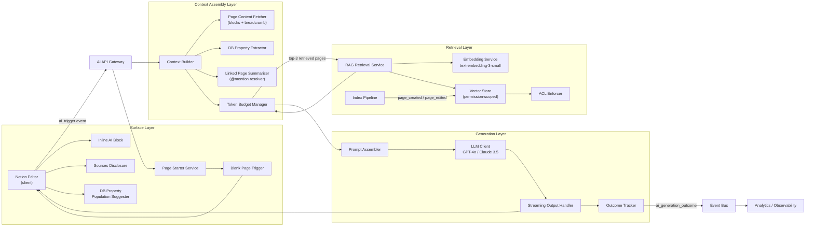
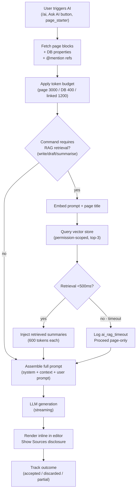

# Notion AI: Contextual Workspace Intelligence (System Architecture v1)

**What this explains:** a production-grade system architecture for grounding Notion AI responses in the user's own workspace, making AI output specific, relevant, and worth keeping - by treating contextual AI generation as a **retrieval-augmented generation problem anchored to a permission-scoped knowledge graph**.

**PRD reference:** https://github.com/004mayank/product-prd/blob/main/notion-ai-prd.md

---

**Version:** v1 - Initial system design
**Changes from v0:** First version - core architecture covering the three pillars (context injection, workspace RAG, page starter), data model, and system diagram.

| Version | Key additions |
|---|---|
| v1 | Core architecture: context builder, vector store, generation service, page starter service. Mermaid system diagram. Data model (GenerationRequest, VectorIndexEntry, GenerationOutcome). Basic pipeline flows. |

---

## 1) Problem recap (the bottleneck)

The AI generation loop breaks at the edit step:

```
Prompt -> Generate -> [Heavy edit or discard] -> Done (manually)
```

Root cause: every Notion AI response starts from zero. No page history, no team vocabulary, no linked database schema. The result is grammatically correct but contextually hollow output.

The system must solve three failure modes at generation time:
- **No page context:** AI does not read the current page before generating
- **No workspace context:** AI has no access to related pages, prior specs, or team norms
- **No structural context:** AI does not know what a blank page in this section should look like

Target outcomes (from PRD v3):
- AI response acceptance rate: ~25% -> 45% (output kept with <30% character edit)
- AI sessions per user per week: ~1.2 -> 2.5
- Page starter acceptance rate: >35% on new blank pages

---

## 2) Design principles

1. **Permission is a hard constraint**: workspace retrieval is always scoped to user-readable pages. No ACL bypass at any layer.
2. **Context is layered by priority**: page content > DB properties > linked pages > workspace retrieval. Token budget is consumed in priority order.
3. **Fail gracefully, degrade fully**: timeouts at any context layer fall back to the next available layer; generation always proceeds.
4. **Latency budget is sacred**: context injection adds <800ms P95; RAG retrieval adds <500ms P95; total generation target is <5s P95.
5. **Attribution is visible**: every RAG-grounded response shows a Sources disclosure. Users can trace why the AI said what it said.
6. **Opt-out, not opt-in**: workspace retrieval is on by default for existing subscribers. Privacy controls are user-controlled per workspace.

---

## 3) High-level architecture

Four layers:

1. **Context Assembly Layer**: collects and prioritises page content, DB properties, linked page summaries, and RAG-retrieved pages within the token budget.
2. **Retrieval Layer**: workspace vector index with permission-scoped semantic search.
3. **Generation Layer**: prompt assembly, LLM call, streaming output, outcome tracking.
4. **Surface Layer**: inline AI block, page starter, Sources disclosure, DB property population.

### Mermaid: full system diagram



### Mermaid: generation request flow



---

## 4) Core data model

### GenerationRequest
```
request_id          uuid
user_id             uuid
workspace_id        uuid
page_id             uuid
command             enum(write | summarise | draft | improve | translate | fix_spelling | page_starter)
prompt_text         string
context_sources     string[]            // ["page_content", "db_properties", "linked_pages", "rag_retrieval"]
page_token_count    int
db_properties       json                // key-value pairs of property name -> value
linked_page_ids     uuid[]              // @mentioned pages resolved
retrieved_page_ids  uuid[]              // top-3 from RAG
context_token_total int
rag_enabled         bool
fallback_triggered  bool
model               enum(gpt-4o | claude-3-5-sonnet)
status              enum(pending | generating | completed | failed | fallback)
created_at          timestamp
completed_at        timestamp
latency_ms          int
```

### GenerationOutcome
```
outcome_id                  uuid
request_id                  uuid
user_id                     uuid
workspace_id                uuid
page_id                     uuid
outcome                     enum(accepted | discarded | partially_accepted)
edit_delta_pct              float       // character-level edit ratio; <30% = accepted
time_to_outcome_ms          int
sources_disclosure_opened   bool
db_properties_populated     bool
ts                          timestamp
```

### VectorIndexEntry
```
page_id             uuid
workspace_id        uuid
embedding_vector    float[1536]         // text-embedding-3-small output
content_hash        sha256              // used to skip re-embedding unchanged content
token_count         int
is_archived         bool
is_deleted          bool
last_indexed_at     timestamp
page_updated_at     timestamp
index_version       int
```

### PageContextSnapshot (ephemeral, per request)
```
page_id             uuid
title               string
breadcrumb          string[]
block_texts         string[]            // ordered; truncated to 3,000 tokens
db_properties       {name: string, type: PropertyType, value: any}[]
linked_summaries    {page_id: uuid, title: string, summary: string}[]
token_total         int
truncated           bool
```

---

## 5) Context Assembly Layer

### 5.1 Token budget enforcement

All context is assembled by the **Token Budget Manager** before prompt assembly:

| Layer | Max tokens | Priority | Fallback if unavailable |
|---|---|---|---|
| System prompt + instructions | 800 | Fixed | n/a |
| Current page blocks | 3,000 | Highest | Truncate from bottom; append `[page truncated]` |
| DB properties | 400 | High | Skip silently; log missing |
| Linked pages via @mention (3 x 400) | 1,200 | Medium | Skip pages with no read permission |
| RAG retrieved pages (3 x 600) | 1,800 | Medium | Skip on timeout; log `ai_rag_timeout` |
| User prompt | 500 | Fixed | n/a |
| Generation output budget | 2,000 | Fixed | n/a |
| **Total** | **~9,700** | Within GPT-4o 128k / Claude 3.5 200k window |

### 5.2 Page Content Fetcher

- Fetches all block content from the Notion Block API
- Serialises to ordered plain text (headings, bullets, paragraphs; tables as markdown)
- Truncates from the bottom to preserve intro and most-recent content within 3,000 token limit
- Appends `[page truncated]` marker if truncated

### 5.3 DB Property Extractor

- Detects if the current page is a database entry
- Extracts property name, type, and current value as structured JSON
- Formula properties: injects computed value, not formula expression
- Empty properties: injected as `null` (explicitly signals to LLM what is missing)

### 5.4 Linked Page Summariser

- Resolves up to 3 `@mention` references on the current page
- Verifies read permission for requesting user before fetching each page
- If page has <200 tokens: injects full content
- If page has >200 tokens: extractive summarisation to 400 tokens
- Permission denied: skips silently - does not expose page existence to LLM

---

## 6) Retrieval Layer

### 6.1 Workspace Vector Index

Built and maintained as an incremental, event-driven pipeline:

```
page_created  -|
page_edited   -|-> Index Pipeline -> Embed (text-embedding-3-small) -> Upsert VectorIndexEntry
page_deleted  -|-> Mark is_deleted=true, remove from query scope
page_archived -|-> Mark is_archived=true, retain in index (for historical context)
```

**Indexing rules:**
- Skip re-embedding if `content_hash` unchanged (edit did not materially change content)
- Target: index updated within 24h of creation or material edit (>50 token change)
- Deleted pages removed from query scope within 1h

### 6.2 ACL Enforcer

Permission-scoped retrieval is a hard constraint, not a best-effort filter:
- Every vector query is pre-filtered by workspace ACL at query time
- Guest users: scoped to their specific granted pages only
- No result can be returned for a page the requesting user cannot read
- ACL check happens inside the vector store query, not as a post-filter (prevents timing side-channels)

### 6.3 RAG Retrieval Service

1. Embed `concat(prompt_text, page_title)` using `text-embedding-3-small`
2. Query vector store for top-3 by cosine similarity, excluding current page
3. Hard timeout: 600ms; if exceeded, emit `ai_rag_timeout` and proceed page-only
4. Extractive summarise each result to 600 tokens
5. Return list of `{page_id, title, summary, similarity_score}` to Context Assembly Layer

---

## 7) Generation Layer

### 7.1 Prompt Assembler

Constructs the final prompt from assembled context in slot order:
1. System prompt (role, output format, workspace context preamble)
2. Current page context (title + breadcrumb + blocks)
3. DB properties (if present)
4. Linked page summaries (with `[Source: Page Title]` attribution)
5. RAG retrieved page summaries (with `[Workspace context: Page Title]` attribution)
6. User prompt

### 7.2 LLM Client

- Primary model: GPT-4o
- Fallback model: Claude 3.5 Sonnet (on GPT-4o 5xx or rate-limit errors)
- All calls are streaming; first token target: <1.5s
- Circuit breaker: if both models return errors for >60s, serve `ai_generation_failed` error state

### 7.3 Outcome Tracker

Tracks the user's decision on the generated output:
- `accepted`: user keeps content with <30% character-level edit
- `partially_accepted`: user keeps content with 30-70% character-level edit
- `discarded`: user clears block or hits regenerate without editing

Edit delta measured by comparing block content at generation completion vs. first subsequent commit with focus moved off the block.

---

## 8) Surface Layer

### 8.1 Inline AI Block

Triggered by:
- `/ai` or `/ask ai` slash command
- "Ask AI" button on empty lines
- Keyboard shortcut (Cmd+J)

States: `idle` -> `context_assembling` -> `generating` (streaming) -> `completed` | `failed`

Shows a shimmer/loading indicator during context assembly (<800ms P95) before streaming starts.

### 8.2 Page Starter Service

Triggered on: blank page load (0 blocks, AI subscriber).

Logic:
1. Check: page has a title entered? If not, show "What will this page be about?" prompt first
2. Fetch parent section type (meeting notes / projects / wiki / personal)
3. Fetch 3 most recently created pages in same section
4. Generate heading structure (3-7 headings) using page-only context (no RAG needed)
5. Inject heading blocks only - no content presumed

Dismiss states:
- User accepts: headings inserted; `ai_page_starter_accepted` fired
- User dismisses: persisted as `ai_starter_dismissed=true` on page; `ai_page_starter_dismissed` fired
- Auto-dismiss: after 10s without interaction; user typing triggers immediate auto-dismiss

### 8.3 Sources Disclosure

Shown below every generation that used RAG-retrieved pages:
- Collapsed by default
- Shows page titles + links for each retrieved page
- Opens on click; renders within 200ms
- Not shown if 0 RAG pages were used

### 8.4 DB Property Population Suggester

Shown after generation on DB entry pages if:
- 2+ properties are empty
- AI output contains candidate values for those properties

Suggests text, date, and select properties only. Multi-select and relation: never auto-populated. User must click to confirm each suggestion.

---

## 9) Key event flows

### 9.1 Write command (full RAG path - happy path)

```
User triggers /ai -> AI API Gateway receives request
AI API Gateway -> Page Content Fetcher: fetch blocks for page_id (user_id scoped)
AI API Gateway -> DB Property Extractor: fetch properties if DB entry
AI API Gateway -> Linked Page Summariser: resolve @mentions, verify permissions
Token Budget Manager: assemble page + DB + linked context (5,200 tokens used)
Token Budget Manager -> RAG Retrieval Service: retrieve top-3 (1,800 token budget)
RAG Retrieval Service -> Embedding Service: embed prompt + page title
Embedding Service -> Vector Store: cosine similarity query (permission-scoped, workspace_id + user_id)
Vector Store -> RAG Retrieval Service: top-3 pages (within 500ms)
RAG Retrieval Service -> Token Budget Manager: 3 x 600 token summaries injected
Prompt Assembler: assemble full prompt (9,200 tokens)
LLM Client: stream generation to editor (GPT-4o)
Editor: renders streaming blocks; shows Sources disclosure (3 pages)
User: accepts output -> Outcome Tracker records accepted, edit_delta_pct=18.5
Event Bus: ai_generation_outcome fired
```

### 9.2 Write command - RAG timeout (degraded path)

```
[Context assembly as above]
RAG Retrieval Service: query exceeds 600ms
RAG Retrieval Service -> Event Bus: ai_rag_timeout (retrieval_duration_ms=623)
RAG Retrieval Service -> Token Budget Manager: return empty; fallback_triggered=true
Prompt Assembler: assemble prompt with page-only context (7,400 tokens)
LLM Client: stream generation (no RAG context)
Editor: renders output; no Sources disclosure shown (0 RAG pages)
GenerationRequest.fallback_triggered = true
```

### 9.3 Page starter (blank page)

```
User creates new blank page in Projects section
Blank Page Trigger: fires ai_blank_page_detected (page_id, parent_section=projects)
Page Starter Service: fetches 3 most recent pages in Projects section
Page Starter Service: reads page title (entered by user)
Page Starter Service: generates heading structure (title-only context, no RAG)
Editor: renders "Start with AI" prompt with generated headings preview
User accepts: heading blocks inserted; ai_page_starter_accepted fired
```

---

## 10) Observability

### Primary funnel

```
ai_session_started
  -> ai_generation_completed (streaming finished)
    -> ai_generation_outcome (accepted | partially_accepted | discarded)
```

Track p50/p90 at each step. Segment by: `command`, `context_sources_used`, `rag_enabled`, `fallback_triggered`.

### Key metrics

| Metric | Type | Target |
|---|---|---|
| `ai_generation_outcome.outcome = accepted` rate | Primary | 45% (from ~25% baseline) |
| `ai_session_started` per user per week | Primary | 2.5 (from ~1.2 baseline) |
| `ai_page_starter_accepted` rate | Primary | >35% on new blank pages |
| `ai_generation_latency_ms` P95 | Guardrail | <5,000ms |
| `rag_retrieval_latency_ms` P95 | Guardrail | <500ms |
| `ai_context_fallback` rate | Guardrail | <5% of sessions |
| `ai_rag_timeout` rate | Guardrail | <3% of RAG-eligible requests |
| Permission leakage incidents | Guardrail | Zero |

---

## 11) Trade-offs

| Decision | Optimised for | Sacrificed | Why |
|---|---|---|---|
| Opt-out retrieval (on by default for existing subscribers) | Adoption; removes friction for existing users | New user trust (opt-in gives more control) | Renewal cohort needs immediate utility; cold-start is the enemy of retention |
| Hard 600ms RAG timeout with fallback | Latency SLO; user experience | Retrieval quality on slow queries | A 5s+ generation with perfect RAG is worse than a 3s generation with page-only context |
| Truncate from bottom on large pages | Recency (most recent content is often most relevant) | Full document coverage | Meeting notes and live docs are updated at the bottom; users expect AI to know the latest |
| Extractive summarisation for retrieved pages (not full content) | Token budget; cost | Nuanced cross-page context | 600 tokens captures the relevant substance; full pages would crowd out primary context |
| Permission check inside vector query (not post-filter) | Security (no timing side-channels) | Marginal query complexity | Post-filter ACL allows the query to return unauthorised results then discard them - this is a security anti-pattern |
| Heading-only page starter (no content) | Reduces risk of presumptuous output | Immediate content lift | Inserting content before the user has written anything risks replacing intent; structure is safer and still reduces blank-page anxiety |

---

## 12) Open questions

1. **Index freshness for active sessions:** pages edited in the current editing session need near-real-time index updates for RAG to be useful. The 24h SLA is insufficient for in-session retrieval. A session-scoped cache refresh is specified in the PRD but the architecture needs to decide: push invalidation on edit save, or polling?

2. **Embedding model versioning:** when `text-embedding-3-small` is superseded, the entire vector index must be re-embedded. What is the re-embedding strategy - live migration with dual index, or downtime window?

3. **Cross-workspace retrieval:** Notion users with multiple workspaces cannot currently retrieve context across workspace boundaries. Is cross-workspace retrieval in scope for future versions, and how does the ACL model change?

4. **Page starter cold start:** new workspaces with <3 pages in a section have insufficient sibling context. Fall back to title-only inference is specified, but what threshold triggers a request to the user for additional context (e.g., "What kind of team uses this workspace?")?

5. **Generation model routing:** the PRD specifies GPT-4o primary and Claude 3.5 Sonnet fallback. Should routing be deterministic (failover only) or probabilistic (traffic split for quality comparison)?
