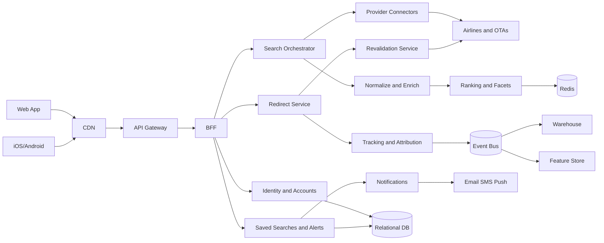
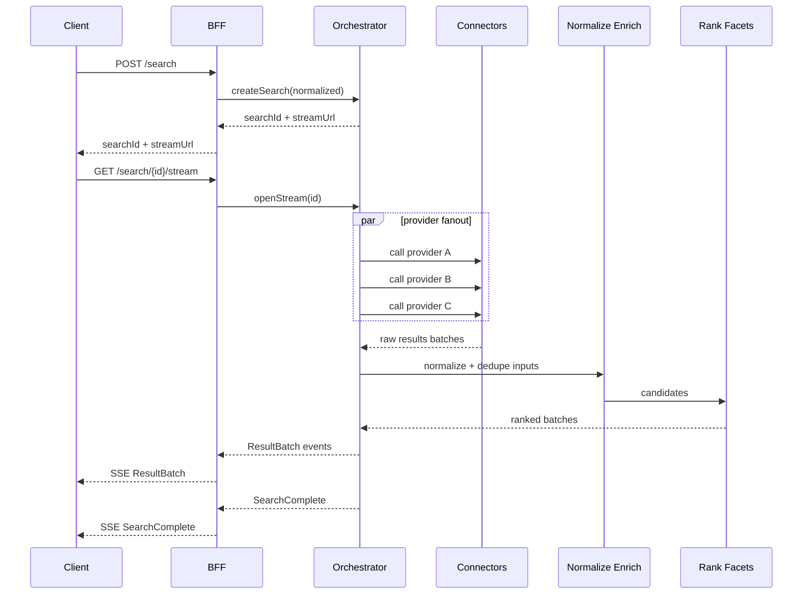
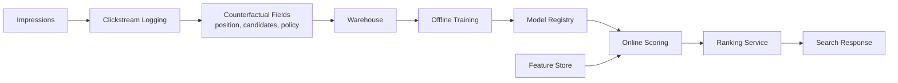
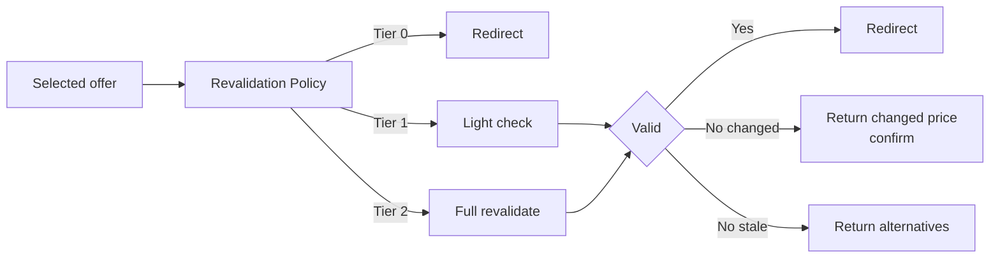
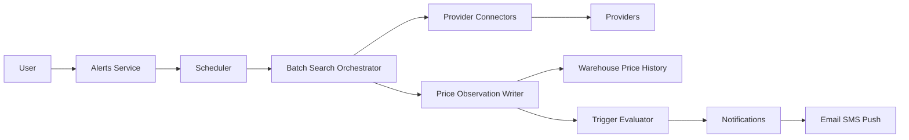

<p align="center">
  
</p>


# Skyscanner - System Architecture

*(Flights-first metasearch, with Accounts + Price Alerts; V4 deepens ranking/quality signals, real‑time pricing freshness, and platform reliability/analytics patterns.)*

**Product:** Skyscanner 
**Audience:** Product Managers / Builders / AI-curious users  
**PRD:** https://github.com/004mayank/product-prd/blob/main/skyscanner-flight-search-to-booking-prd.md

---

## 1) Goals & scope

### In-scope
- Flight search (metasearch): query → aggregated results → filters/sort
- Redirect/deeplink to airline/OTA for booking (no checkout)
- User accounts + preferences
- Saved searches + price alerts (create, manage, notify)
- Analytics + attribution for search and clickouts

### Out-of-scope (for now)
- Full booking/PNR management
- Hotels/cars/packages

---

## 2) System overview (components)

### Clients
- Web app
- iOS/Android apps

### Edge
- CDN + edge caching
- WAF + bot protection
- TLS termination

### API tier
- API Gateway (auth, routing, rate limits, request validation)
- BFF (one or split Web/Mobile)
- Feature flags + experimentation

### Core domain services

1) **Identity & Accounts Service**
- signup/login, sessions, OAuth linking
- user profile: locale/currency, notification prefs, consent

2) **Search Orchestrator**
- owns `searchId` + lifecycle and overall time budget
- chooses providers based on query type, past yield/latency, and cost budgets
- aggregates + streams incremental results

3) **Provider Connectors (Integration Layer)**
- adapter per GDS/NDC/OTA/airline
- throttling, retries, circuit breakers, idempotency
- parsing + normalization pre-checks

4) **Offer Normalization & Enrichment**
- canonical `Itinerary`/`Offer` schema
- currency conversion, baggage/fare rules normalization
- dedupe + itinerary grouping

5) **Ranking, Sorting & Facets**
- Best/Cheapest/Fastest
- consistent facet model, stable pagination/cursors

6) **Pricing / Revalidation Service (optional)**
- freshness check before redirect (where allowed)
- handles “changed/stale” outcomes and alternatives

7) **Redirect/Deeplink Service**
- signed click tokens, affiliate params, replay protection
- click event emission + fraud features

8) **Saved Searches & Alerts Service**
- saved search definitions
- alert rules (threshold/direction/frequency)

9) **Notifications Service**
- email/SMS/push providers
- templating, retries, dedupe, unsubscribe

10) **Tracking & Attribution**
- search/click/alert events
- attribution stitching + partner reporting feeds

### Platform/data
- **Redis**: search sessions + partial results (short TTL), hot reference caches
- **Relational DB** (Postgres/MySQL): users, saved searches, alerts, preferences
- **Event bus/stream** (Kafka/PubSub): clickstream, alert triggers, provider health, quality events
- **Warehouse/lake** (BigQuery/Snowflake/S3): analytics + price history
- Observability: logs/metrics/traces, SLO dashboards

### 2.1 System diagram (GitHub Mermaid)


---

## 3) Search lifecycle & API contracts 

### 3.1 Canonical request normalization
Before any provider calls, Orchestrator performs:
- airport/city resolution + timezone-safe date handling
- passenger/cabin normalization
- locale/currency normalization + FX strategy
- policy enforcement: max date range, max pax, bot score threshold

Produces a **NormalizedQuery** (stable hashable form):
- `queryHash = sha256(normalizedQueryJson)`

### 3.2 Create search
`POST /search`
- Request: route, dates, pax, cabin, locale/currency, flexibility, filters
- Response: `{ searchId, streamUrl, expiresAt }`

**Idempotency**
- Support `Idempotency-Key` header.
- If the same key is reused (within TTL), return the same `searchId`.

**SearchSession**
- persisted in Redis: `{ searchId, queryHash, createdAt, status, budgets, providerPlan, expiresAt }`

### 3.3 State machine
States (example):
- `CREATED` → `RUNNING` → `PARTIAL` → `COMPLETE`
- terminal variants: `CANCELLED`, `EXPIRED`, `FAILED`

Transitions:
- `RUNNING` emits incremental batches.
- `PARTIAL` is acceptable end-state when time budget is exceeded.

### 3.4 Streaming results (recommended)
`GET /search/{searchId}/stream` via **SSE** (or WebSocket)

Event types:
- `SearchStarted`
- `ProviderStatus` (started/timeout/error/throttled)
- `ResultBatch` (delta offers/itineraries)
- `SearchComplete` (final stats + completeness)

Fallback polling:
`GET /search/{searchId}/results?cursor=...`

### 3.4.1 Search sequence (create → fan-out → stream)


### 3.5 Pagination & stability guarantees
To reduce payload and make cursors stable:
- paginate on **Itinerary groups** (`OfferGroup`) not raw offers
- cursor references a deterministic ordering key:
  - `(sortKey, groupId)` where `sortKey` is computed from normalized fields

### 3.6 Cancellation
`POST /search/{searchId}/cancel`
- stops new provider fan-out
- keeps already-returned results until TTL expiry

---

## 4) Provider fan-out strategy & backpressure

### 4.1 Budgeting
- global time budget: e.g., 8–12s
- per-provider timeouts: e.g., 1–4s (tiered by provider latency)
- cost budget: max calls/search, max QPS/provider, max $/search proxy

### 4.2 Adaptive fan-out (progressive disclosure)
Start with a **core provider set** and expand if:
- yield is low
- query is complex (multi-leg/long-haul)
- user explicitly requests “show more” / scrolls

### 4.3 Backpressure & overload behavior
- queue-based connector execution with bounded concurrency
- when overloaded:
  - shed non-core providers first
  - degrade to cached/summary responses where allowed
  - return `PARTIAL` with clear completeness metadata

---

## 5) Offer quality pipeline 

### 5.1 Canonical schemas (contracts)
Define explicit versions:
- `ItinerarySchema vX`
- `OfferSchema vX`
- `FareRulesSchema vX`

Enforce at boundaries:
- connectors validate provider payload → internal contract
- Orchestrator validates internal contract → API response contract

### 5.2 Dedupe + grouping
Core idea: one “itinerary identity” per unique trip.
- compute `itinKey` from normalized segments, times (rounded rules), carriers, cabin
- group offers by `itinKey`

`OfferGroup` contains:
- best offer (by price + quality)
- alternates (same itinerary, different provider)

### 5.3 Quality / confidence signals
Maintain per-offer signals:
- provider reliability score (timeouts, change rate)
- freshness score (time since fetched)
- rules completeness (baggage/fare rules coverage)
- anomaly score (very low price, suspicious taxes)

Use these in ranking and revalidation decisions.

### 5.4 Ranking & personalization 
Ranking typically produces multiple “views” (Best/Cheapest/Fastest) while keeping pagination stable.

**Approach**
- Stage 1: hard filters + itinerary grouping (remove invalid/duplicate)
- Stage 2: candidate scoring (hand-tuned + learned)
- Stage 3: business rules (sponsored constraints, partner exclusions, safety)

**Learning-to-rank (LTR)**
- Offline training on logged impressions/clickouts/conversions
- Counterfactual logging (position + alternatives) to reduce bias
- Feature store / online feature serving for:
  - price competitiveness vs historical baseline
  - provider reliability + change rate
  - itinerary quality (layovers, airport changes, red-eyes)
  - user context (locale, device, prior behavior) with strict consent

### 5.4.1 LTR pipeline (offline + online)


**Guardrails**
- Never rank “too good to be true” offers above a confidence threshold without revalidation
- Explainable contributions for “Best” (price + duration + stops + reliability)
- Monitoring for metric regressions, partner mix drift, and fairness across segments

---

## 6) Redirect & revalidation patterns

### 6.1 Redirect
`POST /redirect` with `{ searchId, offerId }`
- validate offer existence + TTL
- optionally revalidate
- issue signed redirect token (short TTL) + affiliate params
- emit click event + fraud features
- return 302

### 6.2 Revalidation policy
Revalidate when:
- offer near TTL
- provider has high change rate
- anomaly score is high

#### 6.2.1 Freshness tiers (cost-aware)
A practical approach is to apply revalidation selectively:
- **Tier 0**: no revalidation (trusted providers, long TTL, low change rate)
- **Tier 1**: lightweight recheck (head call, cached quote, limited fields)
- **Tier 2**: full revalidation (fresh price + fare rules)



Outcomes:
- `VALID` → redirect
- `CHANGED` → return updated price + ask user to confirm
- `STALE` → return next-best alternatives

**Idempotency**
- `POST /redirect` accepts `Idempotency-Key` to prevent duplicate click events.

---

## 7) Price alerts pipeline 

### 7.0 Alerts architecture (batch search + price history)


### 7.1 Batch search mode
Alerts run searches in a **batch mode**:
- stricter cost budgets
- fewer providers by default
- consistent schedule jitter + dedupe

### 7.2 Observation model
Store:
- `minPrice`, `medianPrice`, `sampleCount`
- provider mix metadata
- confidence score

### 7.3 Triggering + notification dedupe
- idempotency key: `(alertId, timeBucket, triggerType)`
- per-channel retry with dedupe store

---

## 8) Data model (conceptual)

### Identity
- `User(id, email/phone, createdAt, locale, currency, consentFlags)`
- `AuthSession(userId, deviceId, refreshTokenHash, expiresAt)`
- `NotificationPreference(userId, channels, quietHours, frequency)`

### Search / offers
- `SearchSession(searchId, queryHash, createdAt, status, expiresAt)`
- `Itinerary(itinId, legs[], segments[], carriers, duration, stops)`
- `Offer(offerId, itinId, providerId, price, currency, fareRules, baggage, ttl, qualitySignals)`
- `OfferGroup(groupId, itinKey, bestOfferId, alternateOfferIds[])`

### Alerts
- `SavedSearch(id, userId, normalizedQuery, createdAt)`
- `PriceAlert(id, userId, savedSearchId, rule, schedule, status)`
- `PriceObservation(savedSearchId, observedAt, minPrice, medianPrice, sampleCount, meta)`

---

## 9) Caching, retention & governance

### 9.1 Caching
- Redis search state + partial results (TTL minutes)
  - keys like: `search:{searchId}:meta`, `search:{searchId}:batches`, `search:{searchId}:cursor:{cursor}`
- reference data (airports/airlines/FX) longer TTL
  - versioned keys like: `ref:airports:v{n}`, `ref:fx:{base}:{quote}:{day}`
- provider response caching: very short TTL, provider-specific, respect terms
  - safest pattern is caching **normalized** provider responses by `(providerId, queryHash, paramsHash)` with TTL seconds

### 9.2 Data retention (principles)
- minimize PII in event streams
- set explicit retention:
  - raw clickstream: short/medium
  - aggregated metrics: long
  - alert observations: long (for trends)

### 9.3 Auditability
- audit trails for:
  - consent changes
  - notification sends/unsubscribes
  - partner reporting exports

---

## 10) Security, privacy, abuse & fraud

- Bot mitigation on `POST /search` (cost amplification) and `POST /redirect` (click fraud)
- Signed redirect tokens (short TTL) + replay protection
- Encrypt sensitive fields at rest; avoid PII in logs
- Consent gating for analytics/ads tracking
- Abuse hooks:
  - per-IP/device rate limits
  - suspicious query patterns
  - click fraud feature store inputs

---

## 11) Reliability, SLOs, and DR posture

### SLO targets (example)
- Search first results p95: **< 2s**
- Search completion window: **5–15s**
- Redirect p95: **< 300ms**
- Alerts: trigger within schedule window (e.g., **< 15 min** jitter)

### Failure modes (expected)
- provider partial outages → return `PARTIAL`
- connector overload → shed non-core providers
- Redis issues → fall back to stateless limited mode (reduced streaming/history)

### Multi-region
- active-active for stateless tiers (Gateway/BFF/Orchestrator)
- regional connector pools (closer to providers)
- data:
  - primary + replicas (or multi-region DB)
  - regional Redis with TTL; tolerate cache loss

### Disaster recovery
- define RPO/RTO per subsystem
- rehearse provider failover + traffic shifting

---

## 12) Observability & business metrics

### Tech
- distributed tracing: BFF → Orchestrator → Connectors
- provider health dashboards: timeout/error/throttle rates
- cost dashboards: calls/search, connector queue depth
- quality dashboards: dedupe rate, revalidation change rate

### Biz
- search success rate & yield (offers/search)
- search-to-click conversion
- click validity / fraud rate
- alert trigger rate, open/click rates, unsubscribes

---

## 13) Minimal deployment view (ASCII)

```
Clients -> CDN/WAF -> API Gateway -> BFF
                          |
      +-------------------+---------------------------+
      |                   |                           |
 Search Orchestrator   Identity/Accounts          Alerts Service
      |                   |                           |
 Provider Connectors      DB (users)               DB (alerts)
      |
 Normalize/Enrich -> Rank/Facets -> Redis (search state)
      |
 Pricing/Revalidate (opt)
      |
 Redirect Service -> Tracking/Attribution -> Event Bus -> Warehouse
                                    |
                              Notification Service -> Email/SMS/Push
```
