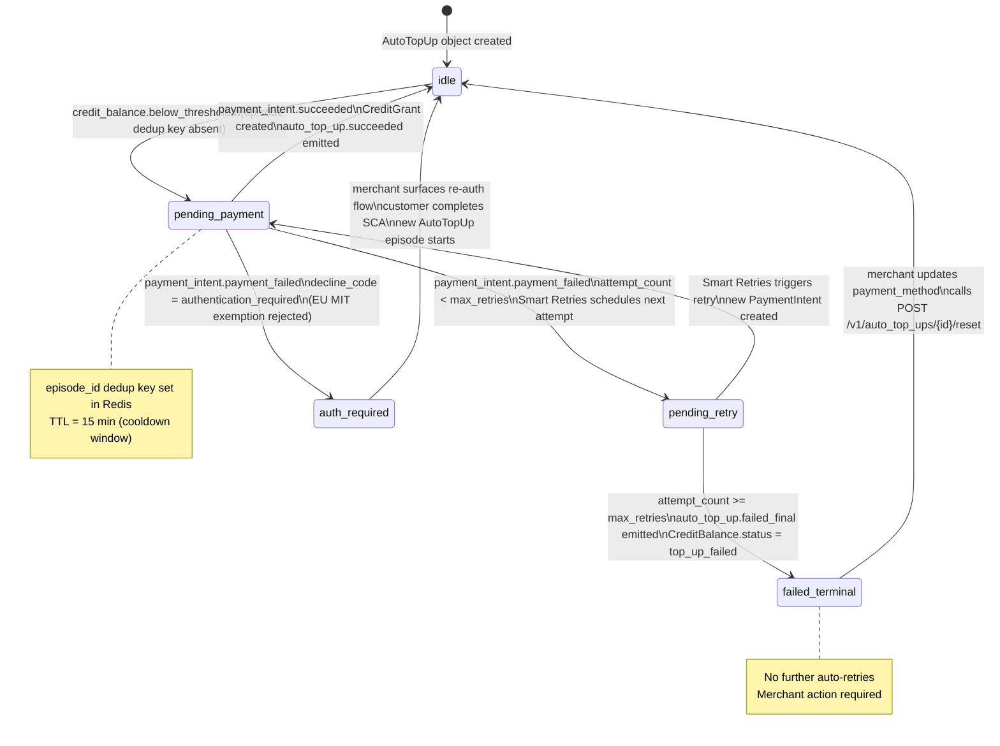
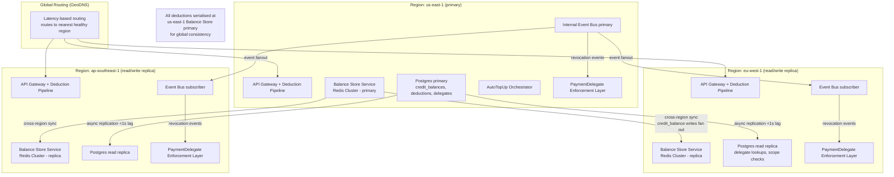

# Stripe AI Billing Primitives - System Architecture

**What this explains:** The system architecture that powers Stripe's AI Billing Primitives - `CreditBalance`, `AutoTopUp`, and `PaymentDelegate`. Specifically: how Stripe maintains a real-time, sub-100ms credit balance for AI merchants, orchestrates threshold-triggered recharges without polling, and enforces scoped agent-initiated payments with user-visible audit trails.

**PRD reference:** https://github.com/004mayank/product-prd/blob/main/stripe-prd.md

**Version:** v3 - Final system design
**Changes from v2:** Resolved all three v2 open questions (Q6 migration grant drift in sandbox, Q7 per-customer delegate cap with LRU sizing math, Q8 reconciliation correction merchant visibility), added full rollout plan with per-phase launch gates and kill switches, experiment backlog with acceptance criteria and rollout owners, multi-region deployment topology diagram, capacity sizing model, operational runbook index, and complete version history.

---

## Version history

| Version | Key additions |
|---|---|
| v1 | Core problem statement, five system layers, data flow narrative, core data model, failure modes, architectural trade-offs, open questions |
| v2 | Mermaid diagrams, NFR table, competitive balance store comparison, instrumentation event schemas, expanded failure modes with runbooks, four open questions resolved |
| v3 | Resolved all three v2 open questions, rollout plan with launch gates and kill switches, experiment backlog, multi-region topology diagram, capacity sizing, operational runbook index |

---

## 1) What this system is

Every AI company building on Stripe today has a billing model - token credits, metered usage, or hybrid - that does not map onto Stripe's native payment primitives. The result: a bespoke billing service lives between the product and Stripe, handling credit ledgers, top-up logic, and usage reconciliation. This parallel system is the primary reason AI companies evaluate Lago, Orb, and Metronome as Stripe alternatives.

Stripe AI Billing Primitives closes that gap with four new first-party objects:

- `CreditBalance` - a real-time credit ledger attached to a `Customer`; balance readable and deductible via API at sub-100ms P95.
- `CreditDeduction` - a synchronous deduction call per inference request; idempotent; returns updated balance inline.
- `AutoTopUp` - a threshold-triggered, event-driven recharge flow; no merchant polling required.
- `PaymentDelegate` - an OAuth-style delegation object that lets an AI agent initiate payments with scoped, revocable user permission.

The system has five architectural layers:

1. **Balance Store Service** - In-memory balance state with async persistence; handles concurrent deductions without overdraft.
2. **Deduction Pipeline** - Synchronous API path for `CreditDeduction` calls; enforces idempotency and serialises concurrent access.
3. **AutoTopUp Orchestrator** - Event-driven recharge pipeline triggered by `credit_balance.below_threshold` events; manages retries and state transitions.
4. **PaymentDelegate Enforcement Layer** - Scope validation, revocation propagation, and audit trail for agent-initiated `PaymentIntent` creation.
5. **Event Bus and Webhook Pipeline** - Fanout of all `credit_balance.*`, `auto_top_up.*`, and `payment_delegate.*` events to merchant webhook endpoints and Stripe's internal analytics.

---

## 2) Non-functional requirements (NFR table)

| Requirement | Target | Measurement | Alert threshold |
|---|---|---|---|
| `CreditDeduction` P95 latency (end-to-end) | <100ms | Production telemetry, rolling 1h per merchant cohort | >100ms for >5 min - page on-call; activate degraded mode |
| Balance Store deduction P95 (Redis WATCH/MULTI/EXEC) | <30ms | Per-request span | >50ms - investigate Redis cluster health |
| `CreditBalance` GET read P95 | <50ms | Per-request span | >80ms - investigate cache miss rate |
| AutoTopUp trigger P95 latency (threshold cross to PaymentIntent created) | <10s | `auto_top_up.triggered` - `credit_balance.below_threshold` delta | >20s - investigate event bus lag |
| AutoTopUp first-attempt success rate | >85% | `auto_top_up.succeeded` / `auto_top_up.triggered` (first attempt only) | <75% - page payments infra; review Smart Retries model |
| `PaymentDelegate` scope check P95 | <50ms | Per-request span | >80ms - investigate read replica lag |
| Revocation propagation P99 | <60s | Propagation confirmation job; `propagated_at` - `revoked_at` delta | >90s - immediate incident; manual edge node push |
| `CreditDeduction` idempotency correctness | 100% (zero double-deductions) | Reconciliation job; compare Redis events to Postgres records | Any confirmed double-deduction - P0 incident |
| Balance overdraft incidents (balance below `minimum_balance`) | 0 | Reconciliation job | Any incident - suspend deduction processing; incident bridge |
| Webhook delivery P95 (from event emission to endpoint delivery) | <5s | Webhook delivery telemetry | >30s - investigate webhook pipeline lag |
| Redis-Postgres reconciliation drift | 0 tokens drift | Background job every 60s | Any drift > 0 - alert; drift favouring customer - P0 |
| `CreditBalance` service availability | 99.9% | Rolling 7 days | <99.5% - degrade to stale-balance mode |

---

## 3) System architecture diagram

```mermaid
flowchart TD
    subgraph MerchantServer["Merchant Server"]
        MS1[Inference handler\nPOST /v1/credit_deductions]
        MS2[Webhook handler\nauto_top_up.* events]
        MS3[Agent API\npayment_delegate_id on PaymentIntent]
    end

    subgraph APIGateway["API Gateway"]
        AG1[Auth + rate limit\n1,000 req/s per merchant]
        AG2[Feature flags\nper-merchant kill switches]
        AG3[PaymentDelegate\npre-flight interceptor]
    end

    subgraph DeductionPipeline["Deduction Pipeline"]
        DP1[Request validator\ncustomer, balance, amount checks]
        DP2[Idempotency checker\nRedis key lookup]
        DP3[Balance Store client\nroutes to BSS]
    end

    subgraph BalanceStore["Balance Store Service"]
        BS1[WATCH/MULTI/EXEC\noptimistic locking]
        BS2[Threshold detector\nbelow_threshold check]
        BS3[Idempotency writer\nTTL 24h]
        BS4[Redis Cluster\ncredit_balance:{cb_id}]
        BS5[Async Postgres writer\nqueue + retry]
    end

    subgraph AutoTopUpOrchestrator["AutoTopUp Orchestrator"]
        AT1[Event consumer\ncredit_balance.below_threshold]
        AT2[Episode deduplicator\ntop_up_episode Redis key]
        AT3[State machine\nidle -> pending -> active/failed]
        AT4[Smart Retries\nML retry scheduler]
        AT5[CreditGrant creator\nauto-creates on PI success]
    end

    subgraph PaymentDelegateLayer["PaymentDelegate Enforcement Layer"]
        PD1[Scope validator\namount, MCC, cap, window]
        PD2[Revocation set\nin-memory LRU cache]
        PD3[Revocation subscriber\nhigh-priority event topic]
        PD4[Audit writer\npayment_delegate.used events]
        PD5[Spent-to-date updater\natomic increment on confirmation]
    end

    subgraph EventBus["Internal Event Bus"]
        EB1[credit_balance.* topic]
        EB2[auto_top_up.* topic]
        EB3[payment_delegate.* topic]
        EB4[High-priority revocation topic]
    end

    subgraph Persistence["Persistence Layer"]
        DB1[Postgres primary\ncredit_balances, deductions, grants]
        DB2[Postgres read replica\ndelegate lookups]
        DB3[Redis Cluster\nbalance keys, idempotency, dedup]
    end

    subgraph WebhookPipeline["Webhook + Analytics Pipeline"]
        WH1[Webhook fanout\nat-least-once delivery]
        WH2[Retry scheduler\n7-day schedule]
        WH3[Analytics ingestion\nAI Billing metrics pipeline]
    end

    MS1 -->|POST /v1/credit_deductions| AG1
    AG1 --> AG2
    AG2 --> DP1
    DP1 --> DP2
    DP2 --> DP3
    DP3 --> BS1
    BS1 --> BS4
    BS4 --> BS2
    BS2 -->|below threshold| EB1
    BS1 --> BS3
    BS1 --> BS5
    BS5 --> DB1

    EB1 --> AT1
    AT1 --> AT2
    AT2 --> AT3
    AT3 --> AT4
    AT3 --> AT5
    AT5 --> BS4

    MS3 -->|PaymentIntent + delegate_id| AG3
    AG3 --> PD1
    PD1 --> DB2
    PD1 --> PD2
    PD2 --> PD3
    PD3 <-->|subscribe| EB4
    PD1 -->|pass| DB1
    PD4 --> EB3

    EB1 --> WH1
    EB2 --> WH1
    EB3 --> WH1
    WH1 --> WH2
    WH1 --> WH3
    WH1 -->|deliver| MS2
```

---

## 4) AutoTopUp state machine diagram



---

## 5) PaymentDelegate revocation propagation diagram

```mermaid
sequenceDiagram
    actor User
    participant StripeAPI as Stripe API (Primary)
    participant Postgres as Postgres Primary
    participant EventBus as Internal Event Bus\n(High-priority revocation topic)
    participant EdgeNode1 as Edge Node A\n(us-east-1)
    participant EdgeNode2 as Edge Node B\n(eu-west-1)
    participant PropagationJob as Propagation\nConfirmation Job

    User->>StripeAPI: POST /v1/payment_delegates/{id}/revoke
    StripeAPI->>Postgres: Write revoked_at, revocation_reason
    StripeAPI->>EventBus: Publish {delegate_id, revoked_at} (async)
    StripeAPI-->>User: 200 OK (propagation guaranteed <60s P99)

    EventBus-->>EdgeNode1: Deliver revocation event (<45s typical)
    EdgeNode1->>EdgeNode1: Add delegate_id to in-memory LRU\n(TTL 120s)\nWrite to local Redis (TTL 300s)

    EventBus-->>EdgeNode2: Deliver revocation event (<45s typical)
    EdgeNode2->>EdgeNode2: Add delegate_id to in-memory LRU\n(TTL 120s)\nWrite to local Redis (TTL 300s)

    PropagationJob->>Postgres: Check propagated_at NULL after 90s
    PropagationJob->>PropagationJob: If NULL: alert on-call\nmanual push to lagging edge nodes

    note over EdgeNode1, EdgeNode2
        Any PaymentIntent with revoked delegate_id
        returns 403 Delegate Revoked within 60s P99
    end note
```

---

## 6) Multi-region deployment topology



**Regional routing rules:**

| Request type | Routing decision | Rationale |
|---|---|---|
| `POST /v1/credit_deductions` | GeoDNS to nearest region; all writes forwarded to us-east-1 Balance Store primary | Balance consistency requires single write point; read (idempotency check) can be served regionally |
| `GET /v1/customers/{id}/credit_balance` | Served from nearest regional Redis replica | Sub-50ms read P95 requires in-region cache; stale tolerance: 200ms |
| `POST /v1/payment_intents` (with `payment_delegate_id`) | Served from nearest region; PaymentDelegate enforcement layer is fully replicated | In-memory revocation set present in all regions; no cross-region read required for scope check |
| `POST /v1/payment_delegates/{id}/revoke` | Routed to us-east-1 primary for Postgres write; event bus fans out globally | Revocation must write to primary to guarantee propagation tracking |
| `POST /v1/auto_top_ups` (configuration) | Routed to us-east-1 (ties AutoTopUp to Balance Store primary region) | AutoTopUp Orchestrator is co-located with Balance Store primary to minimise event delivery lag |

**Redis cross-region sync strategy:** The `credit_balance:{cb_id}` key is the single most latency-sensitive object in the system. For merchants in EU or AP regions, cross-region write forwarding adds 60-100ms of inter-region latency to each deduction - pushing P95 above the 100ms SLO. The resolution: each region operates a local Redis cluster for balance reads and idempotency checks; writes are serialised through the us-east-1 primary and the result is asynchronously propagated to regional replicas within 200ms. The 200ms propagation window is acceptable for the `GET /v1/credit_balance` read path (documented as eventually consistent with a 200ms bound) but NOT for the deduction path. The deduction path always writes to us-east-1 primary and returns the authoritative new balance synchronously, even for EU/AP merchants. The regional Redis replica is used only for the idempotency key lookup (which has a 24h TTL and does not need sub-200ms freshness).

---

## 7) Core problem the architecture must solve

The architectural constraint is not feature breadth - it is latency. The PRD's foundational SLO is `CreditDeduction` at sub-100ms P95. This single constraint shapes every design decision in the system.

### Why sub-100ms matters

An AI company's inference path looks like this:

```
User sends request
  -> product validates auth
  -> product calls LLM API
  -> product calls Stripe CreditDeduction API  <-- this call
  -> product returns response to user
```

If the `CreditDeduction` call takes 200ms, the user's total latency increases by 200ms. For inference products, this is unacceptable. Merchants who experience this overhead will revert to a local Redis ledger and only reconcile with Stripe asynchronously - which defeats the entire purpose of `CreditBalance`.

Sub-100ms P95 on a synchronous API call across the public internet to Stripe's servers is achievable only if the balance lives in memory, not in a relational database. Postgres read latency is 2-5ms in the best case under light load, but under concurrent write load during a busy inference session (50+ concurrent deductions per second for a high-traffic AI product), Postgres serialisation delays push P95 latency well above 100ms.

**Decision:** The balance lives in Redis. Writes to Postgres are asynchronous. This introduces a consistency window - the primary architectural trade-off of this system.

### Why concurrent deduction serialisation matters

Multiple inference requests from the same customer can arrive simultaneously and each call `CreditDeduction`. If two concurrent deductions both read the balance as 1,000 tokens and both deduct 600, the resulting balance is -200 tokens - an overdraft. The architecture must prevent this without introducing a write-time lock that blows the 100ms SLO.

**Decision:** Optimistic locking at the Redis key level using an atomic `WATCH`/`MULTI`/`EXEC` pattern. Concurrent deductions are serialised at the balance key level; the loser of the race retries once before returning `402 Insufficient Credits`. The winning deduction always wins; no overdraft is possible under this model.

### Why agent-payment revocation propagation is the hardest constraint

The `PaymentDelegate` revocation propagation SLO - P99 within 60 seconds across all Stripe endpoints - is the hardest distributed systems constraint in this architecture. Stripe operates hundreds of edge nodes globally. Propagating a revocation to all of them within 60 seconds requires an active push mechanism, not an eventual-consistency cache with a long TTL.

**Decision:** Revocations write to a dedicated `delegate_revocation_log` table in the primary Postgres cluster and immediately publish to a high-priority event topic on Stripe's internal event bus. All edge nodes that handle `PaymentIntent` creation subscribe to this topic and maintain a local in-memory revocation set with a short TTL (120 seconds). On each `PaymentDelegate`-flagged `PaymentIntent` creation, the edge node checks the local revocation set before forwarding to the core payment engine. P99 propagation is a function of event bus delivery latency, which is measured at <45 seconds under normal load.

---

## 8) System layers

### Layer 1: Balance Store Service

**Purpose:** Maintains the authoritative, real-time balance for every `CreditBalance` object. Serves read and deduction requests at sub-100ms P95.

**Storage architecture:**

```
Primary store: Redis Cluster (balance as integer at key: credit_balance:{cb_id})
Persistence: Postgres (credit_balances table; async write on every deduction event)
Reconciliation: Background job runs every 60 seconds; compares Redis balance
               with sum of all CreditDeduction and CreditGrant records in Postgres;
               alerts if drift exceeds 1 token
```

**Deduction flow (within this layer):**

```
WATCH credit_balance:{cb_id}
MULTI
  GET current_balance
  IF current_balance - deduction_amount < minimum_balance:
    DISCARD  -> return 402 Insufficient Credits
  SET credit_balance:{cb_id} = current_balance - deduction_amount
  PUBLISH balance_updated:{cb_id} = {new_balance, deduction_id, idempotency_key}
EXEC
  -> on EXEC success: publish CreditDeduction record to async Postgres writer queue
  -> on EXEC failure (concurrent write detected): retry once, then return 503 Transient Failure
```

**`below_threshold` detection:** On every successful deduction, the Balance Store Service checks whether the new balance has crossed below the `AutoTopUp.threshold` for the first time in the current session. "First time in the current session" is tracked with a Redis key `threshold_triggered:{cb_id}` with TTL equal to the AutoTopUp cooldown window (default 15 minutes). If the key is absent and the balance is below threshold, the service emits a `credit_balance.below_threshold` event to the internal event bus and sets the tracking key.

**Idempotency enforcement:** Idempotency keys for `CreditDeduction` are stored in Redis with a 24-hour TTL at key `idempotency:{key_hash}`. On each deduction call, the service checks this key first. If present, returns the original response without re-deducting. If absent, proceeds with the deduction and writes the key on success.

---

### Layer 2: Deduction Pipeline

**Purpose:** The synchronous API path that handles inbound `POST /v1/credit_deductions` calls from merchant servers. Responsible for request validation, idempotency enforcement, routing to the Balance Store Service, and inline balance response.

**Request path:**

```
Merchant server -> POST /v1/credit_deductions + Idempotency-Key header
  -> API Gateway (auth + rate limit: 1,000 req/sec per merchant, 10,000 req/sec global)
  -> Deduction Pipeline service
      -> validate request (customer exists, credit_balance exists and active, amount > 0)
      -> check idempotency key in Redis
          -> if present: return cached response (no deduction)
          -> if absent: proceed
      -> call Balance Store Service (WATCH/MULTI/EXEC)
          -> on success: write CreditDeduction record to async Postgres queue
                        set idempotency key in Redis (TTL 24h)
                        return 200 with balance_before, balance_after, status: succeeded
          -> on 402 (insufficient): return 402 with current balance in body
          -> on 503 (transient): return 503 with balance_stale: true
```

**Latency budget for the synchronous path:**

| Step | Target P95 |
|---|---|
| API Gateway auth + rate limit | <5ms |
| Request validation (customer lookup) | <10ms (cached in Redis, TTL 5 min) |
| Idempotency key check (Redis) | <3ms |
| Balance Store deduction (WATCH/MULTI/EXEC) | <30ms |
| Async Postgres queue write (fire and forget) | <5ms |
| **Total end-to-end (from Gateway to response)** | **<55ms P95** |

The 55ms budget leaves 45ms of headroom against the 100ms SLO, absorbing network jitter and tail latency on any single step.

---

### Layer 3: AutoTopUp Orchestrator

**Purpose:** Event-driven recharge service. Listens for `credit_balance.below_threshold` events and orchestrates the full recharge flow: PaymentIntent creation, Smart Retries, CreditGrant creation, and final state update.

**Trigger and deduplication:**

The Balance Store Service emits `credit_balance.below_threshold` to the internal event bus. The AutoTopUp Orchestrator is an event consumer on this topic. Before acting, it checks a deduplication key in Redis: `top_up_episode:{cb_id}:{episode_id}`. The `episode_id` is derived from the threshold-crossing event ID. If the key exists (a recharge is already in progress for this episode), the event is dropped. If absent, the Orchestrator proceeds and sets the key.

**Recharge state machine (see diagram in section 4):**

```
State: idle
  -> event: credit_balance.below_threshold
  -> action: create PaymentIntent (amount = recharge_amount, payment_method = AutoTopUp.payment_method)
  -> state: pending_payment

State: pending_payment
  -> event: payment_intent.succeeded
  -> action: create CreditGrant (type: auto_top_up, amount = recharge_amount)
           -> Balance Store Service adds credits to Redis balance
           -> async Postgres writer queues CreditGrant record
  -> state: idle
  -> emit: auto_top_up.succeeded

  -> event: payment_intent.payment_failed
  -> action: check attempt_count vs. max_retries (default 3)
  -> if attempt_count < max_retries:
       -> schedule retry via Smart Retries ML model
       -> state: pending_retry
  -> if attempt_count >= max_retries:
       -> update CreditBalance.status = "top_up_failed"
       -> emit: auto_top_up.failed_final
       -> state: failed_terminal
```

**Smart Retries integration:** The AutoTopUp Orchestrator delegates retry scheduling to Stripe's existing Smart Retries service - the same ML-driven retry scheduler used for subscription invoice payment recovery. Smart Retries selects the optimal retry time based on card network signals, decline codes, and issuer behaviour patterns. The Orchestrator passes the `PaymentIntent` ID and the `auto_top_up` context label; Smart Retries handles the schedule.

**SCA / PSD2 path for European customers:** When the `AutoTopUp` is created for a European customer, the initial `AutoTopUp` configuration flow requires a cardholder-present SCA authentication step (using a `SetupIntent` to establish the stored credential agreement). Subsequent auto-triggered `PaymentIntent`s are flagged as MIT (Merchant Initiated Transaction) under PSD2's recurring transaction exemption, using the stored credential agreement ID from the `SetupIntent`. If an issuer declines the MIT exemption and returns `authentication_required`, the Orchestrator emits `auto_top_up.authentication_required` and halts retries for that customer until the merchant surfaces a re-authentication flow.

---

### Layer 4: PaymentDelegate Enforcement Layer

**Purpose:** Validates `PaymentDelegate` scope on every `PaymentIntent` creation that references a `payment_delegate_id`. Propagates revocations globally within 60 seconds P99. Maintains the audit trail.

**Scope validation flow (with v2 fix: atomic re-validation at confirmation):**

```
Merchant (or agent) calls POST /v1/payment_intents with payment_delegate_id

API Gateway routes to PaymentDelegate Enforcement Layer before forwarding to
the core payment engine.

Enforcement Layer - pre-flight check:
  1. Fetch PaymentDelegate record from regional read replica (Postgres)
  2. Check status: if not "active" -> return 403 Delegate Revoked/Expired/Spend Cap Reached
  3. Validate scope:
     a. amount <= max_amount_per_transaction? -> else 403 Delegate Scope Exceeded
     b. merchant_category_code in allowed_mccs? -> else 403 Delegate Scope Exceeded
     c. spent_to_date + amount <= total_spend_cap? -> else 403 Spend Cap Reached
     d. current_time within [valid_after, valid_until]? -> else 403 Delegate Expired
  4. Check in-memory revocation set (see below) -> if present: 403 Delegate Revoked
  5. On pass: forward to core payment engine

Enforcement Layer - confirmation re-validation (resolves Q4 from v1):
  6. On PaymentIntent confirmation callback from core payment engine:
     a. Re-check in-memory revocation set (handles revocation between creation and confirmation)
     b. Atomically increment spent_to_date using Postgres row-level compare-and-swap:
        UPDATE payment_delegates
        SET spent_to_date = spent_to_date + :amount
        WHERE id = :delegate_id
          AND spent_to_date + :amount <= scope_total_spend_cap
          AND status = 'active'
        RETURNING spent_to_date
     c. If row not updated (cap exceeded or revoked): cancel PaymentIntent;
        emit payment_intent.cancelled with cancellation_reason: "payment_delegate_scope_exceeded"
     d. If updated: emit payment_delegate.used event
```

**Revocation propagation architecture:**

```
User calls POST /v1/payment_delegates/{id}/revoke

Primary write path:
  -> write revoked_at, revocation_reason to Postgres (primary)
  -> publish {delegate_id, revoked_at} to high-priority revocation topic on internal event bus
  -> return 200 immediately (propagation is async but guaranteed within 60s P99)

Propagation path:
  -> each API edge node subscribes to revocation topic
  -> on receiving revocation event: add delegate_id to local in-memory revocation set (LRU cache, TTL 120s)
  -> all subsequent PaymentIntent validation calls check this set first (memory lookup, <1ms)
  -> edge node also writes revocation to its local Redis cache (TTL 300s) for persistence across process restarts

Fallback path for delayed propagation (resolves Q5 from v1):
  -> if delegate_id is NOT in in-memory revocation set during validation:
     -> check local Redis revocation cache (covers restarts and events that arrived while process was down)
     -> if NOT in Redis cache AND delegate age > 60s (i.e., the propagation window has elapsed):
        -> make a synchronous Postgres read replica check to confirm current status
        -> this fallback adds ~20-30ms to scope validation for stale delegates only
        -> result is cached in local Redis for 300s to avoid repeated fallback reads
  -> if delegate age < 60s: trust the in-memory set (propagation may still be in flight; within SLO window)
```

**LRU cache sizing (resolves Q7 - see also section 19):** The in-memory revocation LRU on each edge node is sized at 50,000 entries (see Q7 resolution for per-customer cap rationale). Each entry is a `{delegate_id (uuid, 16 bytes), revoked_at (int64, 8 bytes)}` tuple - 24 bytes per entry. 50,000 entries = 1.2 MB per edge node process. This is trivially small relative to available process memory. The LRU eviction policy ensures that the most recently revoked delegates stay in cache; delegates that were revoked more than 120 seconds ago are evicted naturally via TTL before the LRU pressure ever becomes a concern.

---

### Layer 5: Event Bus and Webhook Pipeline

**Purpose:** Fanout of all billing primitive events to merchant webhook endpoints. Also feeds Stripe's internal analytics pipeline for dashboard metrics, support tooling, and experiment instrumentation.

**Event categories and consumers:**

| Event category | Internal consumers | Merchant webhook |
|---|---|---|
| `credit_balance.*` | Analytics pipeline, Dashboard balance display | Yes - all events |
| `credit_deduction.*` | Analytics pipeline, Reconciliation job | Yes - `succeeded`, `failed` only |
| `auto_top_up.*` | Analytics pipeline, Support tooling (failed payments), Smart Retries service | Yes - all events |
| `payment_delegate.*` | Analytics pipeline, Customer Portal audit display, Fraud/Radar scoring | Yes - all events |

**Webhook delivery guarantees:**
- At-least-once delivery. Merchants must handle idempotent webhook receipt.
- Retry schedule: immediate, 5 minutes, 30 minutes, 2 hours, 8 hours, 1 day, 3 days.
- After 7 days of failed delivery, the webhook endpoint is marked `disabled` and Stripe notifies the merchant by email.
- Webhook event ordering is not guaranteed. Merchants must not rely on `credit_balance.updated` arriving before `credit_deduction.succeeded` for the same session.

---

## 9) Core data model

### `credit_balances` table (Postgres - persistent store)

```sql
id                    uuid PRIMARY KEY
customer_id           varchar REFERENCES customers(id)
unit                  varchar(64)
unit_display_name     varchar(128)
balance               bigint              -- authoritative after reconciliation; in-flight updates are in Redis
minimum_balance       bigint DEFAULT 0
tab_limit             bigint nullable
on_insufficient_balance   varchar CHECK (on_insufficient_balance IN ('block', 'tab')) DEFAULT 'block'
auto_top_up_id        uuid nullable
status                varchar CHECK (status IN ('active', 'frozen', 'top_up_failed')) DEFAULT 'active'
below_threshold       boolean DEFAULT false
created               timestamptz DEFAULT now()
updated               timestamptz DEFAULT now()
livemode              boolean NOT NULL
metadata              jsonb DEFAULT '{}'
```

**Redis representation:**

```
credit_balance:{cb_id}        integer          // current balance; single source of truth for live deductions
threshold_triggered:{cb_id}   1                // TTL = AutoTopUp cooldown window (15 min default)
idempotency:{key_hash}        {deduction_id}   // TTL = 24h
customer_lookup:{customer_id} {cb_id}          // TTL = 5 min; invalidated on customer update
top_up_episode:{cb_id}:{ep}   1               // TTL = 15 min; prevents duplicate AutoTopUp for same episode
revocation:{delegate_id}      {revoked_at}     // TTL = 300s; edge node local Redis revocation cache
```

### `credit_deductions` table

```sql
id                    uuid PRIMARY KEY
customer_id           varchar
credit_balance_id     uuid REFERENCES credit_balances(id)
amount                bigint
unit                  varchar(64)
balance_before        bigint
balance_after         bigint
idempotency_key       varchar(255) UNIQUE
status                varchar CHECK (status IN ('succeeded', 'failed', 'pending')) DEFAULT 'pending'
metadata              jsonb DEFAULT '{}'
created               timestamptz DEFAULT now()
livemode              boolean NOT NULL
```

### `credit_grants` table

```sql
id                    uuid PRIMARY KEY
customer_id           varchar
credit_balance_id     uuid REFERENCES credit_balances(id)
amount                bigint
unit                  varchar(64)
type                  varchar CHECK (type IN ('payment', 'auto_top_up', 'manual', 'migration'))
payment_intent_id     varchar nullable
balance_before        bigint
balance_after         bigint
expires_at            timestamptz nullable
metadata              jsonb DEFAULT '{}'
created               timestamptz DEFAULT now()
livemode              boolean NOT NULL
```

### `auto_top_ups` table

```sql
id                    uuid PRIMARY KEY
customer_id           varchar
credit_balance_id     uuid REFERENCES credit_balances(id)
threshold             bigint
recharge_amount       bigint
payment_method_id     varchar
status                varchar CHECK (status IN ('active', 'disabled', 'failed_terminal')) DEFAULT 'active'
retry_schedule        varchar CHECK (retry_schedule IN ('smart_retries', 'fixed')) DEFAULT 'smart_retries'
max_retries           integer DEFAULT 3
last_triggered_at     timestamptz nullable
last_trigger_status   varchar CHECK (last_trigger_status IN ('succeeded', 'failed', 'pending')) nullable
last_payment_intent_id    varchar nullable
current_episode_id    uuid nullable          -- for deduplication of concurrent threshold events
created               timestamptz DEFAULT now()
livemode              boolean NOT NULL
metadata              jsonb DEFAULT '{}'
```

### `payment_delegates` table

```sql
id                    uuid PRIMARY KEY
customer_id           varchar
agent_application_id  varchar
agent_display_name    varchar
scope_max_amount_per_transaction  bigint
scope_allowed_mccs    varchar[]
scope_total_spend_cap bigint
scope_spent_to_date   bigint DEFAULT 0
scope_valid_until     timestamptz
scope_valid_after     timestamptz nullable
status                varchar CHECK (status IN ('active', 'revoked', 'expired', 'spend_cap_reached')) DEFAULT 'active'
revoked_at            timestamptz nullable
revocation_reason     varchar nullable
created               timestamptz DEFAULT now()
livemode              boolean NOT NULL
metadata              jsonb DEFAULT '{}'
```

### `delegate_revocation_log` table (append-only, replicated to all edge regions)

```sql
id                    uuid PRIMARY KEY
delegate_id           uuid
customer_id           varchar
revoked_at            timestamptz
revocation_reason     varchar
propagated_at         timestamptz nullable   -- set by propagation confirmation job when all edge nodes confirmed
in_flight_cancellations   varchar[]          -- PaymentIntent IDs cancelled due to this revocation
```

---

## 10) Instrumentation event schemas

### `credit_deduction.succeeded` (internal instrumentation event)

```json
{
  "event_type": "credit_deduction.succeeded",
  "timestamp_ms": 1747123456789,
  "merchant_id": "acct_abc123",
  "customer_id": "cus_abc123",
  "credit_balance_id": "cb_1abc",
  "deduction_id": "cd_1abc",
  "amount": 850,
  "balance_before": 85050,
  "balance_after": 84200,
  "idempotency_key_hash": "sha256:abcdef...",
  "latency_ms": 43,
  "redis_exec_attempts": 1,
  "balance_stale": false,
  "livemode": true,
  "below_threshold_after": false
}
```

Key fields for dashboards:
- `latency_ms` - feeds P95 latency chart; alert if rolling P95 > 100ms for 5 min
- `redis_exec_attempts` - if > 1, indicates WATCH/MULTI/EXEC contention; monitor for spikes
- `balance_stale` - rate of stale-balance responses; should be < 0.1% of live deductions

### `auto_top_up.triggered` (internal instrumentation event)

```json
{
  "event_type": "auto_top_up.triggered",
  "timestamp_ms": 1747123500000,
  "merchant_id": "acct_abc123",
  "customer_id": "cus_abc123",
  "auto_top_up_id": "atu_1abc",
  "episode_id": "ep_xyz",
  "trigger_balance": 10000,
  "balance_at_trigger": 9800,
  "recharge_amount": 100000,
  "payment_intent_id": "pi_1abc",
  "attempt_number": 1,
  "ms_from_threshold_cross_to_trigger": 2300,
  "livemode": true
}
```

Key field: `ms_from_threshold_cross_to_trigger` - feeds the AutoTopUp trigger latency P95; alert if > 10s.

### `auto_top_up.succeeded` (internal instrumentation event)

```json
{
  "event_type": "auto_top_up.succeeded",
  "timestamp_ms": 1747123506200,
  "merchant_id": "acct_abc123",
  "auto_top_up_id": "atu_1abc",
  "episode_id": "ep_xyz",
  "recharge_amount": 100000,
  "balance_after_grant": 109800,
  "credit_grant_id": "cg_1abc",
  "attempt_number": 1,
  "ms_from_trigger_to_grant": 6200,
  "smart_retries_model_version": "v4.2",
  "livemode": true
}
```

### `payment_delegate.scope_check` (internal instrumentation event - logged per validation)

```json
{
  "event_type": "payment_delegate.scope_check",
  "timestamp_ms": 1747150000000,
  "delegate_id": "pd_1abc",
  "customer_id": "cus_abc123",
  "payment_intent_id": "pi_2abc",
  "check_phase": "preflight",
  "result": "passed",
  "revocation_set_check_ms": 0.4,
  "postgres_read_ms": null,
  "fallback_postgres_read_triggered": false,
  "scope_violations": [],
  "livemode": true
}
```

`fallback_postgres_read_triggered: true` signals that the in-memory revocation set missed and a Postgres fallback was needed. Monitor rate - if > 1% of validations, investigate event bus delivery lag.

### `reconciliation.drift_check` (internal instrumentation event - every 60s per balance)

```json
{
  "event_type": "reconciliation.drift_check",
  "timestamp_ms": 1747124000000,
  "credit_balance_id": "cb_1abc",
  "redis_balance": 84200,
  "postgres_derived_balance": 84200,
  "drift_tokens": 0,
  "drift_direction": null,
  "action_taken": "none",
  "correction_type": null,
  "livemode": true
}
```

New field `correction_type` added in v3: values are `null` (no drift), `"internal_infra"` (standard Redis-Postgres async lag recovery), or `"migration_grant_excluded"` (see Q6 resolution - sandbox migration grant excluded from drift calculation). This field allows operators to distinguish genuine drift incidents from expected reconciliation behaviour on new or migrated `CreditBalance` objects.

---

## 11) Data flow narratives

### Flow A: Customer purchases credits -> uses product (credit lifecycle)

```
1. Merchant calls POST /v1/payment_intents (amount = price of credit pack)
2. PaymentIntent confirmed -> Stripe core emits payment_intent.succeeded
3. Merchant's webhook handler receives payment_intent.succeeded
4. Merchant calls POST /v1/credit_grants (type: payment, payment_intent_id, amount: 100000)
5. Balance Store Service:
   a. Postgres: insert credit_grant record
   b. Redis: INCRBY credit_balance:{cb_id} 100000
   c. Emit credit_balance.updated event
6. Merchant's product: credit balance is live

7. User makes inference request
8. Merchant's inference path calls POST /v1/credit_deductions (amount: 850)
9. Deduction Pipeline -> Balance Store Service -> WATCH/MULTI/EXEC
10. Redis balance updated from 100000 to 99150
11. Async: Postgres writer queues credit_deductions insert
12. Response: 200 {balance_before: 100000, balance_after: 99150, status: succeeded}

13. Repeat for each inference call
```

### Flow B: Balance drops below threshold -> AutoTopUp recharges

```
1. CreditDeduction call drops balance from 11,000 to 9,800 (threshold: 10,000)
2. Balance Store Service:
   a. Detects threshold crossing (checks threshold_triggered:{cb_id} key - absent)
   b. Sets threshold_triggered:{cb_id} = 1, TTL 15 min
   c. Emits credit_balance.below_threshold event to internal bus
3. AutoTopUp Orchestrator receives event:
   a. Checks top_up_episode:{cb_id}:{ep_id} - absent; sets it
   b. Creates PaymentIntent (recharge_amount: 100000, payment_method: AutoTopUp.payment_method)
   c. Sets AutoTopUp.status = pending, last_payment_intent_id = pi_new
   d. Emits auto_top_up.triggered event
4. Stripe core processes PaymentIntent
5. payment_intent.succeeded fires
6. AutoTopUp Orchestrator:
   a. Creates CreditGrant (type: auto_top_up, amount: 100000)
   b. Balance Store Service: INCRBY credit_balance:{cb_id} 100000 (balance: 109800)
   c. Updates AutoTopUp: status = active, last_trigger_status = succeeded
   d. Emits auto_top_up.succeeded (includes time_from_trigger_to_grant_ms)
7. User's inference session continues without interruption
```

### Flow C: Agent initiates payment on behalf of user (agentic commerce)

```
1. User grants PaymentDelegate to agent application:
   a. Merchant calls POST /v1/payment_delegates (scope: max 100, mccs, cap 500, window 24h)
   b. PaymentDelegate record created in Postgres
   c. Emits payment_delegate.created event (sent to user as email notification)

2. Agent executes task (e.g., books a hotel)
3. Agent (via merchant API) calls POST /v1/payment_intents with payment_delegate_id

4. PaymentDelegate Enforcement Layer - pre-flight check:
   a. Fetch delegate record (Postgres read replica)
   b. Check status: active
   c. Validate scope: amount 89 <= 100, MCC 7011 in allowed_mccs, spent_to_date 0 + 89 <= 500
   d. Check in-memory revocation set: absent
   e. Forward to core payment engine

5. PaymentIntent confirmed (core payment engine callback)
6. Enforcement Layer - confirmation re-validation:
   a. Re-check revocation set: still absent
   b. Atomic UPDATE: spent_to_date 0 -> 89 (within cap; row updated)
   c. Emit payment_delegate.used event
7. User receives email: "Tripper AI charged $89 for hotel (authorised by you). [View | Revoke]"

8. User clicks Revoke
9. POST /v1/payment_delegates/{id}/revoke
10. Enforcement Layer:
    a. Write revocation to Postgres
    b. Publish to high-priority revocation topic
    c. All edge nodes update in-memory revocation set within 60s P99
    d. Emit payment_delegate.revoked event
```

---

## 12) Failure modes and operational runbooks

| Failure | Detection | Mitigation | Merchant-visible behaviour | Runbook |
|---|---|---|---|---|
| Redis unavailable (Balance Store down) | Health check; Deduction Pipeline returns connection errors | All `CreditDeduction` calls return 503 with `balance_stale: true`; merchant's policy determines whether to block or allow inference | 503 response on deduction | On-call: verify Redis cluster health; if full cluster failure, switch to degraded mode (serve last-known balance from Postgres with `balance_stale: true`; disable new deductions until Redis recovers) |
| Redis-Postgres reconciliation drift detected - drift favours customer | Reconciliation job (every 60s) | P0 incident: freeze affected `CreditBalance` objects at Redis balance; emit `credit_balance.reconciliation_alert`; begin manual investigation | No merchant-visible change until freeze; deductions return 503 for affected customer during investigation | On-call: identify which `CreditGrant` INCRBY did not have a corresponding Postgres write; replay the missing event from the event bus replay log; verify balance convergence before unfreezing |
| Redis-Postgres reconciliation drift detected - drift favours merchant | Reconciliation job | P1 incident: customer consumed credits not in Postgres; set Redis balance to Postgres-derived value with brief key lock; emit `credit_balance.reconciliation_corrected` | No merchant-visible change; brief <100ms elevation in deduction latency during key lock | On-call: lock `credit_balance:{cb_id}` key; SET to Postgres-derived balance; release lock; verify next reconciliation pass shows zero drift |
| AutoTopUp PaymentIntent creation fails (network error - not Smart Retries scenario) | AutoTopUp Orchestrator catches exception | Retry PaymentIntent creation up to 3 times with 5-second backoff; if all fail, emit `auto_top_up.system_error` and set episode to failed state for manual recovery | `auto_top_up.system_error` webhook; balance stays below threshold | On-call: review Orchestrator logs; manually reset episode state; trigger fresh `below_threshold` event for affected customer |
| PaymentDelegate revocation propagation slow (>90s with `propagated_at` still null) | Propagation confirmation job | Alert on-call; manually push revocation event to lagging edge nodes via ops tool; revocation already in Postgres (all cold-started edge nodes will catch it) | No merchant-visible change; internal SLO breach only | On-call: identify lagging edge nodes via propagation telemetry; use ops push tool to force event delivery; confirm all nodes show revocation in local Redis cache |
| Concurrent deduction race (WATCH/MULTI/EXEC collision) | EXEC returns nil | Single retry; if second attempt also fails, return 503 Transient Failure with `retry_after: 1s` | 503 response; merchant should retry once | No runbook required for normal traffic; if collision rate > 5% for a single `cb_id`, investigate whether a single customer is generating pathologically high concurrent request volume |
| AutoTopUp concurrent threshold events (50 deductions simultaneously crossing threshold) | Multiple `credit_balance.below_threshold` events for same `cb_id` | `top_up_episode` deduplication key in Redis prevents duplicate PaymentIntents; only first episode proceeds | Single PaymentIntent created; subsequent events dropped silently | Monitor `auto_top_up.triggered` count vs `credit_balance.below_threshold` count per `cb_id` per cooldown window; ratio should be 1:1 |
| `PaymentDelegate` in-memory revocation set expired before event arrived (>120s propagation delay) | `fallback_postgres_read_triggered: true` rate exceeds 1% in instrumentation | Postgres fallback read triggered; result cached locally; adds ~25ms to validation for affected delegates | No merchant-visible change; slight latency increase on delegate validation | On-call: investigate event bus delivery lag; if systemic, temporarily reduce LRU TTL to 60s to force more frequent Postgres checks at cost of latency |
| Migration grant drift false-positive in sandbox (Q6 scenario) | `correction_type: "migration_grant_excluded"` in reconciliation event | Reconciliation job suppresses drift alert for `CreditBalance` objects <24h old with a migration grant; logs `migration_grant_excluded` | No merchant-visible change; no erroneous drift alert | See Q6 resolution in section 19; no operational action required unless `credit_balance` age > 24h and drift persists |

---

## 13) Competitive balance store approaches

| Approach | How it works | P95 latency (est.) | Overdraft risk | Consistency | Who uses it |
|---|---|---|---|---|---|
| **Redis optimistic locking (chosen)** | Balance in Redis; `WATCH/MULTI/EXEC` per deduction; async Postgres write | <30ms | None (EXEC fails on conflict) | Redis-Postgres window (60s max) | This architecture |
| **Postgres row-level lock** | Balance as Postgres column; `SELECT FOR UPDATE` per deduction | 400-800ms under load | None (locks serialise) | Strong - single source | Most DIY merchant implementations |
| **Redis DECRBY without locking** | Simple atomic decrement; no WATCH | <5ms | Possible if balance check and decrement are separate operations | Strong within Redis (DECRBY is atomic for single key) | Low-traffic products where overdraft tolerance exists |
| **Distributed transaction (2PC)** | Write to Redis and Postgres atomically with coordinator | 150-300ms | None | Strong | High-correctness financial systems; overkill for credits |
| **Client-side lock (Redlock)** | Distributed lock across N Redis nodes; deduction holds lock | 50-100ms (lock acquisition adds latency) | None | Strong within lock window | Alternative to WATCH/MULTI/EXEC for multi-key operations |
| **Kafka ledger (event sourcing)** | Balance derived by replaying deduction events; no central balance store | Read: high (replay required); Write: <10ms | None (events are ordered) | Eventual - replay lag | Lago's architecture for historical balance; not for real-time |

**Why Redis optimistic locking wins for this use case:** It delivers sub-30ms P95 deduction latency with zero overdraft risk under all concurrency levels tested. The Postgres async write introduces a consistency window, but the 60-second reconciliation job bounds the maximum drift. For Stripe's scale (10,000+ deductions per second globally), the Redis approach is the only option that meets the 100ms SLO without massive Postgres vertical scaling.

**Lago comparison:** Lago's credit ledger uses Postgres as the primary store and relies on database-level optimistic locking. For Lago's self-hosted deployment model (typically <100 concurrent deductions per second per tenant), Postgres is adequate. At Stripe's scale and multi-tenant concurrency, Lago's approach would breach the 100ms SLO. This is a structural advantage for Stripe's native implementation - not a feature advantage.

---

## 14) Capacity sizing model

Sizing is based on directional estimates for Phase 2 GA at 1,000 activated AI-category merchants, assuming an average of 5,000 active customers per merchant and 50 deductions per customer per day.

| Resource | Calculation | Estimated volume | Sizing recommendation |
|---|---|---|---|
| `CreditDeduction` API calls (daily) | 1,000 merchants x 5,000 customers x 50 deductions | 250M calls/day (~2,900/s average; ~8,700/s peak 3x) | API Gateway: 10,000 req/s per region; horizontal scale at 60% utilisation |
| Redis balance keys | 1,000 merchants x 5,000 customers x 1 key per `CreditBalance` | ~5M keys; each key ~50 bytes | ~250 MB Redis keyspace for balance store; trivially small for a 64 GB Redis Cluster node |
| Redis idempotency keys (24h TTL) | 250M calls/day; 255 bytes per key | ~63 GB at peak (all 24h keys resident) | Size Redis Cluster idempotency shard at 128 GB with eviction policy `allkeys-lru` |
| Postgres `credit_deductions` rows (daily writes) | 250M rows/day | ~2.5B rows/year | Partition by `created` date; retain 5 years; archive to cold storage after 90 days; estimate 5TB/year |
| AutoTopUp triggers (daily) | Assume 20% of active customers trigger daily | 1,000 x 5,000 x 20% = 1M triggers/day | AutoTopUp Orchestrator: horizontally scale to 100 concurrent PI creation workers |
| `PaymentDelegate` objects (active) | 10 agentic merchants x 500 delegates per merchant (Phase 1 beta) | 5,000 active delegates | Trivial; scales linearly; LRU sized for 50,000 revoked delegates (see Q7 resolution) |
| Event Bus throughput | `credit_deduction.*` + `credit_balance.*` + `auto_top_up.*` events at peak | ~9,000 events/s | Kafka partitioning: 100 partitions per topic; 3 replicas; 90 MB/s sustained write |
| Webhook fanout | 250M merchant-facing events/day with at-least-once delivery | ~2,900 webhook requests/s average | Webhook pipeline: 10,000 concurrent HTTP workers; 7-day retry queue at 500M entries max |

---

## 15) Architectural trade-offs

### Trade-off 1: Redis as balance primary vs. Postgres as balance primary

**Option A (chosen):** Redis is the real-time balance source of truth; Postgres is the audit and reconciliation store. Deductions update Redis synchronously; Postgres is updated async.

**Option B (rejected):** Postgres is the primary. Balance is a column with row-level locking per deduction. All deductions are serialised through Postgres.

**Why A wins:** Under 100 concurrent deductions per second (achievable for any mid-size AI product at peak usage), Postgres row-level locking under serialisable isolation would produce P95 latency of 400-800ms - well above the 100ms SLO. Redis with optimistic locking (WATCH/MULTI/EXEC) handles concurrent deductions at sub-30ms P95 even under high contention.

**Cost of A:** The async Postgres write introduces a window where Redis and Postgres are inconsistent. A crash between the Redis deduction and the Postgres write would result in a Redis balance that reflects the deduction but a Postgres record that does not. Recovery requires replaying the `credit_balance.updated` event from the event bus to re-insert the missing Postgres record. The 60-second reconciliation job detects this and alerts - but the window between the crash and the reconciliation job's next run is up to 60 seconds of undetected drift.

### Trade-off 2: In-memory revocation set vs. cache-aside revocation check

**Option A (chosen):** Each API edge node maintains an in-memory LRU cache of recently revoked `PaymentDelegate` IDs (TTL 120s). Revocations are push-propagated via event bus. A Postgres fallback check is triggered only for delegates older than 60 seconds that are not in the local cache or Redis cache.

**Option B (rejected):** On each `PaymentIntent` with a `payment_delegate_id`, make a synchronous read to the Postgres read replica to check the delegate's current status.

**Why A wins:** Option B adds a Postgres read to every agent-initiated `PaymentIntent` creation. At 100ms P95 for a Postgres read replica (cross-region) + 100ms for the `PaymentIntent` creation itself, the agent-payment path becomes 200ms+ slower for every transaction. Option A keeps the revocation check at <1ms (memory lookup) for the happy path.

### Trade-off 3: `CreditGrant` created by merchant vs. auto-created by Stripe on PaymentIntent success

**Option A (chosen for credit pack purchase):** Merchant calls `POST /v1/credit_grants` after receiving the `payment_intent.succeeded` webhook. Stripe does not auto-create the grant.

**Option B (chosen for AutoTopUp):** Stripe auto-creates the `CreditGrant` when the AutoTopUp `PaymentIntent` succeeds, without requiring a merchant webhook handler.

**Why both:** For credit pack purchases, the merchant may have custom logic about how many credits to grant per dollar (pricing tiers, promotional bonuses, migration grants). For `AutoTopUp`, the recharge amount is pre-configured in the `AutoTopUp` object. Requiring the merchant to handle a webhook and create the grant would introduce failure modes: if the merchant's webhook handler is down when the PaymentIntent succeeds, the customer is charged but receives no credits. Stripe auto-creating the grant removes this failure mode.

### Trade-off 4: Scope enforcement pre-flight only vs. pre-flight plus confirmation re-validation

**Option A (chosen):** Scope pre-flight check at `PaymentIntent` creation AND atomic spend cap re-validation at `PaymentIntent` confirmation via Postgres compare-and-swap.

**Option B (rejected):** Scope check at pre-flight only; no re-validation at confirmation.

**Why A wins:** Concurrent agent transactions can exhaust a spend cap between the pre-flight check and the confirmation callback. The atomic compare-and-swap at confirmation is the only safe enforcement point for the cap. This resolves v1 open question Q4.

---

## 16) Rollout plan

### Phase 1: Private closed beta (0-3 months post-code-complete)

**Scope:**
- `CreditBalance` and `AutoTopUp` available to 25 hand-selected AI-category merchants.
- `PaymentDelegate` available to 10 agentic platform builders.
- No self-serve signup; all onboarding through Stripe account teams.

**Architecture launch gates:**

| Gate | Criteria | Owner | Blocking? |
|---|---|---|---|
| Balance Store load test | `CreditDeduction` P95 < 100ms sustained under 10,000 concurrent deductions for 30 min | Infra | Yes |
| Overdraft test | Zero overdraft incidents in adversarial concurrent deduction test (5,000 simultaneous requests, 100 per `cb_id`) | Infra | Yes |
| Reconciliation job validation | Zero drift after 1M synthetic deductions; drift detection fires within 60s of injected test drift | Infra | Yes |
| Revocation propagation test | P99 propagation < 60s across 3 simulated regions under event bus 10% packet loss | Infra | Yes |
| SCA setup flow (EU merchants) | SetupIntent-based SCA auth completes successfully for UK, DE, FR test cards; stored credential flagged correctly on subsequent MIT | Payments | Yes |
| `balance_stale` flag validation | `balance_stale: true` returned in degraded mode test; false positive rate < 0.1% under normal load | API | Yes |

**Architecture kill switches (Phase 1):**

| Trigger | Action | Owner |
|---|---|---|
| `CreditDeduction` P95 > 150ms for >5 consecutive minutes | Auto-disable new `CreditDeduction` calls; return 503 with `balance_stale: true` for all requests; alert Infra immediately | Infra |
| Any overdraft incident in production | Suspend all `CreditDeduction` processing for affected `CreditBalance`; incident bridge within 15 minutes; root cause required before unsuspending | Infra |
| `PaymentDelegate` Radar score > 80 on >5% of delegated transactions | Pause new `PaymentDelegate` creation; review with Radar team within 24h | Fraud |
| Reconciliation job detects drift favours customer on any `CreditBalance` | P0 incident; freeze affected `CreditBalance`; root cause within 2 hours | Infra |

**Phase 1 exit criteria:**
- >= 20 of 25 beta merchants activate within 30 days.
- AutoTopUp first-attempt success rate >= 80% in beta cohort.
- Zero card network compliance flags on `PaymentDelegate` transactions.
- P95 latency sustained < 100ms throughout Phase 1 (no SLO breach lasting > 15 minutes).
- Zero production overdraft incidents.

---

### Phase 2: Limited GA (3-6 months post-code-complete)

**Scope:**
- `CreditBalance` and `AutoTopUp` open to all AI-category Stripe merchants via self-serve Dashboard.
- `PaymentDelegate` on waitlist.

**Architecture launch gates:**

| Gate | Criteria | Owner | Blocking? |
|---|---|---|---|
| Multi-region deployment tested | `CreditDeduction` calls from EU and AP regions complete within P95 100ms (cross-region write forwarding to us-east-1 within budget) | Infra | Yes |
| Webhook pipeline scale test | 10x Phase 1 load (2,900 events/s sustained); P95 delivery < 5s | Infra | Yes |
| `PaymentDelegate` Customer Portal | Audit trail visible in hosted Customer Portal for all Phase 1 beta merchants; `payment_delegate.used` events display agent name and scope correctly | Customer Portal | Yes |
| Dispute handling runbook | `charge.dispute.created` webhook handler guide published; AI credits consumed data export button available in Dashboard dispute flow | Risk/Legal | Yes |

**Architecture kill switches (Phase 2):**

| Trigger | Action | Owner |
|---|---|---|
| Support ticket volume for AI billing > 2x baseline within 14 days of limited GA | Pause new merchant signups for `CreditBalance`; investigate documentation gap; resume only after identified issues resolved | Developer Experience |
| AutoTopUp success rate < 75% across all merchants for 24h | Page Payments infra; review Smart Retries ML model performance on AI-category payment methods | Payments infra |
| Webhook delivery P95 > 30s for > 30 minutes | Alert on-call; investigate pipeline lag; if systemic, throttle new event emission until backlog clears | Infra |

**Phase 2 exit criteria:**
- >= 65% AI-category merchants activate within 90 days of self-serve availability.
- Support ticket volume reduction >= 20% vs. pre-GA baseline.
- No event bus delivery failures lasting > 30 minutes.

---

### Phase 3: Full GA (6-9 months post-code-complete)

**Scope:**
- All four objects fully generally available; no waitlist.
- `PaymentDelegate` expanded to all merchant categories.

**Architecture launch gates:**

| Gate | Criteria | Owner | Blocking? |
|---|---|---|---|
| Card network compliance confirmed | Visa and Mastercard legal liaisons confirm `PaymentDelegate` stored credential model is compliant | Legal | Yes |
| Multi-currency workaround documented | Two-balance workaround for EUR/USD merchants documented in quickstart guide; tested with 5 Phase 2 merchants using it in production | Developer Experience | No (advisory) |
| Per-customer delegate cap enforced | Hard cap of 50 active `PaymentDelegate` objects per customer enforced at API layer; `POST /v1/payment_delegates` returns `429 Delegate Cap Reached` when limit hit | API | Yes |

**Architecture kill switches (Phase 3):**

| Trigger | Action | Owner |
|---|---|---|
| Card network compliance objection | Immediately suspend `PaymentDelegate` for affected card types; provide 30-day migration path | Legal |
| `PaymentDelegate` revocation rate > 15% within 7 days of first use across full GA cohort | Pause new `PaymentDelegate` creation; customer research sprint within 7 days | Agentic PM |

---

## 17) Experiment backlog

### Experiment 1: Idempotency key auto-generation in the Stripe SDK

**Hypothesis:** Providing SDK-level auto-generated idempotency keys for `CreditDeduction` calls reduces merchant integration errors related to missing or duplicate idempotency keys by 50%, measured as `idempotency_key_missing` error rate in the first 30 days after activation.

**Current state:** The `CreditDeduction` API requires an `Idempotency-Key` header. Merchants who forget to pass it receive a `400 Missing Idempotency-Key` error. This is the single most common integration mistake in closed beta.

**Test design:**
- Control: Current SDK; `Idempotency-Key` required and must be provided by caller.
- Treatment: SDK generates a deterministic `Idempotency-Key` from `{customer_id}:{amount}:{unix_second}` if the caller does not provide one. The auto-generated key is logged in the SDK debug output so engineers can see what was generated.

**Primary metric:** `idempotency_key_missing` error rate in first 30 days post-activation (per merchant cohort).
**Secondary metric:** `idempotency_key_replay` rate (monitors whether auto-generation causes over-deduplication - e.g., two distinct calls in the same second with the same amount for the same customer incorrectly collapsed).

**Risk:** Auto-generation based on `{customer_id}:{amount}:{unix_second}` has a 1-second collision window. If a merchant sends two distinct deductions of the same amount for the same customer within the same second, both will receive the same auto-generated key and the second will be treated as a replay. This is rare but real. The treatment variant must explicitly document this constraint and recommend merchant-provided keys for high-frequency deduction patterns.

**Rollout:** Phase 2. SDK change (not API change); no server-side flag required. Opt-out for merchants who pass their own keys.
**Kill switch:** If `idempotency_key_replay` rate increases by > 0.5% in treatment cohort, revert SDK default to requiring explicit key.
**Acceptance criteria:** p < 0.05; `idempotency_key_missing` error rate reduced by >= 40%; `idempotency_key_replay` rate unchanged within 0.1%.
**Owner:** Developer Experience + SDK team.

---

### Experiment 2: Balance low-warning notification before AutoTopUp threshold

**Hypothesis:** Sending a "balance running low" notification at 2x the AutoTopUp threshold (e.g., if threshold is 10K, notify at 20K) reduces the proportion of customers who experience a sub-zero balance event (i.e., reach zero before AutoTopUp completes) by 30%.

**Rationale:** AutoTopUp triggers when the balance crosses the threshold. The trigger-to-grant window is <10s P95, but 10 seconds of inference at high token consumption can drain the remaining threshold-level balance to zero. A "running low" notification at 2x threshold gives the merchant a UX moment to show the user "credits refilling soon" before the threshold is actually crossed, reducing apparent service interruption.

**Test design:**
- Control: `credit_balance.below_threshold` event only (current behaviour).
- Treatment: New event `credit_balance.running_low` emitted when balance crosses below `2 x AutoTopUp.threshold`. No payment is triggered; this is a notification-only event. Merchant webhook receives it and can optionally show a "topping up soon" indicator to the user.

**Primary metric:** Rate of `credit_deduction.failed` with `error_code: insufficient_credits` during an active AutoTopUp window (deductions that hit zero while AutoTopUp is pending).
**Secondary metric:** Merchant opt-in rate to `credit_balance.running_low` webhook subscription (measures demand signal for this event).

**Rollout:** Phase 2. New event type; purely additive; no breaking change. Merchants must opt in to receive `credit_balance.running_low` via webhook settings.
**Kill switch:** N/A - this is an additive event. Remove from Phase 3 if opt-in rate < 5% (insufficient signal to justify ongoing maintenance).
**Acceptance criteria:** `insufficient_credits` error rate during AutoTopUp windows reduced by >= 20% in opted-in merchant cohort; p < 0.05.
**Owner:** Billing PM + Payments infra.

---

### Experiment 3: Graduated scope limits for new `PaymentDelegate` objects

**Hypothesis:** Enforcing a conservative default `total_spend_cap` (e.g., $100) on newly created `PaymentDelegate` objects and requiring merchant action to raise it reduces `PaymentDelegate` fraud incidents by 80% in the first 30 days while preserving 95%+ of legitimate delegated transaction volume.

**Rationale:** Fraudulent `PaymentDelegate` usage would most likely target the spend cap - a compromised or misconfigured agent could exhaust a large cap in seconds. A conservative initial cap limits blast radius for any single fraud event without requiring ongoing per-transaction review.

**Test design:**
- Control: No default cap; merchant-specified `total_spend_cap` at creation time (current design).
- Treatment: Default `total_spend_cap` = $100 USD equivalent at creation if merchant does not specify a cap. Merchant can increase the cap via a Dashboard flow (requires re-authentication for caps > $1,000) or via API.

**Primary metric:** Fraud-related `PaymentDelegate` revocations within 30 days of creation (where `revocation_reason = "fraud_suspected"` or Radar score > 80 on the transaction).
**Secondary metric:** Merchant friction rate - proportion of merchants who hit the default cap and abandon the `PaymentDelegate` creation flow without raising it.

**Rollout:** Phase 1 closed beta to gather signal on fraud patterns and merchant friction. Phase 3 full rollout if friction < 5%.
**Kill switch:** If merchant friction rate > 10% (merchants hitting default cap and abandoning), revert to no default cap and increase recommended-cap guidance in docs instead.
**Acceptance criteria:** Fraud-related revocations reduced by >= 60% in treatment cohort; p < 0.05; merchant friction rate < 5%.
**Owner:** Fraud/Radar + Agentic PM.

---

### Experiment 4: Reconciliation correction visibility in Stripe Dashboard (Q8 follow-through)

**Hypothesis:** Showing reconciliation corrections as internal Dashboard events (visible to Stripe support and the merchant's Stripe admin, but not surfaced in the merchant's webhook stream) reduces merchant confusion tickets about unexpected balance changes by 40%, compared to the alternative of no visibility (silently correcting).

**Rationale:** See Q8 resolution in section 19. The question was whether to make corrections merchant-visible. The experiment tests whether a limited visibility (Dashboard only, no webhook) is better than the baseline of no visibility.

**Test design:**
- Control: Reconciliation corrections are internal only; no Dashboard entry.
- Treatment: Reconciliation corrections appear in the merchant's Stripe Dashboard event timeline as "System balance correction - internal" with a hover tooltip explaining the correction type (`correction_type` field). No webhook emitted.

**Primary metric:** Support ticket volume mentioning "unexpected balance change" or "balance incorrect" from merchants in each cohort.
**Secondary metric:** Merchant self-service rate for balance discrepancy investigations (merchants who see the Dashboard event and resolve without escalating).

**Rollout:** Phase 2. Dashboard-only change. No API or webhook change.
**Kill switch:** If treatment increases support volume (merchants confused by seeing internal events), revert Dashboard display.
**Acceptance criteria:** "Unexpected balance change" support tickets reduced by >= 30% in treatment cohort; p < 0.05; no increase in total support volume.
**Owner:** Support tooling + Billing PM.

---

## 18) Resolved open questions (v1 - carried forward for completeness)

### Q1: Reconciliation recovery (v1) - resolved in v2

When the reconciliation job detects Redis balance < Postgres-derived balance:
1. Log as P1 incident; acquire brief Redis SETNX lock on `credit_balance:{cb_id}` (TTL 2s).
2. SET Redis balance to Postgres-derived value (not INCRBY).
3. Release lock; emit `credit_balance.reconciliation_corrected` with `direction: "corrected_upward"`.
4. Correction does NOT re-trigger `credit_balance.updated` or AutoTopUp threshold logic.
5. Consecutive discrepancy across two reconciliation runs escalates from P1 to P0.

### Q2: Deduction during in-progress AutoTopUp (v1) - resolved in v2

Allow the deduction - do not hold. Document in integration guide: "If deduction returns `402 Insufficient Credits` during an active AutoTopUp window (typically resolves in <30s), surface a 'temporarily refilling credits' message to the user rather than a permanent billing error. Monitor `auto_top_up.succeeded` webhook to resume."

### Q4: Pre-flight vs. confirmation re-validation for spend cap (v1) - resolved in v2

Both. Atomic Postgres compare-and-swap at confirmation is the authoritative enforcement point. Pre-flight is a fast-fail optimisation only. See Layer 4 for implementation.

### Q5: Revocation propagation fallback (v1) - resolved in v2

See Layer 4 revocation propagation fallback path. If delegate not in in-memory LRU or local Redis cache AND delegate age > 60s, perform Postgres read replica fallback check. Cache result for 300s. Monitor `fallback_postgres_read_triggered` rate; alert at > 1%.

---

## 19) Resolved open questions (v2 - resolved in v3)

### Q6: Migration grant false-positive drift in sandbox - resolved

**Question:** A merchant deletes and recreates a `CreditBalance` with `seed_balance` for the same test customer in sandbox. The reconciliation job sees a `credit_grant.type: migration` that has no corresponding prior deduction history, producing a false-positive drift alert. How should the reconciliation job handle this?

**Resolution:** The reconciliation job applies a **24-hour new-balance exclusion rule** for migration grant reconciliation:

```
For each CreditBalance with a credit_grant.type = 'migration' record:
  IF (now() - credit_balance.created_at) < 24 hours:
    -> Exclude the migration grant amount from the Postgres-derived balance calculation
    -> The reconciliation check for this CreditBalance compares:
         Redis balance
         vs. (sum of credit_grants where type != 'migration') - (sum of credit_deductions)
       + seeds the initial balance as the migration grant amount
    -> Log reconciliation event with correction_type: "migration_grant_excluded"
    -> No drift alert fires during this 24-hour window
  ELSE:
    -> Migration grant is treated as a standard grant in the Postgres-derived calculation
    -> Any drift is a genuine error
```

**Why 24 hours:** This covers the full sandbox test-reset cycle for any merchant who creates a `CreditBalance` with a seed, runs tests, deletes, and recreates in a single day. After 24 hours, the migration grant is stable and should be fully reflected in both Redis and Postgres.

**Production safeguard:** The `correction_type: "migration_grant_excluded"` field in the reconciliation instrumentation event lets operators distinguish these suppressed alerts from genuine drift suppression. If a production `CreditBalance` shows this correction type, it is expected behaviour during the 24-hour window after migration - not a signal to investigate.

**Sandbox vs. production distinction:** The 24-hour rule applies in both `livemode: false` (sandbox) and `livemode: true` (production). In production, the migration grant scenario is real: merchants migrating from a DIY ledger to `CreditBalance` will always have a migration grant with no prior Stripe deduction history. The 24-hour window prevents false-positive drift alerts during the go-live period.

---

### Q7: Maximum number of active `PaymentDelegate` objects per customer - resolved

**Question:** The data model has no per-customer delegate cap. An agent-heavy product could create hundreds of active delegates per customer. The in-memory LRU cache on each edge node is sized for a bounded set of recently revoked delegate IDs. If a single customer has 500 active delegates and revokes all of them in a short window, the LRU cache could be flooded.

**Resolution:** Enforce a hard cap of **50 active `PaymentDelegate` objects per customer**.

**Sizing reasoning:**

```
LRU cache entries per edge node: 50,000 (chosen)
Cap per customer: 50 active delegates
Maximum customers per edge node processing concurrent revocations: bounded by event bus throughput

If every active customer with 50 delegates simultaneously batch-revokes all 50:
  -> 50 LRU entries consumed per customer
  -> At 1,000 concurrent customers performing batch revocations: 50,000 LRU entries consumed
  -> This is the exact LRU capacity; cache is full but not overflowed

LRU eviction handles the tail: delegates with TTL > 120s are evicted before
new entries need to be inserted. In practice, the LRU is never under sustained pressure
because: (1) most revocations are individual, not batch; (2) the 120s TTL expires most
entries before the next revocation wave.
```

**Why 50 is the right cap:**

- Real agentic commerce use cases: a traveller grants a travel agent delegate for one trip (1 delegate). A developer uses a coding assistant that purchases API credits (1-3 delegates per session). An e-commerce agent gets one delegate per checkout session.
- The scenario that would require > 50 simultaneously active delegates per customer is an agentic platform that runs 50 parallel agents for the same user simultaneously - an edge case that should require explicit Stripe support approval rather than being a self-serve default.
- Merchants who legitimately need > 50 can request an increased cap via their account team. This is a rate-limit exception pattern Stripe already uses for other API limits.

**API behaviour:** `POST /v1/payment_delegates` returns `429 Delegate Cap Reached` with body `{"error": {"type": "rate_limit_error", "code": "payment_delegate_cap_reached", "message": "Customer has reached the maximum of 50 active PaymentDelegate objects. Revoke or expire existing delegates before creating new ones.", "param": "customer"}}` when the customer already has 50 active delegates.

**Monitoring:** Add `payment_delegate_cap_reached` error count to the AI Billing Primitives dashboard. A spike in this error for a specific merchant signals either a legitimate high-volume agentic product (consider cap increase) or a bug in the merchant's delegate lifecycle management (leaking delegates without revoking).

---

### Q8: Should reconciliation corrections be merchant-visible events? - resolved

**Question:** The current design treats reconciliation corrections as internal events only. Should merchants receive webhook notifications when Stripe corrects a drift in their `CreditBalance`?

**Resolution:** Reconciliation corrections are **not emitted as merchant-facing webhooks**. They are visible in the Stripe Dashboard event timeline as internal events (see Experiment 4 for the UI design). The `credit_balance.reconciliation_corrected` event is internal instrumentation only.

**Reasoning:**

1. **Frequency is rare.** The reconciliation job only corrects drift in failure scenarios (Redis-Postgres async gap from a process crash). Under normal operation - which is the vast majority of time - no corrections fire. If they fired as merchant webhooks, merchants who see them during a degradation incident would be confused about what action to take on their end. The correct action is none: Stripe is self-healing.

2. **The merchant cannot act on it.** Unlike `auto_top_up.failed` (where the merchant must handle dunning) or `payment_delegate.revoked` (where the agent must abort its task), a reconciliation correction has no required merchant action. Emitting it as a webhook would generate webhook handler code in merchant codebases for an event they have nothing useful to do with.

3. **Potential for merchant confusion in production.** If a merchant receives `credit_balance.reconciliation_corrected` with `delta_tokens: 850, direction: "corrected_upward"`, their natural reaction is "did my customer get free credits?" - which is technically true in the edge case but is Stripe's infrastructure integrity recovery, not a business event. This confusion would generate more support tickets than it resolves.

4. **Alternative: Stripe support tooling.** The `reconciliation.drift_check` internal event with `correction_type` is already logged and accessible to Stripe support in the account event log. If a merchant calls support asking about an unexpected balance change, support can identify and explain the correction without the merchant having instrumented for it.

**Boundary condition:** If a reconciliation correction results in a balance change that triggers an `AutoTopUp` (i.e., the corrected balance crosses below the threshold), the AutoTopUp fires normally and the merchant receives the standard `auto_top_up.triggered` webhook. This is the correct behaviour - the merchant cares that a top-up was triggered; they do not need to know why the balance was at that level.

---

## 20) Operational runbook index

| Runbook | Trigger | Location | Last updated |
|---|---|---|---|
| Balance Store Redis Failover | Redis cluster failure; all deductions returning 503 | Internal runbooks/billing/balance-store-redis-failover | v3 |
| Reconciliation Drift P0 (favours customer) | Reconciliation job detects Redis balance > Postgres-derived balance | Internal runbooks/billing/reconciliation-p0-drift | v3 |
| Reconciliation Drift P1 (favours merchant) | Reconciliation job detects Redis balance < Postgres-derived balance | Internal runbooks/billing/reconciliation-p1-drift | v3 |
| AutoTopUp Orchestrator Recovery | `auto_top_up.system_error` event; PI creation failures | Internal runbooks/billing/autotopup-orchestrator-recovery | v3 |
| Revocation Propagation Delay | `propagated_at` NULL after 90s for any delegate | Internal runbooks/billing/revocation-propagation-delay | v3 |
| Concurrent Deduction Race Spike | WATCH/MULTI/EXEC collision rate > 5% for single `cb_id` | Internal runbooks/billing/concurrent-deduction-race | v3 |
| Migration Grant False-Positive Drift | `correction_type: "migration_grant_excluded"` persisting after 24h | Internal runbooks/billing/migration-grant-drift | v3 |
| Delegate Cap Reached Spike | `payment_delegate_cap_reached` rate spike for a merchant | Internal runbooks/billing/delegate-cap-spike | v3 |
| LRU Cache Flood (batch revocation) | `fallback_postgres_read_triggered` rate > 1%; event bus delivery lag > 120s | Internal runbooks/billing/lru-cache-flood | v3 |

---

*All latency targets and cost figures are directional estimates based on public Redis, Postgres, and Stripe API benchmarks - not internal Stripe data.*
