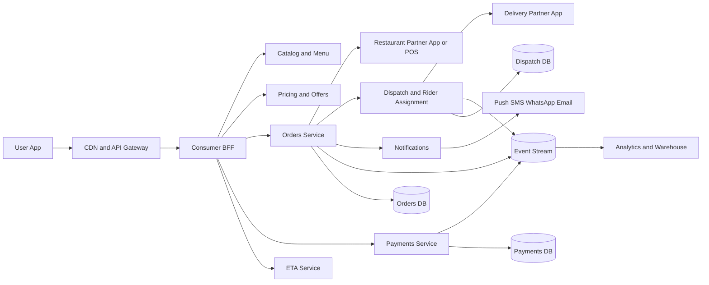
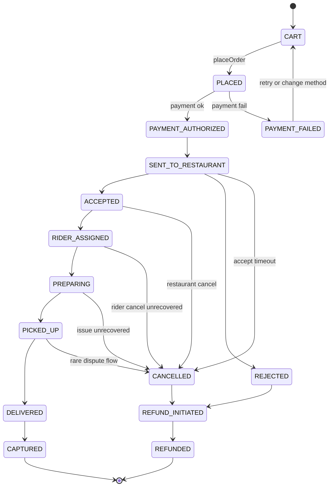
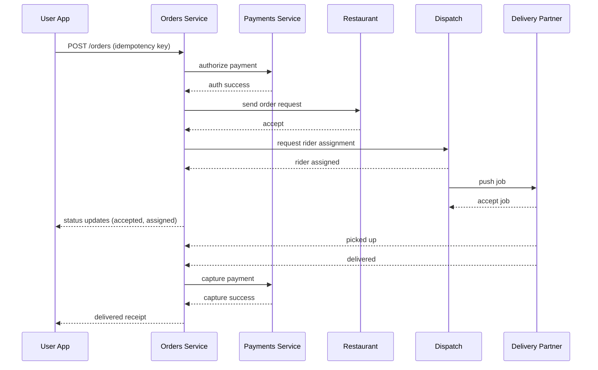

  

# How Zomato Works - Ordering System Architecture 

**Product:** Zomato  
**Audience:** Product Managers / Developers / Foodies  
**Goal:** Explain how Zomato moves an order from discovery to delivery at scale, focusing on product behavior, constraints, and trade-offs.

---

## 1) The core product problem
Zomato must reliably convert *intent* into a *delivered meal* across:
- millions of users
- thousands of restaurants across cities
- volatile delivery supply
- real-time payments and ETAs

From a PM lens, success is:
> **order placed → accepted → prepared → picked up → delivered (or fast fail + refund)** with trust intact.

The hard part is not “ordering UI”. It is **multi-party coordination under uncertainty**.

---

## 2) Key product requirements
Zomato optimizes for:
- **Conversion:** reduce drop-offs from menu → checkout → payment
- **Reliability:** once placed, orders should complete or fail fast (no limbo)
- **Speed:** accurate ETAs, quick acceptance and assignment
- **Coordination:** restaurant + delivery partner + customer stay in sync
- **Trust:** clear pricing, predictable refunds, transparent status

These requirements drive the system design.

---

## 3) High-level ordering architecture (conceptual)

### 3.1 System diagram (GitHub Mermaid)

**PM insight:** Zomato is a **coordinator**. Cooking and delivery are external execution systems; the platform’s job is to keep everyone consistent.

---

## 4) The ordering journey (what happens and why it’s hard)

### Step 1: Discovery and menu
- user browses restaurants and menus
- sees price, delivery fee, surge, and an ETA estimate

**What the system is really doing**
- geo eligibility checks (serviceable or not)
- menu availability windows
- baseline ETA prediction from current supply and kitchen load

**PM takeaway:** expectations are set here; later surprises create churn.

---

### Step 2: Cart and pricing
- items added to cart
- taxes, packaging, platform fee, delivery fee, tips, and offers applied

**Key risk:** late price revelation → checkout abandonment.

**System constraints**
- pricing must be deterministic for a short window
- promos must be consistent across devices and retries

---

### Step 3: Place order and payment authorization
- user confirms order
- payment is **authorized** (or UPI collect initiated), not necessarily captured

**PM insight:** this is the point of no return psychologically. Errors here hurt trust disproportionately.

**Idempotency requirement**
- double-tap “Place order” or payment retries must not create duplicates.
- API should support an `Idempotency-Key` for `POST /orders` and `POST /payments/authorize`.

---

### Step 4: Restaurant acceptance (the first external commit)
- order request sent to restaurant
- restaurant accepts or rejects (capacity, stock, closing)

**Design choice:** fast rejection is better than delayed cancellation.

**Common product tactic**
- acceptance SLA (e.g., 45–90s)
- auto-cancel + auto-refund if SLA breached

---

### Step 5: Rider assignment (balancing speed, cost, and reliability)
- dispatch selects a delivery partner
- ETA recalculated based on distance, batching feasibility, and local supply

**Trade-off:** faster assignment vs better service quality and fewer cancellations.

---

### Step 6: Prep, pickup, and delivery
- restaurant prepares food
- rider picks up and delivers
- live tracking and proactive notifications

**PM insight:** transparency reduces anxiety even when delays happen.

---

## 5) Order state machine (what users experience as “reliability”)
A strong state model prevents limbo states.

**PM note:** “Accepted” is a contractual moment. Post-accept cancellations are the most painful; the system should bias toward early correctness.

---

## 6) End-to-end sequence (happy path)

---

## 7) Payments and refunds (practical lifecycle)
Payments are trust infrastructure.

### Common lifecycle
- **Authorize** at place order (hold funds / intent created)
- **Capture** on delivered (or on pickup in some policies)
- **Reverse / Refund** on rejection, cancellation, SLA breach, or dispute

### Refund principles (PM view)
- speed matters more than perfect explanation
- provide a clear timeline and status
- avoid “silent partial refunds” without a breakdown

---

## 8) Failure scenarios and handling (playbooks)

### Restaurant rejects order
**User experience**
- immediate notification
- instant reorder suggestions
- auto-refund

**System behavior**
- cancel order
- emit `OrderRejected`
- initiate `RefundRequested` with idempotency

---

### No rider available
**User experience**
- proactive ETA update
- clear options: wait, switch restaurant, cancel

**System behavior**
- progressive widening of dispatch radius
- dynamic batching rules
- cut losses if SLA breach is likely

---

### Delays after acceptance
**User experience**
- updated ETA with reason labels (kitchen delay, traffic)
- proactive comms
- support escalation if thresholds breached

**System behavior**
- continuous ETA recalculation from events
- guardrails: don’t oscillate ETA every minute; rate-limit updates

---

## 9) Minimal data model (conceptual)
- `Order(orderId, userId, restaurantId, status, totalAmount, feesBreakdown, createdAt)`
- `OrderItem(orderId, skuId, name, qty, unitPrice)`
- `Payment(paymentId, orderId, method, authStatus, captureStatus, providerRef)`
- `Assignment(orderId, riderId, status, assignedAt, pickupEta, dropEta)`
- `OrderEvent(orderId, type, at, actor)`

---

## 10) Key trade-offs Zomato makes
| Trade-off | Typical decision | Why | Risk |
|---|---|---|---|
| Speed vs ETA accuracy | balance | conversion + expectation setting | misses reduce trust |
| AOV vs conversion | conversion-first | more completed orders | lower margin |
| Choice vs overload | curated listings | faster decision-making | fewer long-tail options |
| Automation vs human ops | hybrid | resilience in edge cases | ops cost |
| Fast fail vs rescue | fast fail early | reduces limbo | may feel harsh |

---

## 11) Metrics (what to actually watch)
**North-star:** completed orders with on-time delivery and low refunds.

Supporting:
- menu → cart → payment conversion
- acceptance rate and acceptance latency
- rider assignment time and rider cancellation rate
- on-time delivery rate, ETA error distribution
- refund rate, refund time to completion
- support contact rate per 1k orders

---

## 12) PM takeaways
- Zomato’s hardest problem is **coordination under uncertainty**, not discovery.
- Late surprises (price, availability, ETA) create the biggest trust loss.
- Reliability comes from **state models + idempotency + fast-fail policies + ops playbooks**.
- Clear expectations beat aggressive optimization.
